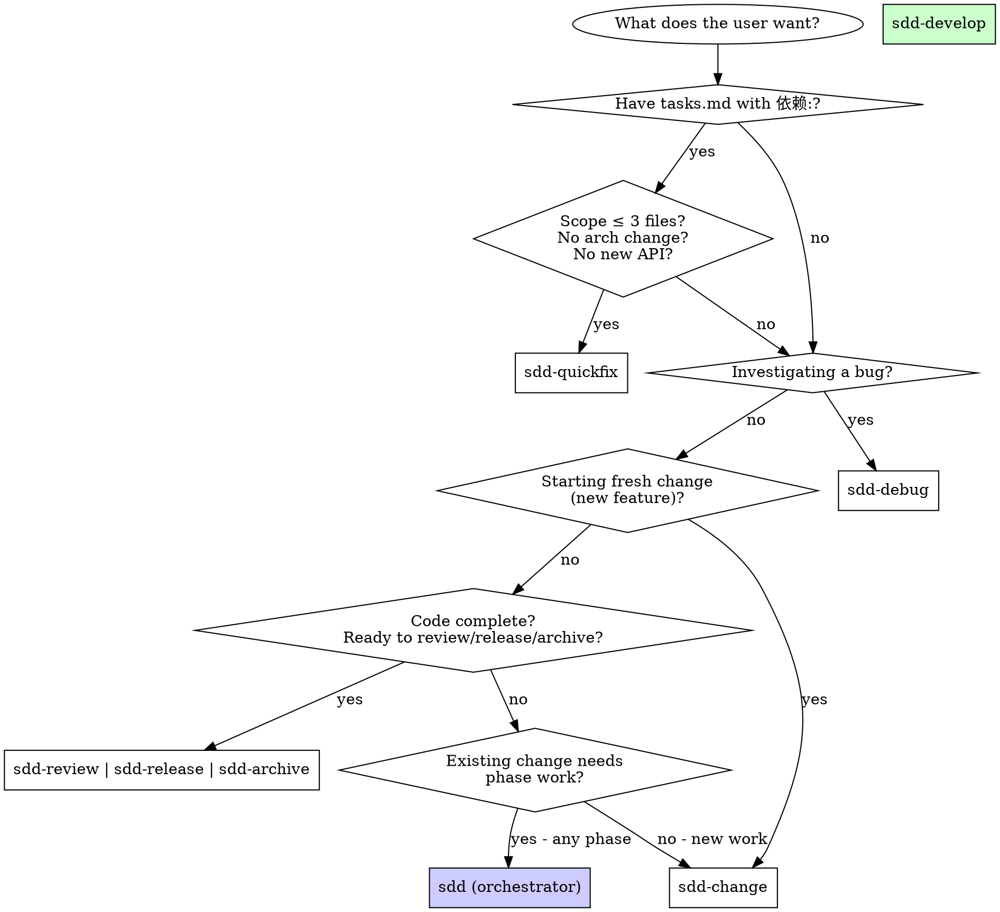

# Development Rules

## Conversational Style

- Keep answers short and concise
- No emojis in commits, issues, PR comments, or code
- No fluff or cheerful filler text (e.g., "Thanks @user" not "Thanks so much @user!")
- Technical prose only, be direct
- When the user asks a question, answer it first before making edits or running implementation commands.
- When responding to user feedback or an analysis, explicitly say whether you agree or disagree before saying what you changed.

## Code Quality

- Read files in full before wide-ranging changes, before editing files you have not fully inspected, and when asked to investigate or audit. Do not rely on search snippets for broad changes.
- No `any` unless absolutely necessary.
- Inline single-line helpers that have only one call site.
- Check node_modules for external API types; don't guess.
- **No inline imports** (`await import()`, `import("pkg").Type`, dynamic type imports). Top-level imports only.
- Never remove or downgrade code to fix type errors from outdated deps; upgrade the dep instead.
- Use only erasable TypeScript syntax (Node strip-only mode) in code checked by the root config (`packages/*/src`, `packages/*/test`, `packages/coding-agent/examples`): no parameter properties, `enum`, `namespace`/`module`, `import =`, `export =`, or other constructs needing JS emit. Use explicit fields with constructor assignments.
- Always ask before removing functionality or code that appears intentional.
- Do not preserve backward compatibility unless the user asks for it.
- Never hardcode key checks (e.g. `matchesKey(keyData, "ctrl+x")`). Add defaults to `DEFAULT_EDITOR_KEYBINDINGS` or `DEFAULT_APP_KEYBINDINGS` so they stay configurable.
- Never modify `packages/ai/src/models.generated.ts` directly; update `packages/ai/scripts/generate-models.ts` instead, then regenerate. Including the resulting `models.generated.ts` diff is always OK, even if regeneration includes unrelated upstream model metadata changes.

## Commands

- After code changes (not docs): `npm run check` (full output, no tail). Fix all errors, warnings, and infos before committing. Does not run tests.
- Never run `npm run build` or `npm test` unless requested by the user.
- Never run the full vitest suite directly: it includes e2e tests that activate when endpoint/auth env vars are present. For all non-e2e tests, run `./test.sh` from the repo root. Otherwise run specific tests from the package root: `node ../../node_modules/vitest/dist/cli.js --run test/specific.test.ts`.
- If you create or modify a test file, run it and iterate on test or implementation until it passes.
- For `packages/coding-agent/test/suite/`, use `test/suite/harness.ts` + the faux provider. No real provider APIs, keys, or paid tokens.
- Put issue-specific regressions under `packages/coding-agent/test/suite/regressions/` named `<issue-number>-<short-slug>.test.ts`.
- For ad-hoc scripts, `write` them to a temp file (e.g. `/tmp`), run, edit if needed, remove when done. Don't embed multi-line scripts in `bash` commands.
- Never commit unless the user asks.

## Dependency and Install Security

- Treat npm dep and lockfile changes as reviewed code. Direct external deps stay pinned to exact versions.
- Hydrate/update locally with `npm install --ignore-scripts`; clean/CI-style with `npm ci --ignore-scripts`. Don't run lifecycle scripts unless the user asks.
- If dep metadata changes, refresh `package-lock.json` with `npm install --package-lock-only --ignore-scripts`.
- If `packages/coding-agent/npm-shrinkwrap.json` needs regen, run `node scripts/generate-coding-agent-shrinkwrap.mjs` (verify with `--check` or `npm run check`). New deps with lifecycle scripts require review and an explicit allowlist entry in that script; never add one silently.
- Pre-commit blocks lockfile commits unless `PI_ALLOW_LOCKFILE_CHANGE=1`. Don't bypass unless the user wants the lockfile change committed.

## Git

Multiple pi sessions may be running in this cwd at the same time, each modifying different files. Git operations that touch unstaged, staged, or untracked files outside your own changes will stomp on other sessions' work. Follow these rules:

Committing:

- Only commit files YOU changed in THIS session.
- Stage explicit paths (`git add <path1> <path2>`); never `git add -A` / `git add .`.
- Before committing, run `git status` and verify you are only staging your files.
- `packages/ai/src/models.generated.ts` may always be included alongside your files.
- Message format: `{feat,fix,docs}[(ai,tui,agent,coding-agent)]: <commit message> (optionally multiple lines)`. Message is informative and concise.

Never run (destroys other agents' work or bypasses checks):

- `git reset --hard`, `git checkout .`, `git clean -fd`, `git stash`, `git add -A`, `git add .`, `git commit --no-verify`.

If rebase conflicts occur:

- Resolve conflicts only in files you modified.
- If a conflict is in a file you did not modify, abort and ask the user.
- Never force push.

## Issues and PRs

See `CONTRIBUTING.md` for the contributor gate (auto-close workflows, `lgtm`/`lgtmi`, quality bar).

When reviewing PRs:

- Do not run `gh pr checkout`, `git switch`, or otherwise move the worktree to the PR branch unless the user explicitly asks.
- Use `gh pr view`, `gh pr diff`, `gh api`, and local `git show`/`git diff` against fetched refs to inspect PR metadata, commits, and patches without changing branches.
- If you need PR file contents, fetch/read them into temporary files or use `git show <ref>:<path>` without switching branches.

When creating issues:

- Add `pkg:*` labels for affected packages (`pkg:agent`, `pkg:ai`, `pkg:coding-agent`, `pkg:tui`); use all that apply.

When posting issue/PR comments:

- Write the comment to a temp file and post with `gh issue/pr comment --body-file` (never multi-line markdown via `--body`).
- Keep comments concise, technical, in the user's tone.
- End every AI-posted comment with the AI-generated disclaimer line specified by the originating prompt (e.g. `This comment is AI-generated by `/wr``).

When closing issues via commit:

- Include `fixes #<number>` or `closes #<number>` in the message so merging auto-closes the issue. For multiple issues, repeat the keyword per issue (`closes #1, closes #2`); a shared keyword (`closes #1, #2`) only closes the first.

## Testing pi Interactive Mode with tmux

Run the TUI in a controlled terminal (from the repo root):

```bash
tmux new-session -d -s pi-test -x 80 -y 24
tmux send-keys -t pi-test "./pi-test.sh" Enter
sleep 3 && tmux capture-pane -t pi-test -p     # capture after startup
tmux send-keys -t pi-test "your prompt here" Enter
tmux send-keys -t pi-test Escape               # special keys (also C-o for ctrl+o, etc.)
tmux kill-session -t pi-test
```

## Changelog

Location: `packages/*/CHANGELOG.md` (one per package).

Sections under `## [Unreleased]`: `### Breaking Changes` (API changes requiring migration), `### Added`, `### Changed`, `### Fixed`, `### Removed`.

Rules:

- All new entries go under `## [Unreleased]`. Read the full section first and append to existing subsections; never duplicate them.
- Released version sections (e.g. `## [0.12.2]`) are immutable; never modify them.

Attribution:

- Internal (from issues): `Fixed foo bar ([#123](https://github.com/earendil-works/pi-mono/issues/123))`
- External contributions: `Added feature X ([#456](https://github.com/earendil-works/pi-mono/pull/456) by [@username](https://github.com/username))`

## Releasing

**Lockstep versioning**: all packages share one version; every release updates all together. `patch` = fixes + additions, `minor` = breaking changes. No major releases.

1. **Update CHANGELOGs**: ask the user whether they ran the `/cl` prompt on the latest commit on `main`. If not, they must run `/cl` first to audit and update each package's `[Unreleased]` section before releasing.

2. **Local smoke test**: build an unpublished release and smoke test from outside the repo (so it can't resolve workspace files):
   ```bash
   npm run release:local -- --out /tmp/pi-local-release --force
   cd /tmp

   # Node package install smoke tests
   /tmp/pi-local-release/node/pi --help
   /tmp/pi-local-release/node/pi --version
   /tmp/pi-local-release/node/pi --list-models
   /tmp/pi-local-release/node/pi -p "Say exactly: ok"
   /tmp/pi-local-release/node/pi

   # Bun binary smoke tests
   /tmp/pi-local-release/bun/pi --help
   /tmp/pi-local-release/bun/pi --version
   /tmp/pi-local-release/bun/pi --list-models
   /tmp/pi-local-release/bun/pi -p "Say exactly: ok"
   /tmp/pi-local-release/bun/pi
   ```
   Verify both Node and Bun startup, model/account listing, interactive startup, and at least one real prompt with the intended default provider. The bare commands `/tmp/pi-local-release/node/pi` and `/tmp/pi-local-release/bun/pi` start interactive mode; run each in tmux, submit a prompt, and wait for the model reply before considering the interactive smoke test passed. Failures are release blockers unless the user explicitly accepts the risk.

3. **Run the release script**:
   ```bash
   PI_ALLOW_LOCKFILE_CHANGE=1 npm_config_min_release_age=0 npm run release:patch    # fixes + additions
   PI_ALLOW_LOCKFILE_CHANGE=1 npm_config_min_release_age=0 npm run release:minor    # breaking changes
   ```
   Use `npm_config_min_release_age=0` only for the release command. The repo's normal npm age gate can otherwise block the release lockfile refresh when the current workspace package version was published recently. Review any lockfile or shrinkwrap diffs the release creates before push.

   The release script bumps all package versions, updates changelogs, regenerates release artifacts, runs `npm run check`, commits `Release vX.Y.Z`, tags `vX.Y.Z`, adds fresh `## [Unreleased]` changelog sections, commits `Add [Unreleased] section for next cycle`, then pushes `main` and the tag. Do not rerun the release script after a tag was pushed.

4. **CI publishes npm packages**: pushing the `vX.Y.Z` tag triggers `.github/workflows/build-binaries.yml`. The `publish-npm` job uses npm trusted publishing through GitHub Actions OIDC with environment `npm-publish`; no local `npm publish`, `npm whoami`, OTP, or WebAuthn flow is required.

5. **If CI publish fails**: inspect the failed `publish-npm` job. The publish helper is idempotent and skips package versions already present on npm, so rerun the tag workflow after fixing CI or transient npm issues. Do not rerun `npm run release:patch` or `npm run release:minor` for the same version.

## User Override

If the user's instructions conflict with any rule in this document, ask for explicit confirmation before overriding. Only then execute their instructions.

<!-- sddSpec:start -->
# AGENTS.md — SDD Spec Workspace v2

## Project Type
This is a **Spec-Driven Development (SDD) workflow workspace** — a skill-and-script repo containing skills, commands, and specs for managing system changes through structured phases: deep brainstorming → delta spec → TDD implementation → independent review → release (simplify + audit) → archive.

## Directory Structure

```
sddSpec/
├── agents/                       # SDD subagents (4)
│   ├── tdd-guide.md              # TDD implementation agent
│   ├── code-reviewer.md          # Code review agent
│   ├── code-simplifier.md        # Code simplification agent
│   └── security-reviewer.md      # Security audit agent
├── skills/                       # SDD workflow skills (11 skills + 3 scripts)
│   ├── sdd/                      # Orchestrator — auto-detect phase, route, advance
│   │   ├── SKILL.md
│   │   └── scripts/
│   │       ├── sdd-env.sh        # Script discovery helper — exports SDD_STATE, SDD_GUARD
│   │       ├── sdd-state.sh      # YAML state machine: init/get/set/transition/check
│   │       └── sdd-guard.sh      # Phase exit guard: brainstorm/design/develop/review/release/archive
│   ├── sdd-change/               # Change creation
│   ├── sdd-brainstorm/            # Deep design dialogue
│   │   └── templates/
│   │       ├── proposal.md
│   │       ├── scenarios.md
│   │       ├── principles.md
│   │       └── design-doc.md     # Merged architecture + technical design
│   ├── sdd-write_plan/          # Plan generation from design doc
│   │   └── templates/
│   │       ├── tasks.md          # Task checklist + execution details
│   │       ├── spec.md           # Delta spec: ADDED/MODIFIED/REMOVED
│   │       └── verification-checklist.md  # Scenario/requirement verification checklist
│   ├── sdd-develop/              # TDD implementation via subagents (+ worktree)
│   ├── sdd-review/               # Independent verification + code review
│   ├── sdd-release/               # Code simplification + security audit (mandatory)
│   ├── sdd-archive/               # Delta merge + design annotation + archive
│   ├── sdd-quickfix/             # Fast path: skip brainstorm+design
│   ├── sdd-debug/                # Root cause tracing + defense-in-depth
│   └── sdd-worktree/             # Workspace isolation
├── commands/                     # OpenCode command definitions
│   ├── sdd.md                    # → sdd (orchestrator)
│   ├── change.md                 # → sdd-change
│   ├── brainstorm.md             # → sdd-brainstorm
│   ├── write_plan.md            # → sdd-write_plan
│   ├── develop.md                # → sdd-develop
│   ├── review.md                 # → sdd-review
│   ├── release.md                # → sdd-release
│   ├── archive.md                # → sdd-archive
│   ├── quickfix.md               # → sdd-quickfix
│   └── debug.md                  # → sdd-debug
├── docs/sdd/
│   ├── specs/spec.md             # Main system specification (NEVER move/delete)
│   ├── changes/<name>/           # Working directory for in-progress changes
│   │   ├── .sdd.yaml             # State file (11 fields)
│   │   ├── proposal.md           # Motivation, scope, acceptance criteria
│   │   ├── scenarios.md          # GIVEN-WHEN-THEN scenarios
│   │   ├── principles.md         # One-line principles per change
│   │   ├── design.md             # Merged architecture + technical design
│   │   ├── tasks.md              # Task checklist + execution details
│   │   ├── verification-checklist.md   # Scenario/requirement verification checklist
│   │   └── specs/<capability>/   # Delta specs (ADDED/MODIFIED/REMOVED)
│   │       └── spec.md
│   ├── archive/<name>/           # Completed changes
│   └── debug/<bug-name>/         # Debug reports
└── .opencode/                    # OpenCode config and dependencies
```

## SDD Workflow Phases

| Phase | Command | Phase Key | Output | Rule |
|-------|---------|-----------|--------|------|
| 0. Orchestrator | `/sdd <desc>` | — | Auto-detect active change, route to phase | First-match-wins, decision points pause |
| 1. Brainstorming | `/brainstorm <name>` | brainstorm | proposal.md, scenarios.md, principles.md, design.md | NO code, NO plan.md, one question at a time, 2-3 approaches, self-review, user gate |
| 2. Write Plan | `/write_plan <name>` | write_plan | tasks.md, specs/<capability>/spec.md, verification-checklist.md | NO code, wait for confirmation, checklist generated from scenarios+spec |
| 3. Develop | `/develop <name>` | develop | Implementation via @tdd-guide subagents [+ worktree] | NEVER write code yourself, TDD first |
| 4. Review | `/review <name>` | review | Checklist verification + fresh tests + @code-reviewer + branch handling | Scenario-by-scenario, evidence required, [!] = HARD FAIL |
| 5. Release | `/release <name>` | release | @code-simplifier → @security-reviewer → closure check | Mandatory, max 1 conflict retry |
| 6. Archive | `/archive <name>` | archive | Merged spec, annotated design, archived changes | specs/spec.md never moved |

## Quickfix Path (skip brainstorm+design)

| Phase | Command | Rule |
|-------|---------|------|
| Init | `/quickfix <name>` | Scope ≤3 files, no architecture change, no new API |
| Develop | — | TDD → verify → review → release → archive |
| Upgrade | — | If scope exceeded → pause → ask user → upgrade to full workflow |

## Skill Selection (Decision Tree)

When the user requests an action, route to the correct skill using this decision:



**Selection summary:**

| User intent | Route to |
|-------------|----------|
| Implement multi-task plan with dependencies | `sdd-develop` |
| Tiny fix (≤3 files, no arch change) | `sdd-quickfix` |
| Bug investigation + fix | `sdd-debug` |
| New change from scratch | `sdd-change` |
| Already in a change, need next phase | `sdd` (orchestrator auto-detects) |
| Code done, run review/release/archive | `sdd-review` / `sdd-release` / `sdd-archive` |

## State File (.sdd.yaml)

| Field | Values | Purpose |
|-------|--------|---------|
| phase | brainstorm, write_plan, develop, review, release, archive | Current phase |
| workflow | full, quickfix | Workflow type |
| change | string | Change name (kebab-case) |
| created_at | YYYY-MM-DD | Creation date |
| base_ref | git SHA or null | Git HEAD at change creation |
| tasks_total | number | Total tasks from tasks.md |
| tasks_done | number | Completed task count |
| isolation | branch, worktree | Workspace isolation method |
| verify_result | null, pending, pass, fail | Review result |
| last_review_sha | git SHA or null | Git commit SHA of the last reviewed checkpoint, or `null`. Used by `sdd-develop` Step 3.5 to scope per-level `git diff` for `@code-reviewer` subagent. Auto-managed by `sdd-develop`; rarely set manually |
| archived | true, false | Archive flag |

### State Transitions

```
brainstorm → (guard + user confirm) → write_plan
write_plan → (guard + user confirm) → develop
develop → (guard: all tasks done) → review
review → (guard: verify_result=pass) → release (pass)
review → (review-fail) → develop (rollback)
release → (guard: simplify+audit done, no CRITICAL) → archive
archive → (archived=true) → done
```

> **Note**: After `review-pass` transition, `phase` becomes `release` and `verify_result=pass`. The orchestrator routes via `phase: release` (an independent entry in `sdd/SKILL.md` Phase Determination Step 2 item 2) — **not** via `verify_result: pass`, which would skip the mandatory simplify + security audit phase.

### Scripts

Source sdd-env.sh once to export script paths, then use `$SDD_STATE` and `$SDD_GUARD`:

```bash
SDD_ENV="${SDD_ENV:-$(find . "$HOME"/.*/skills "$HOME/.config" -path '*/sdd/scripts/sdd-env.sh' -type f -print -quit 2>/dev/null)}"
if [ -z "$SDD_ENV" ] || [ ! -f "$SDD_ENV" ]; then
  echo "ERROR: sdd-env.sh not found. Ensure the sdd skill is installed." >&2
  return 1
fi
source "$SDD_ENV"

# State management
bash "$SDD_STATE" init <name> <full|quickfix>
bash "$SDD_STATE" get <name> <field>
bash "$SDD_STATE" set <name> <field> <value>
bash "$SDD_STATE" transition <name> <event>
bash "$SDD_STATE" check <name> <phase>

# Phase exit guard (add --apply to auto-transition)
bash "$SDD_GUARD" <name> <phase> [--apply]
```

## Debug Workflow

| Phase | Command | Output | Rule |
|-------|---------|--------|------|
| 1. Understand | — | Clarified bug description | Ask clarifying questions |
| 2. Navigate | — | CodeGraph search + callers/callees | Index first, then source files |
| 3. Reproduce | — | Failing reproducer test | MUST fail before fixing |
| 4. Root Cause | — | Cause chain (symptom → ... → root) | Trace call chain to source, defense-in-depth check |
| 5. Past Reports | — | Review docs/sdd/debug/ | Check for same bug/symptom/files |
| 6. Fix (TDD) | — | Dispatch to @tdd-guide → @code-reviewer | Agent does NOT write fix directly |
| 7. Report | — | docs/sdd/debug/<bug-name>/ | debug-report.md |

## Spec Format

### Main Spec (docs/sdd/specs/spec.md)
Uses `## Capability:` section headers. Each requirement: `### Requirement:` with `#### Scenario:` sub-sections in GIVEN-WHEN-THEN format. SHALL/MUST language required.

### Delta Spec (changes/<name>/specs/<capability>/spec.md)
Uses ADDED/MODIFIED/REMOVED/RENAMED format:
- `## ADDED Requirements` — new requirements
- `## MODIFIED Requirements` — full modified requirements (not diffs)
- `## REMOVED Requirements` — with Reason + Migration
- `## RENAMED Requirements` — FROM/TO mapping

Merge order during archive: RENAMED → REMOVED → MODIFIED → ADDED.

## Commands (generated by install.sh, source at commands/*.md)

| Command | Skill | Purpose |
|---------|-------|---------|
| `/sdd <desc>` | sdd | Auto-detect phase and dispatch |
| `/change <name>` | sdd-change | Create new change directory + state |
| `/brainstorm <name>` | sdd-brainstorm | Deep design dialogue + design doc |
| `/write_plan <name>` | sdd-write_plan | Generate tasks.md + delta spec |
| `/develop <name>` | sdd-develop | TDD implementation via subagents |
| `/review <name>` | sdd-review | Verify + code review + branch handling |
| `/release <name>` | sdd-release | Simplify + security audit (mandatory) |
| `/archive <name>` | sdd-archive | Merge specs, annotate, archive |
| `/quickfix <name>` | sdd-quickfix | Fast fix without brainstorm+design |
| `/debug <bug-name>` | sdd-debug | Navigate, reproduce, root cause, fix, report |

## Critical Rules

- **HARD-GATE**: Brainstorming → no code. Design → no code + generate verification-checklist.md. Develop → never self-write, always @tdd-guide. Review → checklist scenario-by-scenario verification, evidence required, [!] = FAIL. Release → mandatory simplify+audit before archive. Archive → specs/spec.md never moved.
- **Develop → Review (no manual gate)**: When all tasks in `tasks.md` are `[x]`, run `bash "$SDD_GUARD" <name> develop --apply` to auto-advance `phase` to `review`. **No AskUserQuestion pause between develop and review** — text output ≠ consent, but completion itself is consent to proceed. The orchestrator will then route to `sdd-review` on the next invocation. Pause only on BLOCKED status, ambiguity that prevents progress, or all tasks complete.
- **Decision points**: Always use AskUserQuestion to pause. Text output ≠ consent.
- **State machine**: Always use sdd-state.sh transition or sdd-guard.sh --apply. Never edit .sdd.yaml directly.
- **Archive**: Only move changes/<name> → archive/<name>. Never move or delete specs/ directory or spec.md.
- **GIVEN-WHEN-THEN**: Mandatory for all scenarios. Minimum 1 per section (normal/abnormal/boundary).
- **Self-review**: Required after brainstorming (placeholder scan, consistency, ambiguity, scope) and design (spec coverage, placeholder, type consistency).

## Source of Truth

- Skills under `skills/sdd-*/SKILL.md` define the authoritative workflow
- Scripts under `skills/sdd/scripts/` maintain state machine integrity
- Templates under `skills/*/templates/` must be used as-is
- GIVEN-WHEN-THEN format is mandatory for scenarios

<!-- sddSpec:end -->
