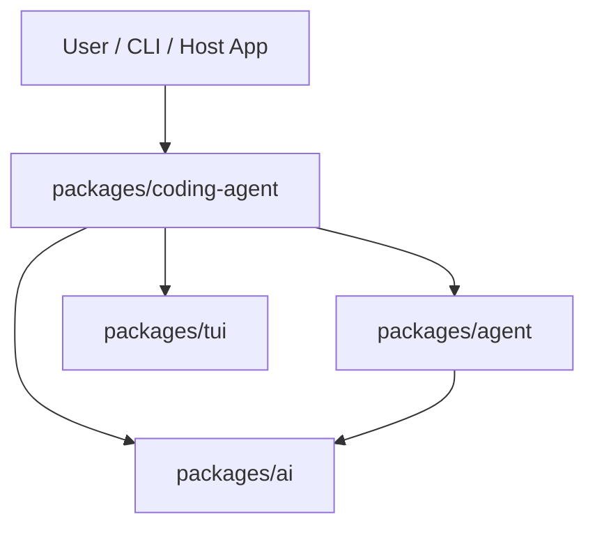
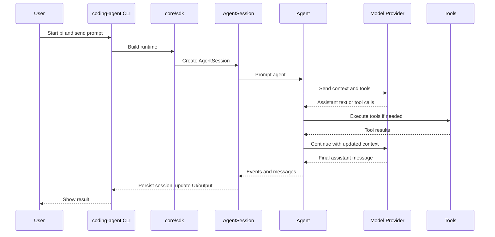
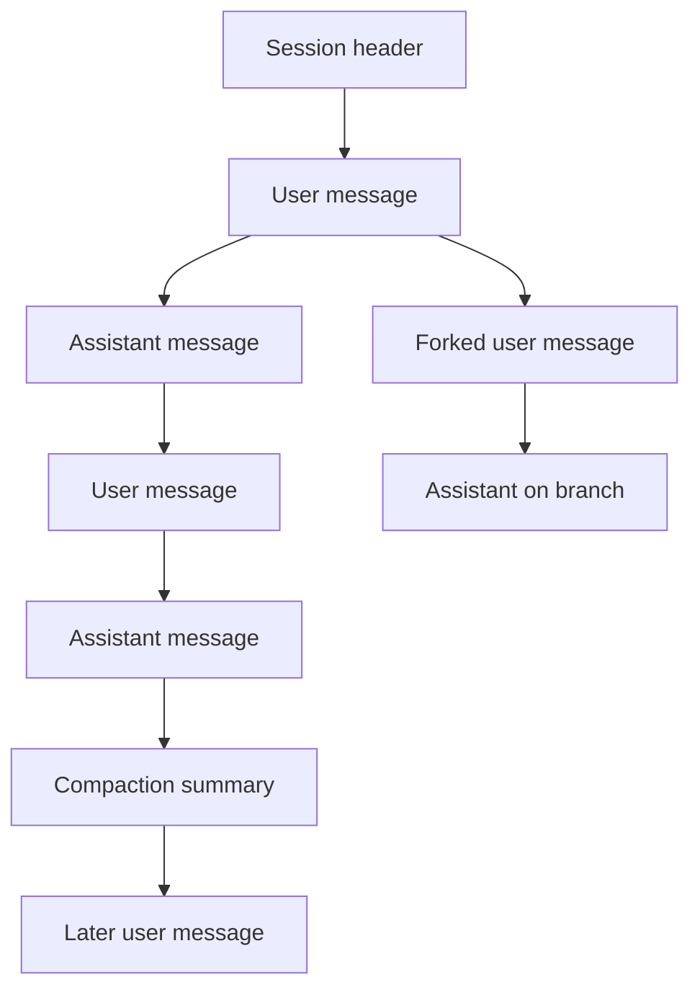
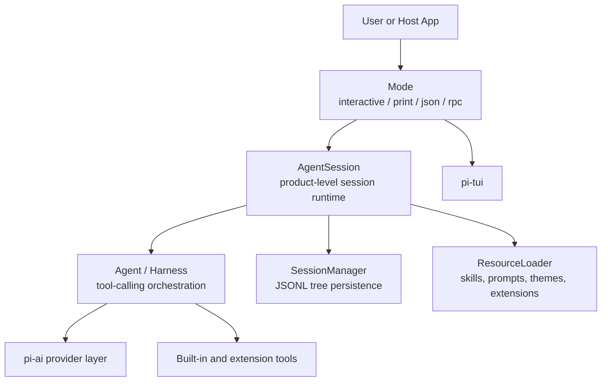

# Pi Mono Architecture Book

## 1. What This Repository Is

`pi-mono` is a monorepo for building AI agents, especially a coding agent that runs in the terminal.

The repository is organized around four main TypeScript packages:

| Package | Role |
| --- | --- |
| `packages/ai` | Talks to model providers and normalizes their behavior |
| `packages/agent` | Runs the agent loop and the agent harness |
| `packages/coding-agent` | Builds the end-user product: CLI, sessions, tools, prompts, extensions, modes |
| `packages/tui` | Renders the terminal UI |

There is also a Python port under `python/src/pi_mono` that mirrors the same overall architecture:

| Python area | Mirrors |
| --- | --- |
| `pi_mono.ai` | `packages/ai` |
| `pi_mono.agent` | `packages/agent` |
| `pi_mono.coding_agent` and `pi_mono.core` | `packages/coding-agent` |
| `pi_mono.tui` | `packages/tui` |

The repository name matters. This is not one single application with one single binary and one fixed opinion about how an agent must work. It is a layered system:

1. A model access layer
2. A generic agent runtime layer
3. A coding-agent product layer
4. A terminal UI layer
5. A Python mirror of the same ideas

That separation is one of the main architectural ideas in the repo.

## 2. The Big Idea Behind AI Coding Agents

Before understanding `pi-mono`, it helps to understand what an AI coding agent is in general.

A coding agent is not just a chatbot that answers coding questions. A coding agent usually does five things:

1. It keeps a conversation state
2. It can call tools
3. It can inspect files and run commands
4. It can update its own context as the task changes
5. It can persist work so the session can be resumed later

In plain words:

- A normal chatbot is like a smart person in a room with no desk, no keyboard, and no memory beyond the current chat window.
- A coding agent is like a smart engineer with a desk, terminal, file browser, notebook, and a work log.

That is the category `pi-mono` belongs to.

## 3. Common Architectures for AI Coding Agents

There is no single standard architecture. Most coding agents in the market or open source world fall into a few patterns.

### 3.1 Chat Wrapper Architecture

This is the simplest form.

Structure:

1. User types prompt
2. App sends messages to model
3. Model returns text
4. App displays text

Strengths:

- Simple
- Cheap to build
- Easy to reason about

Weaknesses:

- No real tool use
- No file system workflow
- No durable task state
- No real agent behavior

This is not what `pi-mono` is.

### 3.2 Tool-Calling Loop Architecture

This is the first real agent architecture.

Structure:

1. User sends a task
2. Model decides whether to call a tool
3. Tool runs
4. Tool result is fed back to the model
5. Loop continues until the model stops

This is the core pattern behind many modern coding agents.

Strengths:

- Practical
- Works for file reading, searching, editing, shell commands
- Easy to extend with more tools

Weaknesses:

- Can become messy if session state is not designed well
- Tool execution and UI often get tangled together

`pi-mono` uses this pattern, but adds stronger layering around it.

### 3.3 Planner / Executor Architecture

This separates thinking into roles.

Structure:

1. Planner model breaks the task into steps
2. Executor model performs steps
3. Reviewer checks output
4. System loops until success

Strengths:

- Better for long and complex tasks
- More explicit control
- Easier to insert approvals and policy checks

Weaknesses:

- More latency
- More tokens
- More moving parts

`pi-mono` can support planning-like behavior through prompts, extensions, or harness features, but the core repo is not built around a hard-coded planner/executor split.

### 3.4 Multi-Agent Architecture

This creates several agents with different jobs.

Examples:

- Research agent
- Coding agent
- Test agent
- Review agent

Strengths:

- Good for decomposition
- Good for specialized workflows

Weaknesses:

- Harder coordination
- Higher cost
- More failure modes

`pi-mono` is not fundamentally a multi-agent framework first. It is a strong single-agent harness that can be extended.

### 3.5 IDE-Native Copilot Architecture

This is common in editor integrations.

Structure:

1. Agent lives inside the editor
2. Editor state is the primary source of truth
3. File edits are applied directly through editor APIs

Strengths:

- Great UX for coding
- Close to files and selections
- Fast inline operations

Weaknesses:

- Tied to one editor
- Harder to reuse outside that host

`pi-mono` is different. It is terminal-first and host-agnostic. It can be embedded, but it does not depend on a specific editor.

### 3.6 Remote Cloud Worker Architecture

This runs the agent in a remote sandbox.

Strengths:

- Strong isolation
- Centralized execution
- Easy to manage permissions

Weaknesses:

- More infrastructure
- Can feel distant from the user’s local environment

Important distinction: the root README makes clear that permissions and containerization are external concerns, not built into the core repo. `pi-mono` is a harness and product framework, not a sandbox platform.

## 4. Where Pi Mono Sits Among These Architectures

`pi-mono` is best described as:

1. A layered local-first coding-agent framework
2. A tool-calling agent runtime
3. A session-persistent harness
4. A highly extensible CLI product

The most important architectural choice is separation of concerns.

The repo does not put everything into one giant package. Instead:

- `pi-ai` handles providers and model APIs
- `pi-agent-core` handles agent orchestration
- `pi-coding-agent` handles the product experience
- `pi-tui` handles rendering

That means the architecture is closer to a small operating system than to a single script.

Analogy:

- `packages/ai` is the network adapter layer
- `packages/agent` is the engine
- `packages/coding-agent` is the driver cabin, dashboard, and workflow logic
- `packages/tui` is the screen and controls

## 5. Monorepo Layout

At the top level, the repo contains:

| Path | Purpose |
| --- | --- |
| `packages/ai` | Unified model/provider library |
| `packages/agent` | Agent runtime and harness |
| `packages/coding-agent` | End-user coding agent application |
| `packages/tui` | Terminal UI library |
| `python` | Python port of the same stack |
| `docs` | Documentation |

Within the package source trees, the directory structure is a strong clue to the architecture:

### 5.1 `packages/ai/src`

| Subpath | Purpose |
| --- | --- |
| `providers/` | Provider-specific implementations |
| `providers/cursor/` | Cursor-specific proxy and transport pieces |
| `providers/images/` | Image model support |
| `utils/` | Shared utilities |
| `utils/oauth/` | OAuth and subscription login flows |

### 5.2 `packages/agent/src`

| Subpath | Purpose |
| --- | --- |
| `agent.ts` | Main stateful agent wrapper |
| `agent-loop.ts` | Tool-calling loop |
| `harness/` | Higher-level agent harness system |
| `harness/compaction/` | Context compression and summaries |
| `harness/env/` | Execution environment abstractions |
| `harness/session/` | Session repositories and persistence |
| `harness/utils/` | Helper utilities |

### 5.3 `packages/coding-agent/src`

| Subpath | Purpose |
| --- | --- |
| `cli/` | CLI helpers and argument plumbing |
| `core/` | Most product runtime logic |
| `core/compaction/` | Product-level compaction pieces |
| `core/export-html/` | Session export and rendering |
| `core/extensions/` | Extension system |
| `core/tools/` | Built-in coding tools |
| `modes/` | Interactive, print, JSON, and RPC modes |
| `modes/interactive/` | Terminal app experience |
| `modes/rpc/` | Headless JSON protocol mode |
| `utils/` | Product utilities |

### 5.4 `packages/tui/src`

| Subpath | Purpose |
| --- | --- |
| `components/` | Reusable TUI components |
| root files | Terminal, keyboard, rendering, autocomplete, layout |

### 5.5 `python/src/pi_mono`

| Subpath | Purpose |
| --- | --- |
| `ai/` | Python provider/model layer |
| `agent/` | Python harness layer |
| `coding_agent/` | Python coding-agent product layer |
| `core/` | Shared Python runtime pieces |
| `tui/` | Python terminal UI |
| `utils/` | Python helpers |

## 6. Dependency Layers

The simplest way to understand the codebase is as a stack:

Interpretation:

- `packages/tui` does not know about models or agents
- `packages/ai` does not know about the coding product UI
- `packages/agent` knows how to run an agent, but not how to build the full coding-agent UX
- `packages/coding-agent` composes everything into a product

This layering is one of the biggest reasons the repo is readable.

## 7. End-to-End Request Lifecycle

The best single mental model is to follow one user prompt through the system.

### 7.1 High-level flow

### 7.2 What actually happens in code

1. `packages/coding-agent/src/cli.ts` starts the program and hands off to `main.ts`
2. `main.ts` parses flags, mode, cwd, session choice, model choice, stdin, and images
3. `core/sdk.ts` creates the runtime services
4. Those services include:
   - auth storage
   - model registry
   - settings manager
   - session manager
   - resource loader
   - tools
   - agent
   - agent session
5. The selected mode runs:
   - interactive TUI
   - print mode
   - JSON mode
   - RPC mode
6. The mode talks to `AgentSession`
7. `AgentSession` talks to the generic `Agent`
8. `Agent` runs the loop and calls the model
9. Tool calls are executed
10. Events are emitted and persisted

## 8. The `packages/ai` Layer: Unified Model Access

This package exists so the rest of the system does not need provider-specific code everywhere.

### 8.1 Why this layer exists

Without this package, the coding agent would need to know:

- OpenAI request shapes
- Anthropic request shapes
- Google request shapes
- Cursor auth and transport rules
- OAuth refresh logic
- model lists
- provider quirks

That would make the product layer fragile.

So `packages/ai` acts as a translation layer.

### 8.2 Main responsibilities

| Responsibility | What it means |
| --- | --- |
| Model registry | Defines available models and metadata |
| Provider dispatch | Routes a request to the right provider implementation |
| Streaming normalization | Makes streamed responses look consistent |
| Tool-call compatibility | Adapts different provider tool-call formats |
| Cost and usage accounting | Normalizes token and cost fields |
| OAuth and subscription auth | Supports browser/device login and token refresh |
| Session resources | Carries provider-side session identifiers when needed |

### 8.3 Important conceptual objects

| Concept | Meaning |
| --- | --- |
| Provider | The company or backend, such as OpenAI or Anthropic |
| Model | A concrete model id with metadata |
| API | The request protocol shape used for that model |
| Stream | An event stream of partial output |
| Context | The message history plus system prompt and tool definitions |

### 8.4 Internal structure

The package exposes:

- provider registration
- model lookup
- streaming
- OAuth helpers
- image model support
- validation and diagnostics helpers

The `providers/` directory contains adapters for real providers. The rest of the repo mostly talks to the unified interface rather than to those adapters directly.

### 8.5 Important `packages/ai/src` files

| File or area | Role |
| --- | --- |
| `models.ts` and `models.generated.ts` | Built-in model catalog |
| `stream.ts` | Main request dispatch and streaming entry point |
| `api-registry.ts` | Provider API registration |
| `providers/register-builtins.ts` | Registers built-in providers |
| `oauth.ts` and `utils/oauth/` | OAuth and subscription login flows |
| `env-api-keys.ts` | Environment variable key discovery |
| `session-resources.ts` | Provider-side session resource handling |
| `images.ts` and `images-api-registry.ts` | Image model support |
| `types.ts` | Shared request/response/message types |
| `utils/event-stream.ts` | Streaming event abstraction |
| `utils/overflow.ts` | Context overflow handling helpers |
| `utils/validation.ts` | Schema and value validation |

### 8.6 Why this matters architecturally

This package makes the rest of the repo provider-agnostic.

That is a big difference from smaller coding agents, which often bake provider assumptions directly into the agent loop.

## 9. The `packages/agent` Layer: The Generic Agent Runtime

This package is the core brain loop.

### 9.1 What an agent loop really is

At the simplest level, the loop does this:

1. Build model context
2. Send it to the model
3. Read model output
4. If the model asked for tools, execute them
5. Add tool results to context
6. Ask the model again
7. Stop when the model stops

This sounds small, but it is the center of the system.

### 9.2 `agent.ts`

This file defines the main stateful `Agent` object.

Think of it as the controller object that exposes a clean surface:

- prompt
- wait for idle
- subscribe to events
- inspect state

### 9.3 `agent-loop.ts`

This file contains the actual orchestration loop.

Important ideas here:

| Idea | Meaning |
| --- | --- |
| Event-driven execution | The loop emits events as work happens |
| Tool continuation | Tool results are added back into context |
| Queued steering/follow-ups | The loop can accept additional instructions while active |
| Conversion boundary | Internal messages are converted to provider-facing messages only at the edge |

This is an important design choice. The internal message model is broader than the raw provider message format.

### 9.4 Harness subsystem

The `harness/` subtree is a more advanced abstraction layer built on top of the core loop.

It includes:

| Subpath | Purpose |
| --- | --- |
| `harness/agent-harness.ts` | Higher-level harness API |
| `harness/session/` | JSONL and in-memory session repos |
| `harness/compaction/` | Summarization and context trimming |
| `harness/skills.ts` | Skill support |
| `harness/system-prompt.ts` | System prompt assembly |
| `harness/prompt-templates.ts` | Reusable prompt templates |
| `harness/env/` | Environment abstraction |

This shows that the repo has two levels of “agent”:

1. A basic loop agent
2. A fuller harness around that loop

That is one reason the architecture feels deeper than a single-agent script.

### 9.5 Important `packages/agent` files

| File or area | Role |
| --- | --- |
| `agent.ts` | Stateful agent controller |
| `agent-loop.ts` | Core tool-calling loop |
| `harness/agent-harness.ts` | Richer harness API |
| `harness/session/jsonl-repo.ts` | Durable JSONL-backed session repository |
| `harness/session/memory-repo.ts` | In-memory session repository |
| `harness/session/session.ts` | Session abstraction for harness users |
| `harness/compaction/compaction.ts` | Context compaction logic |
| `harness/compaction/branch-summarization.ts` | Branch summarization |
| `harness/system-prompt.ts` | Harness-level prompt assembly |
| `harness/skills.ts` | Harness-level skill support |
| `harness/messages.ts` | Message helpers and synthetic message types |
| `harness/env/nodejs.ts` | Node.js environment implementation |

## 10. The `packages/coding-agent` Layer: The Product

This package is where the generic runtime becomes a real coding product.

### 10.1 Main job of this package

It combines:

- the agent runtime
- the model layer
- the tools
- the prompt system
- session persistence
- extension loading
- UI modes
- authentication and settings

If `packages/agent` is the engine, `packages/coding-agent` is the whole vehicle.

### 10.2 Entry points

The important top-level flow is:

1. `cli.ts`
2. `main.ts`
3. `core/sdk.ts`
4. chosen mode

`cli.ts` is thin. That is good architecture. It does process setup and forwards control.

`main.ts` decides what kind of run this is.

`core/sdk.ts` constructs the runtime services.

### 10.3 `core/sdk.ts`

This file is one of the most important in the repo.

It assembles the runtime object graph:

- auth storage
- model registry
- settings
- session manager
- resource loader
- tools
- agent
- agent session

This is effectively the composition root.

When people talk about “architecture,” this file is often the best answer because it shows which objects exist and how they depend on each other.

### 10.4 Main `core/` subsystems

The `core/` directory is the product backplane. Its files are not random utilities. Most of them are named after actual runtime services.

| File or subpath | Role |
| --- | --- |
| `agent-session.ts` | Product-level session runtime |
| `agent-session-runtime.ts` | Runtime host around session lifecycle |
| `agent-session-services.ts` | Shared service assembly helpers |
| `auth-storage.ts` | Credential persistence and lookup |
| `model-registry.ts` | Effective model availability and provider config |
| `model-resolver.ts` | Model id parsing and selection logic |
| `settings-manager.ts` | User and project settings resolution |
| `session-manager.ts` | JSONL session storage and tree navigation |
| `resource-loader.ts` | Skills, prompts, themes, extensions, context files |
| `system-prompt.ts` | Final prompt assembly |
| `prompt-templates.ts` | Named prompt template loading |
| `skills.ts` | Skill loading and prompt formatting |
| `extensions/` | Extension loading, execution, and typing |
| `tools/` | Built-in tool definitions and implementations |
| `compaction/` | Product-level compaction and branch summaries |
| `messages.ts` | Product-specific synthetic message creation |
| `slash-commands.ts` | Built-in slash command registry |
| `footer-data-provider.ts` | Footer status composition for interactive mode |
| `keybindings.ts` | App keybinding definitions and migration |
| `output-guard.ts` | Controlled stdout/stderr handling |
| `export-html/` | Session export renderer |
| `telemetry.ts` | Telemetry toggles and reporting support |
| `http-dispatcher.ts` | Shared HTTP transport configuration |

If you are trying to understand the repo by reading code, this table is your navigation map for the product layer.

## 11. `AgentSession`: The Real Product Core

`AgentSession` is one of the central product abstractions in the repo.

### 11.1 Why it exists

The generic `Agent` knows how to run a tool-calling loop.

But a coding product also needs:

- persistence
- branching
- extension hooks
- model changes
- thinking-level changes
- compaction
- export
- session navigation
- event rebroadcasting

That is what `AgentSession` owns.

### 11.2 Good mental model

Think of `AgentSession` as the operating system process for one conversation.

It wraps the raw agent and adds:

- storage
- policies
- history
- runtime coordination

### 11.3 Responsibilities

| Responsibility | Explanation |
| --- | --- |
| Prompting | Send a prompt into the agent |
| Event subscription | Let UI or RPC clients observe progress |
| Session persistence | Save events and messages into session files |
| Tree navigation | Move through branches and earlier leaves |
| Branching and forking | Create new work branches from existing messages |
| Compaction | Replace long early history with a summary |
| Tool management | Expose and toggle tools |
| Extension integration | Bind extension actions and UI |
| Sharing/export | Produce HTML or shareable forms |

This object is the product-level center of gravity.

## 12. Sessions as an Event-Sourced Tree

This is one of the most important design decisions in the repo.

### 12.1 What a session is

A session is not just a flat list of messages.

In `pi-mono`, a session is stored as JSONL and modeled as a tree of entries.

Session entries include:

- messages
- model changes
- thinking-level changes
- compaction summaries
- branch summaries
- custom extension entries
- labels
- session info

### 12.2 Why tree structure matters

A flat chat history is simple, but weak.

A tree lets you:

- fork from an older user message
- preserve alternate paths
- revisit earlier branches
- summarize a branch
- navigate without losing history

### 12.3 Session manager

`core/session-manager.ts` is the main implementation.

Important responsibilities:

| Capability | Meaning |
| --- | --- |
| JSONL persistence | Session files are append-only structured logs |
| Migration | Old session formats can be migrated forward |
| Tree structure | Entries have `id` and `parentId` |
| Context reconstruction | Current leaf path is turned back into model context |
| Branch summaries | Alternate branches can be summarized |
| Labels and metadata | Sessions can store names and bookmarks |

### 12.4 Why JSONL is a strong choice

JSONL is simple and practical:

- easy to append
- easy to stream
- easy to debug
- resilient to partial writes
- good for large logs

It is not flashy, but it is a good engineering choice for agent sessions.

### 12.5 How context is rebuilt

`buildSessionContext(...)` walks from the current leaf back to the root, then rebuilds the effective message context.

This is a major idea:

- the session file is the durable ledger
- the live prompt context is reconstructed from that ledger

That is closer to event sourcing than to a simple in-memory transcript.

### 12.6 Diagram: session tree

## 13. Compaction: How the Agent Survives Long Conversations

Long coding sessions eventually overflow the context window.

`pi-mono` treats this as a first-class problem.

### 13.1 The problem

If the session keeps growing forever:

- requests get slower
- token cost rises
- models lose focus
- context windows overflow

### 13.2 The solution

The repo uses compaction:

1. Estimate or measure context size
2. Choose a cut point
3. Summarize older parts of the conversation
4. Replace them with a compact summary message
5. Keep recent and still-relevant messages

### 13.3 Why this is better than crude truncation

Crude truncation just chops off the start.

Compaction tries to preserve meaning.

That means the agent can keep working across longer tasks without pretending the early work never happened.

### 13.4 Architectural significance

This is a sign that the repo is built for real multi-step work, not just short demos.

## 14. Tools: The Agent’s Hands

The built-in tools live in `packages/coding-agent/src/core/tools`.

### 14.1 Built-in tool set

The tool index shows these built-ins:

| Tool | Purpose |
| --- | --- |
| `read` | Read files |
| `bash` | Run shell commands |
| `edit` | Apply targeted text edits |
| `write` | Write files |
| `grep` | Search file contents |
| `find` | Find files/paths |
| `ls` | List directory contents |

### 14.2 Tool bundles

The code defines grouped surfaces:

- coding tools
- read-only tools
- all tools

That allows the product to choose a capability level depending on mode or policy.

### 14.3 Important supporting tool files

The tool subsystem is more than just one file per tool.

| File | Purpose |
| --- | --- |
| `bash.ts` | Shell tool and execution behavior |
| `read.ts` | File reading |
| `write.ts` | File writing |
| `edit.ts` | Targeted edits |
| `edit-diff.ts` | Diff-style edit support |
| `find.ts` | File/path discovery |
| `grep.ts` | Content search |
| `ls.ts` | Directory listing |
| `truncate.ts` | Output truncation rules |
| `file-mutation-queue.ts` | Serializes file mutations safely |
| `output-accumulator.ts` | Collects tool output |
| `path-utils.ts` | Tool path handling |
| `tool-definition-wrapper.ts` | Wraps tool definitions for the model side |

### 14.4 Why this abstraction is useful

Each tool has:

- a definition for the model
- an implementation for execution

That means the system cleanly separates:

1. what the model is told the tool can do
2. what the runtime actually executes

### 14.5 Important limitation

The repo gives the agent tools, but does not by itself provide strong sandbox isolation. That is intentionally externalized.

## 15. Resource Loading: Prompts, Skills, Themes, Extensions

Another defining trait of `pi-mono` is that it is highly resource-driven.

`core/resource-loader.ts` loads more than code. It loads behavior-shaping artifacts.

### 15.1 Resource types

| Resource | Purpose |
| --- | --- |
| Extensions | Add commands, tools, UI, providers, actions |
| Skills | Markdown instructions for specialized tasks |
| Prompt templates | Named reusable system prompt structures |
| Themes | Interactive UI appearance |
| Context files | Files like `AGENTS.md` that influence behavior |

### 15.2 Why this matters

Many agent systems hard-code behavior in application code.

`pi-mono` instead treats many behaviors as loadable resources.

That makes it:

- more configurable
- easier to customize
- easier to package

It also makes the repo feel more like a platform.

## 16. Skills: Lightweight Behavioral Modules

Skills are markdown files that describe specialized workflows.

### 16.1 How they work

The skill loader scans directories, validates frontmatter, handles naming rules, and builds a set of available skills.

The prompt formatter then injects a list of available skills into the system prompt so the model knows they exist.

### 16.2 Why skills are interesting

Skills are not the same thing as tools.

Difference:

| Item | What it is |
| --- | --- |
| Tool | Something the runtime executes |
| Skill | Instructions the model can choose to load and follow |

Analogy:

- A tool is a hammer
- A skill is a short procedure manual telling you when and how to use the hammer

### 16.3 Design consequence

This keeps the base prompt smaller and more modular. Instead of putting every workflow into one giant system prompt, the system can expose specialized instructions as optional modules.

## 17. System Prompt Assembly

The final system prompt is not one static string copied into the binary.

It is assembled dynamically.

### 17.1 Inputs to the prompt

The system prompt builder combines:

- default or selected prompt template
- tool descriptions
- general instructions
- loaded skills
- context files like `AGENTS.md`
- docs/examples used as self-knowledge
- cwd and date

### 17.2 Why this design is strong

It makes behavior:

- inspectable
- replaceable
- extensible

It also explains why the product can be customized without rewriting the whole runtime.

## 18. Authentication and Model Registry

`core/auth-storage.ts` and `core/model-registry.ts` are critical product services.

### 18.1 Auth storage

This service handles credentials such as:

- API keys
- OAuth credentials
- runtime overrides
- environment-based fallbacks

It also deals with auth persistence and locking, which matters when multiple processes may touch the same auth file.

### 18.2 Model registry

The model registry answers questions like:

- Which models exist?
- Which are available right now?
- Which provider display name should be shown?
- What request config is needed?
- Which models become available after login?

### 18.3 Why this is more than a simple model list

The registry merges:

- built-in model definitions from `pi-ai`
- custom models from configuration
- auth state
- provider request config
- model overrides

So it is not just storage. It is a decision service.

## 19. Extensions: The Main Platform Mechanism

If skills are lightweight behavior modules, extensions are the heavyweight platform modules.

### 19.1 What extensions can do

The extension loader and runner support features such as:

- custom tools
- custom commands
- custom shortcuts
- custom flags
- custom message renderers
- provider registration
- UI widgets and dialogs

### 19.2 Architectural meaning

This is how `pi-mono` avoids becoming a closed product.

Instead of forcing every feature into the core repo, it provides extension hooks.

### 19.3 Why this matters

Many coding agents become hard to evolve because every new feature must be merged into the central app code.

`pi-mono` explicitly tries to be extensible at the product boundary.

## 20. Modes: Same Core, Different Surfaces

One of the cleanest design choices in the repo is the mode system.

The core runtime is not tied to one presentation mode.

### 20.1 Interactive mode

This is the main terminal app.

It uses `pi-tui` to render:

- messages
- loaders
- selectors
- session navigation
- model selection
- login selectors
- settings
- extension UI

This is the richest surface.

### 20.2 Print mode

Print mode is single-shot.

It:

1. prompts the session
2. waits for completion
3. prints text or JSON events
4. exits

This is useful for scripts, pipelines, and simple automation.

### 20.3 JSON mode

JSON mode is basically structured print mode.

Instead of only final text, it streams machine-readable events.

### 20.4 RPC mode

RPC mode is headless embedding mode.

It uses a JSON stdin/stdout protocol and supports:

- prompt commands
- responses
- streamed events
- extension UI requests

This is architecturally important because it turns the coding agent into an embeddable service, not just a terminal app.

### 20.5 Why the mode system matters

This is a sign of good separation.

The same runtime can serve:

- humans in a terminal
- scripts
- external host apps

## 21. The Interactive TUI Layer

The interactive mode file is large because it coordinates many UI concerns, but the UI itself is still built on a reusable TUI package rather than custom ad hoc printing.

### 21.1 What interactive mode owns

| Concern | Example |
| --- | --- |
| Screen rendering | Message list, footer, selectors |
| Input handling | Keybindings, editor input, slash commands |
| Workflow coordination | New session, fork, switch, reload |
| Model and auth UX | Model picker, login dialog, provider selection |
| Extension UX | Widgets, dialogs, custom UI hooks |
| Status and metadata | Footer, branch, cwd, model, auth status |

### 21.2 Why the file is large

A terminal product with many overlays and selectors naturally has a large coordinator file.

That does not mean the architecture is bad. The important question is whether business logic is pushed downward into reusable services. In `pi-mono`, much of that logic is pushed into session, registry, settings, extensions, and resource-loading services.

## 22. The `packages/tui` Layer

This package is its own reusable terminal UI toolkit.

### 22.1 Core responsibilities

| Area | Purpose |
| --- | --- |
| Components | Text, markdown, input, loader, select lists, editor |
| Input | Key parsing, kitty protocol support, repeats, releases |
| Layout | Containers, overlays, spacing |
| Rendering | Differential terminal rendering |
| Images | Terminal image support |
| Autocomplete | Slash commands and completion providers |
| Keybindings | Configurable keybinding system |

### 22.2 Why this is notable

Some products just use `console.log` plus a few ANSI helpers.

`pi-mono` instead includes a real TUI layer. That raises the engineering level of the product because UI concerns have their own abstraction boundary.

### 22.3 Important `packages/tui/src` files

| File or area | Role |
| --- | --- |
| `tui.ts` | Core TUI container, focus, overlay, and rendering logic |
| `terminal.ts` | Terminal abstraction |
| `keys.ts` | Key parsing and keyboard event logic |
| `keybindings.ts` | Configurable keybinding system |
| `autocomplete.ts` | Autocomplete provider model |
| `terminal-image.ts` | Image capability detection and rendering |
| `components/editor.ts` | Multi-line editor control |
| `components/markdown.ts` | Markdown renderer |
| `components/select-list.ts` | Reusable list selector |
| `components/loader.ts` | Loading indicator |
| `utils.ts` | Width, wrapping, and rendering helpers |

## 23. The Python Port

The Python tree is not an unrelated side project. It mirrors the main architecture.

### 23.1 What the Python port mirrors

| TypeScript concept | Python equivalent |
| --- | --- |
| Provider/model layer | `pi_mono.ai` |
| Agent/harness layer | `pi_mono.agent` |
| Coding agent product layer | `pi_mono.coding_agent` and `pi_mono.core` |
| TUI layer | `pi_mono.tui` |

### 23.2 Why this matters

This tells you the architecture is conceptual, not only language-specific.

If the same structure can be recreated in Python, that usually means the boundaries are real and not accidental.

### 23.3 Current architectural role

The Python implementation is useful for:

- parity experiments
- alternate packaging/distribution
- validating architectural portability

It also makes the repo more interesting as a study case because you can compare how the same ideas map to different languages.

### 23.4 Python mirror structure

The Python tree follows the same broad ideas with Python-specific module boundaries:

| Python area | What it contains |
| --- | --- |
| `pi_mono.ai.providers` | Provider adapters |
| `pi_mono.ai.cursor_agent` | Cursor CLI bridge |
| `pi_mono.ai.utils.oauth` | OAuth helpers |
| `pi_mono.agent.harness` | Harness, compaction, env, and session pieces |
| `pi_mono.coding_agent.core` | Product runtime services |
| `pi_mono.coding_agent.core.tools` | Built-in coding tools |
| `pi_mono.coding_agent.modes.interactive` | Python interactive mode |
| `pi_mono.coding_agent.modes.rpc` | Python RPC mode |
| `pi_mono.core` | Shared runtime utilities such as auth, models, settings, sessions |
| `pi_mono.tui.components` | Python TUI components |

## 24. Important Concepts You Must Keep Straight

This repo becomes much easier once you stop mixing up a few terms.

### 24.1 Provider vs model

- Provider: OpenAI, Anthropic, Cursor, Google
- Model: one specific model id under that provider

### 24.2 Agent vs session

- Agent: the runtime loop
- Session: the durable product conversation with storage and branches

### 24.3 Message vs event vs entry

- Message: a conversational unit sent to or from the model
- Event: a runtime occurrence such as partial text or tool progress
- Entry: a persistent session record in JSONL

### 24.4 Tool vs skill vs extension

- Tool: executable capability
- Skill: markdown guidance module
- Extension: programmable plugin

### 24.5 Mode vs runtime

- Mode: how the product is presented
- Runtime: the shared engine behind those modes

## 25. What the Agent Is Capable Of

At a practical level, the coding agent can do all of the following, depending on configuration and auth:

1. Chat with many model providers through one interface
2. Read and search files
3. Write and edit files
4. Run shell commands
5. Persist and resume sessions
6. Fork and navigate conversation branches
7. Compact long histories
8. Switch models during a session
9. Use OAuth or API-key-based auth depending on provider
10. Load skills, prompt templates, themes, and extensions
11. Run as an interactive app, a single-shot CLI, a JSON stream, or an RPC service

That is a much richer capability set than a simple “AI CLI chat” tool.

## 26. How Pi Mono Differs From Many Other Agent Repos

The main differences are architectural, not cosmetic.

### 26.1 Strong layering

Many repos mix provider code, agent loop code, UI code, and persistence logic together.

`pi-mono` separates them.

### 26.2 Session tree and durable JSONL history

Many agent apps treat the transcript as a flat array in memory.

`pi-mono` treats it as a persistent tree with typed entries.

### 26.3 Resource-driven behavior

Skills, prompt templates, AGENTS files, themes, and extensions are first-class concepts.

### 26.4 Multiple runtime surfaces

The same core can run as:

- human TUI
- text mode
- JSON mode
- RPC embedding

### 26.5 Platform orientation

This repo is trying to be more than one app. It is closer to a reusable stack for building coding-agent products.

## 27. Design Tradeoffs

Good architecture always has tradeoffs.

### 27.1 Strengths

| Strength | Why it matters |
| --- | --- |
| Clean layering | Easier to maintain and reason about |
| Extensibility | Easier to customize behavior |
| Durable sessions | Better for long-running real work |
| Multiple modes | Better reuse |
| Provider abstraction | Easier to support many backends |

### 27.2 Costs

| Cost | Why it exists |
| --- | --- |
| More concepts | Harder for beginners at first |
| More files | More navigation overhead |
| Some large coordinators | Product orchestration can still get big |
| Not a built-in sandbox | Safety/isolation must be solved externally |

These are reasonable tradeoffs for a system that wants to be both a product and a framework.

## 28. A Recommended Way to Read the Repo

If you want to truly understand the repo, read it in this order:

1. Root `README.md`
2. `packages/ai/README.md`
3. `packages/agent/README.md`
4. `packages/coding-agent/README.md`
5. `packages/tui/README.md`
6. `packages/coding-agent/src/cli.ts`
7. `packages/coding-agent/src/main.ts`
8. `packages/coding-agent/src/core/sdk.ts`
9. `packages/coding-agent/src/core/agent-session.ts`
10. `packages/agent/src/agent.ts`
11. `packages/agent/src/agent-loop.ts`
12. `packages/coding-agent/src/core/session-manager.ts`
13. `packages/coding-agent/src/core/resource-loader.ts`
14. `packages/coding-agent/src/core/system-prompt.ts`
15. `packages/coding-agent/src/core/extensions/loader.ts`
16. `packages/coding-agent/src/modes/interactive/interactive-mode.ts`

That reading order follows the actual architectural stack.

## 29. Final Mental Model

If you only remember one picture, remember this one:

Read from top to bottom:

1. A user or host app enters through a mode
2. The mode uses an `AgentSession`
3. The session wraps the generic agent runtime
4. The runtime uses the provider layer and tools
5. The session also persists state and loads behavioral resources
6. The interactive mode renders everything through the TUI layer

That is the architecture in one page.

## 30. Closing Summary

`pi-mono` is not just a CLI wrapper around an LLM.

It is a layered agent system with:

- a provider abstraction layer
- a reusable agent loop and harness
- a product runtime for coding workflows
- a real session persistence model
- extensibility through skills and extensions
- a reusable terminal UI toolkit
- a Python mirror of the same architectural ideas

If you understand:

1. the provider layer
2. the agent loop
3. the session tree
4. the resource loader
5. the extension model
6. the mode system

then you understand the repo at its core.

Everything else is detail built around those six ideas.
