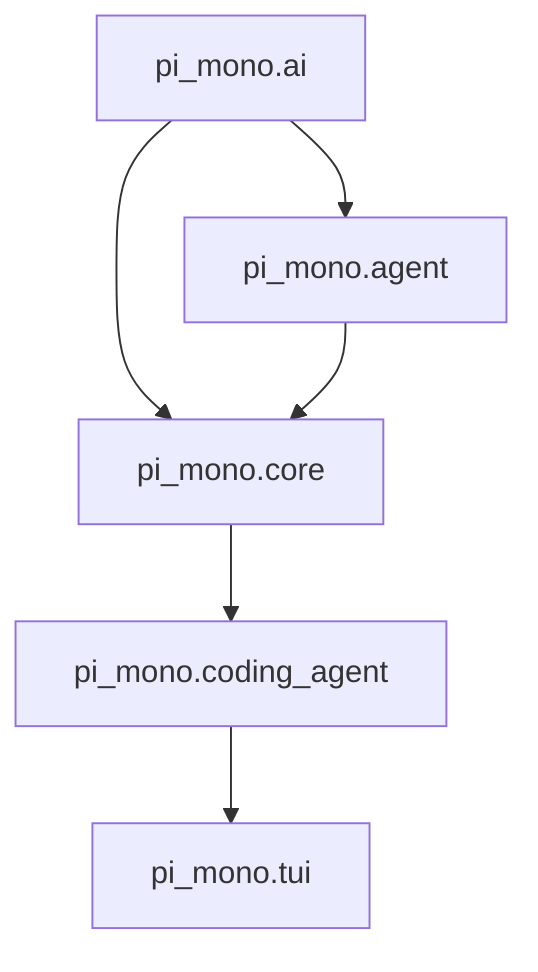
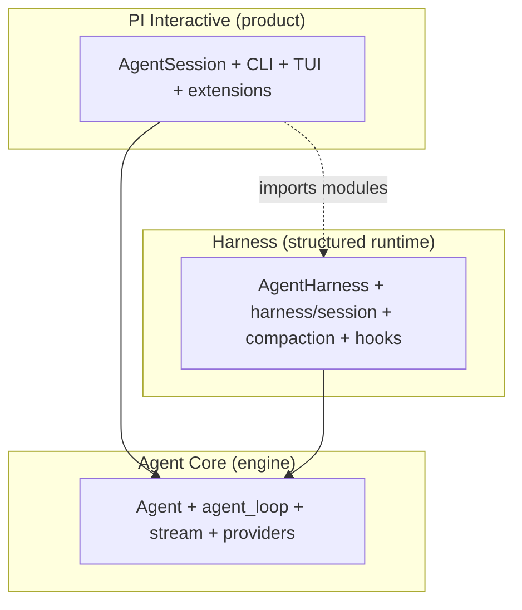
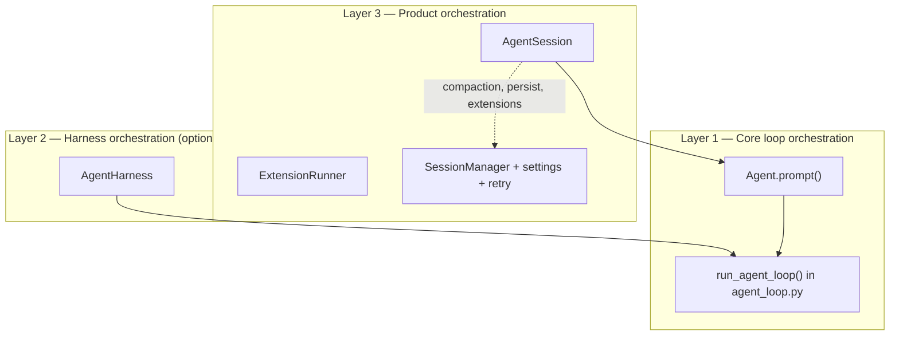
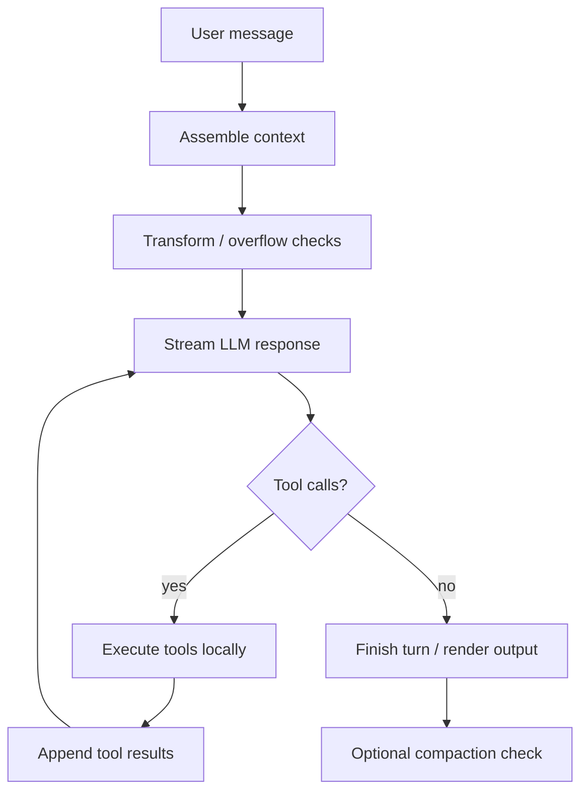
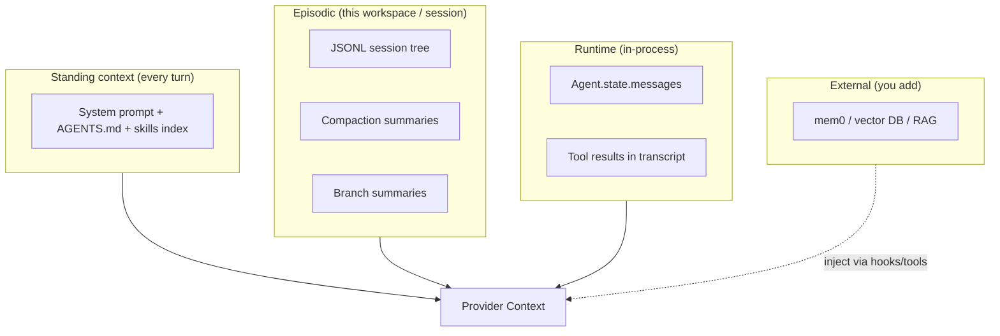

# Pi Mono Concepts Book: Python Edition

## 1. Purpose of This Book

This document is a second guide for `pi-mono`.

The first architecture book explains the repository as a system.

This book has a different goal:

1. explain the core concepts used in the repo in simple words
2. explain the Python files that implement those concepts
3. connect the abstract ideas to concrete Python code
4. show small Python snippets from the repo so the concepts feel real

If the first book answers, "What is this repo and how is it organized?", this book answers, "What do these words mean, why do they exist, and where do I see them in Python?"

The main file from the previous book is [docs/pi-mono-architecture-book.md](/Users/rukesh/Documents/projects/learning/pi-mono/docs/pi-mono-architecture-book.md).

This book focuses on the Python port under:

- `python/src/pi_mono/ai`
- `python/src/pi_mono/agent`
- `python/src/pi_mono/coding_agent`
- `python/src/pi_mono/core`
- `python/src/pi_mono/tui`

Related material:

- [pi-mono-architecture-book.md](pi-mono-architecture-book.md) — repository-wide system map
- [migration.md](migration.md) — TypeScript → Python port status
- [Alejandro's PI architecture video walkthrough](https://www.youtube.com/watch?v=gTeujlv8qK0) — visual tour of Agent Core vs PI Interactive (TypeScript-centric; section 33 maps to Python)

## 2. How to Read This Book

Each chapter follows the same pattern:

1. concept in general
2. why coding agents need it
3. common alternative designs
4. how `pi-mono` uses it
5. Python files to read
6. short Python snippet
7. what to notice in the snippet

That structure matters. Many people get lost because they jump directly into code without first understanding the concept.

This edition also supports three reading depths:

- Beginner
  - focuses on intuition, analogies, and what problem a concept solves
- Intermediate
  - focuses on how the concept is implemented and how parts connect
- Expert
  - focuses on architectural boundaries, tradeoffs, and why the design is structured this way

You do not need to read all three every time.

If a chapter feels too abstract, read the `Beginner` part first.

If a chapter feels too basic, skip to `Intermediate` or `Expert`.

**Practical appendices** (after the concept chapters): section 11 is the full harness + **orchestration** guide (§11.13); **section 36** is the memory guide (built-in + mem0); section 33 maps the architecture video to Python files; section 34 covers install/test commands; section 35 lists TypeScript parity gaps; section 37 summarizes.

## 3. A Simple Map of the Python Port

Before the concepts, keep this map in mind:



This diagram is not a strict import graph for every file. It is a learning map.

Meaning:

- `pi_mono.ai` knows how to talk to model providers
- `pi_mono.agent` knows how to run an agent loop
- `pi_mono.core` holds product services like auth, model registry, sessions, and settings
- `pi_mono.coding_agent` assembles the user-facing coding agent
- `pi_mono.tui` renders the terminal interface

### 3.1 Config directory layout (`~/.pi/agent`)

Most product behavior is driven by files under the agent config dir (default `~/.pi/agent`, override with `PI_CODING_AGENT_DIR`):

```text
~/.pi/agent/
  auth.json          # OAuth tokens and API-key entries per provider
  settings.json      # defaults: provider, model, compaction, theme, packages, …
  models.json        # custom model definitions (optional)
  sessions/          # JSONL session files, one subfolder per workspace cwd
  skills/            # global skill directories (SKILL.md trees)
  prompts/           # prompt template files
  themes/            # TUI themes
  tools/             # custom tool modules (extensions territory)
  extensions/        # installed extension packages
  SYSTEM.md          # optional global system prompt override
  APPEND_SYSTEM.md   # optional global append instructions
```

Project-local overrides often live in `.pi/` inside the repo cwd (skills, `SYSTEM.md`, `AGENTS.md` discovered up the directory tree). See `python/src/pi_mono/config.py` and `resource_loader.py`.

### 3.2 Entry points (what to run)

| Goal | Command |
| --- | --- |
| Interactive coding agent | `cd python && python -m pi_mono.coding_agent` |
| One-shot prompt (print mode) | `python -m pi_mono.coding_agent -p "your prompt"` |
| Headless JSON RPC | `python -m pi_mono.coding_agent --mode rpc` |
| OAuth / provider login | `python -m pi_mono.ai.cli login <provider>` |
| Cursor Agent CLI login | `python -m pi_mono.ai.cli login cursor` |
| List OAuth providers | `python -m pi_mono.ai.cli list` |

Install deps once: `cd python && pip install -e ".[dev]"` (requires Python 3.11+).

## 4. Concept: Provider Abstraction

### 4.1 What it is in general

A provider abstraction is a layer that hides differences between model vendors.

Without it, application code would need to know:

- which HTTP endpoint each vendor uses
- what message format each vendor expects
- how streaming works for each vendor
- how tool calls are encoded
- how auth works for each vendor

With a provider abstraction, the rest of the code can say:

"Use this model with this context."

and leave the provider-specific details to a lower layer.

### 4.2 Why agents need it

Coding agents often support many providers:

- OpenAI
- Anthropic
- Google
- Mistral
- Cursor
- others

If provider logic leaks into the agent loop, the system becomes hard to extend and hard to reason about.

### 4.3 Common alternative designs

There are three common patterns:

1. No abstraction at all
   - fast for prototypes
   - bad for growth
2. Thin adapter layer
   - enough for small systems
   - can still leak vendor quirks upward
3. Full unified model layer
   - strongest separation
   - more code up front

`pi-mono` chooses the third style.

### 4.4 How `pi-mono` uses it

In Python, the abstraction lives mainly in:

- [stream.py](/Users/rukesh/Documents/projects/learning/pi-mono/python/src/pi_mono/ai/stream.py)
- [models.py](/Users/rukesh/Documents/projects/learning/pi-mono/python/src/pi_mono/ai/models.py)
- [api_registry.py](/Users/rukesh/Documents/projects/learning/pi-mono/python/src/pi_mono/ai/api_registry.py)
- `python/src/pi_mono/ai/providers/*`

The stream layer chooses the right provider implementation.

### 4.5 Python snippet

```python
def stream(model: Model, context: Context, options: Optional[StreamOptions] = None):
    provider_name = model.get("provider")
    if provider_name == "cursor":
        from pi_mono.ai.providers.cursor import stream_cursor
        resolved_options = _with_env_api_key(model, options)
        return stream_cursor(model, context, resolved_options)

    api = model.get("api", "")
    provider = _resolve_api_provider(api)
    resolved_options = _with_env_api_key(model, options)
    return provider.stream(model, context, resolved_options)
```

Source:

- [stream.py](/Users/rukesh/Documents/projects/learning/pi-mono/python/src/pi_mono/ai/stream.py)

### 4.6 What to notice

This is the dispatch point.

The caller does not care how OpenAI or Anthropic works internally. It just passes:

- a model
- a context
- options

This is a classic abstraction boundary.

### 4.7 Provider spotlight: Cursor (subscription / Agent CLI)

Cursor is not a normal HTTP API key provider in the Python port. It delegates to the **Cursor Agent CLI** (`agent` on `PATH`, or `CURSOR_AGENT_PATH` / `AGENT_PATH`).

**Python files:**

- `python/src/pi_mono/ai/providers/cursor.py` — thin wrapper
- `python/src/pi_mono/ai/cursor_agent/__init__.py` — discovery, login, streaming via `agent --print --output-format stream-json`
- `python/src/pi_mono/ai/utils/oauth/cursor.py` — optional OAuth path for other flows
- `python/src/pi_mono/ai/models.py` — `discover_cursor_models()` merges CLI `agent models` output with static fallbacks

**Auth options (precedence):**

1. `CURSOR_API_KEY` env var (dashboard API key)
2. Session from `agent login` (checked via `agent status`)
3. Entry in `~/.pi/agent/auth.json` when wired through `AuthStorage`

**Login:**

```bash
cd python && python -m pi_mono.ai.cli login cursor
# or: agent login
```

**Use in coding agent:**

```bash
python -m pi_mono.coding_agent -p "Say exactly: OK" --provider cursor --model sonnet-4.6
```

**Design note:** the provider serializes the full `Context` (system + messages + tool results) into one prompt string for the CLI, then maps streamed JSON back into the standard assistant event stream. Tool loops inside pi still work, but the model backend is Cursor’s agent runtime, not a direct OpenAI/Anthropic HTTP call.

## 5. Concept: Model Registry

### 5.1 What it is in general

A model registry is a directory of models plus metadata.

Metadata usually includes:

- model id
- provider
- context window
- max tokens
- whether reasoning is supported
- pricing
- compatibility flags

### 5.2 Why it matters

If the agent only knew model ids as raw strings, it could not make good decisions about:

- defaults
- reasoning levels
- auth availability
- fallback behavior

### 5.3 How `pi-mono` uses it

There are two layers here:

1. `pi_mono.ai.models`
   - basic built-in model catalog
2. `pi_mono.core.model_registry`
   - product-level effective registry with auth and config

### 5.4 Python files

- [models.py](/Users/rukesh/Documents/projects/learning/pi-mono/python/src/pi_mono/ai/models.py)
- [models_generated.py](/Users/rukesh/Documents/projects/learning/pi-mono/python/src/pi_mono/ai/models_generated.py)
- [model_registry.py](/Users/rukesh/Documents/projects/learning/pi-mono/python/src/pi_mono/core/model_registry.py)

### 5.5 Python snippet

```python
def get_models(provider: str) -> list[Model]:
    if provider == "cursor":
        return discover_cursor_models()
    models = model_registry.get(provider)
    return list(models.values()) if models else []
```

Source:

- [models.py](/Users/rukesh/Documents/projects/learning/pi-mono/python/src/pi_mono/ai/models.py)

### 5.6 What to notice

This function shows two things:

1. most providers use built-in generated metadata
2. Cursor is dynamic and discovered through the local Cursor agent bridge

That means the registry is not only a static file. It can also include dynamic discovery.

### 5.7 Three levels of understanding

#### Beginner

Think of the model registry as the agent’s catalog.

If the agent wants to choose a model, it needs a place to look up:

- what models exist
- what they are called
- what provider they belong to
- what features they support

Without a registry, the rest of the system would just be guessing.

#### Intermediate

In `pi-mono`, there is a split:

- `pi_mono.ai.models`
  - basic catalog and helper functions
- `pi_mono.core.model_registry`
  - product-facing registry that merges auth, config, and custom provider state

That split matters because the agent product needs more than a raw list of model ids. It also needs to know:

- whether auth is configured
- whether a model should be shown to the user
- whether request headers are needed
- whether a custom `models.json` file changed the defaults

#### Expert

Architecturally, the model registry is a policy layer.

It is not merely a data table.

It decides effective availability, not just theoretical existence.

That is the correct design for a multi-provider agent product, because availability depends on runtime conditions such as auth, custom config, and provider-specific compatibility.

## 6. Concept: Streaming

### 6.1 What it is in general

Streaming means the model response arrives piece by piece instead of only as one final string.

Why this matters:

- better UX
- faster feedback
- progress visibility
- easier tool-call event handling

### 6.2 Streaming in a coding agent

A coding agent often needs to stream:

- partial assistant text
- tool call start
- tool call arguments
- tool result
- final completion
- errors

So streaming is not only about text. It is about runtime events.

### 6.7 Common stream event types (quick reference)

When reading `agent_loop.py` or provider adapters, these `type` values appear repeatedly:

| Event `type` | Meaning |
| --- | --- |
| `start` | Assistant message began; includes `partial` scaffold |
| `text_delta` / content deltas | Incremental text (exact name varies by provider adapter) |
| `tool_call_start` / `tool_call_delta` | Tool name and arguments streaming in |
| `done` / `message` | Final assistant message assembled |
| `error` | Provider or transport failure |

The agent loop consumes this stream and builds one `AssistantMessage` object per turn. Interactive mode and RPC mode subscribe to higher-level `AgentEvent`s (`agent_start`, `message_end`, …) emitted above the loop — see section 28.5.

**Cursor note:** the Cursor Agent CLI uses `stream-json` on stdout; `cursor_agent/__init__.py` maps those lines into the same event vocabulary before `agent_loop` sees them.

### 6.3 How `pi-mono` uses it

Streaming is central in:

- [stream.py](/Users/rukesh/Documents/projects/learning/pi-mono/python/src/pi_mono/ai/stream.py)
- [event_stream.py](/Users/rukesh/Documents/projects/learning/pi-mono/python/src/pi_mono/ai/utils/event_stream.py)
- [agent_loop.py](/Users/rukesh/Documents/projects/learning/pi-mono/python/src/pi_mono/agent/agent_loop.py)

### 6.4 Python snippet

```python
response = await maybe_await(
    stream_func(config["model"], llm_context, cast(SimpleStreamOptions, options))
)

async for event in response:
    event_type = event["type"]
    if event_type == "start":
        partial_message = event["partial"]
```

Source:

- [agent_loop.py](/Users/rukesh/Documents/projects/learning/pi-mono/python/src/pi_mono/agent/agent_loop.py)

### 6.5 What to notice

The loop does not wait for one final string. It consumes a stream of events.

That is a major part of why the agent can support:

- real-time UI updates
- partial rendering
- tool-event coordination

### 6.6 Three levels of understanding

#### Beginner

Streaming means the answer comes in pieces instead of all at once.

That is why you can watch the assistant "type" rather than waiting for a long pause and then seeing the full answer suddenly appear.

#### Intermediate

In this repo, streaming is not only for text.

The event stream can also carry:

- start events
- partial message updates
- tool-related events
- final completion or error information

That is why the same runtime can support interactive UI, print mode, and RPC mode without each mode inventing its own transport logic.

#### Expert

Architecturally, streaming is the contract between asynchronous provider behavior and the rest of the runtime.

Once the runtime treats provider output as an event stream rather than as one blocking return value, it can unify:

- live rendering
- tool-call inspection
- retry/error behavior
- host integration

This is one of the core design choices that makes the system feel like a real agent runtime rather than a wrapped completion API.

## 7. Concept: Messages and Context

### 7.1 What a message is in general

A message is a structured unit in a conversation.

Common roles:

- system
- user
- assistant
- tool result

### 7.2 What context is

Context is the effective input the model sees.

Usually:

- system prompt
- conversation history
- tool definitions

### 7.3 Why this matters

Many beginners confuse:

- stored history
- current runtime state
- exact model input

These are related, but not the same thing.

### 7.4 How `pi-mono` uses it

In the agent loop:

1. internal `AgentMessage` objects exist
2. they are converted into model-facing messages
3. a `Context` object is built for the provider layer

This short summary is correct, but it is too compressed if you are learning the system for the first time. So let us expand it carefully.

#### Step 1: internal `AgentMessage` objects exist

Inside the agent runtime, the system does not immediately speak in raw provider format.

It first works with internal agent messages.

Why?

Because the agent runtime needs a message format that is convenient for the runtime itself, not only for the model API.

The runtime wants to represent things like:

- user prompts
- assistant replies
- tool results
- synthetic messages such as compaction summaries
- branch summaries
- custom extension messages

Some of these are natural for the runtime, but not all providers understand them directly.

So the internal message format is like the repo's native language.

Analogy:

- internal `AgentMessage` objects are like notes written in the company’s internal format
- provider-facing messages are like the final form that must be submitted to an external government office

The internal format is designed for convenience and expressiveness.

The external format is designed for compatibility.

#### Step 2: those internal messages are converted into model-facing messages

Before calling the model, the runtime must translate the internal message list into the smaller and more standardized message list the provider layer expects.

This conversion step is important because:

- internal runtime messages may contain concepts the provider does not understand directly
- the provider layer expects only supported roles and content blocks
- some information is for runtime control only and should not be shown to the model

In the basic `Agent` implementation, this conversion happens through `convertToLlm`.

That means the runtime says:

"Here is my full internal history. Now turn it into the exact message list the model should see."

This is a major architectural boundary.

If you do not understand this boundary, a lot of the repo feels confusing.

#### Step 3: a provider-layer `Context` object is built

After conversion, the runtime builds a `Context` dictionary for the provider layer.

That context contains:

- the system prompt
- the converted messages
- the visible tool definitions

This object is what actually crosses the boundary into the `pi_mono.ai` layer.

So there are really three levels:

1. internal runtime message history
2. converted model-facing message history
3. full provider-facing `Context`

That third level is what the provider adapter finally uses to make the model request.

#### Why the repo is designed this way

This design gives `pi-mono` flexibility:

- the runtime can have richer internal concepts
- the model layer can stay provider-focused
- the conversion boundary stays explicit

If the system skipped this separation, then provider constraints would leak into the entire runtime.

That would make sessions, custom messages, compaction, and extension behavior much harder to design cleanly.

#### Mini walkthrough

Suppose the user says:

"Find where authentication is handled and explain it."

Internally, the runtime may have:

1. old user messages
2. old assistant messages
3. a compaction summary
4. a branch summary
5. the new user message
6. tool results from previous turns

The runtime first keeps all of that in its own message/state model.

Then it asks:

"What exact subset and representation of this should the model see right now?"

That is the conversion step.

Then it builds:

- `systemPrompt`
- `messages`
- `tools`

and hands that provider-facing context to the model layer.

### 7.5 Python snippet

```python
llm_context: Context = {
    "systemPrompt": context.get("systemPrompt", ""),
    "messages": llm_messages,
    "tools": [
        {
            "name": t.name,
            "description": t.description,
            "parameters": t.parameters,
        }
        for t in context.get("tools", [])
    ],
}
```

Source:

- [agent_loop.py](/Users/rukesh/Documents/projects/learning/pi-mono/python/src/pi_mono/agent/agent_loop.py)

### 7.6 What to notice

This is the exact bridge from agent runtime into provider runtime.

It is a small block of code, but it is conceptually important.

#### Read this snippet slowly

```python
llm_context: Context = {
    "systemPrompt": context.get("systemPrompt", ""),
    "messages": llm_messages,
    "tools": [...],
}
```

This means:

- `context.get("systemPrompt", "")`
  - the runtime already decided what instructions the model should follow
- `llm_messages`
  - the runtime already converted its internal messages into provider-facing ones
- `tools`
  - the runtime exposes tool definitions to the model in a structured form

So by the time this object is built, a lot of important thinking has already happened.

This line is not "the start" of context building.

It is the final packaging step before the request leaves the agent runtime.

### 7.7 Two conversion boundaries (do not merge them)

Beginners often lump all message shaping into one step. This repo has **two** distinct conversions:

| Stage | Where | Input → output | Purpose |
| --- | --- | --- | --- |
| **Agent conversion** | `agent_loop.py` / harness `convert_to_llm` | Internal `AgentMessage` list → provider `Message` list | Drop runtime-only entries; map compaction/branch summaries into model-visible roles |
| **Provider transformation** | `pi_mono.ai.providers.transform_messages` | Provider `Message` list → adjusted list | Vendor quirks: image downgrade, thinking-block handling, tool-call ID normalization, synthetic tool results for orphans |

Only the second stage runs inside each provider adapter (Anthropic, OpenAI, Google, …) immediately before the HTTP request.

**Files:** `python/src/pi_mono/ai/providers/transform_messages.py` (shared), called from `anthropic.py`, `openai_completions.py`, `openai_responses_shared.py`, etc.

**Overflow detection** is separate again: `pi_mono.ai.utils.overflow.is_context_overflow` inspects failed assistant messages so the product can distinguish “context too long” from retryable network errors (section 9.9).

## 8. Concept: Tools

### 8.1 What a tool is in general

A tool is a capability the model can request, but the runtime must execute.

Examples:

- read a file
- search files
- run a shell command
- edit text

### 8.2 Why tools matter

Without tools, a coding agent is just a code explainer.

With tools, it becomes an active worker.

### 8.3 Common tool architectures

1. direct function calls in process
2. RPC-style tool servers
3. subprocess-backed tools
4. host-managed tools provided by an outer application

`pi-mono` supports a built-in local tool model and also extension-driven tools.

### 8.4 Python files

- `python/src/pi_mono/coding_agent/core/tools/bash.py`
- `python/src/pi_mono/coding_agent/core/tools/read.py`
- `python/src/pi_mono/coding_agent/core/tools/write.py`
- `python/src/pi_mono/coding_agent/core/tools/edit.py`
- `python/src/pi_mono/coding_agent/core/tools/grep.py`
- `python/src/pi_mono/coding_agent/core/tools/find.py`
- `python/src/pi_mono/coding_agent/core/tools/ls.py`

**Default product toolset:** `read`, `bash`, `edit`, `write` only (`_default_active_tools` in `agent_session.py`). `grep`, `find`, and `ls` exist but are not enabled unless you opt in via `--tools` or settings. See section 33.9 for read-only RPC examples.

### 8.5 Python snippet

```python
def _resolve_tools(
    cwd: str,
    *,
    initial_active_tool_names: list[str] | None = None,
    allowed_tool_names: list[str] | None = None,
    excluded_tool_names: list[str] | None = None,
) -> list[AgentTool]:
    active = initial_active_tool_names or _default_active_tools()
    if allowed_tool_names is not None:
        active = [name for name in active if name in allowed_tool_names]
    if excluded_tool_names:
        active = [name for name in active if name not in excluded_tool_names]
    return [create_tool(name, cwd) for name in active]
```

Source:

- [agent_session.py](/Users/rukesh/Documents/projects/learning/pi-mono/python/src/pi_mono/coding_agent/core/agent_session.py)

### 8.6 What to notice

Tools are not always globally on.

The runtime can:

- choose default tools
- restrict tools
- exclude tools
- create tools relative to the current working directory

That is a product-level control layer on top of the generic agent runtime.

### 8.7 Three levels of understanding

#### Beginner

Tools are the agent’s hands.

The model can think and request actions, but the runtime is the part that actually touches files, runs commands, and returns results.

#### Intermediate

In `pi-mono`, the tool system has at least three concerns:

1. what tools exist
2. which of those tools are currently active
3. how tool calls are executed and converted into tool-result messages

That is why the product layer does not simply expose every tool all the time. It can enable a safe or purpose-specific subset.

#### Expert

Architecturally, tools are capability boundaries.

The model never executes OS-level work directly. It only requests structured tool calls.

The runtime decides:

- whether the tool exists
- whether it is active
- whether the arguments are valid
- what result should be fed back into the loop

That separation is essential for correctness, auditing, and future policy controls.

## 9. Concept: Agent Loop

### 9.1 What it is in general

The agent loop is the repeated cycle:

1. send context to model
2. receive model output
3. execute tools if requested
4. append tool results
5. continue until the model stops

This is the core pattern of many modern coding agents.

### 9.2 Why it is called a loop

Because one user prompt can cause several turns of internal work.

The outer conversation looks like:

- user asks one question

But internally the runtime may do:

- model call
- read file
- model call
- grep
- model call
- edit file
- model call
- final answer

Another way to say it:

The user sees one request.

The runtime may see many sub-requests.

That is why coding agents feel active instead of passive.

### 9.3 Python files

- [agent.py](/Users/rukesh/Documents/projects/learning/pi-mono/python/src/pi_mono/agent/agent.py)
- [agent_loop.py](/Users/rukesh/Documents/projects/learning/pi-mono/python/src/pi_mono/agent/agent_loop.py)

### 9.4 Python snippet

```python
while True:
    has_more_tool_calls = True

    while has_more_tool_calls or len(pending_messages) > 0:
        message = await stream_assistant_response(
            current_context, config, signal, emit, stream_fn
        )
        new_messages.append(message)

        tool_calls = [c for c in message.get("content", []) if c.get("type") == "toolCall"]
```

Source:

- [agent_loop.py](/Users/rukesh/Documents/projects/learning/pi-mono/python/src/pi_mono/agent/agent_loop.py)

### 9.5 What to notice

This is the heart of the agent.

It is not a simple chat request. It is an orchestration machine.

### 9.6 Expanded step-by-step loop explanation

The short five-step summary is useful, but let us make it more concrete.

#### Phase A: prepare the current turn

The loop starts with:

- the current conversation state
- the selected model
- the available tools
- optional queued steering or follow-up messages

The runtime first decides what messages belong in the current turn.

That can include:

- the user’s new prompt
- messages queued while a previous turn was active
- follow-up instructions added by runtime logic

So even before the model is called, the loop may already be doing work to prepare the effective turn.

#### Phase B: build model-facing context

Now the loop:

1. transforms internal messages if needed
2. converts them into model-facing messages
3. builds the `Context`

This is the boundary we discussed in the previous chapter.

#### Phase C: stream the assistant response

The runtime sends the request and starts consuming streamed events.

At this stage the assistant message may still be partial.

So the runtime is building the answer incrementally.

That is why the UI can show:

- partial assistant text
- live progress
- partial tool activity

#### Phase D: inspect the assistant message for tool calls

When the streamed message is complete enough, the loop checks whether the assistant requested tools.

If there are no tool calls:

- the turn can finish

If there are tool calls:

- the runtime must execute them

This decision point is one of the most important points in the whole agent architecture.

Because this is where the system asks:

"Is the model done thinking, or is it asking the runtime to do work?"

#### Phase E: execute tools

The runtime executes the requested tools and creates tool result messages.

These tool result messages are added back into the conversation.

This is how the assistant learns what happened in the real environment.

Without this step, a model could ask to read a file but would never see the file content.

#### Phase F: continue or stop

After tool execution, the runtime checks:

- should another internal turn happen now?
- are there queued messages?
- did hooks change the next-turn configuration?
- should the loop stop after this turn?

If another turn is needed, the loop repeats.

If not, the run ends.

#### The key mental model

The loop is not just:

"ask model, get answer"

It is:

"prepare state, ask model, stream response, inspect response, maybe execute tools, update state, maybe continue"

That is why agent loops are the real engine of coding agents.

### 9.7 What lives inside one loop run

A single run may contain:

1. one or more user or system-side queued messages
2. one or more assistant messages
3. zero or more tool-call batches
4. zero or more tool-result messages
5. turn-end checks
6. optional next-turn preparation

That is why reading only the `prompt(...)` method can be misleading. The actual behavior lives deeper in the loop.

### 9.8 Steering and follow-up queues (product layer)

The raw loop supports queued messages mid-run (`steer` / follow-up semantics in TypeScript). In the Python product, `AgentSession` and interactive mode can inject additional user text while the agent is still working; settings `steeringMode` and `followUpMode` (`all` vs `one-at-a-time`) control how those are drained.

Files: `agent_session.py`, `settings_manager.py`, interactive prompt handling in `interactive_mode.py`.

When learning the loop, distinguish:

- **turn** — one model call + optional tool batch inside `agent_loop`
- **run** — full user-visible request, possibly many turns
- **queued steering** — extra user input appended between turns without starting a new top-level run

### 9.9 Retries and overflow (product layer, not inside `agent_loop`)

The raw loop in `agent_loop.py` does not implement retry policy itself. **`AgentSession`** wraps the agent and adds:

1. **Transient error retry** — after `agent_end`, if the last assistant message looks like a retryable provider/network error (429, 503, timeout, …) and `settings.json` `retry.enabled` is true, the session sleeps with backoff and starts another run (up to `retry.maxRetries`).
2. **Non-retry for overflow** — `is_context_overflow()` from `pi_mono.ai.utils.overflow` returns true for “prompt too long” style errors; those are **not** retried the same way — the fix is compaction or a shorter context (section 15).
3. **Non-retry for billing** — quota / 402 patterns are excluded in `_is_non_retryable_provider_limit_error`.

Provider adapters may also retry individual HTTP requests (e.g. OpenAI Codex `maxRetryDelayMs` on 429). That is transport-level retry inside one stream call, separate from session-level rerun.

**Settings:** `retry.enabled`, `retry.maxRetries`, `retry.baseDelayMs` in `~/.pi/agent/settings.json` (see section 20.5).

**Harness phases:** `AgentHarnessPhase` in `agent/harness/types.py` includes `"retry"` and `"compaction"` so the harness UI can show what the runtime is doing between visible assistant replies.

## 10. Concept: Agent State

### 10.1 What state means in general

State means the data the system is carrying right now.

For an agent, state often includes:

- current messages
- selected model
- system prompt
- active tools
- whether it is streaming
- pending tool calls
- errors

### 10.2 How `pi-mono` uses it

The Python `Agent` wraps state in `MutableAgentState`.

### 10.3 Python snippet

```python
class MutableAgentState:
    def __init__(self, initial_state: dict[str, Any] | None = None) -> None:
        self.systemPrompt: str = initial.get("systemPrompt", "")
        self.model: Model = initial.get("model", DEFAULT_MODEL)
        self.thinkingLevel: Any = initial.get("thinkingLevel", "off")
        self._tools: List[AgentTool] = list(initial.get("tools", []))
        self._messages: List[AgentMessage] = list(initial.get("messages", []))
```

Source:

- [agent.py](/Users/rukesh/Documents/projects/learning/pi-mono/python/src/pi_mono/agent/agent.py)

### 10.4 Why this matters

This is the in-memory live state.

Later chapters explain how that differs from durable session state on disk.

## 11. Concept: Harness (from layman to research)

This chapter is the deep guide for harnessing. Read it in order: plain English first, then code, then research direction.

### 11.1 Layman explanation: what is a harness?

Imagine a powerful horse (the AI model) hitched to a cart (your project).

The horse alone can run, but it cannot safely pull a load, remember the route, or follow traffic rules. You need:

- **reins** — steer mid-run (“actually, also check tests”)
- **harness straps** — connect power to the cart without breaking
- **a cart with storage** — remember what happened yesterday (session file)
- **a driver’s checklist** — what tools are allowed today (read-only vs full access)
- **a dashboard** — show progress while the horse is still running (streaming UI)

In software, a **harness** is that whole setup around the raw “think → call tools → think again” loop.

**Without a harness**, you have a chat API wrapper: send text, get text.

**With a harness**, you have an **agent runtime**: memory, tools, safety policy, compaction when context fills up, branching conversations, hooks for extensions, and a product UI on top.

One sentence version:

> The **agent loop** is the engine; the **harness** is everything that makes the engine safe, persistent, and usable in a real product.

### 11.2 The three layers in pi (stack diagram)



| Layer | Analogy | Job |
| --- | --- | --- |
| **Agent Core** | Engine | One turn: build context → stream model → run tools → repeat |
| **Harness** | Frame, storage, policy | Sessions, compaction, branch summaries, hooks, turn snapshots, queues |
| **PI Interactive** | Car body + dashboard | Auth, settings, slash commands, TUI, extensions, `~/.pi/agent` layout |

**Critical detail for readers of this repo:** the pi **coding agent does not instantiate `AgentHarness` today**. `AgentSession` calls `Agent` directly and **imports harness modules** (`compaction`, `messages`, …). `AgentHarness` is the intended reusable orchestration class for embedders and is where the TypeScript repo is migrating toward (see `packages/agent/docs/agent-harness.md`).

### 11.3 What the pi harness does (plain checklist)

When someone says “the harness” in pi-mono, they usually mean the code under `pi_mono.agent.harness` plus the design docs in `packages/agent/docs/`. It answers questions the raw loop does not:

| Question | Harness answer |
| --- | --- |
| Where is conversation history stored? | JSONL session tree (`harness/session/`) |
| What if context is too long? | Compaction + branch summarization (`harness/compaction/`) |
| Can the user interrupt or steer? | `steer` / `followUp` / `nextTurn` queues on `AgentHarness` |
| Can plugins change behavior? | Hook events (`context`, `tool_call`, `session_before_compact`, …) |
| How are skills/templates loaded? | `harness/skills.py`, `harness/prompt_templates.py`, `ExecutionEnv` |
| What phase is the runtime in? | `idle` \| `turn` \| `compaction` \| `branch_summary` \| `retry` |
| How do we avoid corrupting an in-flight request? | **Turn snapshots** — config frozen per model call; changes apply at **save points** between turns |

### 11.4 Pi harness vs Cursor harness (side by side)

Cursor appears in pi in **two different ways**. Keep them separate:

1. **Cursor as a provider** — pi calls the closed-source `agent` CLI (`pi_mono.ai.cursor_agent`). Cursor’s harness runs **inside** that binary.
2. **Cursor IDE** — the desktop app’s agent (Composer, Agent mode). Also closed-source; not in this repo.

The table below compares **pi’s open harness** (what you can read) with **Cursor’s agent stack** (mostly inferred from CLI behavior and product surface, not source code).

| Dimension | **Pi harness** (`pi_mono.agent.harness`) | **Cursor agent** (IDE + `agent` CLI) |
| --- | --- | --- |
| **Source** | Open in this monorepo | Closed; pi only integrates via subprocess |
| **Orchestration** | Explicit `AgentHarness` + `agent_loop`; you can read every step | Opaque loop inside `agent`; pi serializes `Context` to one prompt string |
| **Session / memory** | JSONL tree in `~/.pi/agent/sessions`, fork/`/tree`, compaction entries | Managed inside Cursor; pi does not see Cursor’s internal session when using CLI |
| **Context assembly** | Transparent: system prompt parts, skills XML, message tree, hooks | Pi flattens to text in `serialize_context()` before calling CLI |
| **Tools** | You register tools; harness executes locally (`read`, `bash`, `edit`, …) | Cursor CLI runs its own tool environment; pi’s tool loop still runs when not using Cursor provider |
| **Hooks / extensions** | Typed hook design (`packages/agent/docs/hooks.md`); coding-agent extensions | Cursor rules, MCP, IDE integrations — different extension model |
| **Compaction** | Explicit `prepare_compaction` / `compact`, template-shaped summaries | Handled inside Cursor (not configurable from pi) |
| **Steering** | `steer()` / queues with modes `all` vs `one-at-a-time` | IDE UX (follow-ups, interrupt) — no pi API into Cursor’s queue |
| **Durability / crash recovery** | Designed toward **semi-durable harness** (`durable-harness.md`); work in progress | Unknown; not exposed to pi integrators |
| **Billing / auth** | Per-provider (`auth.json`, env keys) | Cursor subscription via `agent login` / `CURSOR_API_KEY` |
| **Best for** | Building your own agent product, auditing behavior, research | Using Cursor’s models + subscription with pi’s UI/session model |

**How pi talks to Cursor (integration point):**

```text
AgentSession → Agent → agent_loop → stream.py → cursor.py
  → cursor_agent.stream_cursor_cli()
  → subprocess: agent --print --output-format stream-json --workspace <cwd> <serialized prompt>
```

Files to read: `python/src/pi_mono/ai/cursor_agent/__init__.py` (`serialize_context`, `stream_cursor_cli`), `python/src/pi_mono/ai/providers/cursor.py`.

**Mental model:** when `--provider cursor`, pi’s harness still owns **sessions, tools, and UI**, but the **model backend** is Cursor’s closed agent. You get a **hybrid**: pi harness on the outside, Cursor harness on the inside.

### 11.5 Code map: where the harness lives

#### Python (`python/src/pi_mono/agent/harness/`)

| Path | Responsibility |
| --- | --- |
| `agent_harness.py` | Main orchestrator: `prompt`, `compact`, `navigate_tree`, queues, phases, calls `run_agent_loop` |
| `types.py` | `AgentHarnessPhase`, hook event types, stream options, errors |
| `messages.py` | Internal message helpers, `convert_to_llm`, compaction/branch summary messages |
| `session/session.py` | Session API: append message, compaction, branch, get branch path |
| `session/jsonl_storage.py` / `jsonl_repo.py` | Durable JSONL persistence |
| `session/memory_storage.py` / `memory_repo.py` | In-memory sessions (tests) |
| `compaction/compaction.py` | Token estimate, `should_compact`, `prepare_compaction`, `compact` |
| `compaction/branch_summarization.py` | Summarize inactive branch before tree navigation |
| `compaction/utils.py` | File-op tracking for summaries |
| `skills.py` / `prompt_templates.py` | Format skill/template invocations |
| `system_prompt.py` | `<available_skills>` XML formatting |
| `env/local.py` | `LocalExecutionEnv` — filesystem/shell abstraction for tests and loaders |
| `utils/truncate.py`, `utils/shell_output.py` | Output limits for tool results |

#### TypeScript (design source of truth for harness evolution)

| Path | Responsibility |
| --- | --- |
| `packages/agent/docs/agent-harness.md` | Lifecycle, phases, save points, implementation todo |
| `packages/agent/docs/hooks.md` | Hook typing, reducers, mutation semantics |
| `packages/agent/docs/durable-harness.md` | Crash recovery research / semi-durable session |
| `packages/agent/src/harness/agent-harness.ts` | Reference implementation |
| `packages/agent/test/harness/*.test.ts` | Behavior tests (run with `npm run test:harness` in `packages/agent`) |

#### Product layer (uses harness pieces, not always `AgentHarness`)

| Path | Harness-related use |
| --- | --- |
| `coding_agent/core/agent_session.py` | `Agent` + `compact`/`prepare_compaction` + retry + extensions |
| `core/session_manager.py` | Product JSONL sessions, workspace dirs, tree path rebuild |

### 11.6 How harness is used in practice (three patterns)

#### Pattern A — Full `AgentHarness` (embedders, tests)

You construct env + session + model + tools and call `await harness.prompt("...")`.

**Start here:**

- Python: `python/tests/harness/test_agent_harness.py`
- TypeScript: `packages/agent/test/scratch/simple.ts`, `packages/agent/test/harness/agent-harness.test.ts`

Minimal shape:

```python
harness = AgentHarness({
    "env": local_env,
    "session": session,
    "model": model,
    "tools": tools,
    "get_api_key_and_headers": get_auth,
})
await harness.prompt("Hello")
```

#### Pattern B — Pi coding agent (`AgentSession`)

The product **reimplements product concerns** (extensions, settings, auth, retry) on top of `Agent` while **importing harness libraries** for compaction and messages. It does **not** wrap `AgentHarness` yet — migration is planned (`agent-harness.md` §7).

**Start here:** `coding_agent/core/agent_session.py` → `agent.py` → `agent_loop.py`.

#### Pattern C — Cursor provider (harness behind a wall)

Pi’s harness builds `Context`; Cursor’s CLI runs its own loop. Pi maps streamed JSON back to assistant events.

**Start here:** `ai/cursor_agent/__init__.py`, then `tests/test_cursor.py`.

### 11.7 Intermediate: phases, snapshots, and save points

These ideas separate pi’s harness from a naive while-loop.

**Phases** — what operation owns the harness right now:

```text
idle → turn → (optional) compaction | branch_summary | retry → idle
```

Structural calls (`prompt`, `compact`, `navigate_tree`) require `idle`. Queue calls (`steer`, `follow_up`) work during `turn`.

**Turn snapshot** — when a turn starts, `createTurnState()` copies:

- messages on the active branch
- resolved resources and system prompt
- model, thinking level, active tools, stream options

Changes to model/tools mid-run affect the **next** turn, not the HTTP request already in flight.

**Save point** — after assistant + tool results for a turn are done:

1. Flush pending session writes
2. Create a fresh snapshot for the next internal turn
3. Drain steering/follow-up queues if configured

Source: `packages/agent/docs/agent-harness.md` (§ State model, § Save points). Python mirror: `agent_harness.py` `_execute_turn`, `_flush_pending_session_writes`.

### 11.8 Hooks: how extensions intercept the harness

Hooks are the harness’s **editable wiring**. `AgentHarness` emits events; registered handlers can observe or mutate.

**Read-only examples:** `message_end`, `after_provider_response`

**Mutation examples:**

| Hook | Effect |
| --- | --- |
| `context` | Transform message list before model sees it |
| `before_provider_payload` | Patch provider request body |
| `tool_call` | Block or allow a tool (`{ block: true, reason }`) |
| `tool_result` | Rewrite tool output |
| `session_before_compact` | Cancel or replace compaction |
| `session_before_tree` | Cancel or customize branch navigation |

Full semantics: `packages/agent/docs/hooks.md`.

Coding-agent **extensions** use a parallel event surface (`agent_start`, `tool_call`, …) in `ExtensionRunner` — product-level, not identical to harness hooks, but same idea: observe and mutate lifecycle.

### 11.9 When to use `Agent` vs `AgentHarness` vs `AgentSession`

| Layer | Use when | Python entry |
| --- | --- | --- |
| `Agent` + `agent_loop` | Minimal tool loop; unit tests; you bring persistence | `pi_mono.agent.agent`, `agent_loop.py` |
| `AgentHarness` | Sessions, compaction, skills, hooks, branch summaries — **your** product, not pi CLI | `agent/harness/agent_harness.py` |
| `AgentSession` | Hacking pi itself (interactive / print / RPC) | `coding_agent/core/agent_session.py` |

Rule of thumb: learning pi as an app → `AgentSession`. Building a new agent on pi primitives → `AgentHarness` or `Agent` + cherry-pick harness modules.

### 11.10 What to read in code (guided depth path)

**Level 1 — Intuition (1–2 hours)**

1. This section (11.1–11.4)
2. `packages/agent/README.md` — event sequence for `prompt()`
3. Skim `agent_harness.py` public methods (`prompt`, `steer`, `compact`, `navigate_tree`)

**Level 2 — Implementer (1 day)**

1. `agent_loop.py` — tool loop
2. `harness/session/session.py` — append + tree
3. `harness/compaction/compaction.py` — `prepare_compaction` / `compact`
4. `python/tests/harness/test_agent_harness.py` — expected behavior
5. `agent_session.py` — how the product differs from raw harness

**Level 3 — Harness contributor**

1. `packages/agent/docs/agent-harness.md` — full lifecycle + todo list
2. `packages/agent/docs/hooks.md` — hook reducers
3. `packages/agent/test/harness/` — TypeScript harness tests
4. `packages/agent/docs/durable-harness.md` — recovery design

**Level 4 — Cursor integration only**

1. `ai/cursor_agent/__init__.py` — CLI protocol
2. `tests/test_cursor.py` — mocked CLI contract
3. Compare with `providers/anthropic.py` to see direct HTTP vs subprocess harness

### 11.11 Research-level harness: what the field is solving

At research and advanced-engineering level, a harness is not just “glue code.” It is the **operating system for agents**: scheduling, persistence, policy, and failure semantics around non-deterministic models.

#### Problems the research community cares about

| Problem | Why it matters | Pi direction (`packages/agent/docs/`) |
| --- | --- | --- |
| **Context limits** | Models forget; long tasks fail | Compaction with structured summaries; branch summarization |
| **Durability** | Process crash mid-tool loses state | `durable-harness.md`: queue + pending-write journaling in session |
| **Safe tool retry** | Re-running `bash` may double-apply side effects | Tool metadata for idempotency before auto-retry |
| **Hook reentrancy** | Extension calls `prompt()` from inside `tool_call` → deadlock | Facade + `runWhenIdle()`; lifecycle hardening test suite |
| **Observability** | Debug multi-turn failures | `observability.md`; typed phases and save points |
| **Policy / alignment** | Block dangerous tools, redact secrets | `tool_call` / `tool_result` hooks |
| **Multi-agent orchestration** | Subagents, handoffs | Queues, `nextTurn`, branch tree (primitive fork semantics) |

#### Where pi’s harness research is heading (from in-repo design docs)

1. **Semi-durable harness** — session JSONL becomes the source of truth not only for messages but for queues, pending writes, and operation markers; resume after crash without duplicating tool side effects (`durable-harness.md`).

2. **Coding-agent on `AgentHarness`** — today’s split (`AgentSession` vs `AgentHarness`) converges so product behavior uses one orchestration path (`agent-harness.md` §7).

3. **Typed hook reducers** — move mutation chaining out of ad hoc code into composable reducers; extensions register with provenance (`hooks.md`).

4. **Explicit recovery policies** — `mark_interrupted` vs `retry_unfinished` for unfinished provider streams and tool calls; default conservative because **provider streams are not resumable**.

5. **Harness as platform** — stable facades for session writes during busy phases, instead of raw session access from listeners.

#### Broader research landscape (outside this repo)

These are active directions in academia and industry; pi’s open harness is one concrete design point:

- **Durable execution** — workflows that survive restarts (analogous to Temporal / durable functions, applied to agents).
- **Memory hierarchies** — episodic session log vs semantic memory vs retrieval (pi today: section 36; compaction in section 15)
- **Sandboxed tool execution** — isolate `bash`/`write` (pi: local tools + `--tools` restriction; Cursor: proprietary sandbox).
- **Verifiable tool traces** — replay session JSONL for audit (pi’s JSONL design supports this in principle).
- **Multi-model routing** — harness chooses model per turn (pi: `setModel`, scoped models, thinking levels).

You do not need these papers to use pi. They explain **why** the harness keeps growing while the agent loop stays small.

### 11.12 Python snippet (constructor surface)

```python
class AgentHarness(Generic[TSkill, TPromptTemplate, TTool]):
    def __init__(self, options: AgentHarnessOptions[TSkill, TPromptTemplate, TTool]) -> None:
        self.env = options["env"]
        self.session = options["session"]
        self.resources = get_harness_option(options, "resources", "resources", {}) or {}
        self.stream_options = clone_stream_options(
            get_harness_option(options, "stream_options", "streamOptions")
        )
        self.system_prompt = get_harness_option(
            options, "system_prompt", "systemPrompt", "You are a helpful assistant."
        )
```

Source: `python/src/pi_mono/agent/harness/agent_harness.py`

The harness is not the raw loop. It is the structured runtime around the loop — and in pi, it is the main place where **agent systems research meets production code** you can actually read.

### 11.13 Orchestration: is there an “Orchestrator” in pi?

**Short answer:** pi has **orchestration**, but **no class named `Orchestrator`**. The word shows up in docs and comments meaning “the code that coordinates the run.” Different layers orchestrate different things.

#### Layman version

**Orchestration** = who decides the order of steps: call model → run tools → save session → maybe compact → show UI → retry on error.

Think of a concert:

| Role | Pi equivalent |
| --- | --- |
| **Musicians** (model, tools) | `stream.py`, `coding_agent/core/tools/*` |
| **Conductor** (one run’s beat) | `agent_loop.py` — `run_agent_loop` |
| **Stage manager** (sessions, queues, compaction) | `AgentHarness` or product logic in `AgentSession` |
| **Theater director** (CLI, TUI, extensions, settings) | `AgentSession` + `main.py` + modes |

There is one conductor for the **tool loop**, and a separate stage manager for **product concerns**. They overlap but are not the same file.

#### The three orchestration layers (code map)



| Layer | File(s) | Orchestrates |
| --- | --- | --- |
| **1 — Agent loop** | `python/src/pi_mono/agent/agent_loop.py` | Per **run**: stream model → detect tool calls → execute tools → append results → repeat until stop; `transformContext`, save points between internal turns |
| **2 — Harness** | `python/src/pi_mono/agent/harness/agent_harness.py` | Per **harness API call**: phases (`idle`/`turn`/…), turn snapshots, steering queues, hook emission, session pending writes, calls `run_agent_loop` |
| **3 — Product** | `python/src/pi_mono/coding_agent/core/agent_session.py` | Per **user-facing session**: system prompt refresh, tool resolution, JSONL persistence, extension events, retry after provider errors, `/compact`, interactive steering |

**What you run (`python -m pi_mono.coding_agent`):** Layer 3 (`AgentSession`) → Layer 1 (`Agent` → `agent_loop`). Layer 2 (`AgentHarness`) is **not** in that path today; it is for embedders and tests (section 11.6).

#### “Custom orchestration” vs third-party SDKs

Section 33.6: pi does **not** use LangChain / Vercel AI SDK / OpenAI Agents SDK as the orchestrator. The orchestrator **is** `agent_loop.py` (plus harness/product wrappers). That is intentional: full control over streaming events, tool semantics, and provider boundaries.

#### Multi-agent orchestration

Pi does **not** ship a built-in subagent supervisor. Primitives you can build on:

- **Branch tree** — fork alternate agent paths (`/fork`, `/tree`)
- **Queues** — `steer`, `followUp`, `nextTurn` on harness
- **Extensions + custom tools** — spawn another agent in a tool (see TypeScript `packages/coding-agent` subagent examples in CHANGELOG)

That is **DIY orchestration**, not a first-class `SubagentOrchestrator` type.

#### Where “orchestrator” appears in the book already

| Topic | Section |
| --- | --- |
| Agent loop as “orchestration machine” | §9 |
| Harness as orchestration layer | §11, `agent-harness.md` |
| `AgentSession` as product orchestrator | §22, §27, §33.6 |
| No Vercel-style external orchestrator | §33.6 |

#### What to read to understand orchestration deeply

1. `agent_loop.py` — start at `run_agent_loop`
2. `agent.py` — `prompt()` wires config and calls the loop
3. `agent_session.py` — `_handle_agent_event`, `prompt()`, `compact()`, retry
4. `agent_harness.py` — `_execute_turn`, `_create_loop_config` (harness path)
5. TypeScript: `packages/agent/docs/agent-harness.md` (lifecycle + save points)

**Research direction:** industry “orchestrators” are moving toward **durable workflows** (crash-safe steps), **policy hooks** (block tools), and **multi-agent graphs**. Pi’s harness docs (`agent-harness.md`, `durable-harness.md`, `hooks.md`) are the in-repo version of that roadmap — still converging `AgentSession` onto `AgentHarness` as the single orchestration path.

## 12. Concept: Sessions

### 12.1 What a session is in general

A session is the durable record of a conversation and its state changes.

In a small app, a session might be just a flat list of messages.

In a stronger system, a session can also include:

- metadata
- model changes
- thinking changes
- branches
- compaction summaries
- custom extension entries

### 12.2 Why sessions matter

Without sessions, an agent forgets as soon as the process exits.

With sessions, the product can:

- resume work later
- branch old work
- inspect history
- compact safely

### 12.3 Python files

- [session.py](/Users/rukesh/Documents/projects/learning/pi-mono/python/src/pi_mono/agent/harness/session/session.py)
- [jsonl_repo.py](/Users/rukesh/Documents/projects/learning/pi-mono/python/src/pi_mono/agent/harness/session/jsonl_repo.py)
- [jsonl_storage.py](/Users/rukesh/Documents/projects/learning/pi-mono/python/src/pi_mono/agent/harness/session/jsonl_storage.py)
- [session_manager.py](/Users/rukesh/Documents/projects/learning/pi-mono/python/src/pi_mono/core/session_manager.py)

### 12.4 Python snippet

```python
async def append_message(self, message: AgentMessage) -> str:
    return await self._append_typed_entry(
        MessageEntry(
            type="message",
            id=await self._storage.create_entry_id(),
            parent_id=await self._storage.get_leaf_id(),
            timestamp=self._iso_timestamp(),
            message=message,
        )
    )
```

Source:

- [session.py](/Users/rukesh/Documents/projects/learning/pi-mono/python/src/pi_mono/agent/harness/session/session.py)

### 12.5 What to notice

The session does not just append raw text.

It appends typed structured entries.

That is a much stronger design than storing one long transcript string.

### 12.6 Expanded explanation: what a typed session entry buys you

If a session were only a plain transcript, the system would lose structure.

For example, the repo would struggle to distinguish:

- a real user message
- a model change
- a thinking-level change
- a compaction summary
- a custom extension record

By storing typed entries, the runtime can ask better questions:

- what model was active here?
- where did compaction happen?
- what is the active leaf?
- what label belongs to this branch?

This is one of the reasons `pi-mono` can support more serious workflow features.

## 13. Concept: Session Tree

### 13.1 What it is in general

A session tree is a conversation history where each entry may point to a parent entry.

That creates branches instead of one flat line.

### 13.2 Why this matters

Imagine this workflow:

1. user asks for one solution
2. assistant proposes approach A
3. user wants to try a different direction from earlier

If history is flat, you either lose the old path or create a messy duplicate transcript.

If history is a tree, both paths can exist cleanly.

### 13.3 How `pi-mono` uses it

The Python session manager reconstructs the active path from leaf to root.

### 13.4 Python snippet

```python
path: List[Dict[str, Any]] = []
current: Optional[Dict[str, Any]] = leaf
while current:
    path.insert(0, current)
    parent_id = current.get("parentId")
    current = by_id.get(parent_id) if parent_id else None
```

Source:

- [session_manager.py](/Users/rukesh/Documents/projects/learning/pi-mono/python/src/pi_mono/core/session_manager.py)

### 13.5 What to notice

The runtime stores many entries, but the model context is reconstructed from one active path.

That distinction is central.

### 13.6 Branch summarization (when you switch paths)

Forking or navigating `/tree` to an earlier user message can leave a long inactive branch. Before the model sees that branch’s messages again, the harness may insert a **`branch_summary`** JSONL entry — a compressed narrative of the skipped subtree (plus optional file-read/modified lists in `details`).

| Concept | JSONL `type` | Python module |
| --- | --- | --- |
| Whole-session context shrink | `compaction` | `agent/harness/compaction/compaction.py` |
| Per-branch context shrink | `branch_summary` | `agent/harness/compaction/branch_summarization.py` |

Both produce synthetic messages via `create_compaction_summary_message` / `create_branch_summary_message` in harness `messages.py`. Compaction is “this session is too long”; branch summarization is “this alternate path is too long to replay verbatim.”

## 14. Concept: JSONL Persistence

### 14.1 What JSONL is

JSONL means "JSON Lines."

Each line is one JSON object.

Example:

```json
{"type":"session","id":"..."}
{"type":"message","id":"...","message":{...}}
{"type":"model_change","id":"...","provider":"openai","modelId":"gpt-5"}
```

### 14.2 Why it is a good fit

For sessions, JSONL is useful because it is:

- append-friendly
- readable
- easy to parse incrementally
- easy to repair partially

### 14.3 How `pi-mono` uses it

The product session manager and the harness session repo both use JSONL-oriented persistence ideas.

### 14.4 Python snippet

```python
def parse_session_entries(content: str) -> List[Dict[str, Any]]:
    entries = []
    lines = content.strip().split("\n")
    for line in lines:
        if not line.strip():
            continue
        try:
            entry = json.loads(line)
            entries.append(entry)
        except Exception:
            pass
    return entries
```

Source:

- [session_manager.py](/Users/rukesh/Documents/projects/learning/pi-mono/python/src/pi_mono/core/session_manager.py)

## 15. Concept: Compaction

### 15.1 What compaction is in general

Compaction is the process of shrinking old context while trying to preserve meaning.

### 15.2 Why agents need it

Long coding tasks create long histories.

Long histories create:

- bigger prompts
- slower responses
- higher cost
- context overflow risk

### 15.3 Other strategies besides compaction

1. hard truncation
2. retrieval from external memory (section 36 — mem0, RAG, vector DBs)
3. summary replacement
4. tree pruning

`pi-mono` uses summary-based compaction as a first-class mechanism.

### 15.4 Python files

- `python/src/pi_mono/agent/harness/compaction/compaction.py`
- `python/src/pi_mono/agent/harness/compaction/branch_summarization.py`
- [agent_session.py](/Users/rukesh/Documents/projects/learning/pi-mono/python/src/pi_mono/coding_agent/core/agent_session.py)
- [session_manager.py](/Users/rukesh/Documents/projects/learning/pi-mono/python/src/pi_mono/core/session_manager.py)

### 15.5 Python snippet

```python
if compaction:
    messages.append(
        create_compaction_summary_message(
            compaction["summary"],
            compaction["tokensBefore"],
            compaction["timestamp"],
        )
    )
```

Source:

- [session_manager.py](/Users/rukesh/Documents/projects/learning/pi-mono/python/src/pi_mono/core/session_manager.py)

### 15.6 What to notice

Compaction is not just a side utility. It changes the effective session context.

That means it is part of core agent behavior, not just storage cleanup.

### 15.7 Expanded explanation: compaction is a context rewrite

This point is worth slowing down for.

Compaction is not like compressing a zip file on disk.

It is more like rewriting the summary of a long meeting so future readers do not need every sentence.

Before compaction, the context may contain:

- many early user turns
- many early assistant turns
- old tool results

After compaction, the live context may instead contain:

- one summary message representing older work
- a chosen set of kept messages
- newer messages in full detail

So compaction changes what the model sees next time.

That is why compaction belongs to agent behavior, not just storage optimization.

### 15.8 Settings and manual triggers

**`settings.json` compaction block** (read via `SettingsManager.get_compaction_settings()`):

| Field | Role |
| --- | --- |
| `compaction.enabled` | Master switch for automatic checks |
| `compaction.reserveTokens` | Headroom below `contextWindow` before `should_compact` fires |
| `compaction.keepRecentTokens` | How much recent history to keep verbatim when summarizing |

**Manual:** interactive `/compact` → `AgentSession.compact()` emits `compaction_start` / `compaction_end` events and appends a `compaction` entry.

**Automatic:** TypeScript product runs `_checkCompaction` after turns when usage metadata crosses the threshold. Python has `prepare_compaction` / `compact` and manual `/compact`; verify your checkout for automatic turn-end wiring in `agent_session.py` (parity note in section 35).

**Summary template:** background model must emit `## Goal`, `## Progress`, `## Key Decisions`, etc. — see `SUMMARIZATION_PROMPT` in `compaction.py` and section 33.14.

## 16. Concept: System Prompt

### 16.1 What a system prompt is in general

A system prompt is the instruction layer that defines the agent’s role and behavior.

It is different from the user prompt.

The user prompt is the task.

The system prompt is the operating manual.

### 16.2 Common design choices

1. one hard-coded prompt string
2. template plus variable substitution
3. dynamic assembly from multiple sources

`pi-mono` uses dynamic assembly.

### 16.3 Python files

- [system_prompt.py](/Users/rukesh/Documents/projects/learning/pi-mono/python/src/pi_mono/coding_agent/core/system_prompt.py)
- `python/src/pi_mono/agent/harness/system_prompt.py`

### 16.4 Python snippet

```python
prompt = f"""You are an expert coding assistant operating inside pi, a coding agent harness. You help users by reading files, executing commands, editing code, and writing new files.

Available tools:
{tools_list}
"""
```

Source:

- [system_prompt.py](/Users/rukesh/Documents/projects/learning/pi-mono/python/src/pi_mono/coding_agent/core/system_prompt.py)

### 16.5 What to notice

The prompt is assembled from:

- selected tools
- context files
- skills
- docs references
- cwd
- current date

So the prompt is a composed runtime artifact, not a fixed constant.

### 16.6 Expanded explanation: why dynamic prompt assembly matters

This is important because beginners often imagine the system prompt as one fixed paragraph hidden somewhere in the code.

That is not how this repo works.

Instead, the final prompt is more like a document assembled from parts.

Possible parts include:

- the base coding-agent instructions
- visible tool descriptions
- project context files such as `AGENTS.md`
- available skills
- optional prompt append files
- runtime facts such as current date and working directory

This gives the product flexibility.

It also means that when behavior changes, the cause may be:

- different settings
- different loaded resources
- different tools
- different project context files

not only code changes.

## 17. Concept: Skills

### 17.1 What a skill is in general

A skill is a reusable instruction module for a specialized task.

It is not the same thing as a tool.

Difference:

- tool = executable capability
- skill = specialized guidance

### 17.2 Why skills are useful

If every specialized workflow lives in one giant system prompt, the prompt becomes bloated and hard to maintain.

Skills allow the system to expose many optional instruction modules.

### 17.3 Python files

- `python/src/pi_mono/agent/harness/skills.py`
- [resource_loader.py](/Users/rukesh/Documents/projects/learning/pi-mono/python/src/pi_mono/coding_agent/core/resource_loader.py)

### 17.4 How `pi-mono` uses them

The resource loader finds skill directories and files, validates them, and then the system prompt builder can include them.

### 17.5 Learning point

When you see "skills" in this repo, think:

"extra task-specific instructions the model can use"

not

"new executable code path."

Skills are indexed in the system prompt as small XML entries (`<available_skills>`) with name, description, and path. The model is expected to `read` the skill file only when the task matches — see section 33.15.

### 17.6 Prompt templates (not the same as skills)

**Skills** stay out of the prompt until the model `read`s `SKILL.md` (lazy, section 33.15).

**Prompt templates** are product shortcuts: a name like `review` expands to a full user-message string **before** the agent loop runs. The core loop only sees normal user text.

| Layer | Files |
| --- | --- |
| Harness parsing | `agent/harness/prompt_templates.py` |
| Product wiring | `coding_agent/core/prompt_templates.py` |

Interactive: type template name or use template discovery from `resource_loader`. Expansion parity with TypeScript `expandPromptTemplate` may be partial — check section 35 if a template does not expand.

## 18. Concept: Resource Loader

### 18.1 What it is in general

A resource loader is a service that gathers configuration-like artifacts from disk and makes them available to the runtime.

### 18.2 Why this matters

Many agent systems hard-code behavior.

`pi-mono` externalizes part of behavior into resources:

- skills
- prompt templates
- context files
- system prompt files

### 18.3 Python files

- [resource_loader.py](/Users/rukesh/Documents/projects/learning/pi-mono/python/src/pi_mono/coding_agent/core/resource_loader.py)

### 18.4 Python snippet

```python
skill_paths = self._merge_paths(
    [
        os.path.join(self._agent_dir, "skills"),
        os.path.join(self._cwd, CONFIG_DIR_NAME, "skills"),
    ],
    self._additional_skill_paths,
)
```

Source:

- [resource_loader.py](/Users/rukesh/Documents/projects/learning/pi-mono/python/src/pi_mono/coding_agent/core/resource_loader.py)

### 18.5 What to notice

The loader merges:

- global agent resources
- project-local resources
- explicitly added paths

That is why `pi-mono` feels like a platform rather than a fixed app.

### 18.6 Expanded explanation: what the loader is really doing

The loader is not only "reading files from disk."

It is deciding which behavioral inputs are active for this run.

That means it influences:

- which skills the model knows about
- which prompt templates can be selected
- which context files shape the prompt
- which extension-related resources are visible

So the resource loader is closer to a configuration-and-behavior assembler than to a plain file reader.

## 19. Concept: Authentication

### 19.1 What auth means here

Authentication in this repo means giving provider-facing runtime code the credentials it needs.

That can be:

- API keys
- OAuth tokens
- provider-specific subscription state

### 19.2 Why this is not trivial

Providers differ a lot:

- some use env vars
- some use stored auth files
- some use OAuth refresh
- Cursor can use local agent login state

### 19.3 Python files

- [auth_storage.py](/Users/rukesh/Documents/projects/learning/pi-mono/python/src/pi_mono/core/auth_storage.py)
- `python/src/pi_mono/ai/oauth.py`
- `python/src/pi_mono/ai/env_api_keys.py`
- `python/src/pi_mono/ai/utils/oauth/*` (anthropic, openai-codex, cursor, …)
- `python/src/pi_mono/ai/cursor_agent/__init__.py` (Cursor Agent CLI login/status)
- `python/src/pi_mono/ai/cli.py` (`login`, `list`)

### 19.4 What to learn from this concept

Auth is not only "load one string."

In a multi-provider agent, auth is a service with:

- precedence rules
- file locking
- env fallbacks
- refresh logic
- provider-specific exceptions

### 19.5 OAuth CLI workflow

```bash
cd python
python -m pi_mono.ai.cli list
python -m pi_mono.ai.cli login anthropic
python -m pi_mono.ai.cli login openai-codex
python -m pi_mono.ai.cli login openai-codex --device-code
python -m pi_mono.ai.cli login cursor          # runs `agent login`
```

Credentials land in `~/.pi/agent/auth.json` as provider-keyed entries. `AuthStorage.get_api_key()` is what `ModelRegistry` calls before each request.

### 19.6 Typical `auth.json` shape

```json
{
  "anthropic": {
    "type": "oauth",
    "access": "...",
    "refresh": "...",
    "expires": 1710000000000
  },
  "cursor": {
    "type": "oauth",
    "access": "..."
  },
  "openrouter": {
    "type": "api_key",
    "key": "sk-or-..."
  }
}
```

Exact fields vary by provider. Env vars (e.g. `OPENROUTER_API_KEY`, `CURSOR_API_KEY`) can override or supplement file auth — see `env_api_keys.py`.

### 19.7 Auth precedence (mental model)

When the runtime needs credentials for a model:

1. Explicit `--api-key` on CLI (one-shot)
2. `AuthStorage` entry in `auth.json` (with refresh if OAuth)
3. Provider-specific env vars from `get_env_api_key(provider)`
4. For Cursor: `agent status` / `agent login` session if no key

Failures surface in the assistant error message; interactive mode also has `/login` and `/logout` slash commands.

## 20. Concept: Model Resolution and Settings

### 20.1 What it is in general

Model resolution is the process of deciding what model to use right now.

That may depend on:

- explicit CLI flags
- saved session state
- default settings
- provider auth
- model availability

### 20.2 Python files

- [sdk.py](/Users/rukesh/Documents/projects/learning/pi-mono/python/src/pi_mono/coding_agent/core/sdk.py)
- `python/src/pi_mono/coding_agent/core/model_resolver.py`
- `python/src/pi_mono/core/settings_manager.py`

### 20.3 Python snippet

```python
initial = find_initial_model(
    scoped_models=list(opts.scoped_models or []),
    is_continuing=has_existing_session,
    default_provider=settings_manager.get_default_provider(),
    default_model_id=settings_manager.get_default_model(),
    default_thinking_level=settings_manager.get_default_thinking_level(),
    model_registry=model_registry,
)
```

Source:

- [sdk.py](/Users/rukesh/Documents/projects/learning/pi-mono/python/src/pi_mono/coding_agent/core/sdk.py)

### 20.4 What to notice

Model selection is a decision process, not one global constant.

### 20.5 `settings.json` fields worth knowing

Stored at `~/.pi/agent/settings.json` (merged with project-scoped overrides by `SettingsManager`):

| Field | Effect |
| --- | --- |
| `defaultProvider` / `defaultModel` | Startup model when CLI does not override |
| `defaultThinkingLevel` | Reasoning level (`off` … `xhigh`) |
| `compaction.enabled` | Auto-compaction on/off |
| `compaction.reserveTokens` / `keepRecentTokens` | Threshold tuning (pairs with `should_compact`) |
| `retry` | Provider error auto-retry policy |
| `theme` | Interactive TUI theme name |
| `packages` / `extensions` / `skills` / `prompts` | Package manager sources |
| `doubleEscapeAction` | `fork`, `tree`, or `none` on double-Escape |
| `treeFilterMode` | What `/tree` shows (user-only, no-tools, …) |
| `sessionDir` | Override session storage root |

Example minimal fix when OpenRouter credits fail:

```json
{
  "defaultProvider": "openrouter",
  "defaultModel": "nvidia/nemotron-3-ultra-550b-a55b:free"
}
```

### 20.6 Model resolution precedence

Rough order (see `model_resolver.py` and `sdk.py`):

1. CLI `--provider` / `--model`
2. Session resume state (continuing/forking)
3. `settings.json` defaults
4. First available authenticated provider/model from registry
5. Built-in fallback model

## 21. Concept: SDK Composition Root

### 21.1 What a composition root is

A composition root is the place where major runtime objects are created and wired together.

This is a useful software architecture term to know.

### 21.2 Why it matters

If object creation is scattered everywhere, it becomes hard to understand how the system is assembled.

### 21.3 How `pi-mono` uses it

The Python composition root is mainly:

- [sdk.py](/Users/rukesh/Documents/projects/learning/pi-mono/python/src/pi_mono/coding_agent/core/sdk.py)

### 21.4 Python snippet

```python
auth_storage = opts.auth_storage or AuthStorage.create(auth_path)
model_registry = opts.model_registry or ModelRegistry.create(auth_storage, models_path)
settings_manager = opts.settings_manager or SettingsManager.create(cwd, agent_dir)
session_manager = opts.session_manager or SessionManager.create(
    cwd, get_default_session_dir(cwd, agent_dir)
)
```

Source:

- [sdk.py](/Users/rukesh/Documents/projects/learning/pi-mono/python/src/pi_mono/coding_agent/core/sdk.py)

### 21.5 What to notice

This is the most important assembly point in the Python product layer.

When you want to understand "what objects exist," this is where to look.

## 22. Concept: Agent Session

### 22.1 What it is in general

An agent session is the product-level wrapper around the lower-level agent loop.

### 22.2 Why it exists

The raw `Agent` can run prompts.

But the product also needs:

- persistence
- system prompt refresh
- tool selection
- extension integration
- compaction
- session stats
- model switching

### 22.3 Python files

- [agent_session.py](/Users/rukesh/Documents/projects/learning/pi-mono/python/src/pi_mono/coding_agent/core/agent_session.py)

### 22.4 Python snippet

```python
class AgentSession:
    """Shared session abstraction for interactive, print, and rpc modes."""

    def __init__(self, config: AgentSessionConfig) -> None:
        self.agent = config.agent
        self.session_manager = config.session_manager
        self.settings_manager = config.settings_manager
        self.model_registry = config.model_registry
        self._resource_loader = config.resource_loader
```

Source:

- [agent_session.py](/Users/rukesh/Documents/projects/learning/pi-mono/python/src/pi_mono/coding_agent/core/agent_session.py)

### 22.5 What to notice

This is where many services meet.

So `AgentSession` is one of the best files to study after `sdk.py`.

### 22.6 Expanded explanation: why `AgentSession` is such an important file

If `sdk.py` tells you how the system is assembled, `AgentSession` tells you how the assembled system behaves during real work.

That is why this file matters so much.

It sits above the raw `Agent` and coordinates things like:

- event handling
- system prompt refresh
- tool selection
- model and thinking-level behavior
- session persistence
- compaction flow
- extension integration
- retries and queue updates

So if you want to understand the difference between:

- a generic agent runtime
- a full coding-agent product

then `AgentSession` is one of the clearest files to read.

## 23. Concept: Extensions

### 23.1 What an extension is in general

An extension is a plug-in style module that adds behavior without changing the core app.

### 23.2 Why extensions matter in agent systems

Agent products often need:

- custom tools
- custom UI
- custom providers
- custom commands
- custom workflow hooks

Hard-coding all of that into the core makes the product rigid.

### 23.3 Python files

- `python/src/pi_mono/coding_agent/core/extensions/loader.py`
- `python/src/pi_mono/coding_agent/core/extensions/runner.py`
- `python/src/pi_mono/coding_agent/core/extensions/types.py`
- `python/src/pi_mono/coding_agent/core/extensions/wrapper.py`

### 23.4 Learning point

Extensions are the heavyweight customization mechanism.

Skills are the lightweight one.

### 23.5 Three levels of understanding

#### Beginner

An extension is like installing a new feature pack into the agent.

It can add behavior without rewriting the core product.

#### Intermediate

Extensions matter because some changes are too strong to express as skills or prompt text.

For example, an extension may need to:

- register tools
- alter UI behavior
- expose widgets
- participate in command handling
- hook into runtime events

That is much more than a markdown instruction file can do.

#### Expert

Architecturally, extensions are where the platform boundary becomes explicit.

The core product defines:

- extension loading
- extension typing
- runtime wrappers
- extension UI contracts

That means customization is not an accidental hack around the codebase. It is a designed extension surface.

### 23.6 Package manager (`pi` packages)

Extensions, skills, prompts, and themes can be installed from git/npm-like sources configured in `settings.json` (`packages` field). Python implementation:

- `coding_agent/core/package_manager.py`
- `coding_agent/package_manager_cli.py` (CLI subcommands from `main.py`)

This is how optional capabilities (themes, community extensions) ship without bloating core. Same security rules as extensions: review before install.

### 23.7 Extension lifecycle events (hook names)

Extensions register handlers by event name string. `ExtensionRunner.emit` dispatches to every loaded extension. Common hooks:

| Event | When | Can mutate? |
| --- | --- | --- |
| `session_start` | Session opened | — |
| `session_shutdown` | Process exiting | — |
| `resources_discover` | Startup / cwd change — skills, prompts, themes | Extensions can add resources |
| `agent_start` / `agent_end` | Whole user run begins/ends | — |
| `turn_start` / `turn_end` | One model call cycle | — |
| `message_end` | After each message persisted | Yes — handlers may replace message |
| `tool_call` | Before tool executes | Can block or alter args |
| `tool_result` | After tool returns | Can replace result text |
| `session_before_*` | Various session mutations | Can return `{ cancel: true }` |

`AgentSession._forward_agent_event_to_extensions` forwards agent events to the runner. Interactive mode and RPC re-emit some of these to the UI/client.

TypeScript extensions are still the reference implementation; Python hosts them through the extension runner when configured.

## 24. Concept: Modes

### 24.1 What a mode is

A mode is one presentation or transport surface for the same underlying runtime.

### 24.2 Why modes are useful

The same core agent can serve:

- an interactive human user
- a shell script
- another application

### 24.3 Python files

- [print_mode.py](/Users/rukesh/Documents/projects/learning/pi-mono/python/src/pi_mono/coding_agent/modes/print_mode.py)
- `python/src/pi_mono/coding_agent/modes/rpc/rpc_mode.py`
- `python/src/pi_mono/coding_agent/modes/interactive/interactive_mode.py`

### 24.4 Learning point

Modes are a sign of separation between:

- runtime logic
- user interface / transport logic

That is good architecture.

### 24.5 Mode selection (how `main.py` decides)

| Condition | Mode |
| --- | --- |
| `--mode rpc` | RPC JSONL server on stdin/stdout |
| `--mode json` | Structured JSON output (non-interactive) |
| `-p` / `--print` or piped stdin | Print mode |
| TTY stdin, no print flag | Interactive TUI |

```bash
# Interactive (default when tty)
python -m pi_mono.coding_agent

# One-shot
python -m pi_mono.coding_agent -p "Explain auth_storage.py" --provider anthropic --model claude-sonnet-4-5

# RPC embed
python -m pi_mono.coding_agent --mode rpc
```

All modes share one `AgentSession` instance created in `create_agent_session_runtime` (`sdk.py`).

## 25. Concept: RPC

### 25.1 What RPC means in general

RPC means remote procedure call.

In simple terms, one process sends commands to another process using a structured protocol.

### 25.2 Why an agent might expose RPC

Because another app may want to embed the agent rather than launch its TUI directly.

### 25.3 How `pi-mono` uses it

The Python RPC mode uses a JSON stdin/stdout protocol.

That means the coding agent can run headless as a service process.

### 25.4 Python files

- `python/src/pi_mono/coding_agent/modes/rpc/rpc_mode.py`
- `python/src/pi_mono/coding_agent/modes/rpc/rpc_types.py`
- `python/src/pi_mono/coding_agent/modes/rpc/jsonl.py`

### 25.5 Three levels of understanding

#### Beginner

RPC mode lets another program talk to the agent using structured messages instead of using the human terminal UI.

So instead of a person typing into the app, another application can send commands like:

- prompt
- get session state
- respond to extension UI requests

#### Intermediate

In this repo, RPC mode uses JSON lines over standard input and standard output.

That means:

- one process runs the agent
- another process sends JSON commands
- the agent sends back JSON responses and events

This is a simple but effective embedding model because it avoids needing a network server just to integrate the agent.

#### Expert

Architecturally, RPC mode is the strongest proof that the runtime is separate from the UI.

If the agent logic were entangled with interactive terminal rendering, RPC mode would be much harder to build.

The fact that `pi-mono` can expose a headless JSON protocol means the core runtime is reusable as an application component, not just as a terminal app.

### 25.6 RPC protocol sketch

Transport: **one JSON object per line** on stdin (commands) and stdout (responses + events).

Common command types (see `modes/rpc/rpc_types.py`):

- `prompt` — send user text (and optional images); receive streaming agent events
- `get_state` — session snapshot for embedders
- `get_commands` — slash commands and extension commands
- `set_auto_compaction` — toggle compaction
- Extension UI protocol messages for custom widgets (partial parity with TypeScript)

Embedder pattern:

```bash
echo '{"type":"prompt","id":"1","message":"Say OK"}' | python -m pi_mono.coding_agent --mode rpc --no-session
```

Read `modes/rpc/rpc_mode.py` for the full command dispatcher. RPC is the right mode for read-only tool sandboxes combined with `--tools read,grep,find` (section 33.9).

## 26. Concept: TUI

### 26.1 What TUI means

TUI means terminal user interface.

It is more structured than plain terminal printing.

### 26.2 Why a coding agent benefits from a TUI

Because it needs:

- message lists
- loaders
- selectors
- editors
- keybindings
- overlays

### 26.3 Python files

- `python/src/pi_mono/tui/*`
- `python/src/pi_mono/coding_agent/modes/interactive/*`

### 26.4 Learning point

The interactive coding agent is not just "print and input."

It is a real terminal application.

### 26.5 Interactive UI map

`interactive_mode.py` composes TUI components; each owns its render slice:

| Component area | Role | Path under `modes/interactive/components/` |
| --- | --- | --- |
| Editor / input | Prompt line, keybindings, paste | `editor.py` (via `pi_mono.tui`) |
| Message feed | Assistant, user, tools, compaction | `assistant_message.py`, `tool_execution.py`, … |
| Footer | cwd, tokens, context %, auto-compact flag | `footer.py` |
| Overlays | Model picker, settings, `/tree`, login | `settings_selector.py`, `tree_selector.py`, … |
| Slash autocomplete | `/model`, `/compact`, … | `interactive_autocomplete.py` |

Engine: `pi_mono/tui/tui.py` — differential render loop, overlay stack, hardware cursor marker for IME.

**User-facing commands to try while learning:** `/tree`, `/fork`, `/compact`, `/model`, `/session`, `/login`, `/settings`, `/export`.

## 27. Worked Example: One Prompt Through the Python Runtime

This chapter follows one simple prompt all the way through the Python code.

Prompt:

`"Say exactly: OK"`

Assume the user runs a single-shot command that goes through print mode.

### 27.1 Step 1: CLI entry

The process starts in:

- [main.py](/Users/rukesh/Documents/projects/learning/pi-mono/python/src/pi_mono/coding_agent/main.py)

This file:

- parses CLI arguments
- decides the application mode
- prepares the initial message
- creates the session runtime

So this is the product entry point, not the agent loop itself.

### 27.2 Step 2: mode selection

`main.py` decides whether this run is:

- interactive
- print
- json
- rpc

For a one-shot command, it usually goes into print mode.

That means the runtime is going to:

1. create the session
2. send the message
3. wait for completion
4. print the result
5. exit

### 27.3 Step 3: runtime assembly

Next, `main.py` calls into:

- [sdk.py](/Users/rukesh/Documents/projects/learning/pi-mono/python/src/pi_mono/coding_agent/core/sdk.py)

This is where the major objects get created:

- `AuthStorage`
- `ModelRegistry`
- `SettingsManager`
- `SessionManager`
- `ResourceLoader`
- `Agent`
- `AgentSession`

This is the composition root.

### 27.4 Step 4: print mode sends the prompt

Then execution moves into:

- [print_mode.py](/Users/rukesh/Documents/projects/learning/pi-mono/python/src/pi_mono/coding_agent/modes/print_mode.py)

That file calls:

```python
await session.prompt(
    initial_message,
    PromptOptions(images=initial_images),
)
```

So print mode itself is not the agent.

It is just the surface that tells `AgentSession` to start work.

### 27.5 Step 5: `AgentSession` manages the product-level prompt

Inside:

- [agent_session.py](/Users/rukesh/Documents/projects/learning/pi-mono/python/src/pi_mono/coding_agent/core/agent_session.py)

the session is responsible for product behavior such as:

- refreshing the system prompt
- handling active tools
- persisting session entries
- binding extensions
- passing the work to the lower-level `Agent`

This is the stage where the product wraps the raw agent runtime.

### 27.6 Step 6: `Agent.prompt(...)` starts the actual run

Inside:

- [agent.py](/Users/rukesh/Documents/projects/learning/pi-mono/python/src/pi_mono/agent/agent.py)

the `Agent` normalizes the prompt into message objects and starts the run.

This is where the raw agent runtime begins.

### 27.7 Step 7: the agent loop prepares the first turn

Now the system enters:

- [agent_loop.py](/Users/rukesh/Documents/projects/learning/pi-mono/python/src/pi_mono/agent/agent_loop.py)

The loop:

- emits start events
- appends the prompt into the current context
- prepares the effective message list for the turn

At this point the runtime still has internal agent messages, not yet final provider-facing messages.

### 27.8 Step 8: internal messages are converted into provider-facing messages

Still inside the loop, the runtime does three things:

1. optionally transforms messages
2. converts them into LLM-facing messages
3. builds the provider-facing `Context`

This is the exact conceptual boundary discussed earlier.

For this simple prompt, the resulting context is roughly:

- system prompt: coding-agent instructions
- messages: the user message `"Say exactly: OK"`
- tools: the active tool definitions

### 27.9 Step 9: the provider layer is called

The loop calls the stream function, which usually ends up in:

- [stream.py](/Users/rukesh/Documents/projects/learning/pi-mono/python/src/pi_mono/ai/stream.py)

That file chooses the correct provider implementation based on the selected model.

This is where provider abstraction takes over.

### 27.10 Step 10: streamed assistant events come back

The provider layer returns an event stream.

The loop consumes those events and incrementally builds the assistant message.

If the model only returns plain text and no tool calls, the loop does not need to execute any tools.

So for `"Say exactly: OK"`, the simplest successful path is:

1. provider returns assistant text
2. no tool calls are found
3. the turn ends
4. the run ends

### 27.11 Step 11: result returns to `AgentSession` and print mode

Once the loop ends:

- the `Agent` state now includes the assistant message
- `AgentSession` has observed and coordinated the run
- print mode waits for idle and inspects the last assistant message

Then print mode writes the final assistant text to stdout.

### 27.12 Step 12: the process exits

After output is flushed:

- runtime resources are disposed
- the process exits

For a single-shot request, that is the full lifecycle.

### 27.13 Beginner view of the whole example

Beginner summary:

- `main.py` starts the app
- `sdk.py` builds the runtime
- `print_mode.py` sends the prompt
- `AgentSession` manages the product behavior
- `Agent` and `agent_loop.py` run the agent
- `stream.py` talks to the model
- the answer comes back and is printed

### 27.14 Intermediate view of the whole example

Intermediate summary:

- the product surface is separate from the core runtime
- `AgentSession` sits between product concerns and raw loop concerns
- internal messages are converted into provider-facing context before the model call
- the loop may continue across multiple internal turns if tools are used

### 27.15 Expert view of the whole example

Expert summary:

- `main.py` and the modes are transport/presentation layers
- `sdk.py` is the composition root
- `AgentSession` is the product orchestrator
- `Agent` and `agent_loop.py` are the execution engine
- `stream.py` and provider adapters are the model boundary
- the explicit conversion from internal messages to provider `Context` is one of the key architectural seams in the system

### 27.16 Variant: same path with a tool call

For `"Read README.md and summarize it"`, steps 27.1–27.8 are unchanged. Then:

1. **Turn 1** — model streams text + a `read` tool call in the assistant message.
2. **Tool execution** — `agent_loop` runs `coding_agent/core/tools/read.py` in the session cwd; result becomes a `toolResult` message appended to context.
3. **Turn 2** — loop builds fresh `llm_context` (now including file contents) and calls `stream.py` again.
4. **Turn 2 completes** — no further tool calls; assistant gives the summary.
5. **Persist** — each message and tool result is appended as JSONL entries on the active branch.

One user prompt → **two** internal model calls. Print mode still prints only the final assistant text unless `--verbose` / event logging is enabled. Interactive mode shows tool activity in the transcript as it streams.

This is the same loop as section 9.6 phases C–F; the worked example in 27.1–27.15 is the degenerate case with zero tool calls.

## 28. Concept: Event Bus

### 28.1 What an event bus is

An event bus is a mechanism for broadcasting runtime events to interested listeners.

### 28.2 Why it matters

A coding agent has many observers:

- interactive UI
- RPC client
- print mode
- logging
- extensions

Events let those observers react without tightly coupling everything together.

### 28.3 Python files

- `python/src/pi_mono/core/event_bus.py`
- [agent_session.py](/Users/rukesh/Documents/projects/learning/pi-mono/python/src/pi_mono/coding_agent/core/agent_session.py)

### 28.4 Learning point

Events are the glue between runtime progress and presentation.

### 28.5 Agent events the UI and RPC consume

Below the stream events (section 6.7), `Agent` / `AgentSession` emit coarser **agent events** on the session event bus:

| `type` | Typical consumer use |
| --- | --- |
| `agent_start` / `agent_end` | Footer “working” state, extension hooks |
| `turn_start` / `turn_end` | Per-model-call progress |
| `message_start` / `message_end` | Append transcript lines, token stats |
| `tool_execution_start` / `tool_execution_end` | Show tool name and status in TUI |
| `compaction_start` / `compaction_end` | Loader overlay during `/compact` |
| `auto_compaction_start` / `auto_compaction_end` | Same for automatic compaction |

`interactive_mode.py` pattern-matches these to update components without polling `Agent` state. RPC mode serializes them as JSON lines on stdout for embedders.

Extensions subscribe to overlapping names via `ExtensionRunner` (section 23.7) — same vocabulary, different dispatch path.

## 29. Concept: Thinking Level / Reasoning Level

### 29.1 What it is

Some models support different amounts of reasoning effort.

This repo expresses that through thinking levels like:

- `off`
- `minimal`
- `low`
- `medium`
- `high`
- `xhigh`

### 29.2 Why it matters

Different tasks need different tradeoffs:

- lower latency
- lower cost
- deeper reasoning

### 29.3 Python files

- [models.py](/Users/rukesh/Documents/projects/learning/pi-mono/python/src/pi_mono/ai/models.py)
- [sdk.py](/Users/rukesh/Documents/projects/learning/pi-mono/python/src/pi_mono/coding_agent/core/sdk.py)

### 29.4 Python snippet

```python
def clamp_thinking_level(model: Model, level: ModelThinkingLevel) -> ModelThinkingLevel:
    available_levels = get_supported_thinking_levels(model)
    if level in available_levels:
        return level
```

Source:

- [models.py](/Users/rukesh/Documents/projects/learning/pi-mono/python/src/pi_mono/ai/models.py)

### 29.5 How to set thinking level

| Surface | Mechanism |
| --- | --- |
| Default | `defaultThinkingLevel` in `settings.json` |
| CLI | `--thinking <level>` or model suffix patterns parsed by `model_resolver.py` |
| Interactive | `Shift+Tab` cycles levels (`app.thinking.cycle` in `keybindings.py`) |
| Per-message | Stored on session entries when changed mid-session |

`clamp_thinking_level` ensures the requested level is supported for the current model (`get_supported_thinking_levels`). Unsupported levels fall back with a warning when parsing scoped model patterns.

## 30. Concept: Local Execution Environment

### 30.1 What it is

An execution environment is the object through which the system reads files, discovers resources, or runs commands.

### 30.2 Why it matters

Abstracting the environment makes the code:

- easier to test
- easier to port
- easier to control

### 30.3 Python files

- `python/src/pi_mono/agent/harness/env/local.py`
- [resource_loader.py](/Users/rukesh/Documents/projects/learning/pi-mono/python/src/pi_mono/coding_agent/core/resource_loader.py)

### 30.4 Learning point

When you see `LocalExecutionEnv`, think:

"the harness’s view of the local machine."

## 31. Concept: Why There Are Two Session Systems

This is a subtle but important point.

You will see session logic in:

- `pi_mono.agent.harness.session`
- `pi_mono.core.session_manager`

Why?

Because the repo has:

1. a generic harness layer
2. a richer product layer

The harness session pieces are more generic.

The product session manager adds product-specific behavior such as:

- product entry types
- session discovery
- session directory defaults
- product-oriented context rebuilding

This is not duplication by accident. It reflects the layered design.

## 32. A Suggested Python Reading Order

If your goal is understanding rather than editing quickly, read in this order:

1. [stream.py](/Users/rukesh/Documents/projects/learning/pi-mono/python/src/pi_mono/ai/stream.py)
2. [models.py](/Users/rukesh/Documents/projects/learning/pi-mono/python/src/pi_mono/ai/models.py)
3. [agent.py](/Users/rukesh/Documents/projects/learning/pi-mono/python/src/pi_mono/agent/agent.py)
4. [agent_loop.py](/Users/rukesh/Documents/projects/learning/pi-mono/python/src/pi_mono/agent/agent_loop.py)
5. **Section 11** (harness deep guide) + [agent_harness.py](/Users/rukesh/Documents/projects/learning/pi-mono/python/src/pi_mono/agent/harness/agent_harness.py)
6. [session.py](/Users/rukesh/Documents/projects/learning/pi-mono/python/src/pi_mono/agent/harness/session/session.py)
7. [auth_storage.py](/Users/rukesh/Documents/projects/learning/pi-mono/python/src/pi_mono/core/auth_storage.py)
8. [model_registry.py](/Users/rukesh/Documents/projects/learning/pi-mono/python/src/pi_mono/core/model_registry.py)
9. [session_manager.py](/Users/rukesh/Documents/projects/learning/pi-mono/python/src/pi_mono/core/session_manager.py)
10. [sdk.py](/Users/rukesh/Documents/projects/learning/pi-mono/python/src/pi_mono/coding_agent/core/sdk.py)
11. [agent_session.py](/Users/rukesh/Documents/projects/learning/pi-mono/python/src/pi_mono/coding_agent/core/agent_session.py)
12. [resource_loader.py](/Users/rukesh/Documents/projects/learning/pi-mono/python/src/pi_mono/coding_agent/core/resource_loader.py)
13. [system_prompt.py](/Users/rukesh/Documents/projects/learning/pi-mono/python/src/pi_mono/coding_agent/core/system_prompt.py)
14. [print_mode.py](/Users/rukesh/Documents/projects/learning/pi-mono/python/src/pi_mono/coding_agent/modes/print_mode.py)
15. [interactive_mode.py](/Users/rukesh/Documents/projects/learning/pi-mono/python/src/pi_mono/coding_agent/modes/interactive/interactive_mode.py)
16. `python/src/pi_mono/coding_agent/modes/rpc/rpc_mode.py`

Then: section 33 (video companion), section 34 (run tests), section 35 (parity), section 36 (memory).

## 33. Video Architecture Companion (Alejandro's PI Breakdown)

This chapter maps the ideas from [the PI architecture video](https://www.youtube.com/watch?v=gTeujlv8qK0) to this Python port. The video uses TypeScript file names (`client.ts`, `main.ts`, `compaction.ts`); here we point at the Python equivalents and note parity gaps where the port is still catching up.

### 33.1 Coverage checklist

| Video topic | In this book earlier? | Python location / notes |
| --- | --- | --- |
| Agent Core vs PI Interactive split | Partial (section 3 map) | Expanded below (33.2) |
| Turn lifecycle: context → transform → LLM → tools loop | Partial (sections 7, 9, 27) | Expanded (33.3–33.5) |
| System prompt parts (base + AGENTS.md + skills + tools + history) | Partial (sections 7, 16) | Expanded (33.4) |
| Context transformation / overflow | Section 7.7, 9.9 | Section 33.5 |
| Custom orchestration (no Vercel AI SDK) | Missing | Section 33.6 |
| `~/.pi/agent/sessions` workspace isolation | Partial (section 12) | Expanded (33.7) |
| JSONL append-only storage | Yes (section 14) | — |
| Conversation tree (`id`, `parentId`, fork) | Yes (section 13) | `/tree` UI (33.8) |
| Four core tools + grep/find optional | Partial (section 8) | Expanded (33.9) |
| Read-only RPC via `--tools` | Missing | Section 33.9 |
| Extensions + security warning | Partial (section 23) | Expanded (33.10) |
| Compact system prompt + XML skill tags | Partial (sections 16–17) | Expanded (33.11) |
| PI Interactive boot + three modes | Partial (sections 24, 27) | Expanded (33.12) |
| Flicker-free custom TUI | Partial (section 26) | Expanded (33.13) |
| Compaction template + API token usage | Partial (section 15) | Expanded (33.14) |
| Skills lazy load vs prompt-template shortcuts | Partial (section 17) | Expanded (33.15) |

Note: the video transcript sometimes says `~/.py/agent`; the real config directory is `~/.pi/agent` (`CONFIG_DIR_NAME = ".pi"` in `python/src/pi_mono/config.py`).

### 33.2 Agent Core vs PI Interactive

The video divides PI into two layers. The Python port follows the same split:

**Agent Core** — execution engine, not a terminal app:

- `python/src/pi_mono/agent` — `Agent`, `agent_loop.py`, tool orchestration
- `python/src/pi_mono/agent/harness` — sessions, compaction, skills, structured runtime
- `python/src/pi_mono/ai` — provider adapters and streaming

You can drive this core programmatically (SDK / harness) or through RPC without opening the TUI.

**PI Interactive** — the coding-agent product on top:

- `python/src/pi_mono/coding_agent` — CLI, `AgentSession`, modes, extensions, tools
- `python/src/pi_mono/tui` — terminal UI engine and components
- `python/src/pi_mono/coding_agent/modes/interactive` — full interactive experience

TypeScript entry: `client.ts` → `main.ts`. Python equivalent:

- `python/src/pi_mono/coding_agent/main.py` — parse args, pick mode, assemble runtime via `sdk.py`
- `python -m pi_mono.coding_agent` — what you run in the terminal

### 33.3 The agent turn lifecycle (every user message)

This is the sequential loop the video whiteboards. It matches sections 9 and 27, stated here as one pipeline:



**Python files for each stage:**

1. **Assemble context** — `AgentSession._refresh_system_prompt`, `build_system_prompt`, session path rebuild (`session_manager.py`, harness `session.py`)
2. **Transform** — `pi_mono.ai.providers.transform_messages`, `pi_mono.utils.overflow`
3. **Stream LLM** — `agent_loop.py` → `pi_mono.ai.stream`
4. **Execute tools** — `agent_loop.py` tool batch + `coding_agent/core/tools/*`
5. **Persist** — `SessionManager` / harness session append typed JSONL entries
6. **Compaction** — `agent/harness/compaction/compaction.py` (see 33.14)

The loop can run many internal turns for one user-visible request when the model keeps calling tools.

### 33.4 Unified context assembly (what goes into one model call)

When a turn starts, PI builds a single provider-facing `Context` from several sources. The video lists these pieces; the Python port implements them as follows.

| Piece | What it is | Python source |
| --- | --- | --- |
| Base system prompt | Short built-in coding-agent instructions (~compact template) | `coding_agent/core/system_prompt.py` |
| User system override | Optional full replacement prompt file | `~/.pi/agent/SYSTEM.md` or `.pi/SYSTEM.md` in cwd (`resource_loader.py` `_discover_system_prompt_file`) |
| Project / agent rules | `AGENTS.md` (and ancestors), not `system.md` in this repo | `resource_loader.py` `load_project_context_files` — wraps content in `<project_context>` / `<project_instructions>` tags |
| Append system prompt | Extra instructions appended to base | `APPEND_SYSTEM.md` or `--append-system-prompt` |
| Skill index | Names, descriptions, paths only (not full skill bodies) | `agent/harness/system_prompt.py` `format_skills_for_system_prompt` → `<available_skills>` XML |
| Tool manifest | High-level tool names + one-line descriptions | `build_system_prompt` tool list + `agent_session.py` `TOOL_DESCRIPTIONS` |
| Message history | Active branch path from session tree | `session_manager.py` path reconstruction; may include compaction summary entries instead of raw old messages |

The video’s “hardcoded foundational file” is the default template in `build_system_prompt`. Workspace-specific rules come from discovered `AGENTS.md` files (global agent dir, project `.pi/`, and ancestors walking up from cwd).

### 33.5 Context transformation layer

After assembly, the runtime may adjust messages before the provider sees them.

**Why:** providers differ in what roles and content blocks they accept; long histories may need compaction or overflow handling.

**Python files:**

- `python/src/pi_mono/ai/providers/transform_messages.py` — provider-specific message transforms
- `python/src/pi_mono/utils/overflow.py` — detect context window overflow from errors and usage patterns
- `python/src/pi_mono/agent/harness/compaction/compaction.py` — `estimate_context_tokens`, `should_compact`, `prepare_compaction`

The video describes a check before send and after turn end. In TypeScript, `AgentSession._checkCompaction()` runs after assistant messages using real usage metadata. The Python port has the full compaction **module** and manual `/compact`, but automatic turn-end `_checkCompaction` wiring in `coding_agent/core/agent_session.py` is still catching up with the TypeScript product — treat auto-compaction as designed behavior even if your checkout may require manual compaction until parity lands.

### 33.6 Custom orchestration (built in-house)

A major point from the video: PI’s agent loop is implemented directly in this monorepo (TypeScript originally; Python port in `agent_loop.py`), not delegated to a third-party orchestration SDK (Vercel AI SDK, OpenAI Agents SDK, etc.).

That choice keeps:

- streaming event shape under repo control
- tool-loop semantics explicit
- provider quirks isolated in `pi_mono.ai`

Tradeoff: more code to maintain, but full customization and a smaller conceptual stack.

### 33.7 Session directories and workspace isolation

Sessions live under:

```text
~/.pi/agent/sessions/
```

For each workspace cwd, PI creates an isolated subdirectory so projects do not mix session files. Python logic:

```python
def get_default_session_dir_path(cwd: str, agent_dir: str = ...) -> str:
    replaced_cwd = resolved_cwd.replace("/", "-").replace("\\", "-").replace(":", "-")
    safe_path = f"--{replaced_cwd}--"
    return os.path.join(get_sessions_dir(), safe_path)
```

Source: `python/src/pi_mono/core/session_manager.py`

Each session file is a `.jsonl` transcript for that workspace (see section 14).

### 33.8 Conversation tree, `/tree`, and fork

**Storage model:** every JSONL entry has `id` and `parentId` (see section 13). New prompts attach to a parent entry, forming a tree rather than overwriting history.

**Interactive commands** (product layer):

- `/tree` — navigate branches (`slash_commands.py`, `interactive_mode.py`, `components/tree_selector.py`)
- `/fork` — start a new branch from an earlier user message

When you “go back and try a different prompt,” the old branch remains in the file; only the **active path** (leaf → root) is rebuilt for model context.

### 33.9 Built-in tools and read-only mode

**Default active tools** (four core tools):

```python
def _default_active_tools() -> list[ToolName]:
    return ["read", "bash", "edit", "write"]
```

Source: `python/src/pi_mono/coding_agent/core/agent_session.py`

**Also available but not in the default set:** `grep`, `find`, `ls`. The default system prompt even nudges the model to use `bash` with `rg`/`find` when those dedicated tools are off:

```python
if has_bash and not has_grep and not has_find and not has_ls:
    add_guideline("Use bash for file operations like ls, rg, find")
```

**Read-only programmatic mode** (video example: RPC with no writes):

```bash
python -m pi_mono.coding_agent --mode rpc --tools read,grep,find -p "Summarize this repo"
```

CLI flags: `--tools` / `--exclude-tools` / `--no-tools` in `coding_agent/cli/args.py`. Restricting tools is how you keep an embedded agent from editing files or running shell commands.

### 33.10 Extensions: events, hooks, and security

Extensions are optional TypeScript (or Python-hosted) modules that plug into the product lifecycle. Python wiring:

- `coding_agent/core/extensions/loader.py` — discovery and loading
- `coding_agent/core/extensions/runner.py` — event emission, command registration, tool registration
- `agent_session.py` — forwards `agent_start`, `agent_end`, `turn_*`, `message_end` to extensions

Extensions can:

- register tools and slash commands
- subscribe to lifecycle events (e.g. after a tool finishes)
- add CLI flags and TUI keybindings (TypeScript extensions; Python port hosts TS extensions via the extension runner)

**Security (from the video, still applies):** extensions execute code on your machine with your user permissions. Audit source before enabling, especially for third-party packages. Use an isolated session or workspace when trying unknown extensions.

### 33.11 System prompt structure and XML skill blocks

The default prompt is intentionally compact (on the order of tens of lines, not hundreds). It includes:

- role and tool list
- short guidelines
- pointers to pi docs (when the user asks about pi itself)
- current date and cwd

Skills are **not** pasted in full. The harness emits structured XML:

```xml
<available_skills>
  <skill>
    <name>...</name>
    <description>...</description>
    <location>/absolute/path/to/SKILL.md</location>
  </skill>
</available_skills>
```

Source: `python/src/pi_mono/agent/harness/system_prompt.py`

The base prompt tells the model to **read the skill file when needed**, which is the lazy-loading pattern from the video.

Project rules use similar explicit tags (`<project_context>`, `<project_instructions path="...">`) in `coding_agent/core/system_prompt.py`.

### 33.12 PI Interactive boot sequence and three modes

When you launch the coding agent:

1. **`main.py`** — `parse_args`, optional migrations, resolve session path from cwd
2. **`create_agent_session_runtime` (`sdk.py`)** — composition root: auth, model registry, settings, session manager, resource loader, `Agent`, `AgentSession`
3. **Mode dispatch:**
   - **Interactive** — `run_interactive_mode` → TUI (`modes/interactive/interactive_mode.py`)
   - **Print / stdio** — `run_print_mode` — one-shot or piped prompts (`modes/print_mode.py`); this is the video’s “standard IO” mode
   - **RPC** — `run_rpc_mode` — JSON lines on stdin/stdout for embedding (`modes/rpc/rpc_mode.py`)

Same `AgentSession` under all three; only the transport and UI differ (section 24).

### 33.13 Flicker-free TUI (differential rendering)

The video contrasts PI’s custom TUI with heavy off-the-shelf terminal frameworks. Python port matches that design:

- `python/src/pi_mono/tui/tui.py` — “differential rendering loop comparing previous vs new lines”
- Components (`editor`, `footer`, `select_list`, etc.) own their render logic
- `InteractiveMode` composes components instead of redrawing the whole screen every keystroke

This targeted update model reduces terminal flicker when messages stream or the footer updates token stats.

### 33.14 Compaction mechanics in detail

**When compaction runs (design):**

- After an agent turn completes (if context usage crosses threshold)
- Before a new user prompt (same check in TypeScript product)
- Manually via `/compact` in interactive mode (`AgentSession.compact`)

**Token measurement — not character÷4 guessing:**

```python
def calculate_context_tokens(usage: Usage) -> int:
    return usage.get("totalTokens") or (
        usage.get("input", 0)
        + usage.get("output", 0)
        + usage.get("cacheRead", 0)
        + usage.get("cacheWrite", 0)
    )
```

`estimate_context_tokens` prefers the **last assistant message’s provider usage metadata**, then adds estimated tokens for messages after that index. Fallback: rough per-message estimates if usage is missing.

**Threshold:**

```python
def should_compact(context_tokens: int, context_window: int, settings: dict) -> bool:
    if not settings.get("enabled", False):
        return False
    return context_tokens > context_window - settings.get("reserveTokens", 0)
```

**Summary shape** (background model must follow this template — matches video and `compaction.ts`):

- `## Goal`
- `## Constraints & Preferences`
- `## Progress` (Done / In Progress / Blocked)
- `## Key Decisions`
- `## Next Steps`
- `## Critical Context` (preserve paths, errors, identifiers)

See `SUMMARIZATION_PROMPT` in `python/src/pi_mono/agent/harness/compaction/compaction.py`.

After compaction, the session stores a typed `compaction` entry; the active context uses the summary instead of raw old messages (section 15).

### 33.15 Skills vs prompt templates vs slash commands

The video’s distinction matters for token budget and architecture:

| Mechanism | Layer | What happens | Core loop aware? |
| --- | --- | --- | --- |
| **Skills** | System prompt index + `read` tool | Only name/description/path in prompt; full `SKILL.md` loaded on demand | Yes — model chooses when to read |
| **Prompt templates** | Product / harness | Shortcut expands to a full prompt **string** before the agent runs (TypeScript: `expandPromptTemplate` in `agent-session.ts`) | No — core sees normal user text |
| **Builtin slash commands** | Interactive (and some RPC) | UI commands: `/tree`, `/compact`, `/model`, … — not sent to the model as literal user intent | Mixed — handled by `interactive_mode` or `AgentSession` |

Python files:

- Skills: `agent/harness/skills.py`, `resource_loader.py`, `format_skills_for_system_prompt`
- Prompt templates: `agent/harness/prompt_templates.py`, `coding_agent/core/prompt_templates.py`
- Slash commands: `coding_agent/core/slash_commands.py`

**Lazy skill loading pattern (video summary):**

1. System prompt lists skills in XML with filesystem paths.
2. Instructions tell the model to use `read` when a skill applies.
3. Full skill documentation enters context only when needed.

This keeps the standing context small compared to dumping every skill file into the system prompt.

### 33.16 Three reading levels (video chapter)

#### Beginner

PI = a small agent engine (think / act with tools / remember) plus an optional terminal app on top. Sessions are line-by-line files; branching lets you explore alternatives without losing history.

#### Intermediate

Follow one prompt through `main.py` → `sdk.py` → `AgentSession` → `agent_loop.py` → `stream.py` (section 27). Watch how internal messages become provider `Context` before the model call.

#### Expert

The seams are: (1) internal vs provider messages, (2) harness vs product session managers, (3) core loop vs modes/TUI, (4) static registry vs dynamic providers like Cursor. Extensions and skills sit on opposite sides of the “executable code vs instructional text” boundary.

## 34. Running and Testing the Python Port

### 34.1 Environment requirements

- **Python 3.11+** (`requires-python` in `python/pyproject.toml`)
- Use `python3 -m pytest`, not bare `pytest`, if multiple Python versions are installed
- **Node.js** only needed for TypeScript extension host — not for basic unit tests

### 34.2 Install

```bash
cd python
python3 -m pip install -e ".[dev]"
```

### 34.3 Run tests

```bash
cd python
python3 -m pytest tests/                    # full Python test suite
python3 -m pytest tests/test_agent_loop.py  # single file
python3 -m pytest tests/harness/            # harness + session + compaction
```

Cursor provider tests: `tests/test_cursor.py` (mocks Agent CLI; does not bill subscription).

### 34.4 Smoke commands

```bash
python3 -m pi_mono.coding_agent -p "Say exactly: OK" --provider openrouter --model openai/gpt-oss-20b:free
python3 -m pi_mono.coding_agent -p "Say exactly: OK" --provider cursor --model sonnet-4.6
```

### 34.5 Debugging tips

- `~/.pi/agent/pi-debug.log` — debug log path from `config.py`
- `--verbose` — noisier startup
- `--no-session` — ephemeral run (no JSONL write)
- Inspect raw session: open `.jsonl` under `~/.pi/agent/sessions/<workspace-hash>/`

## 35. Python vs TypeScript Parity

The port tracks the TypeScript monorepo under `packages/*`. Status lives in [migration.md](migration.md).

| Package | Python path | Notes |
| --- | --- | --- |
| `pi-ai` | `pi_mono.ai` | Providers, stream, OAuth |
| `pi-agent` | `pi_mono.agent` | Loop + harness |
| `pi-tui` | `pi_mono.tui` | Differential TUI |
| `pi-coding-agent` | `pi_mono.coding_agent` | CLI, modes, extensions host |

**Known gaps while learning (may change):** auto turn-end compaction in `AgentSession`, prompt-template expansion before prompt, full extension UI RPC, **`transformContext` / `before_agent_start` extension wiring in Python `sdk.py`** (TypeScript has it; needed for automatic mem0 injection — section 36). Compare with `packages/coding-agent/src/` when in doubt.

## 36. Concept: Memory (from layman to mem0 and beyond)

This chapter explains **all memory in pi**: what is built in, what is not, how to add **mem0** or other stores, and where the field is heading.

### 36.1 Layman explanation: what is “memory” for an agent?

A chatbot with no memory is like a colleague with amnesia: every conversation starts from zero.

**Memory** is anything that lets the agent **use information from outside the current message**:

| Kind | Plain English | Example |
| --- | --- | --- |
| **Short-term** | What we said in this chat, right now | Last 20 messages in the prompt |
| **Episodic** | What we did in past chats | “Last Tuesday you fixed auth in `auth_storage.py`” |
| **Semantic** | Facts extracted and stored by meaning | “User prefers pytest over unittest” |
| **Procedural** | How to do things | Skills, `AGENTS.md`, tool docs |
| **Working** | Scratch space during one run | Tool outputs, file reads this turn |

Models only see what you **put in the prompt** (plus their training). Memory systems decide **what to fetch and inject** before each call.

### 36.2 Memory hierarchy in pi (what exists today)



| Layer | Pi mechanism | Persists? | Scoped by |
| --- | --- | --- | --- |
| Standing instructions | `build_system_prompt`, `AGENTS.md`, skills XML | Files on disk | cwd + `~/.pi/agent` |
| Episodic transcript | JSONL session (`~/.pi/agent/sessions/...`) | Yes | workspace cwd + session file |
| Compressed history | Compaction / branch summary entries | Yes (in JSONL) | active branch |
| Working context | `Agent.state.messages` + tool results | Until process exits | current run |
| Semantic / long-term | **Not built in** | You choose (mem0, etc.) | your `user_id` / project id |

**Key idea:** pi’s built-in memory is **honest transcript + summarization**. It is not a vector database and does not do embedding search across all past projects unless you add that.

### 36.3 Built-in memory (deep but readable)

#### A. Session JSONL — the source of truth

Every user message, assistant reply, tool result, model change, compaction, and branch lives as append-only JSONL (sections 12–14).

- **Resume:** reopen the same session file → `build_session_context` rebuilds messages.
- **Fork / tree:** alternate branches stay in the file; only the **active path** feeds the model (section 13).
- **Isolation:** each workspace cwd gets its own sessions subdirectory (`session_manager.py`).

This is **episodic memory**: high fidelity, linear (or tree) history, not semantic search.

#### B. Compaction — compress episodic memory into a summary

When context tokens exceed `contextWindow - reserveTokens`, pi can replace old messages with one structured summary (section 15, `packages/coding-agent/docs/compaction.md`).

- Uses **real API usage metadata**, not character÷4 guesses.
- Summary template: Goal, Progress, Key Decisions, Next Steps, Critical Context (paths, errors).
- **Lossy** by design — fine details may disappear unless repeated in “Critical Context”.

Compaction ≈ **“write meeting notes so we can discard the raw transcript.”**

#### C. Branch summarization — memory when switching paths

`/tree` / fork may summarize the branch you are leaving (`branch_summarization.py`). Same idea as compaction but for **alternate timelines**.

#### D. Static / procedural memory (not “chat history”)

| Source | Role |
| --- | --- |
| `AGENTS.md` / `.pi/AGENTS.md` | Project rules discovered up the directory tree |
| `SYSTEM.md` / `APPEND_SYSTEM.md` | Global or per-project prompt overrides |
| Skills (`SKILL.md`) | Lazy-loaded instructions via `read` tool |
| Prompt templates | Expanded to full user text before the run |

These are **files as memory** — always or on-demand in context, not learned from conversation automatically.

#### E. In-memory vs durable

`InMemorySessionStorage` / `SessionManager.in_memory()` — for tests only; no JSONL on disk.

`Agent.state` — live copy of messages for the running process; persisted copies go through `SessionManager` on `message_end`.

### 36.4 What pi does **not** include (and why you might add mem0)

Pi does **not** ship:

- Embedding index over all past conversations
- Automatic fact extraction (“user likes dark mode”) across sessions
- Cross-workspace memory unless you build it
- Graph / entity memory

**mem0** ([mem0.ai](https://mem0.ai), [github.com/mem0ai/mem0](https://github.com/mem0ai/mem0)) fills that gap: add conversations → extract/update memories → search by semantic similarity on the next turn.

| | **Pi session + compaction** | **mem0 (typical)** |
| --- | --- | --- |
| Storage | JSONL transcript + summary entries | Vector DB + optional graph (configurable) |
| Retrieval | Replay active branch (recent + summary) | Semantic search (`search(query)`) |
| Scope | Per session file / workspace | Per `user_id`, `agent_id`, custom filters |
| Fidelity | Exact tool outputs until compacted | Extracted facts (compressed) |
| Cost | Compaction = extra LLM call when full | Add/search = embed + optional LLM extract |

They **complement** each other: pi for **faithful coding session replay**; mem0 for **long-horizon preferences and facts** across many sessions.

### 36.5 Where to inject external memory in pi (integration map)

Before the model sees context, pi applies this pipeline (section 7):

```text
AgentMessage[]  →  transformContext()  →  convertToLlm()  →  Context  →  provider
```

**Injection points** (best to weakest for automatic recall):

| # | Mechanism | When it runs | Python status |
| --- | --- | --- | --- |
| 1 | `transformContext` on `Agent` | Every model call inside the loop | Supported in `agent_loop.py`; **not wired from `sdk.py` yet** |
| 2 | Extension `context` event | Same as (1) via `ExtensionRunner.emit_context` | Runner exists; wiring pending (TypeScript `sdk.ts` has it) |
| 3 | Extension `before_agent_start` | Start of each user run | Runner exists; **not called from `AgentSession.prompt` yet** in Python |
| 4 | Custom **tools** (`mem0_search`, `mem0_add`) | When model chooses to call | Works via extensions today |
| 5 | **System prompt** append | Every turn | Manual / extension `before_agent_start` when wired |
| 6 | **`agent_end` subscriber** | After run completes | Write-only to mem0 (no automatic read) |
| 7 | **`AgentHarness` `context` hook** | Every turn if using harness directly | Works in `agent_harness.py` |

For **automatic** “remember me across sessions,” you want **(1) or (2)**. For **model-controlled** memory, use **(4)**.

### 36.6 Integrating mem0 — step by step

#### Install mem0 (separate from pi)

```bash
pip install mem0ai
# Open-source local default: Qdrant + SQLite under ~/.mem0 (see mem0 docs)
# Or cloud: export MEM0_API_KEY=...
```

Docs: [mem0 Python quickstart](https://docs.mem0.ai/open-source/python-quickstart).

#### Choose open-source vs hosted

| Mode | Client | Good for |
| --- | --- | --- |
| **Open-source** | `from mem0 import Memory` | Local dev, self-hosted Qdrant/pgvector |
| **Hosted** | `from mem0 import MemoryClient` | Managed API, teams |

Both expose `add(...)` and `search(query, filters=..., top_k=...)`.

#### Scoping keys (important)

Use stable IDs so memories do not leak between users or repos:

```python
user_id = os.environ.get("PI_USER_ID", os.getenv("USER", "default"))
project_id = hashlib.sha256(cwd.encode()).hexdigest()[:16]
filters = {"user_id": user_id, "metadata": {"project_id": project_id}}
```

mem0 filters vary by version — check [mem0 filter docs](https://docs.mem0.ai) when upgrading.

---

#### Pattern A — Custom tools (works in pi **today**, recommended first)

Register tools that wrap mem0. The model decides when to search or save.

**Flow:**

```text
User prompt → agent loop → model calls mem0_search → results in toolResult → model answers
```

Example extension tool sketch (conceptual — implement in your extension module):

```python
from mem0 import Memory

memory = Memory()

async def mem0_search_execute(args: dict) -> dict:
    query = args["query"]
    user_id = args.get("user_id", "default")
    results = memory.search(query, filters={"user_id": user_id}, limit=5)
    lines = [f"- {r['memory']}" for r in results.get("results", [])]
    text = "\n".join(lines) if lines else "No memories found."
    return {"content": [{"type": "text", "text": text}], "details": results}

async def mem0_add_execute(args: dict) -> dict:
    user_id = args.get("user_id", "default")
    memory.add(
        [{"role": "user", "content": args["content"]}],
        user_id=user_id,
    )
    return {"content": [{"type": "text", "text": "Saved to mem0."}], "details": {}}
```

Register via extension API (`register_tool` in `extensions/loader.py`). Add system prompt line: “Use mem0_search when you need past user preferences; use mem0_add for durable facts.”

**Pros:** No sdk changes; model controls cost; explicit audit trail in transcript.  
**Cons:** Model may forget to search; extra tool turns.

---

#### Pattern B — `transformContext` injection (automatic recall)

Fetch mem0 hits from the latest user message and prepend a synthetic message before each model call.

```python
from pi_mono.agent.harness.messages import create_user_message

def _last_user_text(messages: list) -> str:
    for m in reversed(messages):
        if m.get("role") == "user":
            content = m.get("content")
            if isinstance(content, str):
                return content
            if isinstance(content, list):
                return " ".join(
                    b.get("text", "") for b in content if b.get("type") == "text"
                )
    return ""

async def mem0_transform_context(messages, signal=None):
    query = _last_user_text(messages)
    if not query:
        return messages
    results = memory.search(query, filters={"user_id": USER_ID}, limit=5)
    if not results.get("results"):
        return messages
    block = "## Recalled memories (mem0)\n" + "\n".join(
        f"- {r['memory']}" for r in results["results"]
    )
    injected = create_user_message(block)
    injected["customType"] = "mem0_context"  # if using custom message shape
    return [injected, *messages]
```

Wire on the `Agent` after `create_agent_session`:

```python
runtime = await create_agent_session(...)
agent = runtime.session.agent
_original = agent.transformContext

async def _combined(messages, signal=None):
    messages = await mem0_transform_context(messages, signal)
    if _original:
        messages = await _original(messages, signal)
    return messages

agent.transformContext = _combined
```

**Pros:** Automatic context every turn.  
**Cons:** Extra latency per model call; may inject irrelevant memories — tune `top_k` and filters.

**TypeScript product:** same pattern is native via extension `context` handlers once Python `sdk.py` matches `packages/coding-agent/src/core/sdk.ts` (`transformContext: async (messages) => runner.emitContext(messages)`).

---

#### Pattern C — Write on `agent_end` (learn after each run)

Subscribe to the agent and push the turn into mem0 for extraction:

```python
def on_agent_event(event):
    if event.get("type") != "agent_end":
        return
    messages = event.get("messages", [])
    # Send user+assistant pairs; mem0 extracts facts
    memory.add(
        [{"role": m["role"], "content": m.get("content")} for m in messages[-4:]],
        user_id=USER_ID,
    )

session.agent.subscribe(on_agent_event)
```

**Pros:** Simple; good for “always learn.”  
**Cons:** Does not help **current** turn unless combined with Pattern B or A; extraction cost every run.

---

#### Pattern D — `AgentHarness` hooks (embedders)

If you use `AgentHarness` directly (section 11), register a `context` hook handler that calls mem0 search — same logic as Pattern B but through `_emit_hook({"type": "context", ...})`.

See `agent_harness.py` `_create_loop_config` → `transform_context`.

---

#### Pattern E — Skill + `read` (no code)

Ship a `SKILL.md` documenting mem0 CLI or a small HTTP service; model uses `bash` to query it. Fragile but zero integration code.

---

### 36.7 mem0 + pi compaction together

Use both deliberately:

| Concern | Use |
| --- | --- |
| Exact file edits, tool output, this repo’s history | Pi JSONL + compaction |
| User preferences, identity, cross-project facts | mem0 |
| This session is 200k tokens | Pi `/compact` |
| “What did I say about databases months ago?” | mem0 `search` |

**Avoid duplication:** if mem0 already stores “default test framework: pytest,” do not rely on compaction to preserve that — compaction optimizes for **task progress**, not user profile.

**Conflict policy:** prefer mem0 for stable facts; prefer session transcript for code truth. In `transformContext`, tag injected block clearly (`## Recalled memories`) so the model does not treat memories as file contents.

### 36.8 Cursor provider and memory

With `--provider cursor`, **two memory systems** stack:

1. **Pi side** — JSONL sessions, compaction, your mem0 injection (if configured).
2. **Cursor CLI side** — opaque internal memory/context inside `agent` (section 11.4).

Pi serializes context to a prompt string (`cursor_agent.serialize_context`). Cursor does not read your JSONL or mem0 unless **you inject** mem0 results into messages before the provider call.

For Cursor **IDE** memory (rules, codebase index), that is separate from pi entirely.

### 36.9 What to read in code

| Goal | Read |
| --- | --- |
| Rebuild messages from disk | `core/session_manager.py` `build_session_context` |
| Compaction logic | `agent/harness/compaction/compaction.py` |
| Branch memory | `agent/harness/compaction/branch_summarization.py` |
| Injection point | `agent/agent_loop.py` `stream_assistant_response` (`transformContext`) |
| Extension context chain | `coding_agent/core/extensions/runner.py` `emit_context` |
| TS reference wiring | `packages/coding-agent/src/core/sdk.ts` `transformContext` |
| Compaction docs | `packages/coding-agent/docs/compaction.md` |
| Extension context docs | `packages/coding-agent/docs/extensions.md` (`context`, `before_agent_start`) |
| mem0 API | [docs.mem0.ai](https://docs.mem0.ai) |

**Tests:** `python/tests/test_agent_loop.py` (`test_agent_loop_transform_context`), `python/tests/harness/test_agent_harness.py`.

### 36.10 Research frontier: where memory for agents is heading

#### Problems researchers care about

| Problem | Why it is hard |
| --- | --- |
| **Unbounded history** | Context windows are finite; summarization loses detail |
| **Semantic retrieval** | Keywords miss paraphrases; embeddings miss structure |
| **Memory write policy** | What to store? everything vs extracted facts vs nothing |
| **Consistency** | Summary, mem0 fact, and transcript disagree |
| **Multi-session / multi-agent** | Shared memory vs isolated tenants |
| **Durability vs privacy** | Remember forever vs GDPR delete |
| **Tool-grounded truth** | Memory must not override actual file contents |

#### Directions (pi + industry)

1. **Layered memory** — episodic log (pi JSONL) + semantic store (mem0) + static rules (`AGENTS.md`); pi’s architecture already assumes this split; section 36.2.

2. **Semi-durable harness** — crash-safe queues and pending writes (`durable-harness.md`); memory survives process death without corrupting tool side effects.

3. **Hook-governed injection** — typed `context` reducers decide *what* gets injected (`hooks.md`); future: policy hooks (“do not inject memories older than N days”).

4. **mem0-style extract–update graphs** — memories as entities with UPDATE/DELETE, not append-only strings.

5. **RAG over repo + memory** — codebase index (Cursor-style) separate from user memory; convergence is orchestration, not one database.

6. **Evaluation benchmarks** — LongMemEval, LOCOMO, etc.; any production system needs retrieval precision/recall metrics, not vibes.

7. **Agent-controlled vs system-controlled memory** — tools (Pattern A) vs automatic injection (Pattern B); hybrid is common in research (“memory manager” module).

Pi is positioned as **open orchestration**: you pick mem0, pgvector, LanceDB, or a custom store and plug in at `transformContext` / tools / extensions — rather than shipping one vendor lock-in memory.

### 36.11 Quick decision guide

| You want… | Do this |
| --- | --- |
| Resume yesterday’s coding chat | Pi sessions (default) |
| Shrink long session | `/compact` or auto compaction in settings |
| Remember user prefs across months | mem0 + Pattern A or B |
| Model chooses when to remember | mem0 tools (Pattern A) |
| Automatic recall every turn | `transformContext` + mem0 (Pattern B) |
| No extra dependencies | `AGENTS.md` + skills + compaction only |
| Audit exact tool history | Trust JSONL, not mem0 alone |

## 37. Final Summary

If you understand these concepts, you understand most of the Python port:

1. provider abstraction
2. model registry
3. streaming
4. messages and context
5. tools (read, bash, edit, write defaults; grep/find optional)
6. agent loop
7. state
8. harness
9. sessions
10. session tree and `/tree` / `/fork`
11. JSONL persistence and `~/.pi/agent/sessions` layout
12. compaction (API usage tokens + structured summary template)
13. system prompt (compact base + XML skill blocks + AGENTS.md context)
14. skills (lazy load via `read`)
15. prompt templates vs slash commands
16. resource loader
17. auth
18. settings and model resolution
19. composition root
20. product-level `AgentSession`
21. extensions (events + security)
22. modes (interactive, print/stdio, RPC)
23. TUI differential rendering
24. event bus
25. Agent Core vs PI Interactive (section 33.2)
26. custom in-repo orchestration (section 33.6)
27. read-only tool restriction via CLI (section 33.9)
28. memory layers + external stores like mem0 (section 36)

The shortest practical mental model is:

- `pi_mono.ai` talks to models
- `pi_mono.agent` runs the loop
- `pi_mono.agent.harness` adds a structured runtime
- `pi_mono.core` adds product services
- `pi_mono.coding_agent` builds the actual coding agent product
- `pi_mono.tui` renders the interactive experience

That is the Python version of the repo in one sentence.
