# Task DAG: pi-webui

This document visualizes the dependency graph of all 45 tasks in the pi-webui implementation plan.

## Mermaid DAG

```mermaid
graph TD
  %% Theme 1: Bootstrap
  T1_1["1.1 packages/webui/package.json"]
  T1_2["1.2 packages/webui/tsconfig.json"]
  T1_3["1.3 webui npm workspace link"]

  %% Theme 2: Web Server foundation
  T2_1["2.1 server/index.ts (HTTP+WS)"]
  T2_2["2.2 routes/static.ts"]
  T2_3["2.3 routes/health.ts"]

  %% Theme 3: Cron store
  T3_1["3.1 cron-store.ts (CronStore)"]
  T3_2["3.2 cron-store unit tests"]
  T3_3["3.3 routes/cron.ts (REST API)"]

  %% Theme 4: Cron watcher
  T4_1["4.1 cron-watcher.ts (chokidar)"]

  %% Theme 5: Session pool
  T5_1["5.1 session-pool.ts"]
  T5_2["5.2 session-pool unit tests"]
  T5_3["5.3 routes/sessions.ts (REST)"]

  %% Theme 6: Memory extraction
  T6_1["6.1 memory-store.ts (SQLite)"]
  T6_2["6.2 memory-store unit tests"]
  T6_3["6.3 llm-client.ts"]
  T6_4["6.4 llm-client unit tests"]
  T6_5["6.5 wire DELETE→extract→delete"]

  %% Theme 7: WebSocket bridge
  T7_1["7.1 ws/handler.ts"]
  T7_2["7.2 ws unit tests"]

  %% Theme 8: Cron tool extension
  T8_1["8.1 trigger_now action"]
  T8_2["8.2 cron extension tests"]
  T8_3["8.3 last_run_status field"]

  %% Theme 9: pi CLI --web
  T9_1["9.1 --web flag in args.ts"]
  T9_2["9.2 --web spawn in main.ts"]

  %% Theme 10: React SPA foundation
  T10_1["10.1 web/package.json"]
  T10_1b["10.1b web/tsconfig.json"]
  T10_2["10.2 Vite + Tailwind"]
  T10_3["10.3 App router shell"]
  T10_4["10.4 API + WS client"]

  %% Theme 11: Sessions + Chat
  T11_1["11.1 SessionsPage + SessionList"]
  T11_2["11.2 New Session modal"]
  T11_3["11.3 ChatPage + ChatMessages"]

  %% Theme 12: Cron Dashboard
  T12_1["12.1 CronPage + CronList"]
  T12_2["12.2 CronForm modal"]
  T12_3["12.3 CronLastRun row expand"]

  %% Theme 14: E2E
  T14_1["14.1 E2E smoke test"]
  T14_2["14.2 Manual E2E README"]

  %% ===== Dependencies =====
  T1_1 --> T1_2
  T1_1 --> T1_3
  T1_2 --> T2_1
  T1_2 --> T3_1
  T1_2 --> T6_1
  T1_2 --> T6_3
  T2_1 --> T2_2
  T2_1 --> T2_3
  T2_1 --> T3_3
  T2_1 --> T4_1
  T2_1 --> T5_1
  T2_1 --> T7_1
  T2_1 --> T9_2
  T3_1 --> T3_2
  T3_1 --> T3_3
  T3_1 --> T4_1
  T3_3 --> T12_1
  T5_1 --> T5_2
  T5_1 --> T5_3
  T5_1 --> T7_1
  T5_3 --> T6_5
  T5_3 --> T11_2
  T6_1 --> T6_2
  T6_1 --> T5_3
  T6_1 --> T6_5
  T6_3 --> T6_4
  T6_3 --> T6_5
  T7_1 --> T7_2
  T7_1 --> T11_3
  T8_1 --> T8_2
  T8_1 --> T8_3
  T8_3 --> T12_3
  T9_1 --> T9_2
  T1_1 --> T10_1
  T10_1 --> T10_1b
  T10_1b --> T10_2
  T10_2 --> T10_3
  T10_3 --> T10_4
  T10_4 --> T11_1
  T10_4 --> T12_1
  T11_1 --> T11_2
  T11_1 --> T11_3
  T12_1 --> T12_2
  T12_1 --> T12_3
  T14_1 --> T14_2

  %% Style: completed
  classDef done fill:#90EE90,stroke:#2D862D,color:#000
  class T1_1,T1_2,T1_3,T2_1,T2_2,T2_3,T3_1,T3_3 done

  %% Style: in progress
  classDef todo fill:#FFE4B5,stroke:#FF8C00,color:#000
  class T3_2,T4_1,T5_1,T5_2,T5_3,T6_1,T6_2,T6_3,T6_4,T6_5,T7_1,T7_2,T8_1,T8_2,T8_3,T9_1,T9_2,T10_1,T10_1b,T10_2,T10_3,T10_4,T11_1,T11_2,T11_3,T12_1,T12_2,T12_3,T14_1,T14_2 todo
```



## Critical Path

The longest path through the DAG (determines minimum project duration):

```
1.1 → 1.2 → 3.1 → 3.3 → 12.1 → 12.3
```

Or:

```
1.1 → 1.2 → 2.1 → 5.1 → 5.3 → 6.5
```

## Parallel Tracks (Batches)

Tasks within the same batch have no inter-dependencies and can run concurrently.

### Batch 1 (root nodes, no deps)
- 8.1 trigger_now action
- 9.1 --web flag in args.ts

### Batch 2 (after 1.1)
- 1.2 tsconfig
- 1.3 workspace link
- 10.1 web/package.json

### Batch 3 (after 1.2)
- 2.1 server/index.ts
- 3.1 cron-store.ts
- 6.1 memory-store.ts
- 6.3 llm-client.ts

### Batch 4 (after 2.1)
- 2.2 static route
- 2.3 health route
- 3.3 cron REST API
- 4.1 cron watcher
- 5.1 session pool
- 7.1 WS handler
- 9.2 --web spawn logic

### Batch 5 (after 3.1)
- 3.2 cron-store tests
- 4.1 cron watcher (parallel)

### Batch 6 (after 5.1)
- 5.2 session-pool tests
- 5.3 sessions REST
- 7.1 WS handler (parallel)

### Batch 7 (after 5.3)
- 6.5 wire DELETE→extract (needs 5.3, 6.1, 6.3)
- 11.2 New Session modal (needs 5.3)

### Batch 8 (after 6.1, 6.3)
- 6.2 memory-store tests
- 6.4 llm-client tests

### Batch 9 (after 7.1)
- 7.2 WS tests
- 11.3 ChatPage (parallel)

### Batch 10 (after 8.1)
- 8.2 cron extension tests
- 8.3 last_run_status field

### Batch 11 (after 8.3)
- 12.3 CronLastRun row expand

### Batch 12 (after 10.1b)
- 10.2 Vite config

### Batch 13 (after 10.2)
- 10.3 App router

### Batch 14 (after 10.3)
- 10.4 API + WS client

### Batch 15 (after 10.4)
- 11.1 SessionsPage
- 12.1 CronPage

### Batch 16 (after 11.1, 12.1)
- 11.2 New Session modal (parallel to 12.2)
- 11.3 ChatPage (parallel to 12.2)
- 12.2 CronForm modal
- 12.3 CronLastRun (already done in batch 11 if 8.3 done first)

### Batch 17 (after all 14.1 deps)
- 14.1 E2E smoke test
- 14.2 Manual E2E README

## Current Status (8/45 = 18%)

✅ Completed:
- 1.1, 1.2, 1.3 (Bootstrap)
- 2.1, 2.2, 2.3 (Web Server foundation)
- 3.1, 3.3 (Cron store + REST API; 3.2 effectively done in 3.1)

⏳ Pending (37 tasks):
- 4.1, 5.1-3, 6.1-5, 7.1-2, 8.1-3, 9.1-2, 10.1-4, 11.1-3, 12.1-3, 14.1-2

## Recommended Dispatch Order

Sequential, by batch, until all batches exhausted:
