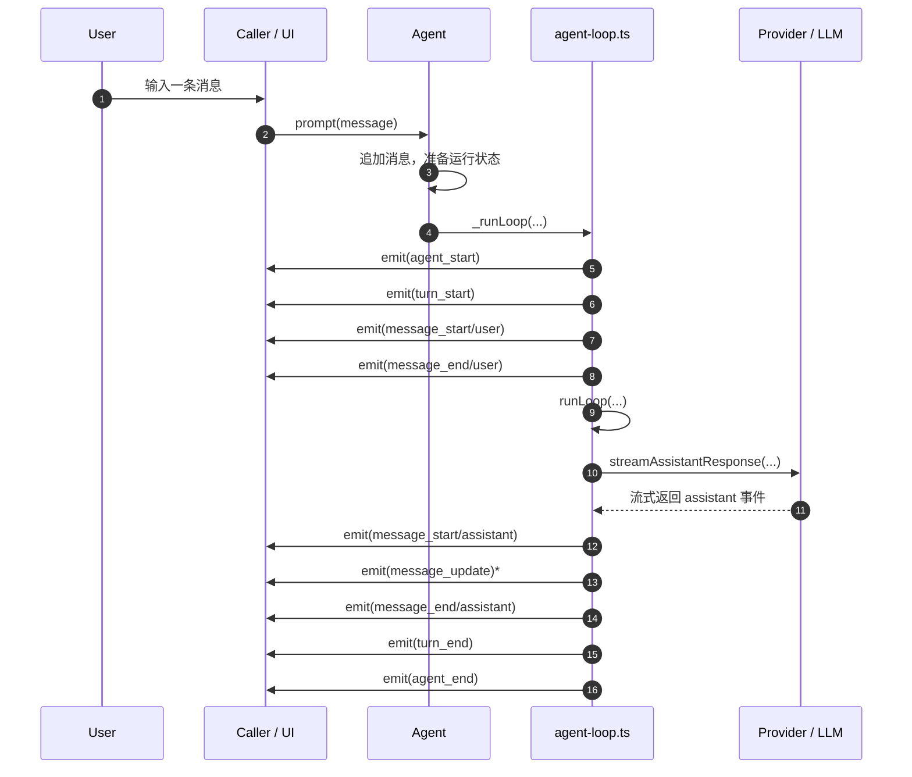
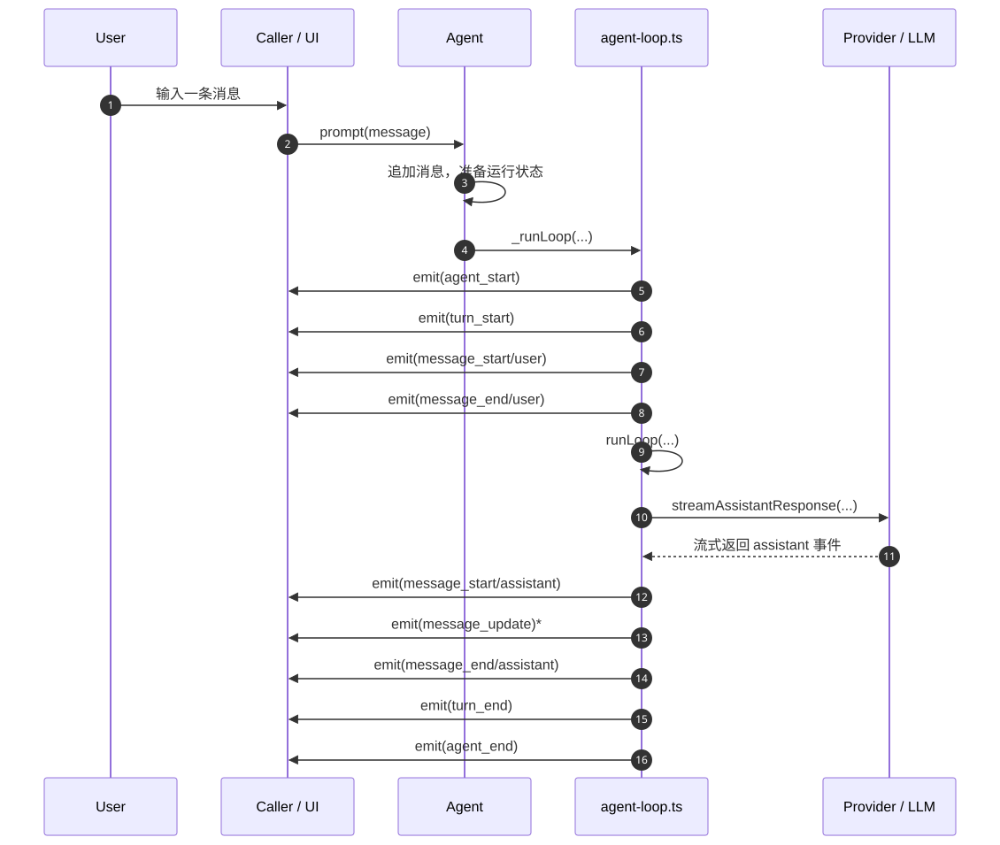

# TypeScript 与 Code Agent 入门路径

这份文档给不熟悉 TypeScript、但想借 `pi-mono` 学习工程代码阅读、agent 设计与调试流程的读者准备。

目标不是一开始就把所有类型和抽象都看懂，而是先沿着一条最短执行链路，搞清楚“一个输入是怎么穿过系统的”，再回头理解类型设计、扩展点和调试手段。

## 建议学习顺序

### 第一阶段：先看最短主流程

不要从 `types.ts` 开始。

对于初学者，直接打开大段类型定义通常会很抽象，因为你还不知道这些类型在运行时到底对应什么行为。更好的方式是：先跟一条请求路径，再回头看类型。

第一条推荐路径是：

1. `packages/agent/src/agent.ts`
2. `packages/agent/src/agent-loop.ts`
3. `packages/agent/src/types.ts`（只看 `AgentEvent`）
4. `packages/coding-agent/src/core/agent-session.ts`
5. `packages/coding-agent/src/core/sdk.ts`

其中，第一轮最重要的是前 3 个文件。

## 最短主流程

你可以把一次最基础的执行过程理解成下面这条链：

```text
user input
  -> Agent.prompt()
  -> Agent._runLoop()
  -> agentLoop() / runLoop()
  -> streamAssistantResponse()
  -> emit AgentEvent
  -> UI 或调用方通过 subscribe() 收到更新
```

## 流程图





## 每个点应该怎么看

### 1. `Agent.prompt()` 是入口

当外部代码把一句话交给 agent 时，通常会先进入 `Agent.prompt()`。

你不需要一开始就读完整个类。第一轮只需要抓住三件事：

- 它是“外部调用入口”
- 它会把输入整理成内部消息
- 它最终会把执行交给 `_runLoop()`

也就是说，`prompt()` 更像“收请求并发车”，而不是“真正开完整趟流程”。

### 2. `_runLoop()` 是 `Agent` 类内部的调度桥

`_runLoop()` 的作用是把 `Agent` 类里的状态、监听器、abort 控制和真正的 loop 执行连接起来。

你可以把它理解成一个桥：

- 上游是 `Agent` 这个面向产品/API 的类
- 下游是 `agent-loop.ts` 里的纯执行逻辑

这一步很重要，因为它告诉你：**`Agent` 类负责“包装和管理”，真正的回合执行逻辑不全写在类里。**

### 3. `runLoop()` 是核心执行循环

`agent-loop.ts` 里的 `runLoop()` 才是主流程的心脏。

第一轮阅读只看下面几个问题：

- 用户消息什么时候进入上下文？
- assistant 回复什么时候开始请求？
- 哪些事件会被发出去？
- 这一轮什么时候结束？

在“最短主流程”里，可以暂时忽略工具调用、follow-up、steering 这些更复杂的分支。先只看：

- `turn_start`
- assistant 响应流
- `turn_end`
- `agent_end`

### 4. `streamAssistantResponse()` 是 LLM 边界

这是一个特别值得重视的函数，因为它通常是“内部世界”和“模型 API 世界”的交界处。

这里会发生一个关键转换：

- 系统内部用的是 `AgentMessage[]`
- 发送给模型时会转换成更通用的 `Message[]`

所以你会看到，类型不是凭空设计出来的，而是在“系统内部表达”和“对外调用协议”之间起桥梁作用。

这也是为什么我们不建议先读整个 `types.ts`：只有看到这个边界后，你才会明白这些类型是为了解决什么问题。

## 现在只需要看懂的类型

第一轮只建议你看 `packages/agent/src/types.ts` 里的 `AgentEvent`。

原因很简单：当前最短主流程，本质上就是“函数在执行，同时不断发事件”。

你只要先理解这些事件名，就已经能看懂大半流程：

- `agent_start`
- `turn_start`
- `message_start`
- `message_update`
- `message_end`
- `turn_end`
- `agent_end`

把它们想成“日志语义”会更容易：系统在每个关键阶段都会通知 UI 或调用方当前进展。

## 对 TypeScript 初学者最重要的观察点

在这条主流程里，先不要追求把 TS 语法全吃透。只观察这些模式：

### 接口和类型在描述“协议”

例如 `AgentEvent` 不是某个函数，而是一组可能事件的并集。它描述的是：系统承诺会发出哪些结构化消息。

### 类在描述“有状态对象”

`Agent` 是一个典型的 TypeScript/JavaScript 工程类：内部有状态、有方法、有监听器集合，也有外部可调用 API。

### 函数在描述“执行边界”

`prompt()`、`_runLoop()`、`runLoop()`、`streamAssistantResponse()` 这几个名字本身就已经在划分职责边界。

读 TS 代码时，先识别职责，再研究语法细节，通常更容易进入状态。

## 阅读建议

### 第一轮：只回答这 4 个问题

1. 从哪里接收输入？
2. 从哪里开始真正执行 loop？
3. 从哪里调用 LLM？
4. 从哪里把进展通知给外部？

### 第二轮：回头补 `types.ts`

等你把主流程走通以后，再回去看：

- `AgentState`
- `AgentMessage`
- `AgentContext`
- `AgentEvent`

这时你会发现，这些类型不是抽象障碍，而是在给前面那条流程命名。

### 第三轮：再看复杂路径

等最短主流程通了，再继续读：

- tool call 路径
- continue 路径
- `coding-agent` 里 `AgentSession` 的产品层封装
- extension 和 session persistence

## 一个适合你的实际学习节奏

如果你是不熟悉 TS 的读者，推荐这样做：

### Day 1

- 只读 `Agent.prompt()`
- 只看 `_runLoop()` 怎么把事情交出去
- 画出自己版本的调用链

### Day 2

- 读 `runLoop()`
- 标出它发了哪些事件
- 用中文写出每一步“系统正在做什么”

### Day 3

- 读 `streamAssistantResponse()`
- 理解为什么需要消息转换
- 回头读 `AgentEvent` 和 `AgentMessage`

### Day 4+

- 再进入 `coding-agent/src/core/agent-session.ts`
- 看产品层是怎么使用底层 `Agent` 的

## 常见卡点

### “我不知道从哪个函数开始读”

就从入口函数开始，不要从类型定义开始。这个 repo 里，最好的入口通常是 `prompt()`、`main()`、`createAgentSession()` 这类名字明显的函数。

### “我每行都看得懂，但整体不知道在干什么”

这是典型的“局部理解、全局丢失”。这时不要继续深挖细节，而是先画调用链和事件顺序。

### “`types.ts` 看不进去”

很正常。把 `types.ts` 当成词典，不要当小说读。只在你遇到陌生概念时回去查对应定义。

## 下一步建议

如果你想继续按这条路径学，下一篇最适合写的是：

1. `Agent.prompt() -> _runLoop() -> runLoop()` 的逐函数中文注释版
2. 带 tool call 的第二条流程图
3. `AgentEvent` 与 UI 更新关系图

你不需要一开始就会写 TypeScript。先学会**沿着调用链定位入口、边界和事件**，后面的 TS 类型设计、调试和扩展点理解就会快很多。
