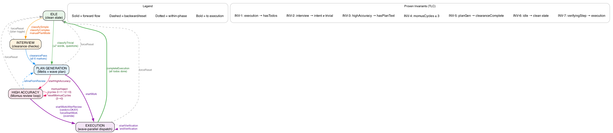

# Plan Mode Extension — Prometheus 3-Phase Planning Flow

A state-machine-driven extension that transforms the agent into Prometheus, a methodical planner that interviews, plans, reviews, and executes work in structured phases.

> **⚠️ LOCAL CUSTOMIZATION** — This is NOT the upstream plan-mode example. This is our full Prometheus orchestrator. See the [repo README](../../../../README.md#local-customizations-important) for upstream sync safety procedures. Always check before pulling.

## Architecture

```
index.ts        — Extension entry point, event handlers, phase transition orchestration
phases.ts       — State machine types + pure functions (classify, clearance, verdict, paths)
prompts.ts      — All system prompt strings injected per phase
utils.ts        — Plan parsing, command safety, step tracking, wave extraction
```

### State Machine

6 phases. The `complete` phase exists in the type but is unreachable (dead state).

```
idle ──classifyTrivial──→ planGen
  │                          ↑
  ├──classifySimple/Complex──→ interview ──clearancePass──→ planGen
  │                                                          │
  │                                          startWork ←─────┤
  │                                             │            │
  │                                             ↓      startHighAccuracy
  │                                         execution        │
  │                                             │            ↓
  │                                    completeExecution  highAccuracy
  │                                             │         ↗    ↘
  └─────────────────────────────────────────────┘   momusOK  momusReject
                                                      │         │
                                                 startWork  refine→planGen
```

**Overview diagram:** `plan-mode-overview.png`



### Phase Details

| Phase | Tools Available | Behavior |
|-------|----------------|----------|
| **idle** | all | No system prompt injection. Auto-classifies intent on first user message |
| **interview** | read-only + write/edit (.pi/ .md only) + subagent | Prometheus interviews user, accumulates `[CLEAR:*]` markers. 6 clearance checks must pass |
| **plan-generation** | read-only + write (.pi/) | Generates structured plan with waves, TODOs, dependencies. Saves to `.pi/plans/` |
| **high-accuracy** | read-only + write (.pi/) | Momus review loop. Max 3 reject cycles. Returns `[OKAY]` or `[REJECT]` |
| **execution** | full access | Wave-parallel dispatch. 3-layer verification per step (tool audit → command checks → verifier turn) |

### Intent Classification

| Intent | Criteria | Path |
|--------|----------|------|
| **trivial** | ≤7 words, questions, single-action fix/debug | Skip interview → planGen |
| **simple** | Above trivial, not multi-domain | Interview → planGen |
| **complex** | Multi-tech, multi-deliverable, build verbs + scope | Interview → planGen → highAccuracy |

### Invariants

| ID | Property | Formula |
|----|----------|---------|
| INV-1 | Execution requires todos | `phase = execution → hasTodos` |
| INV-2 | Interview never trivial | `¬(phase = interview ∧ intent = trivial)` |
| INV-3 | High accuracy requires plan | `phase = highAccuracy → hasPlanText` |
| INV-4 | Momus cycles bounded | `momusCycles ≤ 3` |
| INV-5 | PlanGen requires clearance | `phase = planGen → clearanceComplete` |
| INV-6 | Idle is clean | `phase = idle → (¬clearance ∧ cycles=0 ∧ verdict=null ∧ ¬verifying)` |
| INV-7 | Verification only in execution | `verifyingStep → phase = execution` |

## Commands

- `/plan` — Toggle plan mode (force reset if active, enter interview if idle)
- `/todos` — Show current plan progress
- `Ctrl+Alt+P` — Toggle plan mode shortcut

## Files

| File | Purpose |
|------|---------|
| `index.ts` | Extension entry: event handlers (`before_agent_start`, `agent_end`, `turn_end`, `tool_call`, `context`, `session_start`), UI widgets, phase orchestration |
| `phases.ts` | Pure state machine logic: `createInitialState()`, `classifyIntent()`, `parseClearanceMarkers()`, `isClearanceComplete()`, `extractMomusVerdict()`, `buildDraftPath()`, `buildPlanPath()` |
| `prompts.ts` | System prompts: `prometheusIdentity()`, `interviewPrompt()`, `planGenerationPrompt()`, `highAccuracyPrompt()`, `executionPrompt()`, `verificationPrompt()`, `buildSystemPrompt()` |
| `utils.ts` | Utilities: `isSafeCommand()`, `cleanStepText()`, `extractTodoItems()`, `extractDoneSteps()`, `markCompletedSteps()`, `isWithinPiDir()`, `extractWavePlan()`, `isRequestComplex()`, `auditToolCalls()`, `generateVerificationChecks()` |

## Project Agents (`.pi/agents/`)

| Agent | Role | Model |
|-------|------|-------|
| **Metis** | Pre-planning consultant. Classifies intent, surfaces assumptions, flags AI failure points. Read-only | gpt-5.4 / claude-opus-4-6 |
| **Momus** | Plan critic. Reviews executability, verifies file references. Returns `[OKAY]` or `[REJECT]` with max 3 blocking issues. Read-only | gpt-5.4 / claude-opus-4-6 |

## Extension Loading

The extension is loaded via symlinks from `~/.pi/agent/extensions/plan-mode/`:

```
~/.pi/agent/extensions/plan-mode/
  index.ts   → packages/coding-agent/examples/extensions/plan-mode/index.ts
  phases.ts  → packages/coding-agent/examples/extensions/plan-mode/phases.ts
  prompts.ts → packages/coding-agent/examples/extensions/plan-mode/prompts.ts
  utils.ts   → packages/coding-agent/examples/extensions/plan-mode/utils.ts
```

If the extension fails to load with `Cannot find module`, recreate missing symlinks:

```bash
ln -s /Users/besi/Code/pi-mono/packages/coding-agent/examples/extensions/plan-mode/phases.ts \
  ~/.pi/agent/extensions/plan-mode/phases.ts
ln -s /Users/besi/Code/pi-mono/packages/coding-agent/examples/extensions/plan-mode/prompts.ts \
  ~/.pi/agent/extensions/plan-mode/prompts.ts
```

## Runtime Debugging

Debug log: `~/.pi-plan-debug.log`

Shows: intent classification, phase transitions, clearance markers, menu choices, Momus verdicts, step dispatch, verification results.

```bash
tail -f ~/.pi-plan-debug.log
```

## Tests

146 tests across 5 test files:

```bash
npx vitest --run packages/coding-agent/test/plan-mode-phases.test.ts     # 22 tests — intent, clearance, verdict, paths
npx vitest --run packages/coding-agent/test/plan-mode-utils.test.ts      # 48 tests — command safety, step extraction, waves
npx vitest --run packages/coding-agent/test/plan-mode-complexity.test.ts  # 35 tests — isRequestComplex heuristic
npx vitest --run packages/coding-agent/test/plan-mode-waves.test.ts      # 16 tests — wave plan extraction, dependencies
npx vitest --run packages/coding-agent/test/plan-mode-verification.test.ts # 25 tests — tool audit, verification checks
```

## TLA PreCheck Integration

### What it does
For user projects with stateful workflows (payments, subscriptions, order lifecycle), Prometheus generates a `.machine.ts` file using the TLA PreCheck DSL and verifies the design before planning implementation. The verified machine can then generate runtime adapter code — the proof becomes the code.

### When it triggers
During plan generation (Phase 2, Step 1), Prometheus runs a MANDATORY checklist:
- Payment/billing flows → YES
- Order lifecycle → YES
- Subscription management → YES
- Auth flows with session states → YES
- Job queues, deployment pipelines → YES
- CRUD, UI-only → NO (skip, document why)

During interview (Phase 1, Step 4), Prometheus informs the user that stateful workflows will be formally verified.

### Planning flow
```
Interview (Step 4: identify stateful workflows)
    ↓
Plan Generation (Step 1: MANDATORY State Machine Assessment)
    ├── Write .pi/machines/<name>.machine.ts
    ├── Run: npx tla-precheck check .pi/machines/<name>.machine.ts
    ├── Fix design if check fails, re-run until proof passes
    └── Record TLC results (states, invariants) in the plan
    ↓
Plan Generation (Step 2: Metis reviews plan WITH proof results)
    ↓
Momus review
    ↓
Execution (run tla-precheck build → generates runtime adapter)
```

### Execution flow
During execution, the plan includes TODO steps to:
1. `npx tla-precheck check` — re-verify after project scaffold creates tsconfig.json
2. `npx tla-precheck build` — generate runtime adapter into user's source tree

The generated adapter provides typed functions (e.g., `checkout(sql, {...})`, `cancel(sql, {...})`) that call the proven interpreter inside a DB transaction with row locking.

### Build requires metadata
`tla-precheck build` needs adapter metadata in the machine file to generate runtime code:
```typescript
metadata: {
  runtimeAdapter: "src/machine-adapters/Subscription.adapter.ts",
  ownedTables: ["subscriptions"],
  ownedColumns: {
    subscriptions: { status: "status", plan: "plan" }
  }
}
```
Without this metadata, `check` still passes but `build` cannot generate the adapter. This creates a chicken-and-egg problem: the Prisma schema (tables/columns) is often created in an earlier TODO, but the machine metadata needs to reference those tables. The plan must sequence accordingly: scaffold → schema → add metadata to machine → build.

### Known issues

**Phase gate bypass**: GPT models (and some Opus fallbacks) don't emit `[CLEAR:*]` clearance markers during interview. Without all 6 markers, the phase transition to `plan-generation` never fires, so `planGenerationPrompt()` (which contains the TLA PreCheck assessment) is never injected. The model generates the plan during interview phase, bypassing the mandatory checklist.

**Mitigation (index.ts)**: A fallback in `agent_end` detects `.pi/plans/*.md` files written during interview and forces the transition to `plan-generation`, re-injecting the full prompt with the State Machine Assessment.

**TLC requires tsconfig.json**: In empty/greenfield projects, `tla-precheck check` fails because there's no `tsconfig.json`. The model may fall back to manual state enumeration (which is still useful but not a formal proof). TLC runs properly after project scaffolding.

**Ralph false positive**: The orchestrator's "stopped mid-task" detector pattern-matches on "TODO" strings inside `.pi/plans/*.md` and incorrectly triggers retries. Prometheus correctly refuses to execute, but Ralph retries up to 5 times.

### Agent awareness

| Agent | TLA PreCheck role |
|-------|------------------|
| **Prometheus** (planner) | Writes `.pi/machines/<name>.machine.ts`, runs `check`, records proof in plan |
| **Execution agent** | Runs `tla-precheck build` to generate adapter, imports adapter in implementation code |
| **Reviewer** (spec mode) | Flags hand-written state transition logic that should use the adapter. Flags direct DB writes bypassing the adapter. Verifies `check` still passes if machine was modified |
| **tla-precheck subagent** (`~/.pi/agent/agents/tla-precheck.md`) | Dedicated agent for running check/build and reporting results |

### Dependencies
- `tla-precheck` v0.1.7+ in `devDependencies`
- Java 17+ (Temurin 21) for TLC model checker
- TLC jar at `~/.tla-precheck/tla2tools.jar` (installed via `npx tla-precheck setup`)
- Claude Code skill at `~/.claude/skills/tla-precheck/SKILL.md`

### Verify setup
```bash
npx tla-precheck doctor
```

## Development History

### v1 — Basic Plan Mode
- Read-only exploration with bash allowlist
- Simple `Plan:` header extraction with numbered steps
- `[DONE:n]` markers for completion tracking

### v2 — Prometheus 3-Phase Rewrite
- Full state machine with 6 phases (idle → interview → planGen → highAccuracy → execution)
- Intent classification (trivial/simple/complex) with auto-routing
- Clearance check system (6 markers: objective, scope, ambiguities, approach, tests, questions)
- Momus review loop with bounded reject cycles (max 3)
- Wave-parallel execution with dependency-aware scheduling
- 3-layer step verification (tool audit → command checks → verifier turn)
- System prompt injection via `before_agent_start` (agent becomes Prometheus)
- `.pi/` path restriction during planning phases
- Session persistence and resume support
