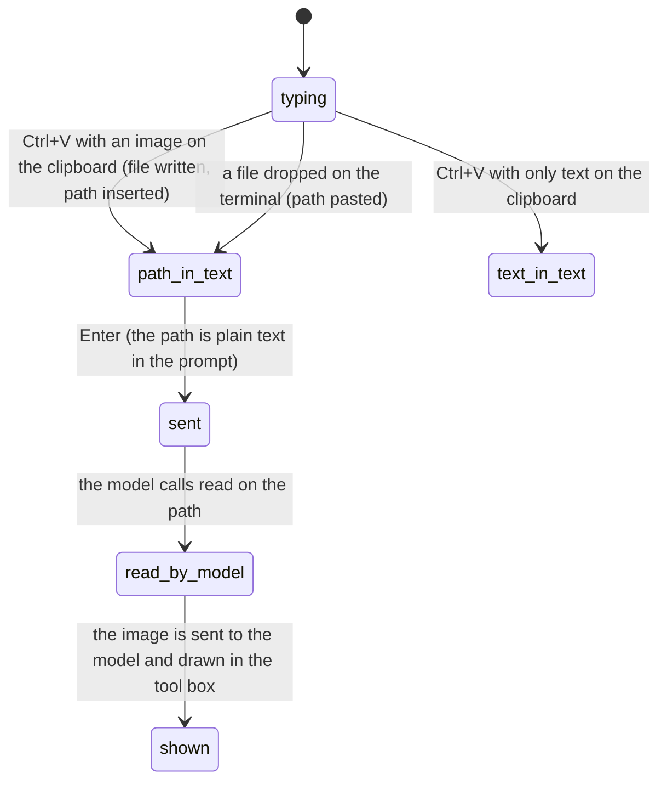

# Attachments

## Summary

pi can show the model files and images in three ways. On the command line, `@path` arguments attach images and inline text files into the first prompt. In the editor, an image pasted with Ctrl+V or a file dropped onto the terminal becomes a file path in the text, and the model reads it with its `read` tool. And images that tools return (a `read` of a PNG) are sent to the model and drawn in the transcript when the terminal can show them. This document owns all three; there is no attachment chip, no preview, and no upload.

Available whenever the editor is. Images reach the model only if the model accepts them; otherwise they are replaced by a note.

## The simple case

The user takes a screenshot, copies it, and presses Ctrl+V in the editor. The text `/tmp/pi-clipboard-3f9c….png` appears at the cursor. They add `what is wrong in this screenshot?` and press Enter. The model calls `read /tmp/pi-clipboard-3f9c….png`; the box shows the image inline (in Kitty, Ghostty, or iTerm2), and the model describes what it sees.

From the shell, `pi @design.png @notes.md "Implement this"` starts pi with a first prompt that carries the image as an attachment and the notes file's text inline.

## The interaction, event by event

### Compose

- **Ctrl+V** (Alt+V on Windows) reads the system clipboard. With an image, pi writes it to the system temp directory as `pi-clipboard-<uuid>.png` (or `.jpg`, matching the clipboard format) and inserts that path at the cursor. With no image, it inserts the clipboard's text at the cursor as if typed (not as a bracketed paste: no large-paste marker). With neither, or without clipboard access, nothing happens and nothing is said.
- **Dropping a file** on the terminal window pastes its path; terminals vary in whether spaces are escaped or quoted. A space is put before the path when it lands directly after a word.
- **`@path`** typed in the editor opens [autocomplete](autocomplete.md) and inserts a path; it is text.
- **`@path` on the command line** is processed before pi starts: a missing file is a red `Error: File not found: <path>` and pi exits; an empty file is skipped; an image is resized to at most 2000×2000 (`images.autoResize`) and attached; any other file is inlined as `<file name="/abs/path">…</file>` ahead of the first message. Several `@` arguments are processed in order.

### Resolves at once

- Ctrl+V with nothing usable on the clipboard: nothing.
- A dropped directory: its path is inserted like a file's.
- `@path` on the command line pointing at a file that cannot be read: error and exit before the screen is drawn.

### Sent

A path in the prompt is sent as text. The model decides whether to read it; nothing about the prompt tells the model it is an image other than the file name. The command-line attachments are sent with the first prompt as real image content plus the inlined text; the user message in the transcript shows the `<file>` blocks as text.

### While working

When the model calls `read` on an image, the tool box shows the image inline if the terminal supports images and `terminal.showImages` is on, at most `terminal.imageWidthCells` wide (60 by default); otherwise a text placeholder. The image goes to the model resized to 2000×2000 if larger. If the current model does not accept images, the model receives `[Current model does not support images. The image will be omitted from this request.]` instead. With `images.blockImages` on, no image is ever sent.

A `bash` command that produces an image file does not show it; only `read` does.

### Done

Nothing is cleaned up: clipboard images stay in the temp directory. Images the model read are part of the tool result in the session (as data), so a session with many screenshots grows quickly and re-sends them on every model call until compaction summarises them away.

## Modifiers

| Modifier | Set before sending | Changed while working |
| --- | --- | --- |
| Model | A model without image support gets the omission note in place of each image; command-line attachments are dropped with the same note. | Switching to a non-image model mid-turn affects the next call. |
| Thinking level | No effect. | No effect. |
| Agent busy | No effect on pasting; the prompt queues as usual. | No effect. |
| Attachments | This document. | Not applicable. |
| Session kind | Image data read by tools is written to the session file; in an ephemeral session it stays in memory. | No effect. |

## Cancel and interrupt

| Event | While composing | While the model reads |
| --- | --- | --- |
| Escape (once; twice within 500 ms) | Nothing (the path is ordinary text). | Aborts the turn; the `read` box shows `Operation aborted`. |
| Ctrl+C once / twice; Ctrl+D | Ctrl+C clears the editor, path included; the temp file remains. | Same. |
| Another message submitted (Enter; Alt+Enter follow-up) | Sends or queues the text with the path. | Queues. |
| A slash command or shortcut that opens an overlay or changes the session | The text is kept behind the overlay. | Session switches abort the read. |
| Model or thinking level changed | See "Modifiers". | Next call. |
| Provider error, rate limit, timeout, or network lost | No effect. | The image is re-sent on retry. |
| Context window exhausted (auto-compaction) | No effect. | Images count roughly 4,800 characters each toward the estimate; compaction replaces them with the summary's file list. |
| Terminal resized; pi suspended (Ctrl+Z) and resumed | No effect. | An inline image is redrawn at the new width. |
| Process ends: terminal closed (SIGHUP), SIGTERM, killed | Temp files are left behind. | Same. |
| Session or files changed from outside | A path that no longer exists when the model reads it fails the read. | Same. |
| Credentials lost, or logged out | No effect. | No effect. |

## Interactions with other systems

**Session persistence.** Command-line image attachments and images returned by tools are stored in the session as data; clipboard images are stored only as their temp path in the user message.

**Branching and history.** None beyond the above.

**Compaction.** Images are estimated at 4,800 characters each and summarised with the rest; the summary lists the files read.

**Context files and the system prompt.** None.

**Settings and keybindings.** `images.autoResize`, `images.blockImages`, `terminal.showImages`, `terminal.imageWidthCells`; `app.clipboard.pasteImage` (Ctrl+V; Alt+V on Windows).

**Tools and the working directory.** `read` is the only tool that produces images; `@file` paths on the command line resolve against the working directory with `~` expanded.

**Terminal and rendering.** Inline images need Kitty, Ghostty, or iTerm2; non-PNG images are converted to PNG for the Kitty protocol. In other terminals a placeholder is drawn. In fullscreen mode iTerm2 shows placeholders too.

**Credentials and providers.** None.

## Edge cases

- Right-click paste in the terminal is a text paste through the editor's normal paste path, so a large right-click paste gets a marker; Ctrl+V never does.
- Ctrl+V is caught before everything else, so it works even while the autocomplete popup is open.
- A clipboard image in BMP or another format is converted to PNG before it is written.
- A macOS screenshot file name with its narrow no-break space is found by `read` whether or not the model reproduces the special space.
- `pi @photo.png` with no message starts interactive mode with the attachment and no prompt; the attachment is sent with the first prompt the user types. See "Open questions".
- An `@` argument naming a directory is a read error and pi exits.

## Open questions and verification

- What happens to command-line attachments when no message is given on the command line (sent with the first typed prompt, or dropped) was read from the initial-message assembly and not confirmed.
- Whether Ctrl+V text insertion bypasses the large-paste collapse was read from the insertion path (it inserts at the cursor rather than through the paste handler) and not observed.
- The clipboard temp file's extension for formats other than PNG and JPEG was not determined.
- Whether a dropped path with spaces arrives quoted depends on the terminal; with iTerm2 and Ghostty it is backslash-escaped, which the model must handle when reading; not tested.

Verified against pi-mono commit `a69bef789`.
