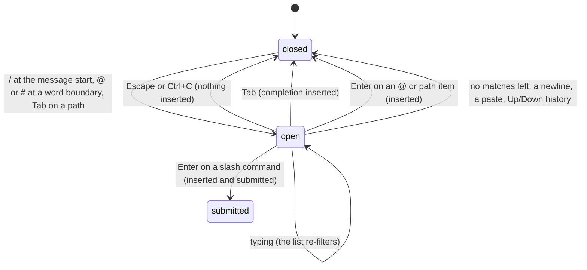

# Autocomplete

## Summary

The autocomplete popup is a short list drawn directly under the editor that offers completions for three things: slash commands when the user types `/` at the start of the message, files and directories when the user types `@` (or `#`) at a word boundary, and file paths when the user presses Tab. It is reached only from the editor, appears and disappears on its own as the text changes, and never changes anything but the editor's text.

It works whatever the agent is doing. File completion needs the `fd` binary that pi downloads on first run; without it, `@` offers nothing.

## The simple case

The user types `/` in an empty editor. A list of slash commands appears below the box, five at a time, each with its name, argument hint, and description; `/changelog` is highlighted first. Typing `mo` narrows it to `/model`; Enter fills in `/model ` and, because it is a slash command, submits it at once, opening the model selector.

Later they type `Look at @auth` and the list shows up to 20 files whose names or paths match `auth`, best matches first. Down moves the highlight; Tab inserts `src/auth.ts ` and closes the list; the editor keeps focus and they carry on typing.

## The interaction, event by event

### Open

The popup opens in one of three ways:

- **`/`** typed when the cursor is on the first line and nothing but spaces precedes it. The list is every built-in slash command (and, once a command name and a space are typed, that command's argument completions: model ids for `/model`, levels for `/thinking`, providers for `/login`). Typing letters, digits, `.`, `-`, and `_` keeps filtering; a space ends the name.
- **`@`** or **`#`** typed at the start of a line or after a space or tab. The list is files and directories under the working directory whose names or paths match what follows, searched with `fd` (hidden files included, `.git` excluded, `.gitignore` respected), scored with exact name matches first, then name prefixes, then substrings in the name, then substrings in the path, directories slightly ahead, and the top 20 shown. `@src/au` limits the search to `src/`; `@"My Docs/re` handles a path with spaces. The search is debounced by 20 ms as the user types.
- **Tab** with no popup open. If the line is a bare slash command, the slash list opens. Otherwise the word before the cursor is completed as a path, whether or not it looks like one; with exactly one match it is inserted immediately and no list is shown.

The list shows five items at most (setting `autocompleteMaxVisible`, 3–20). The highlight starts on the item whose value equals what was typed, else the first item whose value starts with it, else the first item. The editor keeps its text and cursor; the popup is drawn below the box, pushing the footer down.

### Dismissed at once

- No match: the popup closes as soon as the filter yields nothing.
- Escape or Ctrl+C: closes with nothing inserted; the text is unchanged. Escape does not reach the abort handler while the popup is open.
- Shift+Enter, a paste, or Up/Down into history: closes.

### First change

Up and Down move the highlight, wrapping at both ends. Page Up and Page Down are bound for lists but do nothing here. Typing continues to filter; Backspace refreshes the list and can reopen it if the context is still completable.

### While open

Nothing in the rest of the screen changes; the agent keeps working if it was.

### Accepted

- **Tab** inserts the highlighted item and closes the list. A slash command becomes `/name ` with the cursor after the space. A file becomes its path followed by a space; a directory becomes its path with a trailing `/` and no space, so the next Tab or keystroke keeps completing inside it. A quoted path keeps its quotes, with the cursor inside the closing quote for a directory.
- **Enter** inserts the highlighted item and, for a slash command, submits the line immediately (a command that takes arguments is submitted without them: `/name` shows the current name). For a file or path, Enter inserts and closes without submitting.

> Technical note: results are discarded if the text or cursor changed while the search was running, so fast typing never inserts a stale completion. `fd` is limited to 100 results before scoring.

## Modifiers

| Modifier | Set before sending | Changed while working |
| --- | --- | --- |
| Model | The `/model` argument list shows scoped models, or all available models. | No effect. |
| Thinking level | The `/thinking` argument list shows the current model's levels. | No effect. |
| Agent busy | No effect on the popup. Enter on a slash command submits it, which runs it even while working. | No effect. |
| Attachments | No effect. `@` inserts a path as text, not an attachment. | No effect. |
| Session kind | No effect. | No effect. |

## Cancel and interrupt

| Event | Before open | While open |
| --- | --- | --- |
| Escape (once; twice within 500 ms) | Usual editor behaviour. | Closes the popup; a second Escape then acts on the editor. |
| Ctrl+C once / twice; Ctrl+D | Usual. | Ctrl+C closes the popup without clearing the editor and does not arm the quit; Ctrl+D deletes forward (the editor has text). |
| Another message submitted (Enter; Alt+Enter follow-up) | Usual. | Enter accepts (and submits for slash commands); Alt+Enter queues the text as it stands. |
| A slash command or shortcut that opens an overlay or changes the session | Usual. | A shortcut (Ctrl+L) opens its overlay; the popup is gone when the editor returns. |
| Model or thinking level changed | Usual. | No effect on the list already shown. |
| Provider error, rate limit, timeout, or network lost | No effect. | No effect. |
| Context window exhausted (auto-compaction) | No effect. | No effect. |
| Terminal resized; pi suspended (Ctrl+Z) and resumed | No effect. | The list re-wraps; suspend closes nothing. |
| Process ends: terminal closed (SIGHUP), SIGTERM, killed | No effect. | Nothing to lose. |
| Session or files changed from outside | Files created while pi runs appear in the next `@` search. | The open list is not refreshed. |
| Credentials lost, or logged out | No effect. | No effect. |

## Interactions with other systems

**Session persistence.** None.

**Branching and history.** None.

**Compaction.** None.

**Context files and the system prompt.** None; `@` inserts plain text, and it is the model that decides to read the file.

**Settings and keybindings.** `autocompleteMaxVisible`; `tui.input.tab`, `tui.select.up`/`down`/`confirm`/`cancel`. Slash commands registered by skills or extensions would appear in the `/` list; none exist in the default configuration.

**Tools and the working directory.** `@` searches from the working directory and respects its `.gitignore`. The `fd` binary lives in `~/.pi/agent/bin/` and is downloaded at startup if missing, with progress shown in the transcript.

**Terminal and rendering.** The popup's columns are sized to the width; the slash list's name column is 12–32 cells.

**Credentials and providers.** None.

## Edge cases

- `/` anywhere but the start of the first line does not open the list, so a URL in a prompt is safe.
- A `/` line that matches no command is not an error at submit; it goes to the model as text.
- `@` followed by a space is not a search; `@` at the end of a word (`user@host`) is not either.
- Tab on an empty editor opens nothing (there is no word to complete) and inserts nothing.
- With `fd` missing and not downloadable (offline first run), `@` shows nothing and Tab path completion shows nothing; no error is shown.
- Two `@` references on one line each get their own search as they are typed.
- Completing a directory and pressing Tab again lists its contents.

## Open questions and verification

- Whether Page Up/Page Down in the popup do nothing (the list component does not handle them although bindings exist) was read from the code; may be worth treating as a bug rather than documenting.
- The behaviour of Tab on an empty editor was inferred from the "forced completion with an empty prefix" path and not confirmed by hand; it may list the working directory.
- Whether the popup survives a model change (Ctrl+P) while open was not determined.
- The 20 ms debounce and the 100-result `fd` limit are read from the code and not observable by hand.

Verified against pi-mono commit `a69bef789`.
