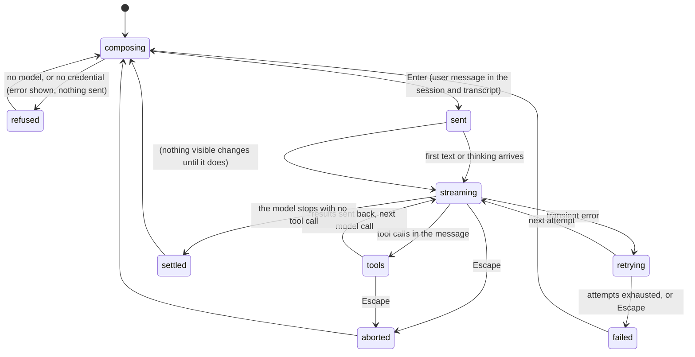

# Sending a prompt

## Summary

Sending a prompt is the core interaction: the user presses Enter on some text, the text becomes a user message, the model answers, and the answer streams into the transcript, possibly with tool calls, until the model stops. This document follows one prompt from Enter to settled from the user's side: what is checked, what is drawn when, what the user can still do, how it ends, and what goes wrong. The definitions (sent, working, settled, abort, retry, the queue rules) are in [the turn](../foundations/the-turn.md); this document is the concrete walk-through with what appears on screen.

Available whenever the editor is and a model is selected. With the agent already working, Enter queues instead; see [the message queue](the-message-queue.md).

## The simple case

The user types `What does this repo do?` and presses Enter. The editor empties. A blank line and then the prompt, in the user-message background, are added at the bottom of the transcript. The status line shows a spinner and `Working... (escape to interrupt)`. Within a second or two the assistant's answer begins below the prompt, in rendered markdown, growing as it streams; headings, lists, bold, and code blocks are styled as they complete. If the model wants to see a file, a box appears reading `read README.md` with a tinted background, then turns to the success tint when the read is done, and the model's next message streams in below it. When the model finishes, the spinner disappears, the footer's token and cost figures update, and the cursor is in the empty editor.

## The interaction, event by event

### Compose

See [the editor](the-editor.md). Whatever is in the editor when Enter is pressed is the prompt, trimmed; `@` references are plain text; a dropped or pasted image is a path in the text (see [attachments](attachments.md)).

### Resolves at once

- **Empty text.** Nothing.
- **No credential for any provider.** A blank line and `Error: No API key found for the selected model.`, a blank line, and `Use /login to log into a provider via OAuth or API key. See:` with two documentation paths, in the error colour. The prompt is not in the session and is not drawn; it is in the prompt history (Up recalls it).
- **No credential for the selected model's provider.** `Error: No API key found for <provider>.` with the same help, or for OAuth providers `Authentication failed for "<provider>". … Run '/login <provider>' to re-authenticate.` Same consequences.
- **The agent is working or compacting.** The text is queued, not sent; see [the message queue](the-message-queue.md).
- **A slash command or shell command.** Handled by their own documents; no prompt is sent.

### Sent

The editor empties and the prompt is added to the prompt history. A blank line and the user message (markdown-rendered in the user-message background, one column of padding) are appended to the transcript. The message is in the session from this moment. The status line shows `Working... (escape to interrupt)`.

If the previous turn was aborted while over the context limit, `Auto-compacting... (escape to cancel)` shows first and the transcript is rebuilt with a `[compaction]` box before the prompt goes out.

Nothing else is drawn until the model's first token arrives. A slow provider shows only the spinner; there is no elapsed-time counter and no "connecting" state.

### While working

**Text and thinking.** The assistant message is added to the transcript when the first piece arrives and re-rendered as it grows. Thinking arrives first for reasoning models, in italics in the thinking colour; with Ctrl+T it is a single `Thinking...` line instead. Text follows, rendered as markdown: the part still streaming is rendered as it stands, so an unfinished code fence shows as a code block that grows, a half-typed table shows as text until its rows complete, and a mermaid block is drawn as a box diagram once it parses (setting `markdown.mermaid`, default `streaming`). Long lines wrap at the width.

**Tool calls.** Each tool call the model emits gets a box in the transcript as soon as its name is known, with the pending tint and whatever arguments have streamed so far (`read src/` growing to `read src/auth.ts`). When the arguments are complete the tool runs: `bash` boxes show the command and live output with an elapsed-time counter; `edit` boxes show a live diff preview; the others show their header. On completion the tint becomes success or error and the result is shown collapsed (see [tool calls](tool-calls.md)). Several tool calls in one message run at the same time. Their results go to the model and the next assistant message begins below them; the status line does not change between model calls.

**What the user can do.** Type the next prompt; Enter queues it as a steering message, shown in the pending area as `Steering: …`, delivered after the current tool calls finish; Alt+Enter queues a follow-up for after the turn. Escape aborts. Every slash command runs. Ctrl+O expands the tool boxes so far. Ctrl+P and Shift+Tab change the model or thinking level for the next model call. `!` runs a shell command, held until the turn ends. Ctrl+G opens the external editor; pi's screen is released and redrawn on return with everything that streamed meanwhile. The full matrix is in [busy state](../cross-cutting/busy-state.md).

**Cut-off output.** When the provider stops the message at its output limit, the message ends with `Response was truncated before completion.` in the error colour. Tool calls in that message are not run; each gets an error result telling the model its arguments may be truncated, and the model is called again.

### Done

When the model stops without a tool call and no steering or follow-up message is waiting, the status line clears. If the context used is over the compaction threshold, `Auto-compacting... (escape to cancel)` runs now and the transcript is rebuilt with the summary. Then the turn settles: the footer updates its totals (`↑`, `↓`, `R`, `W`, `$`, and the context percentage), and Enter sends again.

With `showCacheMissNotices` on, a dim line such as `Cache miss: 120k tokens re-billed (~$0.36)` may follow the assistant message when the provider's prompt cache was not hit, suppressed below 20,000 tokens and $0.10.

Everything is in the session: the user message, each assistant message, each tool result. The editor holds whatever was typed during the turn.

## Modifiers

| Modifier | Set before sending | Changed while working |
| --- | --- | --- |
| Model | The model in the footer handles the first call; a model that cannot take images drops them with a note to the model. | Takes effect at the next model call (after the current tool results); recorded in the session between messages; the footer updates at once. |
| Thinking level | Decides how much thinking is shown before the text; `off` shows none. | Takes effect at the next model call. |
| Agent busy | Idle: sends. Working: queues. | Not applicable. |
| Attachments | `@file` on the command line attaches images and inlines text files into the first prompt; in the editor a path is text. | No effect. |
| Session kind | Saved: the first assistant message creates the session file. Ephemeral: nothing on disk. | No effect. |

## Cancel and interrupt

| Event | Sent, nothing received yet | While working |
| --- | --- | --- |
| Escape (once; twice within 500 ms) | Aborts: an empty assistant message ending in `Operation aborted` is added and recorded; the queue returns to the editor; settled. | Aborts: the partial text stays, `Operation aborted` is appended under it (or shown in each unfinished tool box when there are tool calls); running tools are killed; the queue returns to the editor; settled. During a retry countdown: cancels the retry, `Error: Retry failed after N attempts: Retry cancelled`. |
| Ctrl+C once / twice; Ctrl+D | Ctrl+C clears the editor only. Twice: pi aborts the turn, records it, and exits. | Same. |
| Another message submitted (Enter; Alt+Enter follow-up) | Enter queues a steering message that is delivered before the first model call if it arrives in time. | Enter steers; Alt+Enter queues a follow-up. |
| A slash command or shortcut that opens an overlay or changes the session | Overlays open; the turn continues. `/new`, `/resume`, `/fork`, `/clone`, `/import`, `/tree` (to another point), `/compact`, `/quit` abort the turn first; the queue is dropped. `/reload` is refused. | Same. |
| Model or thinking level changed | Takes effect on the first call if changed before it starts. | Next model call. |
| Provider error, rate limit, timeout, or network lost | Transient: the failed assistant block stays on screen ending with `Error: <message>`, and the status line shows `Retrying (1/3) in 2s... (escape to cancel)` counting down, then a fresh attempt streams in below it; the failed attempt is in the session too, though the next model call does not see it. After three failures: `Error: Retry failed after 3 attempts: <message>` under the third block. Not transient (quota, billing): `Error: <message>` at once and the turn settles. A stalled stream fails after five minutes of silence (`httpIdleTimeoutMs`). | Same; a failed message that had tool calls shows `Error: …` in each unfinished tool box. |
| Context window exhausted (auto-compaction) | An overflow error on the first call: `Context overflow detected, Auto-compacting... (escape to cancel)`, then the call is retried once. | Same; after a successful response that overflowed, compaction runs without a retry. |
| Terminal resized; pi suspended (Ctrl+Z) and resumed | Redraws. | Redraws; streaming continues unseen during suspend and is drawn on `fg`. |
| Process ends: terminal closed (SIGHUP), SIGTERM, killed | The user message is in the session only if a session file already exists; a brand-new session leaves nothing. | SIGHUP/SIGTERM abort and exit; a kill loses the partial message. See [process lifecycle](../cross-cutting/process-lifecycle.md). |
| Session or files changed from outside | No effect. | Tools see files as they are when they run. |
| Credentials lost, or logged out | The first call fails with a credential error; no retry. | The next call fails; the current one finishes. |

## Interactions with other systems

**Session persistence.** User message at send; assistant messages, tool results, and failed attempts as they complete; see [sessions](../foundations/sessions.md).

**Branching and history.** The prompt continues from the active position. After `/tree` moved it back, this prompt starts a new branch and the transcript shows only the new branch.

**Compaction.** Before the call only for an aborted-over-limit previous turn; after the turn on threshold; mid-turn on overflow with one retry. See [compaction](../sessions/compaction.md).

**Context files and the system prompt.** Read at each model call from the files found at startup (or at the last `/reload`); the model sees `AGENTS.md` content as part of its instructions.

**Settings and keybindings.** `hideThinkingBlock`, `showCacheMissNotices`, `markdown.mermaid`, `markdown.codeBlockIndent`, `outputPad`, `retry.*`, `compaction.*`, `httpIdleTimeoutMs`, `transport`.

**Tools and the working directory.** Tools run where pi was started; `bash` in a fresh shell each time. Nothing asks the user's permission before a tool runs.

**Terminal and rendering.** Streaming re-renders the growing message in place; on a narrow terminal, wrapped code blocks are wrapped rather than scrolled. Images in tool results are drawn inline when the terminal can show them.

**Credentials and providers.** Resolved at each call; subscription providers mark the cost with `(sub)`.

## Edge cases

- The first prompt of a fresh session given on the command line (`pi "hello"`) is sent before the user can type; the status line shows `Working...` immediately after the header.
- A prompt that is only an `@file` reference is sent as that text; the model may or may not read the file.
- If the model returns an empty message (no text, no thinking, no tool calls), the turn ends with an empty assistant block and nothing is drawn but the blank separator.
- A steering message typed before the first token arrives is delivered before the first model call, so the model's first message may answer both.
- Aborting during a tool call leaves the tool's box in the error tint with `Operation aborted`; the file the tool was writing may be partly written.
- Two Escapes in a row after an abort open the tree (the editor is empty after the queue was returned only if the queue was empty).
- The failed attempts of a retry stay drawn, each ending with `Error: <message>`; `/session` counts them and `/tree` lists them. After the last failure the message appears twice, once under the block and once as `Retry failed after 3 attempts: …`.
- Switching models mid-turn can make the provider miss its prompt cache; with notices on, `Cache miss after model switch: …` is shown.

## Open questions and verification

- Whether a steering message queued before the first token is delivered before or with the first model call was read from the loop's poll points; not observed.
- The rendering of a mid-stream partial table (as text until complete) is read from the markdown renderer's behaviour on incomplete input and not observed.
- Whether the `Working...` line appears before or after the user message is drawn (they are triggered by two events in the same tick) was not observed.
- The claim that nothing is drawn for an empty assistant message was not observed with a real provider.
- Whether the five-minute idle timeout counts as a transient error and retries (its error text contains "timeout") was read from the retry classifier and not observed.

Verified against pi-mono commit `a69bef789`.
