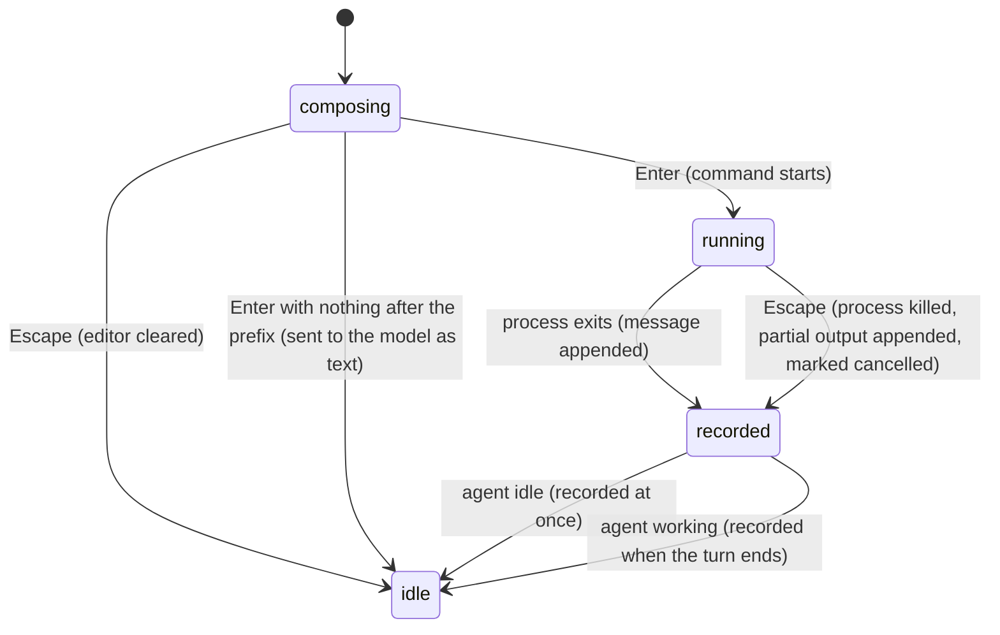

# Shell commands

## Summary

A shell command is a line typed into the editor that begins with `!`. Instead of going to the model, the rest of the line is run in the project's shell, its output streams into the transcript in a bordered box, and the command and its output are recorded in the session as a message the model will see on its next turn. A line beginning with `!!` does the same but the record is hidden from the model: the user sees it, the model never does.

The feature lives in the editor and needs no setup. It is signalled by the editor border turning the *bash-mode* colour (green in both built-in themes) as soon as the first non-blank character is `!`. It is available whenever the editor is, including while the agent is working and while compaction is running; a running command can be cancelled with Escape. It is not available while an overlay has replaced the editor.

## The simple case

The user types `!git status` and presses Enter. The editor empties and a box appears at the bottom of the transcript with a green top and bottom border, the line `$ git status` in bold green, and a spinner reading `Running... (escape/ctrl+c to cancel)`. Output lines appear below the command as the process writes them, dimmed; only the last 20 lines are shown while the command runs.

When the process exits the spinner disappears. If it exited with code 0 nothing more is shown. If it exited with any other code, `(exit N)` is appended in the error colour. If more than 20 lines were produced, a line reads `... N more lines (ctrl+o to expand)`.

The editor is ready again as soon as the command starts; the user does not have to wait. The next message the user sends to the model carries the command and its output ahead of it, so the model can refer to the result. The editor border returns to the colour of the current thinking level.

## The interaction, event by event



### Compose

Typing a line whose first non-blank character is `!` puts the editor in bash mode: the border changes to the bash-mode colour immediately, on the keystroke, and changes back the moment the text no longer starts with `!`. Nothing else about the editor changes; multi-line input, history, kill ring, and autocomplete behave as in [the editor](the-editor.md). Leading whitespace before the `!` is allowed and is removed on submit.

Nothing is sent anywhere and nothing is recorded while composing.

### Resolves at once

Three submissions end without running anything:

- **`!` or `!!` with nothing after it** (or only spaces). The line falls through to ordinary submission and is sent to the model as the literal text `!` or `!!`, as a normal prompt, starting a turn. This is almost certainly not what the user meant; see "Open questions".
- **A second shell command while one is still running.** A warning is added to the transcript: `A bash command is already running. Press Esc to cancel it first.` The text stays in the editor unchanged.
- **Escape while composing** (agent idle, no command running). The editor is cleared and bash mode ends. The text is not kept in history.

In all three cases the session file is not written.

### Sent

On Enter the text is trimmed, the prefix is stripped (`!!` before `!`), and the command is trimmed again. The full line, prefix included, is added to the editor's prompt history. The editor is cleared and leaves bash mode.

A bordered box is created for the command and added to the transcript (or, if the agent is working, to the pending area between the transcript and the editor; see "Modifiers"). It shows `$ <command>` and the spinner. The process is started in the session's working directory with the user's environment, with `~/.pi/agent/bin` prepended to `PATH`. The shell is `/bin/bash` if it exists, otherwise `bash` on `PATH`, otherwise `sh`. On Windows it is Git Bash, then any `bash.exe` on `PATH`; if none is found, the box completes with an error. If the working directory no longer exists, the box completes with no exit code and an error line `Bash command failed: Working directory does not exist: ...` is added to the transcript.

There is no timeout. The command runs until it exits or is cancelled.

> Technical note: the process is started in its own process group, detached from pi. Cancellation kills the whole group, so pipelines and background children started by the command are killed too. The `PI_*` session variables that the model's `bash` tool receives are not set for user shell commands.

### While working

Output from stdout and stderr is merged in arrival order, stripped of ANSI colour codes, and has carriage returns removed, so progress bars and coloured output appear as plain text. Each chunk is appended to the box as it arrives and the box re-renders; the preview shows the last 20 logical lines, wrapped to the terminal width. Ctrl+O expands every tool box in the transcript, this one included, to show all lines that survive truncation.

The editor stays usable. The user can type the next prompt, send it (see "Cancel and interrupt"), open overlays, or cycle models. Only a second `!` command is refused.

> Technical note: output is kept in a rolling 100 KB buffer. Once total output passes 50 KB the full stream is also written to `pi-bash-<id>.log` in the system temp directory, so the complete output is never lost even though the session record is truncated.

### Done

When the process exits the box is finalised: the spinner is removed, `(exit N)` is shown for a non-zero code, nothing for zero. Output is truncated from the head to the last 2000 lines or the last 50 KB, whichever limit is hit first; if truncation happened, a warning line `Output truncated. Full output: <temp file path>` is appended.

One message is recorded. It holds the command, the truncated output, the exit code, whether it was cancelled, whether it was truncated, and the temp file path. If the agent is idle it is appended to the session file at once. If the agent is working it is held and appended when the turn ends, after the assistant's last message and tool results, so that the model's tool calls and their results are never split by a shell record; it is also flushed immediately before the next prompt is sent if a turn has not ended in between.

What the model sees, on its next turn, is a user-role message of the form:

```
Ran `git status`
```
followed by the output in a fenced block (or `(no output)`), then `Command exited with code N` if non-zero, `(command cancelled)` if cancelled, and `[Output truncated. Full output: <path>]` if truncated. A `!!` record is skipped entirely when the context is built; it exists only in the session file and on screen.

Nothing is undoable. The record stays in the session; the only way to exclude it from the model's context afterwards is to move the active position before it with `/tree` (see [the tree](../sessions/the-tree.md)).

## Modifiers

| Modifier | Set before sending | Changed while working |
| --- | --- | --- |
| Model | No effect. | No effect. The record goes to whichever model handles the next turn. |
| Thinking level | No effect on the command. While composing, the green bash-mode border replaces the thinking-level colour. | No effect. |
| Agent busy | Idle: the box goes straight into the transcript and the record is written at once. Working: the box is shown in the pending area above the editor, and the record is held until the turn ends; when the user next sends a prompt the box moves into the transcript. The pending area is redrawn from the message queue whenever the queue changes or a queued message is delivered, and the box is not part of that redraw, so it vanishes from the screen at the first queue change; the record is unaffected. See "Open questions". | If the agent becomes idle while the command runs, the record is still written at once when the command finishes. If the agent starts working (the user sends a prompt) while the command runs, the record is held until that turn ends. |
| Attachments | No effect. Images and `@file` references in the line are not interpreted; the text after `!` is passed to the shell verbatim. | No effect. |
| Session kind | Saved: the record is appended to the session file. Ephemeral (`--no-session`): kept in memory only; gone on exit. | No effect. |

Bash mode itself is decided at submit time from the first character, so editing the line to add or remove the `!` before Enter is the only way to change it.

## Cancel and interrupt

| Event | While composing | While running |
| --- | --- | --- |
| Escape (once; twice within 500 ms) | Clears the editor and leaves bash mode; a second Escape on the now-empty editor starts the double-Escape action (`/tree` by default). If the agent is working, Escape aborts the agent instead and the editor text is kept. | Kills the process group. The box shows `(cancelled)` in the warning colour, the output received so far is kept and recorded, and the exit code is recorded as none. If the agent is also working, the first Escape aborts the agent and leaves the command running; a second Escape then cancels the command. |
| Ctrl+C once / twice; Ctrl+D | One Ctrl+C clears the editor (bash mode ends). A second within 500 ms quits pi. Ctrl+D with an empty editor quits. | Ctrl+C clears the editor and does nothing to the command; a second Ctrl+C, or Ctrl+D, quits pi and kills the command; output received so far is not recorded. |
| Another message submitted (Enter; Alt+Enter follow-up) | Not applicable: Enter submits the command. Alt+Enter with the agent idle behaves as Enter and runs the command. Alt+Enter with the agent working queues the whole line, `!` included, as a follow-up prompt; when delivered it is sent to the model as text and is not run. | Enter sends the prompt to the model as usual; the command keeps running, and its record is held until that turn ends. Alt+Enter queues a follow-up as usual. |
| A slash command or shortcut that opens an overlay or changes the session | A shortcut such as Ctrl+L opens its overlay over the editor; the text is kept and is back when the overlay closes. A slash command cannot be typed without replacing the text. | The command keeps running and the box keeps updating behind the overlay. `/new` starts a new session while the command runs; the record, when it arrives, is written to the new session. |
| Model or thinking level changed | Thinking level changes the border colour only once the line stops starting with `!`. | No effect. |
| Provider error, rate limit, timeout, or network lost | No effect. | No effect on the command. |
| Context window exhausted (auto-compaction) | No effect. | The command keeps running. The record is held while the agent is working; compaction may run before it is flushed, in which case the record lands after the compaction summary and is part of the kept context. |
| Terminal resized; pi suspended (Ctrl+Z) and resumed | The editor re-wraps. Suspend keeps the text. | The box re-wraps to the new width. Suspend stops rendering; the process keeps running and its output is buffered; on `fg` the box catches up. |
| Process ends: terminal closed (SIGHUP), SIGTERM, killed | The text is lost. | SIGHUP and SIGTERM kill the process group before pi shuts down; nothing is recorded. A hard kill (SIGKILL) leaves the shell process running as an orphan; nothing is recorded. |
| Session or files changed from outside | No effect. | No effect; the command sees whatever is on disk. |
| Credentials lost, or logged out | No effect. | No effect. |

After a cancel the editor stays where it was and bash mode is off. After any interrupt that killed pi, the command's output is only on disk if it had already passed 50 KB (the temp file); otherwise it is gone.

## Interactions with other systems

**Session persistence.** One `bashExecution` entry per command, appended as described under "Done". It carries the output as recorded, so resuming the session shows the box again, completed, with the same exit status and truncation warning, collapsed to 20 lines. `!!` entries are persisted too, and shown on resume with a dim border.

**Branching and history.** The record is an ordinary entry in the session tree: `/tree` lists it, and it can be a branch point. `/fork` and `/clone` carry it along like any other message. The submitted line, prefix included, is in the editor's up-arrow history.

**Compaction.** A shell record counts as a user message for compaction: it is a valid cut point and is summarised with the rest of the conversation. `!!` records are part of the session but not of the context, so they contribute nothing to the context size and nothing to the summary.

**Context files and the system prompt.** No interaction.

**Settings and keybindings.** `shellPath` replaces the shell. `shellCommandPrefix` is prepended to every command (on its own line), for example to enable aliases. `app.tools.expand` (Ctrl+O) expands the box; `app.interrupt` (Escape) cancels. `theme` decides the bash-mode colour.

**Tools and the working directory.** The command runs in the session's working directory, the same one the model's `bash` tool uses. Each command is a fresh shell: `cd`, exported variables, and shell options do not carry over to the next `!` command or to the model's tool.

**Terminal and rendering.** Output is rendered as plain dim text, wrapped to the terminal width; colour and cursor movement from the command are stripped. Interactive programs (editors, pagers, anything that reads the TTY) do not work: the command has no stdin and its output is captured, not displayed live.

**Credentials and providers.** No interaction.

## Edge cases

- `! ` with only spaces after the prefix is sent to the model as the text `!`. The same for `!!`.
- `!!` is checked before `!`, so `!!!ls` runs `!ls` with the record hidden from the model. In bash, `!ls` invokes history expansion and fails unless history is off; in a non-interactive shell it is off, so the literal `!ls` command is "not found".
- `!` followed by a newline and a command (Shift+Enter) runs the multi-line text as one script; the shell sees the newline.
- A `!!` command's header line is drawn in the dim colour until the first output chunk or completion, after which it is redrawn in the bash-mode green; only the borders stay dim. See "Open questions".
- A command that produces no output ends with an empty box: the command line, nothing else, and `(exit N)` if non-zero.
- Two commands cannot overlap from the editor, but a command started while the agent is idle and a model `bash` tool call started afterwards can run at the same time; they do not see each other.
- Output larger than 2000 lines but under 50 KB is truncated by line count; the warning still names a temp file, which is created at completion to hold the full output.
- After `/new` while a command runs, the record is written to the new session, with no preceding context; on screen the box stays in the old transcript, which `/new` clears, so the box disappears but the record lands in the new session file.

## Open questions and verification

- A shell command started while the agent is working is shown in the pending area, and the pending area is cleared and rebuilt from the message queue alone on every queue change and on every delivered queued message. The box disappears from the screen the first time that happens, and the later move into the transcript finds nothing to move. The record is still written, so the box reappears only when the transcript is rebuilt (resume, `/tree`, toggling thinking visibility). May be worth treating as a bug rather than documenting.
- A bare `!` or `!!` is sent to the model as a prompt rather than being ignored or refused. May be worth treating as a bug rather than documenting.
- The spinner hint reads `escape/ctrl+c to cancel`, but Ctrl+C clears the editor and does not cancel the command. The hint reuses the cancel binding of list selectors. Suspected copy bug.
- The `!!` header is drawn in the bash-mode colour after the first re-render, although the constructor draws it dim; the re-render path ignores the excluded-from-context flag. Suspected cosmetic bug.
- Escape while the agent is working aborts the agent and leaves the running shell command alone; a second Escape is needed. Whether that is intended or an oversight is not recorded in the code.
- The `/new` while running case is read from the code path (the held record flushes into whatever session is current) and not confirmed by hand.
- Whether compaction's serialisation of a shell record matches the "what the model sees" form above, or a different one, was not confirmed.
- Whether an orderly quit (`/quit`, Ctrl+D, double Ctrl+C) kills a still-running command was inferred from the session's dispose path; the interactive shutdown does not call the detached-child cleanup directly.
- Timing of the 20-line preview re-render under very fast output (whether intermediate frames are skipped) was not checked.

Verified against pi-mono commit `a69bef789`.
