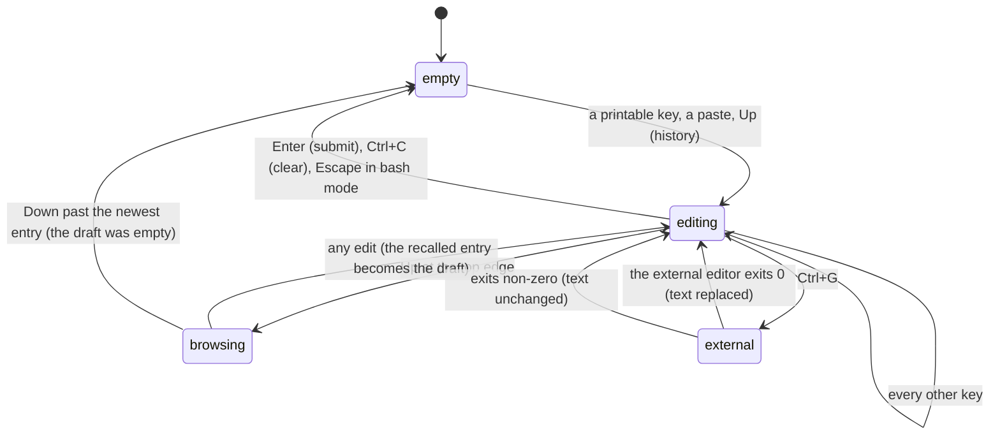

# The editor

## Summary

The editor is the bordered box at the bottom of the screen where the user composes a prompt. It is a small multi-line text editor with Emacs-style keys: cursor movement by character, word, and line; deletion into a kill ring that can be yanked back; undo; a prompt history browsed with Up and Down; bracketed paste with large pastes collapsed into a marker; and a hand-off to an external editor with Ctrl+G. Everything the user types passes through it, and it is the thing an overlay replaces. This document covers composing; what happens on Enter is [sending a prompt](sending-a-prompt.md), and the popup that appears for `@`, `/`, and Tab is [autocomplete](autocomplete.md).

The editor is always available when no overlay is open, including while the agent is working. Its border colour is the current thinking level's, or green when the text starts with `!`.

## The simple case

The user types `Fix the failing test in` and the text appears inside the box as they type, the cursor after it. They press Shift+Enter to start a second line, type `src/auth.test.ts`, and press Enter. The box empties and the two-line prompt goes to the model. Up recalls it into the box; Down returns to the empty draft. Ctrl+G would have opened the same text in `nano` (or `$EDITOR`) and put the edited result back in the box when the editor closed.

## The interaction, event by event

### Compose

The editor starts empty with the cursor on its single line. Printable characters are inserted at the cursor. The box is three lines tall (two borders and one line of text) and grows as lines are added, to a limit of 30% of the terminal's height (at least five lines), after which the text scrolls inside the box and the cursor line is kept in view. Long lines wrap at the width; wrapping is by grapheme, so emoji and CJK text wrap correctly.

Movement: Left/Right (Ctrl+B/Ctrl+F) by character; Alt+Left/Alt+Right, Ctrl+Left/Ctrl+Right, Alt+B/Alt+F by word; Home/End (Ctrl+A/Ctrl+E) to the line's ends; Up/Down by line, except at the edges (below); Page Up/Page Down by a page. Ctrl+] followed by any character jumps forward to the next occurrence of that character, across lines, case-sensitively; Ctrl+Alt+] jumps backward; pressing Ctrl+] again while it waits cancels.

Deletion: Backspace and Delete remove one character and are not remembered. Ctrl+W and Alt+Backspace delete the word before the cursor; Alt+D and Alt+Delete the word after; Ctrl+U deletes to the start of the line; Ctrl+K to the end. These four go into the kill ring: consecutive kills in the same direction join into one entry (deleting three words with three Ctrl+W presses yields one three-word entry), and deleting across a line end adds the newline. Ctrl+Y inserts the most recent kill at the cursor; Alt+Y immediately after a yank replaces it with the previous kill, and again with the one before that, cycling. The kill ring has no size limit and lasts for the run.

Undo: Ctrl+- undoes the last change. Typed words are undone a word at a time (a run of letters is one step; each space is its own step, undone together with the word before it); a paste, a newline, an accepted completion, a recalled history entry, a kill, and a yank are each one step. There is no redo. The undo history is cleared on submit.

Newline: Shift+Enter or Ctrl+J. Typing `\` and then Enter also inserts a newline (the backslash is removed), for terminals where Shift+Enter cannot be told from Enter. Shift+Space inserts a plain space for terminals that send something else for it.

Prompt history: Up when the cursor is on the first line of the text and either the text is empty, the cursor is at column 0, or history is already being browsed, recalls the previous submitted line (the most recent first), with the cursor at its start. Up on the first line in any other position jumps to the start of the line instead. Down while browsing and on the last line recalls the next newer entry with the cursor at its end, and past the newest restores the draft that was in the box when browsing began. Any edit while browsing makes the recalled text the new draft. The history holds the last 100 submissions (prompts, shell commands, and queued messages; built-in slash commands such as `/settings` are not added), skips an entry identical to the previous one, and is in memory only; it starts empty each run, seeded with the user messages of a resumed session.

Paste: text arriving as a bracketed paste (including a file path dropped onto the terminal) is inserted at the cursor with its line endings normalised, tabs expanded, and control characters removed. A pasted path beginning with `/`, `~`, or `.` gets a space put before it when the cursor follows a word character, so that dropping a file after typing `look at` does not fuse them. A paste of more than 10 lines or more than 1,000 characters is collapsed into a marker, `[paste #1 +42 lines]` or `[paste #1 1234 chars]`, which behaves as one character: the cursor skips over it, Backspace removes it whole, and its content is restored only on submit. Several markers are numbered in order and renumbered when one is deleted. Ctrl+V is not a paste key; it is described in [attachments](attachments.md) and [clipboard](../cross-cutting/clipboard.md).

### Resolves at once

- Enter with an empty or whitespace-only box does nothing; the box stays empty and nothing is recorded.
- Escape with text in the box does nothing (unless the text starts with `!`, which clears it, or the agent is working, which aborts the turn; see [input](../foundations/input.md#escape)).
- Ctrl+C clears the box. The text is not added to history and Ctrl+- does not bring it back.
- Ctrl+G with an external editor that exits non-zero (the user quit `vim` with `:cq`, or the command was not found) leaves the text unchanged; a status line says nothing.

### Sent

Enter trims leading and trailing whitespace (including blank leading and trailing lines), expands any paste markers, and hands the text on. The box empties, the undo history and paste markers are cleared, and the text is added to the prompt history. From here [sending a prompt](sending-a-prompt.md), [shell commands](shell-commands.md), or the slash command's document takes over. The text is not validated in the editor; a prompt with no model selected is refused afterwards and the text is then gone from the box.

### While working

The editor is not affected by the agent working: typing, history, kill ring, and undo all behave the same. Enter queues instead of sending; see [the message queue](the-message-queue.md).

Ctrl+G hands off to the external editor at any time: pi leaves the terminal (the screen shows the shell's normal output with the line `Launching external editor: nano` and `Pi will resume when the editor exits.`), writes the current text, including expanded paste markers, to a temporary `prompt.md`, runs the editor on it, and when the editor exits redraws pi with the file's content in the box (a single trailing newline removed). The turn in progress continues meanwhile; output that streamed while the editor was open is drawn when pi resumes.

### Done

There is no "done" for the editor other than submit. After a submit the box is empty and the cursor is on its single line; the border colour reverts from green to the thinking colour if the text was a shell command.

## Modifiers

| Modifier | Set before sending | Changed while working |
| --- | --- | --- |
| Model | No effect. | No effect. |
| Thinking level | Sets the border colour. | The border colour changes at once. |
| Agent busy | Idle: Enter sends, Alt+Enter sends. | Working: Enter queues a steering message, Alt+Enter a follow-up, Alt+Up refills the box with the queue. |
| Attachments | An image path pasted with Ctrl+V or dropped is plain text in the box. | No effect. |
| Session kind | No effect. | No effect. |

## Cancel and interrupt

| Event | Empty | With text |
| --- | --- | --- |
| Escape (once; twice within 500 ms) | Arms the double-Escape; twice opens the tree. | No effect, unless bash mode (clears) or the agent is working (aborts; the text is kept, with the queue put in front of it). |
| Ctrl+C once / twice; Ctrl+D | Ctrl+C arms the quit; Ctrl+D quits. | Ctrl+C clears the box (and arms the quit); Ctrl+D deletes the character under the cursor. |
| Another message submitted (Enter; Alt+Enter follow-up) | Nothing. | Submits or queues, emptying the box. |
| A slash command or shortcut that opens an overlay or changes the session | The overlay replaces the box. `/tree` and `/fork` fill the empty box with the chosen message. | The overlay replaces the box; the text is kept and is back when it closes. A session switch keeps the text too. `/tree` and `/fork` leave existing text alone and drop the chosen message. |
| Model or thinking level changed | Border colour. | Border colour; the text is kept. |
| Provider error, rate limit, timeout, or network lost | No effect. | No effect. |
| Context window exhausted (auto-compaction) | No effect. | No effect on the text; Enter queues. |
| Terminal resized; pi suspended (Ctrl+Z) and resumed | The box re-wraps. | The text re-wraps; the cursor stays on the same character. Suspend keeps the text. |
| Process ends: terminal closed (SIGHUP), SIGTERM, killed | Nothing to lose. | The text and the history are lost. |
| Session or files changed from outside | No effect. | No effect. |
| Credentials lost, or logged out | No effect. | No effect. |

A paste that arrives while an overlay is open goes to the overlay (a selector's search field), not to the editor.

## Interactions with other systems

**Session persistence.** The editor's text is never saved. A session resumed into the same run does not restore a draft.

**Branching and history.** Choosing a user message in `/tree` or `/fork` puts that message's text into the box only when the box is empty; text already there (including a queue returned by the abort that `/tree` performs first) is kept and the chosen text is dropped.

**Compaction.** No interaction.

**Context files and the system prompt.** No interaction.

**Settings and keybindings.** Every key above is an action id under `tui.editor.*` and `tui.input.*` in `keybindings.json`; `editorPaddingX` adds 0–3 columns of padding inside the border; `externalEditor` sets the Ctrl+G command, ahead of `$VISUAL` and `$EDITOR`. For VS Code the setting needs `code --wait`, or pi resumes at once with the text unchanged.

**Tools and the working directory.** No interaction.

**Terminal and rendering.** Which keys arrive as what depends on the terminal; Shift+Enter in particular needs the Kitty protocol or a terminal-side mapping (see [the terminal](../cross-cutting/the-terminal.md)). The terminal's own cursor is hidden; pi draws its own, except when `showHardwareCursor` is on for IME placement.

**Credentials and providers.** No interaction.

## Edge cases

- A line ending in `\` submits when Shift+Enter has been rebound as submit; the backslash rule inverts with the binding.
- Up with the cursor in the middle of a multi-line draft moves the cursor up; only at column 0 of the first line, or in an empty box, does it recall history.
- Recalled history entries are inserted with the cursor at the start (going older) or end (going newer).
- Deleting a paste marker with Ctrl+W treats it as one word.
- A yank right after a yank-pop cycle inserts the entry the cycle stopped on.
- The kill ring is shared with nothing else; Ctrl+X copies the last assistant message to the system clipboard, not the editor's selection (there is no selection).
- Pasting text that contains the terminal's own escape sequences (from a copied terminal screen) has them stripped.
- The external editor runs with pi's terminal fully released; Ctrl+Z inside it suspends the editor, not pi.

## Open questions and verification

- The editor's exact height rule (30% of rows, minimum five) was read from the editor component and not measured by hand.
- Whether scroll indicators (a count of hidden lines above or below) are shown when the box scrolls internally was not confirmed; the tests suggest they are.
- Whether a dropped file path containing spaces arrives quoted or escaped depends on the terminal and was not tested.
- The claim that prompt history is seeded from a resumed session's user messages is read from the transcript-rebuild code path and not observed.
- What the status line says, if anything, after an external editor exits non-zero was not determined; the code shows nothing.

Verified against pi-mono commit `a69bef789`.
