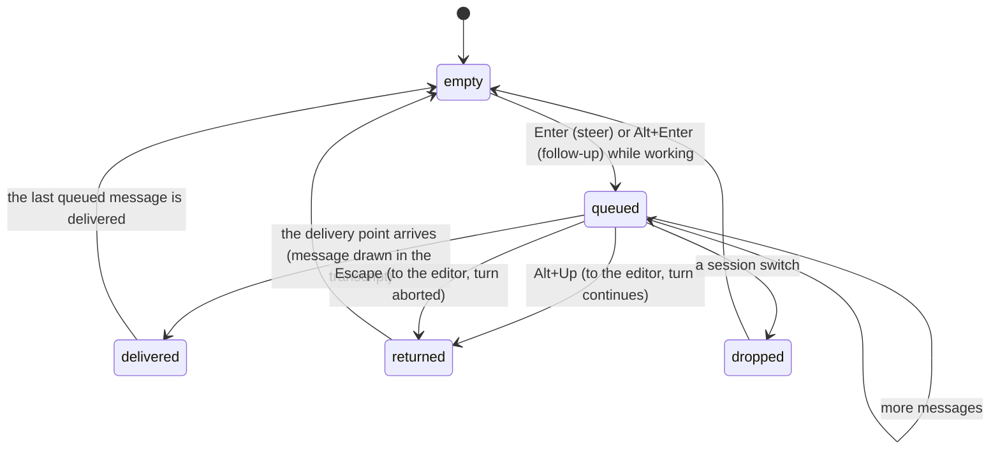

# The message queue

## Summary

While the agent is working, the user can keep talking. Enter queues a *steering message*, delivered to the model after the current assistant message and its tool calls finish, so the model sees it mid-task. Alt+Enter queues a *follow-up*, delivered only when the model would otherwise stop. Queued messages are listed in the pending area above the editor, Alt+Up pulls them all back into the editor, and Escape returns them to the editor while aborting the turn. During compaction the same keys queue messages for after it. This document owns the queue's screen behaviour and its edge cases; the delivery rules are stated in [the turn](../foundations/the-turn.md#while-working).

## The simple case

The model is halfway through a task and the user notices it is editing the wrong file. They type `Use the config in src/settings.ts, not lib/` and press Enter. The editor empties and a dim line `Steering: Use the config in src/settings.ts, not lib/` appears above the status line, with `↳ Alt+Up to edit all queued messages` under it. The model's current tool calls finish, the steering message is drawn in the transcript as a user message, the pending line disappears, and the model's next message takes the correction into account.

Later they type a second idea and press Alt+Enter: `Follow-up: Also add a test` waits until the model has finished the current task, then is sent as the next prompt, all within the same `Working...`.

## The interaction, event by event

### Compose

As in [the editor](the-editor.md). The text is trimmed; an empty submission does nothing. Paste markers are expanded when the message is queued, not when it is delivered.

### Resolves at once

- The agent is idle: Enter sends and Alt+Enter sends; nothing is queued.
- The text is a built-in slash command: it runs at once, whatever the agent is doing; nothing is queued.
- The text is a shell command: it runs at once; nothing is queued.

### Sent

On Enter while working, the editor empties, the text goes into the prompt history, and the pending area shows a blank line, `Steering: <text>` in dim text truncated to the width, and the `↳ Alt+Up` hint. Alt+Enter shows `Follow-up: <text>` instead; steering lines are listed above follow-up lines whatever the order they were typed in. Nothing is in the session yet.

During compaction (the status line shows `Compacting context...` or `Auto-compacting...`), Enter and Alt+Enter queue into a separate holding queue with the status message `Queued message for after compaction`; the pending area shows them the same way.

### While working

A steering message waits until the current assistant message ends and its tool calls have all finished. At that point the oldest steering message is sent to the model as a user message: it is drawn in the transcript in the user-message background, its pending line disappears, and the model is called with it. By default one steering message is delivered per model call (`steeringMode: one-at-a-time`); with `all`, every waiting steering message is delivered together.

A follow-up waits until the model stops without calling a tool and no steering message is left. Then the oldest follow-up is sent as a new prompt inside the same turn (`Working...` never clears). `followUpMode` works the same way.

While messages wait, the user can keep adding more, or press Alt+Up: every queued message (steering first, then follow-up) is removed from the queue and placed in the editor, separated by blank lines and ahead of any text already there; a status message says `Restored 2 queued messages to editor`, or `No queued messages to restore`. The turn continues.

When compaction ends, the holding queue is flushed: if a retry is about to run, its messages are re-queued as steering or follow-up for that run; otherwise the first message becomes a new prompt and the rest are queued behind it.

### Done

The queue is empty when the last message has been delivered; the turn settles only then. A message delivered from the queue is in the session exactly as a typed prompt would be, at the point it was delivered.

## Modifiers

| Modifier | Set before sending | Changed while working |
| --- | --- | --- |
| Model | No effect on queuing. | A queued message goes to whichever model is current when it is delivered. |
| Thinking level | No effect. | Same. |
| Agent busy | Idle: nothing queues. Working or compacting: queues as above. | Not applicable. |
| Attachments | A path in the text is text. | No effect. |
| Session kind | No effect. | No effect. |

## Cancel and interrupt

| Event | Nothing queued | Messages queued |
| --- | --- | --- |
| Escape (once; twice within 500 ms) | Aborts the turn. | Aborts the turn and puts every queued message into the editor, ahead of the current text; the pending area clears. |
| Ctrl+C once / twice; Ctrl+D | Ctrl+C clears the editor. | Same; the queue stays. Quitting drops the queue. |
| Another message submitted (Enter; Alt+Enter follow-up) | Queues. | Adds to the queue. |
| A slash command or shortcut that opens an overlay or changes the session | Overlays leave the queue alone. | A session switch (`/new`, `/resume`, `/fork`, `/clone`, `/import`) aborts the turn and drops the queue without returning it; nothing says so. `/compact` aborts and drops it. Choosing another entry in `/tree` returns the queue to the editor and then aborts. See "Open questions". |
| Model or thinking level changed | No effect. | No effect on the queue. |
| Provider error, rate limit, timeout, or network lost | No effect. | The queue survives a retry and is delivered when the retry succeeds. If the turn fails for good, a leftover queue is delivered by a fresh model call right away. |
| Context window exhausted (auto-compaction) | Messages typed during compaction go to the holding queue. | Queued messages survive compaction; the holding queue is flushed after it, with a re-queue when a retry follows. |
| Terminal resized; pi suspended (Ctrl+Z) and resumed | No effect. | The pending lines re-wrap. |
| Process ends: terminal closed (SIGHUP), SIGTERM, killed | No effect. | Queued messages are lost; they were never in the session. |
| Session or files changed from outside | No effect. | No effect. |
| Credentials lost, or logged out | No effect. | A queued message delivered after the credential is gone fails as a normal prompt would. |

## Interactions with other systems

**Session persistence.** Nothing is recorded until delivery; a queued message is in the session only once it has become a user message.

**Branching and history.** Every queued line is in the prompt history from the moment it was queued, so Up recalls it even after it was delivered or dropped.

**Compaction.** The holding queue above. A steering message delivered right before an auto-compaction is in the context that gets compacted.

**Context files and the system prompt.** None.

**Settings and keybindings.** `steeringMode`, `followUpMode` (both in `/settings`); `app.message.followUp` (Alt+Enter), `app.message.dequeue` (Alt+Up), `tui.input.submit` (Enter).

**Tools and the working directory.** A steering message never interrupts a running tool; it waits for the batch.

**Terminal and rendering.** Alt+Enter and Alt+Up need a terminal that reports Alt; Windows Terminal and some macOS terminals bind Alt+Enter to fullscreen and must be reconfigured (see [the terminal](../cross-cutting/the-terminal.md)). With `Option` as Meta off on macOS, Alt+Up may type a character instead.

**Credentials and providers.** None.

## Edge cases

- A `/` line pi does not recognise is queued as a steering message and delivered to the model as literal text; `/skill:…` and prompt-template lines are expanded when queued.
- A steering message queued while the model is mid-stream with no tool calls is delivered after that message ends, as an extra model call, even though the model had stopped: the turn does not settle while a steering message waits.
- Alt+Enter when idle is plain Enter, including for slash and shell commands.
- Alt+Up with both queues non-empty returns steering messages before follow-ups regardless of typing order.
- Two identical steering messages in a row are both queued; the prompt history skips the duplicate.
- A shell command run while messages are queued: its box in the pending area is erased by the next queue change (see [shell commands](shell-commands.md#open-questions-and-verification)).
- Queued messages are not shown in the transcript's user-message style until delivered; a long queue is many dim lines, each truncated to one line.

## Open questions and verification

- A session switch while messages are queued drops them silently, where Escape returns them to the editor. May be worth treating as a bug rather than documenting.
- Whether a leftover queue after a fatally failed turn is delivered (a fresh model call starts on its own) or discarded was read from the post-run logic and not observed; either is surprising and may be worth treating as a bug.
- The order in which the pending area lists a steering message typed after a follow-up (steering first) was read from the rendering code and not observed.
- Whether `Restored N queued messages to editor` also appears when Escape (not Alt+Up) returns the queue was not determined; the abort path does not show the status.

Verified against pi-mono commit `a69bef789`.
