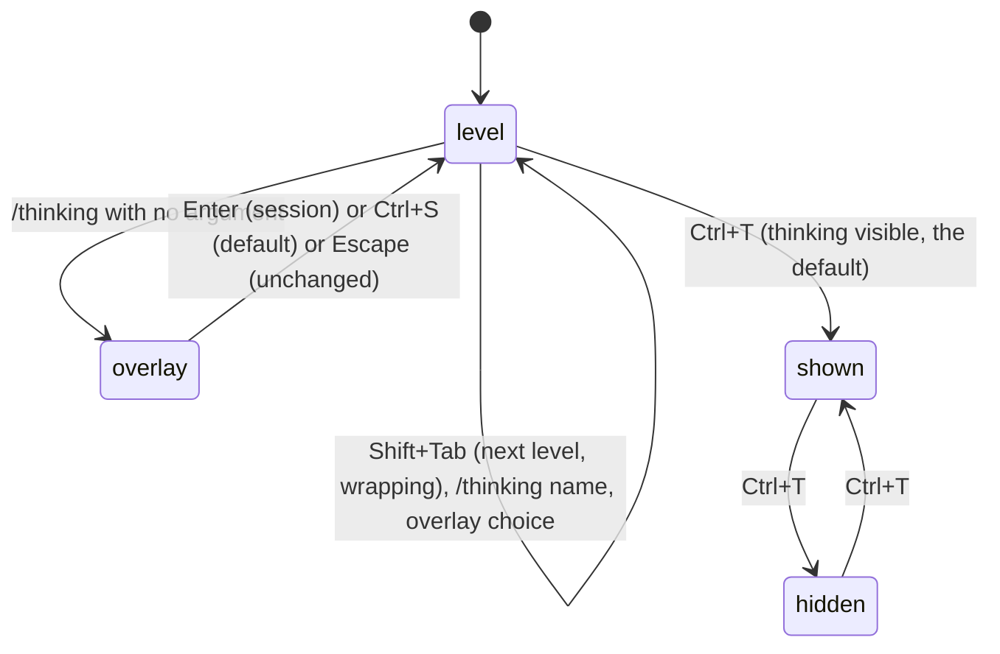

# Thinking

## Summary

Thinking is the model's reasoning before its answer, and the thinking level is how much of it pi asks for. The level is shown in two places, the footer (`• medium`) and the editor's border colour, and is changed with Shift+Tab (cycle), `/thinking` (an overlay or a direct name), or the settings panel (a per-model default). Ctrl+T hides or shows the thinking text in the transcript. This document owns all of that; the effect of thinking on a turn is in [sending a prompt](sending-a-prompt.md).

Available whenever the editor is. On a model that cannot reason, the level is `off` and Shift+Tab only says so.

## The simple case

The footer reads `claude-opus-4-8 • medium` and the editor border is the medium-level blue. The user presses Shift+Tab: the border turns purple, the footer reads `• high`, and a dim status line says `Thinking level: high`. The next prompt gets more reasoning, shown in italics above the answer. They press Ctrl+T: the italic block collapses to a single `Thinking...` line, in every past message too, and stays collapsed for future responses until Ctrl+T again.

## The interaction, event by event

### Open

- **Shift+Tab** moves to the next level the current model supports, in the order `off, minimal, low, medium, high, xhigh, max` restricted to the model's set, wrapping from the last back to the first. The footer and border update at once and a status line says `Thinking level: <level>`. On a model without reasoning: `Current model does not support thinking` and nothing changes.
- **`/thinking`** with no argument opens the thinking selector: the list of the model's levels with the current one highlighted; typing filters; Up/Down move.
- **`/thinking high`** sets the level directly (case-insensitive). A name the model does not support: `Error: Unknown thinking level "hig". Available levels: off, minimal, low, medium, high.`
- **Ctrl+T** toggles thinking visibility.
- **`/settings` → Default thinking level per model** sets a default for a particular model, used whenever that model is selected.

### Dismissed at once

Escape in the selector closes it with no change. Shift+Tab and `/thinking <name>` have no dismiss.

### First change

In the selector, moving the highlight changes nothing until Enter.

### While open

The selector replaces the editor; the turn, if one is running, continues behind it.

### Accepted

- Enter in the selector sets the level for this session: footer, border, `Thinking level: <level>`, and a thinking-level entry in the session file.
- Ctrl+S sets it and saves it as `defaultThinkingLevel` in settings: `Default thinking level: <level>`.
- Ctrl+T rebuilds the whole transcript with thinking blocks hidden (each becomes one `Thinking...` line) or shown, applies to the message streaming right now, and saves `hideThinkingBlock` to settings so it persists across runs.

A level change takes effect at the next model call; see [the turn](../foundations/the-turn.md#modifiers). A level the model cannot do is clamped to the nearest it can, and the clamped value is what is shown and recorded.

## Modifiers

| Modifier | Set before sending | Changed while working |
| --- | --- | --- |
| Model | Each model has its own set of levels; switching models applies that model's per-model default if one is set, otherwise keeps the current level clamped to the new model's set. | Same, at the next call. |
| Thinking level | This document. | Next call. |
| Agent busy | No effect on changing the level. | The change applies to the next model call of the turn. |
| Attachments | No effect. | No effect. |
| Session kind | Saved: the level is recorded and restored on resume. Ephemeral: lasts the run. | No effect. |

## Cancel and interrupt

| Event | Idle | While working |
| --- | --- | --- |
| Escape (once; twice within 500 ms) | Closes the selector unchanged. | Aborts the turn; the level is unchanged. |
| Ctrl+C once / twice; Ctrl+D | Ctrl+C in the selector cancels it. | Same. |
| Another message submitted (Enter; Alt+Enter follow-up) | Uses the current level. | Queued. |
| A slash command or shortcut that opens an overlay or changes the session | Opening another overlay closes the selector. A session switch restores that session's level. | Same. |
| Model or thinking level changed | See "Modifiers". | Same. |
| Provider error, rate limit, timeout, or network lost | No effect. | No effect. |
| Context window exhausted (auto-compaction) | No effect. | No effect. |
| Terminal resized; pi suspended (Ctrl+Z) and resumed | Redraw. | Redraw. |
| Process ends: terminal closed (SIGHUP), SIGTERM, killed | A session-only level is already in the session file; a default is already in settings. | Same. |
| Session or files changed from outside | `defaultThinkingLevel` edited on disk applies at the next start. | Same. |
| Credentials lost, or logged out | No effect. | No effect. |

## Interactions with other systems

**Session persistence.** A thinking-level entry is appended when the effective level changes; resuming restores the last one on the branch.

**Branching and history.** `/tree` to another branch changes the messages only; the level stays what it is, even if the other branch recorded a different one. A resume, fork, or clone restores the level from the branch it opens.

**Compaction.** Thinking text is part of the assistant messages that compaction summarises; hidden or shown makes no difference to the model.

**Context files and the system prompt.** None.

**Settings and keybindings.** `defaultThinkingLevel`, `modelThinkingLevels`, `hideThinkingBlock`, `thinkingBudgets` (token budgets per level for providers that take one); `app.thinking.cycle` (Shift+Tab), `app.thinking.toggle` (Ctrl+T).

**Tools and the working directory.** The `bash` tool's environment carries `PI_REASONING_LEVEL`.

**Terminal and rendering.** Border colours by level: `off` dark grey, `minimal` grey, `low` steel blue, `medium` light blue, `high` lavender, `xhigh` violet, `max` magenta (dark theme). Thinking text is italic in the thinking colour; a theme without a `thinkingMax` colour uses `xhigh`'s. Shift+Tab needs a terminal that reports it (most do).

**Credentials and providers.** Which levels a model offers comes from the provider's model catalogue.

## Edge cases

- `max` exists only on models that declare it; Shift+Tab never reaches it elsewhere.
- Setting a level equal to the current one records nothing and shows the status anyway.
- Ctrl+T while a response is streaming re-renders the streaming message with the new visibility immediately.
- `/thinking` with a level name the model does not have, but another model does, is an error here and not a clamp.
- The hidden label is `Thinking...` even for messages whose thinking has long since finished.
- A reasoning model with the level `off` shows `• thinking off` in the footer; a non-reasoning model shows no thinking suffix at all.

## Open questions and verification

- Whether Shift+Tab on a model with a single level (`off` only, but flagged as reasoning) reports the same level or says unsupported was not determined.
- The light theme's border colours were not read.
- Whether the selector's Ctrl+S also applies the level to the session (read: yes, it calls the same setter with persist) was not observed.

Verified against pi-mono commit `a69bef789`.
