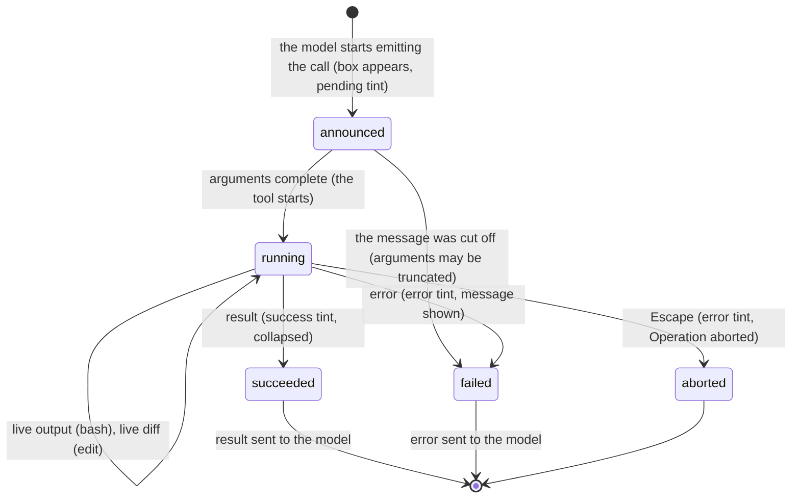

# Tool calls

## Summary

A tool call is the model asking pi to do something in the project: read a file, run a shell command, edit or write a file, or (when enabled) search with grep, find files, or list a directory. Each call is drawn as a box in the transcript that appears while the model is still describing it, runs without asking, and then shows its result collapsed to a few lines. This document owns what each of the seven built-in tools looks like, what it does, and its limits; how a turn flows around tool calls is in [sending a prompt](sending-a-prompt.md).

In the default configuration the model has `read`, `bash`, `edit`, and `write`. `grep`, `find`, and `ls` exist but are off unless enabled with `--tools` or the `defaultTools` setting. There is no permission prompt: a tool call the model makes is run.

## The simple case

The model says it will look at the test file and a box appears: `read src/auth.test.ts`, tinted as pending. A moment later the tint is the success colour and the box is one line; Ctrl+O would expand it to show the file's contents. The model then runs `npm test`: a box with `$ npm test` in bold, the last five lines of output scrolling beneath it, and `Elapsed 3.2s` counting up; when the command exits the counter reads `Took 4.1s` and the box shows the last five lines with `... (87 earlier lines, Ctrl+O to expand)`. The model edits the file: `edit src/auth.test.ts` with a diff beneath it, removed lines in red and added lines in green, a single changed line showing the changed words highlighted. The model's next message explains what it did.

## The interaction, event by event

### Compose

Not applicable: the model composes tool calls, not the user. The user influences them only through the prompt.

### Resolves at once

- A call in a message that was cut off by the output limit is not run; its box shows the error tint with a message that the arguments may be truncated, and the model is told the same.
- A call to a tool that is not enabled cannot happen; the model does not know the tool exists.
- A `read` of a file that does not exist, an `edit` whose text is not found, an `ls` of a non-directory: the tool fails at once with an error in the box (`Error: File not found: …`, and so on) and the error goes to the model, which usually tries something else.

### Sent

The box appears when the model begins the call, before its arguments have fully arrived, in the pending tint, showing the tool's header with whatever arguments are known: `read src/` growing to `read src/auth.ts:1-40`, `$ npm te` growing to `$ npm test`. When the arguments are complete the tool starts. Calls in the same assistant message start together and run in parallel; `edit` and `write` calls on the same file are serialised in order.

### While working

Per tool:

- **`read`**: header `read <path>`, with `:<from>-<to>` when the model asked for a range. No live output. Files recognised as instructions render differently: `read resource AGENTS.md` for context files, `[skill] <name>` for a skill file, `read docs <path>` for pi's own documentation.
- **`bash`**: header `$ <command>` in bold, with `(timeout 30s)` when the model set one. Output appears as it arrives, updated at most ten times a second, collapsed to the last five visual lines; `Elapsed 1.2s` ticks below. The command runs in the working directory in a fresh shell with `PI_SESSION_ID`, `PI_PROVIDER`, `PI_MODEL`, and `PI_REASONING_LEVEL` set, with no timeout unless the model gave one.
- **`edit`**: header `edit <path>`; a diff preview is drawn from the arguments as they stream and settles when they are complete. Removed lines in the removed colour, added in the added colour, unchanged context dimmed; a one-line replacement highlights the changed words in inverse video.
- **`write`**: header `write <path>`; the content is shown syntax-highlighted as it streams, collapsed to ten lines with `... (N more lines, M total, Ctrl+O to expand)`.
- **`grep`**: header `grep /pattern/ in <path>` with `(glob)` and `limit N`; runs ripgrep (downloaded to `~/.pi/agent/bin/` at first use), hidden files included, `.gitignore` respected, up to 100 matches.
- **`find`**: header `find <pattern> in <path> (limit 1000)`; runs `fd` with the same ignore rules.
- **`ls`**: header `ls <path> (limit 500)`.

The box's tint is pending throughout. Escape aborts the whole turn; there is no way to stop one tool and let the others continue.

### Done

The tint becomes success or error. The result is shown collapsed: `read` shows nothing (the content is hidden until expanded), `bash` the last five visual lines with `... (N earlier lines, Ctrl+O to expand)` and `Took 4.1s`, `write` nothing on success, `edit` its diff, `grep` 15 lines, `find` and `ls` 20 lines, each with `... (N more lines, Ctrl+O to expand)`. Errors show in the error colour: `Command exited with code 1` under the output for `bash`, `Error: …` for the rest. Ctrl+O expands every box in the transcript to the full result; the expansion state applies to boxes drawn later too.

What the model receives is the result text, truncated at 2,000 lines or 50 KB (whichever first), with a note of what was cut: `read` says `[Showing lines 1-2000 of 5000. Use offset=2001 to continue.]`; `bash` spills the full output to a temp file and says `[Showing lines X-Y of Z. Full output: /tmp/pi-bash-….log]`; `grep` caps match lines at 500 characters. An image read with `read` is sent to the model as an image, resized to at most 2000×2000 (`images.autoResize`), or replaced by a note if the model cannot take images or `images.blockImages` is on.

The tool result is recorded in the session and the model is called again with it.

> Technical note: `bash` output is captured, not attached to the terminal, so commands that need a TTY (editors, pagers, `sudo` prompts) hang until aborted or finish with an error. ANSI colour is stripped from the result and `\r` progress bars collapse to their last state. The process runs in its own group and is killed as a group on abort or timeout.

## Modifiers

| Modifier | Set before sending | Changed while working |
| --- | --- | --- |
| Model | Decides which tools are called and how. A model without image support gets a text note in place of an image result. | No effect on a running call. |
| Thinking level | No effect. | No effect. |
| Agent busy | Not applicable; tool calls happen only while working. | Escape aborts all running tools. |
| Attachments | No effect. | No effect. |
| Session kind | Tool results are persisted in a saved session; an ephemeral one keeps them in memory. The temp file for overflowing `bash` output is written either way. | No effect. |

## Cancel and interrupt

| Event | Announced, not yet running | Running |
| --- | --- | --- |
| Escape (once; twice within 500 ms) | The box turns to the error tint with `Operation aborted`; the call is recorded with that result. | The process (for `bash`, `grep`, `find`) is killed; `edit` and `write` stop at the next opportunity and may leave a file partially written; the box shows `Operation aborted` in the error tint; recorded. |
| Ctrl+C once / twice; Ctrl+D | Ctrl+C clears the editor only. Quitting aborts as above, then exits. | Same. |
| Another message submitted (Enter; Alt+Enter follow-up) | Queued; delivered after this message's tools finish. | Same. |
| A slash command or shortcut that opens an overlay or changes the session | Overlays leave tools running. A session switch aborts them. | Same. |
| Model or thinking level changed | Takes effect on the next model call, after the tools. | Same. |
| Provider error, rate limit, timeout, or network lost | Not applicable; the call has already arrived. | No effect on a running tool; the error, if any, comes on the next model call. |
| Context window exhausted (auto-compaction) | No effect. | No effect; compaction runs between model calls, and a tool result is never separated from its call. |
| Terminal resized; pi suspended (Ctrl+Z) and resumed | The box re-wraps. | Same; the tool keeps running while suspended. |
| Process ends: terminal closed (SIGHUP), SIGTERM, killed | The call is lost with the message. | SIGHUP/SIGTERM kill the tool's process; a kill orphans it. The result is not recorded. |
| Session or files changed from outside | No effect. | A file changed under an `edit` between its read and write may be written with stale content; `edit` matches against the file as it was read. |
| Credentials lost, or logged out | No effect. | No effect on the tool; the next model call fails. |

## Interactions with other systems

**Session persistence.** Each tool result is an entry, recorded when the tool ends, including aborted and errored ones; the call itself is part of the assistant message. Resuming shows the boxes completed, collapsed.

**Branching and history.** Tool calls and results are entries in the tree; `/tree`'s default filter shows them, `no-tools` hides them.

**Compaction.** Tool results are the largest part of most contexts. Compaction summarises them, tracking which files were read and modified so the summary can list them. A tool result is never a cut point: it stays with its call.

**Context files and the system prompt.** The tool list in the system prompt is the enabled tools; `AGENTS.md` instructions about which commands to run are just text the model reads.

**Settings and keybindings.** `defaultTools`, `--tools`, `--exclude-tools`, `--no-tools`; `shellPath`, `shellCommandPrefix`; `images.*`, `terminal.showImages`, `terminal.imageWidthCells`; `app.tools.expand` (Ctrl+O).

**Tools and the working directory.** This document. Paths in results are relative to the working directory where the tool makes them so; `find` relativises its results.

**Terminal and rendering.** Diffs and code use the theme's colours; syntax highlighting loads its grammars in the background after startup, so the first `write` box in a run may appear unhighlighted for a moment. Images in results are drawn inline in terminals with image support (Kitty, Ghostty, iTerm2), at `terminal.imageWidthCells` wide, and as a placeholder elsewhere.

**Credentials and providers.** The `bash` environment carries the provider and model names; nothing else.

## Edge cases

- `write` reports `Successfully wrote N bytes` where N is the character count, not the byte count; off by one per multi-byte character.
- `edit` with the old text appearing twice in the file fails; the model must include more context.
- `edit` tolerates a few malformed argument shapes from models (a single edit instead of a list, a JSON string for the list) and still applies them.
- A `read` of a single line longer than 50 KB returns nothing but a note suggesting a `sed` command.
- A `bash` command whose output is exactly over the limits shows the truncation note even when the temp file holds only marginally more.
- `ls` on an empty directory says `(empty directory)`; `grep` with no matches says `No matches found`; `find` with none says `No files found matching pattern`.
- macOS screenshot file names with their special spaces are found by `read` even when the model types plain spaces.
- Tool boxes drawn before Ctrl+O was pressed and those drawn after follow the same expansion state; pressing Ctrl+O toggles all of them and prints `Tool output: expanded` or `collapsed`.

## Open questions and verification

- Whether `edit` and `write` stop mid-write on abort (leaving a partial file) or finish the in-flight write was read from the abort checks placed between awaits; which outcome a user sees depends on timing and was not observed.
- The `Elapsed`/`Took` counter's presence on `bash` boxes was read from the tool's render code and not observed.
- The 100 ms throttle on live `bash` output is not observable by hand.
- The `write` byte-count misreport may be worth treating as a bug rather than documenting.
- Whether `grep`, `find`, and `ls` boxes show any live state before completion (they have no streaming) was not confirmed.

Verified against pi-mono commit `a69bef789`.
