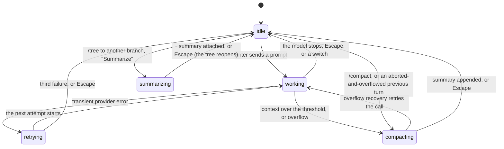

# Busy state

## Summary

pi never locks the editor. Whatever the agent is doing, the user can type, press shortcuts, and submit slash commands, and each of those does something: sometimes the same thing it does when idle, sometimes a queued version of it, and occasionally a refusal. This document is the matrix of what every built-in slash command and every application shortcut does in each state the agent can be in: idle; working (the model is being called, text is streaming, or tools are running); counting down to a retry; compacting (automatically or with `/compact`); summarizing a branch for `/tree`; and with an overlay open. The feature documents link here for their "A slash command or shortcut" interrupt row rather than repeating the matrix.

Two rules explain most of the table. First, a built-in slash command is matched on the exact trimmed text before pi looks at what the agent is doing, so every one of them runs at once in every state; only `/reload` checks and refuses. Second, a submission that is not a command is routed by two flags: if a compaction or branch summary is running it goes to the holding queue; otherwise, if a turn is in progress, it goes to the queue as a steering message (Enter) or follow-up (Alt+Enter); otherwise it is sent. The retry countdown counts as a turn in progress; automatic compaction counts as both.

## The simple case

The model is three tool calls into a refactor and the status line reads `Working... (escape to interrupt)`. The user types `/model` and presses Enter: the model selector replaces the editor, the tool boxes keep updating behind it, and choosing a model prints `Model: …` and takes effect from the next model call. They press Escape to close the selector, type `also update the tests`, and press Enter: the line moves to the pending area as `Steering: also update the tests`. They press Ctrl+O to expand the tool output so far, then Shift+Tab to raise the thinking level for the rest of the turn. Nothing they did waited on the model, and nothing interrupted it.

Had they typed `/new` instead, the turn would have been aborted without a question, the partial response written to the old session, the steering message dropped, and `✓ New session started` printed.

## The states

What each state looks like, and which flags drive the matrix:

| State | Status line | Turn in progress | Compaction running |
| --- | --- | --- | --- |
| Idle | Empty | No | No |
| Working | `Working... (escape to interrupt)` | Yes | No |
| Retry countdown | `Retrying (n/3) in Ns... (escape to cancel)` | Yes | No |
| Compacting, automatic | `Auto-compacting... (escape to cancel)` or `Context overflow detected, Auto-compacting... (escape to cancel)` | Yes | Yes |
| Compacting, manual | `Compacting context... (escape to cancel)` | No (`/compact` aborted it first) | Yes |
| Branch summarizing | `Summarizing branch... (escape to cancel)` | No (choosing the branch aborted it first) | Yes |
| Overlay open | Whatever it was; the overlay replaces the editor | Unchanged | Unchanged |

> Technical note: "turn in progress" is the session's `isStreaming` flag, which stays set from the prompt until the turn settles, through retries, automatic compaction, and queued continuations. "Compaction running" is `isCompacting`, set for manual compaction, automatic compaction, and branch summarization alike. The submit handler checks compaction first, then the turn, which is why automatic compaction behaves like compaction rather than like working.

## The four outcomes

Every cell in the matrix is one of four things.

**Runs at once.** The command or shortcut does what it does when idle, and the state continues around it. This is the default: overlays open, settings change, models and thinking levels switch, output expands, the external editor opens, the session is exported or named. Nothing warns that the agent is busy. For anything that changes what the model is sent (model, thinking level, a credential), the change applies from the next model call, including a retried one; the call already in flight finishes with what it started with.

**Queued or held.** A prompt, a follow-up, or an unrecognised `/` line is not sent while a turn is in progress: Enter queues a steering message and Alt+Enter a follow-up, both shown in the pending area and delivered by the rules in [the turn](../foundations/the-turn.md#while-working). While a compaction or branch summary is running the same keys go to the holding queue instead, with `Queued message for after compaction`; when it ends the holding queue is flushed (as steering and follow-up messages if the interrupted turn is about to be retried, otherwise as a new prompt with the rest queued behind it). A `!` command always runs at once, but its record is held until the turn ends whenever a turn is in progress. Alt+Up returns everything queued or held to the editor.

**Refused.** Only `/reload` refuses: `Warning: Wait for the current response to finish before reloading.` while a turn is in progress (including the retry countdown and automatic compaction), `Warning: Wait for compaction to finish before reloading.` during manual compaction or a branch summary. A second `!` while one runs is the only other refusal, and it is the same in every state.

**Ends the state, then acts.** A switch (`/new`, `/clone`, choosing in `/fork`, `/resume`, or `/tree`, confirming `/import`), `/compact`, and quitting all stop whatever is happening first: a turn is aborted and its partial message and tool results written; a retry countdown is cancelled (`Error: Retry failed after N attempts: Retry cancelled`); a compaction or branch summary is cancelled. A switch and `/compact` drop the queue without returning it to the editor; `/tree` returns it first. None of them asks for confirmation (`/import` confirms the import, not the abort).

## The matrix

One row per action. "Switch" means what [input](../foundations/input.md#cancel-and-interrupt) defines: the turn in progress is aborted, the aborted message and tool results are written to the old session, the queue and holding queue are dropped without being returned to the editor, and the session is replaced. "Overlay" in the last column means the built-in overlays; while one is open the editor is hidden, so no slash command can be typed and most shortcuts never reach the editor.

| Action | Idle | Working | Retry countdown | Compacting (auto or manual) | Branch summarizing | An overlay open |
| --- | --- | --- | --- | --- | --- | --- |
| Enter (a prompt) | Sends it; the turn starts. | Queued as a steering message (`Steering: …`). | Queued as a steering message; delivered with the retried call. | Holding queue; `Queued message for after compaction`. | Holding queue; same status; flushed after `Navigated to selected point`. | Accepts the overlay's selection. |
| Alt+Enter | Same as Enter. | Queued as a follow-up (`Follow-up: …`). | Queued as a follow-up. | Holding queue, marked as a follow-up. | Holding queue, marked as a follow-up. | No effect. |
| Alt+Up | `No queued messages to restore`. | Queue returned to the editor; the turn continues. | Same; the retry still runs. | Queue and holding queue returned to the editor. | Holding queue returned to the editor. | Reorders in `/scoped-models`; otherwise no effect. |
| Typing in the editor | Edits. | Edits. | Edits. | Edits. | Edits. | Goes to the overlay (filters a selector, types into the login dialog). |
| Escape | Closes the popup, clears bash mode, or arms the double-Escape; twice opens `/tree`. | Aborts the turn; the queue returns to the editor. | Cancels the retry: `Error: Retry failed after N attempts: Retry cancelled`; the turn settles. | Cancels it: manual, `Error: Compaction cancelled`; automatic, `Auto-compaction cancelled`; the turn settles uncompacted. | Cancels it: `Branch summarization cancelled`; the tree reopens at the same entry. | Dismisses the overlay; in the login dialog, abandons the login silently. |
| Ctrl+C once / twice | Clears the editor; twice quits. | Same; quitting aborts and writes the turn first. | Same; quitting cancels the retry first. | Same; quitting cancels the compaction. | Same; quitting cancels the summary. | Cancels the overlay; does not count toward quitting. |
| Ctrl+D (empty editor) | Quits. | Quits; aborts and writes the turn. | Quits; cancels the retry. | Quits; cancels the compaction. | Quits; cancels the summary. | The overlay's own meaning (deletes in `/resume`); otherwise no effect. |
| Ctrl+Z | Suspends pi. | Suspends; the turn continues unseen and is drawn on `fg`. | Suspends; the countdown continues. | Suspends; the compaction continues. | Suspends; the summary continues. | No effect; the editor's binding is not reached. |
| Shift+Tab | Cycles the thinking level: `Thinking level: …`. | Same; applies from the next model call. | Same; applies to the retried call. | Same; the compaction call is unaffected. | Same. | No effect. |
| Ctrl+P / Shift+Ctrl+P | Cycles the model: `Switched to …`. | Same; applies from the next model call. | Same; applies to the retried call. | Same; the compaction call keeps its model. | Same. | Toggles a provider in `/scoped-models`, shows paths in `/resume`; otherwise no effect. |
| Ctrl+L | Opens the model selector. | Opens it; the turn continues behind it. | Opens it. | Opens it. | Opens it. | No effect. |
| Ctrl+O | Expands or collapses all tool output: `Tool output: expanded`. | Same, including boxes still running. | Same. | Same. | Same. | Cycles the filter in `/tree`; otherwise no effect. |
| Ctrl+T | Hides or shows thinking; rebuilds the transcript (status, warning, and error lines vanish). | Same; the streaming message is re-added. | Same. | Same. | Same. | No effect. |
| Ctrl+G | Opens the external editor; pi's screen is released. | Same; the turn continues unseen and is drawn on return. | Same; the countdown continues. | Same. | Same. | No effect. |
| Ctrl+X | Copies the last assistant message: `Copied last agent message to clipboard`. | Same; see "Open questions" for a message still streaming. | Same. | Same. | Same. | Copies the selected entry in `/tree`; otherwise no effect. |
| Ctrl+V | Pastes an image path or text into the editor. | Same. | Same. | Same. | Same. | No effect. |
| `!cmd`, `!!cmd` | Runs; box in the transcript; record written at once. | Runs; box in the pending area; record held until the turn ends. | Same as working. | Automatic: same as working. Manual: same as idle; the record lands while compaction runs. | Same as idle; the record lands on the branch being left. See "Open questions". | Not reachable. |
| `/settings` | Opens the settings panel. | Opens it; changes apply live. | Opens it. | Opens it. | Opens it. | Not reachable. |
| `/model [id]` | Opens the model selector, or sets the model: `Model: …`. | Same; the model applies from the next call. | Same; applies to the retried call. | Same. | Same. | Not reachable. |
| `/thinking [level]` | Opens the thinking selector, or sets the level. Unknown level: `Error: Unknown thinking level "…"`. | Same; next model call. | Same. | Same. | Same. | Not reachable. |
| `/scoped-models` | Opens the scoped-models selector. | Opens it. | Opens it. | Opens it. | Opens it. | Not reachable. |
| `/tree` | Opens the tree. Choosing an entry navigates. | Opens it. Choosing an entry returns the queue to the editor, aborts the turn, then navigates. | Opens it. Choosing cancels the retry (`Retry failed … Retry cancelled`), then navigates. | Opens it. Automatic: choosing waits for the compaction, then navigates. Manual: navigates at once while compaction runs. See "Open questions". | Opens it. Choosing starts a second navigation while the first summarizes. See "Open questions". | Not reachable. |
| `/fork` | Opens the user-message selector; choosing forks. | Opens it; choosing is a switch. | Opens it; choosing cancels the retry and switches. | Opens it; choosing cancels the compaction and switches. | Opens it; choosing cancels the summary and switches. | Not reachable. |
| `/clone` | Switch at once: `Cloned to new session`. | Switch: aborts, writes, drops the queue, clones. | Switch; the retry is cancelled. | Switch; the compaction is cancelled. | Switch; the summary is cancelled. | Not reachable. |
| `/resume` | Opens the session picker; choosing switches. | Opens it; choosing is a switch. | Same. | Same. | Same. | Not reachable. |
| `/new` | Switch at once: `✓ New session started`. | Switch, with no confirmation. | Switch; the retry is cancelled silently. | Switch; the compaction is cancelled. | Switch; the summary is cancelled. | Not reachable. |
| `/import <path>` | Asks `Replace current session with <path>?`; Yes switches. | Same; Yes is a switch. | Same. | Same. | Same. | Not reachable. |
| `/compact [instr.]` | Compacts: `Compacting context...`. | Aborts the turn, then compacts; the turn is not resumed. | Cancels the retry (`Error: Retry failed … Retry cancelled`), then compacts. | Automatic: waits for it, then `Error: Already compacted`. Manual: a second compaction starts alongside. See "Open questions". | Runs alongside the summary. See "Open questions". | Not reachable. |
| `/export [path]` | Writes the file: `Session exported to: …`. | Same; the message still streaming is not in it. | Same. | Same. | Same. | Not reachable. |
| `/share` | Uploads and prints the link. | Same. | Same. | Same. | Same. | Not reachable. |
| `/copy` | Copies the last assistant message, or `Error: No agent messages to copy yet.` | Same. | Same. | Same. | Same. | Not reachable. |
| `/name [name]` | Sets or shows the name. | Same. | Same. | Same. | Same. | Not reachable. |
| `/session` | Prints the stats block. | Same, as of now. | Same. | Same. | Same. | Not reachable. |
| `/changelog`, `/hotkeys` | Prints the box. | Same. | Same. | Same. | Same. | Not reachable. |
| `/trust` | Opens the trust selector. | Opens it. | Opens it. | Opens it. | Opens it. | Not reachable. |
| `/login [provider]` | Opens the login flow. | Opens it; a model chosen on success applies from the next call. | Same. | Same. | Same. | Not reachable. |
| `/logout` | Opens the logout selector. | Opens it; logging out of the current provider fails the next model call. | Same; the retried call fails. | Same. | Same. | Not reachable. |
| `/reload` | Reloads. | `Warning: Wait for the current response to finish before reloading.` | Same warning. | Automatic: the same warning. Manual: `Warning: Wait for compaction to finish before reloading.` | `Warning: Wait for compaction to finish before reloading.` | Not reachable. |
| `/quit` | Quits with the resume hint. | Aborts, writes the turn, quits. | Cancels the retry, quits. | Cancels the compaction, quits. | Cancels the summary, quits. | Not reachable. |
| `/debug` (hidden) | Writes the debug log: `✓ Debug log written` and the path. | Same. | Same. | Same. | Same. | Not reachable. |
| `/foo` (unrecognised) | Sent to the model as the text `/foo`; a turn starts. | Queued as a steering message and delivered as text. | Queued as a steering message. | Holding queue. | Holding queue. | Not reachable. |

Three things the table implies deserve saying plainly:

- `/new`, `/clone`, `/import` (after its own confirmation), `/compact`, and `/quit` run while the model is mid-response with no confirmation and no mention that a turn was in progress. The partial response is kept in the old session; the queue is dropped. May be worth treating as a bug rather than documenting.
- A `/` line pi does not recognise is not refused: idle, it starts a turn with that text; working, it is queued and delivered to the model as literal text. A typo such as `/quit now` or `/compcat` goes to the model. May be worth treating as a bug rather than documenting.
- Matching is on the exact trimmed text, so `/quit now` is not `/quit`, `/Settings` is not `/settings`, and `/export  a.html` (two spaces) exports to `a.html` because the path is read after the command word.

The Escape row is the one place where the state changes what a key means rather than what happens to its result. Escape's usual priority order (popup, abort, shell command, bash mode, double-Escape; see [input](../foundations/input.md#escape)) is suspended while a retry countdown, a compaction, or a branch summary runs: the key then cancels that and nothing else. A running shell command or a bash-mode line in the editor has to wait for the countdown or compaction to end, or be cancelled with it, before Escape reaches it again.

> Technical note: the retry, compaction, and branch-summary states each replace the editor's Escape handler when they begin and restore it when they end. The working handler is restored at the start of the next attempt rather than at the end of the countdown, so there is no gap in which Escape does nothing. If two of these states overlap (the suspected bugs under "Open questions"), the handler restored last wins.

## Modifiers

| Modifier | Set before sending | Changed while working |
| --- | --- | --- |
| Model | Decides which model the first call uses; every row above behaves the same whatever the model. | Ctrl+P, `/model`, and the selector change it at once in every state; it applies from the next model call, including a retried one. |
| Thinking level | Same. | Shift+Tab and `/thinking` change it at once in every state; next model call. |
| Agent busy | This document. | This document. |
| Attachments | No effect on the matrix; an image path in the editor is text until sent. | No effect. |
| Session kind | Saved: switches write the aborted turn to the old file. Ephemeral: the same on screen, nothing on disk; `/fork` and `/clone` replace the in-memory session. | No effect. |

## Cancel and interrupt

The table summarizes what each interrupt does to the state itself; the feature documents say what it does to their feature.

| Event | Effect on the agent state |
| --- | --- |
| Escape (once; twice within 500 ms) | Working: abort, then idle. Retry countdown: cancelled, then idle. Compacting or summarizing: cancelled, then idle (the tree reopens after a cancelled summary). Overlay: dismissed; the state behind it is untouched. A second Escape on an empty editor opens the tree, whatever the state. |
| Ctrl+C once / twice; Ctrl+D | One Ctrl+C never changes the state. Two, or Ctrl+D on an empty editor, quit from any state: the turn is aborted (without waiting for the aborted message to be written), the retry or compaction cancelled, and the resume hint printed when the session has a file. |
| Another message submitted (Enter; Alt+Enter follow-up) | Never changes the state; the message is sent, queued, or held according to the first row of the matrix. |
| A slash command or shortcut that opens an overlay or changes the session | An overlay changes nothing behind it. A switch ends every state: abort, cancel the retry, cancel the compaction or summary, then replace the session; the new session starts idle. |
| Model or thinking level changed | Never changes the state; applies from the next model call. |
| Provider error, rate limit, timeout, or network lost | Working becomes the retry countdown (transient) or idle (not transient, or the third failure). Compacting or summarizing: the same countdown inside that state, then back to it. See [errors and retries](errors-and-retries.md). |
| Context window exhausted (auto-compaction) | Working becomes compacting; after an overflow, compacting becomes working again for the single retry; after a threshold compaction, idle. |
| Terminal resized; pi suspended (Ctrl+Z) and resumed | No change; every state continues through a suspend. |
| Process ends: terminal closed (SIGHUP), SIGTERM, killed | SIGHUP and SIGTERM: the state is cancelled on the way out and the aborted turn written. Killed: whatever was not yet written is lost. See [process lifecycle](process-lifecycle.md). |
| Session or files changed from outside | No change. |
| Credentials lost, or logged out | No change until the next model call, which fails and ends the turn. |

## Interactions with other systems

**Session persistence.** Commands that run while working write into the session around the turn: a model or thinking change is an entry at the point it was made; a shell record is held until the turn ends; a switch writes the aborted assistant message and its tool results to the old session before leaving it. `/export` and `/share` while working export the session as written so far, without the message still streaming.

**Branching and history.** `/tree` and `/fork` are available in every state, but acting on them ends the state: a navigation aborts the turn first, a fork is a switch. Queued lines are in the prompt history from the moment they were queued, so a queue dropped by a switch can be recalled with Up.

**Compaction.** Automatic compaction is the one state that is both a turn and a compaction: submissions go to the holding queue, `/reload` refuses with the response-in-progress warning, and `!` records are held as during working. Manual compaction and branch summarization are compactions without a turn, so `!` records are written at once and `/tree` does not wait.

**Context files and the system prompt.** `/reload`, the only command that re-reads them, is the only command that refuses while busy; everything else runs with the context as loaded.

**Settings and keybindings.** Every shortcut in the matrix is rebindable (`app.interrupt`, `app.clear`, `app.suspend`, `app.thinking.cycle`, `app.model.cycleForward`/`cycleBackward`, `app.model.select`, `app.tools.expand`, `app.thinking.toggle`, `app.editor.external`, `app.message.copy`, `app.message.followUp`, `app.message.dequeue`). `app.session.new`, `app.session.tree`, `app.session.fork`, and `app.session.resume` exist with no default key and behave like their slash commands, including `/new`'s unconfirmed switch. `steeringMode` and `followUpMode` change how queued messages are delivered, not whether they queue. `doubleEscapeAction` changes what the second Escape opens.

**Tools and the working directory.** A running tool is never affected by a command except an abort or a switch, which kills it and records `Operation aborted`. A `!` command and a tool's `bash` call can run at the same time in the same directory.

**Terminal and rendering.** Overlays draw in the editor's slot and the transcript keeps updating above them, so a turn's tool boxes change behind the model selector. Ctrl+G and Ctrl+Z both release the screen; everything that happened meanwhile is drawn on return.

**Credentials and providers.** `/login` and `/logout` are available in every state. A credential removed mid-turn fails the next model call with a credential error and no retry; a credential added mid-turn is used by the next call.

## Edge cases

- During startup, before the header is drawn and tools are downloaded, Enter on anything prints `Startup is still in progress` and leaves the text in the editor; shortcuts are not yet bound.
- Escape during the retried attempt (after the countdown, while `Working...` is back) aborts the turn like any abort, and the message ends with `Aborted after N retry attempts` instead of `Operation aborted`.
- Escape during automatic compaction that was an overflow recovery leaves the failed turn failed; the next prompt runs the pre-prompt compaction check and compacts again before sending.
- Submitting while the retry countdown runs queues a steering message, not a holding-queue message, so it is delivered with the retried call rather than after it; if the retry is then cancelled, the leftover queue is delivered by a fresh model call (see [the message queue](../conversation/the-message-queue.md#open-questions-and-verification)).
- `/tree` with an empty session prints `No entries in session` and opens nothing; `/fork` with no user messages prints `No messages to fork from`; `/clone` on an empty session prints `Nothing to clone yet`.
- `/compact` when there is nothing to compact prints `Error: Nothing to compact (session too small)`; right after a compaction, `Error: Already compacted`.
- `/logout` with nothing stored prints a status line explaining that only `/login` credentials are removed.
- Ctrl+D with text in the editor deletes a character in every state; it quits only when the editor is empty.
- The model selector, settings panel, and every other overlay can be opened while another is open only by dismissing the first; opening a second from code replaces the first, but no key reaches the editor to do it.
- `Alt+Enter` with the agent idle runs a slash command or shell command exactly as Enter would.
- A steering message queued during a tool call waits for every tool in that batch; a `!` command started at the same moment does not, so the shell box can finish before the steering line is delivered.
- `/model <id>` with an exact match changes the model silently apart from the `Model: …` status; with no exact match it opens the selector with the text prefilled, in every state.
- `/compact` while working aborts the turn and the compaction then runs on the aborted message too: the summary includes the partial response. The turn is not resumed afterwards; the user sends the next prompt by hand.
- `/new` while a `!` command runs leaves the command running; its record lands in the new session when it finishes (see [shell commands](../conversation/shell-commands.md#edge-cases)).
- Ctrl+T during working re-adds the streaming message at the bottom of the rebuilt transcript, so a retry countdown's `Error:` lines above it disappear while the failed blocks (which are in the session) stay.
- The `Summarize branch?` prompt after choosing an entry in `/tree` is itself an overlay: Escape in it returns to the tree with the same entry selected, and the turn in progress is not yet aborted; the abort happens only once the user has chosen.
- During the retry countdown, `Working...` is not shown; the countdown line replaces it and `Working...` returns when the attempt begins.
- A `/` line with a prompt-template or skill name in a configured installation expands and queues like any prompt; in the default configuration there are none, so only the built-ins and `/debug` are commands.
- Shift+Tab on a model that cannot reason prints `Current model does not support thinking` in every state; Ctrl+P with one model available prints `Only one model available` (or `Only one model in scope`).
- `/share` and `/export` while working include the user message of the turn in progress but not the assistant message still streaming, so an export taken mid-turn ends on a question with no answer.
- A queued steering message whose text is a built-in command name (typed while idle, then recalled with Up while working) is still matched as a command on submit, so `/new` recalled from history switches sessions rather than queueing.

## Open questions and verification

- The whole matrix was derived from the submit handler, the key handlers, the Escape rebinding, and the session's state flags; only the idle and working columns are backed by tests. The retry, compaction, and summarizing columns were not tried by hand.
- `/tree` chosen during automatic compaction: the abort that precedes navigation waits for the run to settle, which appears to wait for the compaction to finish rather than cancel it. Not confirmed; whether it should cancel instead is a product question.
- `/tree` chosen during manual compaction or during another branch summary, and `/compact` during manual compaction or a branch summary, start a second operation alongside the first because neither checks for the other. The first operation's cancel handle is overwritten, so Escape cancels only the newer one. May be worth treating as a bug rather than documenting.
- A `!` command during branch summarization writes its record at the current active position, which the pending navigation is about to leave, so the record lands on the abandoned branch. Read from the flag that defers records only while a turn is in progress; not observed. May be worth treating as a bug rather than documenting.
- `/compact` during automatic compaction was read as "wait, then `Already compacted`" from the abort-then-compact path and the nothing-to-compact check; not observed.
- Ctrl+X while a message is streaming: whether the streaming partial counts as the last assistant message depends on whether the agent's message list includes it before `message_end`; not determined.
- Ctrl+Z and Alt+Enter with an overlay open were read as "not reached" because both are bound on the editor and the overlay has focus; not tried.
- Whether a switch that interrupts the retry countdown shows `Error: Retry failed after N attempts: Retry cancelled` before the new session appears, or the transcript is cleared first, was not determined.
- The holding queue after a cancelled branch summary is not flushed (the tree reopens instead); it waits for the next compaction end or navigation. Not observed; may be worth treating as a bug rather than documenting.
- Destructive built-ins running mid-stream without confirmation, and unknown `/` lines going to the model, are stated above as suspected bugs; both are established in [goal.md](../goal.md) and are not in dispute, but the product decision is open.

Verified against pi-mono commit `a69bef789`.
