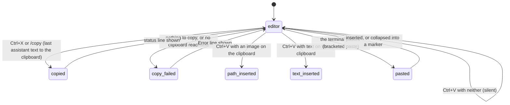

# Clipboard

## Summary

pi touches the system clipboard in two directions and through three doors. Out: Ctrl+X or `/copy` puts the text of the last assistant message on the clipboard, and Ctrl+X in `/tree` does the same for the selected entry. In: Ctrl+V (Alt+V on Windows) reads the clipboard itself, writing an image to a temp file and inserting its path, or inserting the clipboard's text at the cursor. And the terminal's own paste (Cmd+V, Ctrl+Shift+V, middle-click, a dropped file) arrives as a bracketed paste that the editor cleans up, collapses when large, and inserts. There is no selection inside pi and nothing else can be copied from inside it; the terminal's own mouse selection is how any other part of the screen is copied. This document owns every one of those paths, including how the clipboard is reached on each platform and over SSH.

Copy and paste are available whenever the editor is, including while the agent is working. Copy is silent about how it reached the clipboard; paste is silent when it fails.

## The simple case

The model has just answered with a code block. The user presses Ctrl+X. A dim status line `Copied last agent message to clipboard` appears under the transcript, and the whole text of the answer, code block and all, is on the clipboard ready to paste into their editor.

They take a screenshot, which macOS puts on the clipboard, and press Ctrl+V in pi's editor. `/var/folders/…/T/pi-clipboard-9b1d….png` appears at the cursor. They type ` what is this dialog?` and press Enter; the model reads the file.

They copy a stack trace from a browser and press Cmd+V in the terminal. The editor shows `[paste #1 +38 lines]`; on Enter the full trace is sent.

## Copy and paste, path by path

### Ctrl+X and `/copy`

Both copy the text of the most recent assistant message on the current branch: the text blocks only, joined, trimmed; thinking and tool calls are not included. An assistant message that was aborted before producing anything is skipped in favour of the one before it. The session's own messages are used, so the last message of a resumed session copies too.

- Success: the status message `Copied last agent message to clipboard`.
- No assistant message yet: `Error: No agent messages to copy yet.`
- The clipboard could not be reached: `Error: Failed to copy to clipboard` (or a more specific message from the platform tool).

`/copy` is a built-in slash command and runs at once even while the agent is working (see [busy state](busy-state.md)); while a response is streaming it copies the previous complete message, not the one in progress. In fullscreen mode the shortcut flashes `Copied!` instead of adding a status line.

### Ctrl+X in `/tree`

With the tree overlay open, Ctrl+X copies the text of the highlighted entry: a user message's text, an assistant message's text, a shell record's command and output. `Copied selected message to clipboard` on success; `Error: Selected entry has no text to copy` for entries with nothing textual (a model change, a label). The overlay stays open.

### How the clipboard is written

pi tries, in order, until one works:

- **macOS:** the built-in clipboard binding, then `pbcopy`.
- **Windows:** the built-in binding, then `clip`.
- **Linux:** never the built-in binding (it does not hold the clipboard on Wayland). Termux: `termux-clipboard-set`. Wayland (`WAYLAND_DISPLAY` set): `wl-copy`; if that fails and an X display exists, `xclip`, then `xsel`. X11: `xclip`, then `xsel`. With no display and no tool, nothing works locally.
- **Over SSH or mosh** (`SSH_CONNECTION`, `SSH_CLIENT`, or `MOSH_CONNECTION` set): the local attempt above is made first (it writes the remote machine's clipboard, if it has one), and then the text is also sent to the terminal as an OSC 52 clipboard write, which terminals such as Kitty, Ghostty, WezTerm, iTerm2 (when its "allow clipboard access" option is on), Alacritty, and Windows Terminal apply to the user's own clipboard. Whether OSC 52 is honoured is invisible to pi, so `Copied last agent message to clipboard` is shown over SSH even when the terminal ignored it.
- **Anywhere**, when every local attempt failed, OSC 52 is tried as the last resort.

OSC 52 is not attempted for text over about 75 KB (100,000 characters once encoded); a very long message over SSH then reports success only if the remote clipboard took it, otherwise `Failed to copy to clipboard`. Each platform tool is given five seconds.

> Technical note: the native binding is written first and OSC 52 after it, not the other way round, because some terminals react to OSC 52 by writing the native clipboard themselves, racing the binding, and very large OSC 52 payloads can desynchronise the terminal's rendering.

### Ctrl+V and Alt+V

The `app.clipboard.pasteImage` action, bound to Ctrl+V (Alt+V on Windows, where Ctrl+V is the console's own paste). It is checked before any other key, so it works even with the autocomplete popup open. It reads the clipboard in two steps:

1. **An image.** If the clipboard holds an image, pi writes it to the system temp directory as `pi-clipboard-<uuid>.png` (or `.jpg`, `.webp`, `.gif`, matching the clipboard's format) and inserts that absolute path at the cursor. The file is never deleted.
2. **Otherwise text.** The clipboard's text is inserted at the cursor as typed: one undo step, history browsing ended, the autocomplete popup closed, line endings normalised, tabs expanded to four spaces. It does not go through the paste path, so there is no large-paste marker however long it is, and no control-character filtering.
3. **Neither**, or no clipboard access: nothing happens and nothing is said.

How the image is read:

- **macOS, Windows:** the built-in binding, which always delivers PNG.
- **Linux, Wayland or WSL:** `wl-paste`, preferring PNG, then JPEG, WebP, GIF, then any image type it lists; then `xclip`. On WSL, if neither finds an image, PowerShell reads the Windows clipboard (so a `Win+Shift+S` screenshot pastes) and the result is PNG.
- **Linux, X11:** the built-in binding, then `xclip` trying each supported type in turn.
- **Termux:** never; image paste is unavailable.
- An image in another format (a BMP from WSLg, for instance) is converted to PNG before writing; if conversion is unavailable the image is treated as absent and the text step runs.

How the text is read: on Wayland, `wl-paste`; elsewhere the built-in binding, which is absent on Termux and on Linux without a display, in which case Ctrl+V inserts nothing.

### The terminal's paste

Everything the terminal itself pastes (Cmd+V on macOS, Ctrl+Shift+V or Shift+Insert on Linux and Windows, middle-click, tmux's paste-buffer, a file dragged onto the window) arrives wrapped in bracketed-paste markers, because pi turns bracketed paste on at startup. The editor collects the whole paste before acting, so a paste split across several reads is still one paste. Then:

- Control bytes that tmux re-encoded as key sequences are decoded back; line endings are normalised; tabs become four spaces; other control characters are dropped.
- A dropped file's path (anything starting with `/`, `~`, or `.`) gets a space in front when the cursor is directly after a word character, so `look at` plus a drop does not become `look at/Users/…`.
- More than 10 lines or more than 1,000 characters: collapsed into `[paste #1 +42 lines]` or `[paste #1 1234 chars]`. The marker moves as one character, Backspace removes it whole, and the content is restored on submit. Several markers are numbered in order and renumbered when one is removed.
- A single line is inserted atomically without triggering autocomplete; several lines are inserted as they are.
- The paste is one undo step, ends history browsing, and closes the autocomplete popup.

A paste while an overlay is open goes to the overlay (its search field, where it has one), not the editor.

### Right-click

In regular mode pi does not track the mouse. A right-click does whatever the terminal does with it: paste in many Linux terminals and Windows Terminal, a context menu in iTerm2 and Apple Terminal. A right-click paste from the terminal is an ordinary bracketed paste. Only in fullscreen mode, where pi owns the mouse, does pi read the clipboard itself on right-click and feed it to the focused component as a synthesised bracketed paste.

### What cannot be copied

There is no selection inside the editor and no copy of editor text (the editor's `tui.input.copy` binding on Ctrl+C is shadowed by clear; see [input](../foundations/input.md)). Tool output, user messages, thinking, shell command output, and the footer can only be copied with the terminal's own selection (mouse drag or the terminal's copy mode), which works normally in regular mode because pi leaves the mouse alone; the selection copies what is on screen, including the box borders and collapsed `... N more lines` lines. Whole conversations are better taken out with `/export` ([export, import, and share](../sessions/export-import-share.md)). Images cannot be copied out of pi at all.

Inside tmux the terminal's selection is tmux's copy mode, and tmux's own clipboard handling (`set-clipboard`) decides whether what is copied reaches the system clipboard; pi's Ctrl+X bypasses tmux entirely by writing the clipboard with the platform tool, and only the OSC 52 fallback passes through tmux.

## Modifiers

| Modifier | Set before sending | Changed while working |
| --- | --- | --- |
| Model | No effect on copying. A pasted image path is only useful with a model that accepts images; see [attachments](../conversation/attachments.md). | No effect. |
| Thinking level | No effect; thinking text is never copied. | No effect. |
| Agent busy | Idle: Ctrl+X copies the last complete message. | Working: Ctrl+X copies the previous complete message, not the streaming one; paste goes into the editor as usual and Enter queues. |
| Attachments | Ctrl+V with an image produces the path; the terminal's paste of an image (where a terminal even allows it) produces nothing usable. | No effect. |
| Session kind | No effect; the copied text comes from the in-memory session in both kinds. | No effect. |

## Cancel and interrupt

| Event | Copy | Paste |
| --- | --- | --- |
| Escape (once; twice within 500 ms) | No effect; a copy cannot be cancelled and completes in well under the five-second tool timeout. | No effect on pasted text; a bracketed paste in progress cannot be interrupted. |
| Ctrl+C once / twice; Ctrl+D | No effect on the clipboard. | Ctrl+C clears the editor including pasted text and markers; the temp file of a pasted image remains. |
| Another message submitted (Enter; Alt+Enter follow-up) | No effect. | Enter sends the text with markers expanded; Alt+Enter likewise into the follow-up queue. |
| A slash command or shortcut that opens an overlay or changes the session | `/copy` runs while an overlay is open only if typed before it opened. Ctrl+X in `/tree` copies the selected entry. A session switch changes which message is "last". | A paste goes to the open overlay. |
| Model or thinking level changed | No effect. | No effect. |
| Provider error, rate limit, timeout, or network lost | No effect. | No effect. |
| Context window exhausted (auto-compaction) | The last assistant message is unchanged by compaction, so Ctrl+X copies the same text. | No effect. |
| Terminal resized; pi suspended (Ctrl+Z) and resumed | No effect. | A paste arriving while suspended goes to the shell, not pi. |
| Process ends: terminal closed (SIGHUP), SIGTERM, killed | What was copied stays on the clipboard. | Pasted but unsent text is lost; clipboard image temp files remain. |
| Session or files changed from outside | No effect. | A pasted image path whose file has been deleted fails when the model reads it. |
| Credentials lost, or logged out | No effect. | No effect. |

## Interactions with other systems

**Session persistence.** Nothing about copying is recorded. A pasted image enters the session only as its path in the user message; the image data enters when the model reads it (see [attachments](../conversation/attachments.md)).

**Branching and history.** "Last assistant message" means the last on the current branch; after `/tree` moves the active position, Ctrl+X copies the message at the new position. Pasted text is in the prompt history once submitted.

**Compaction.** No interaction.

**Context files and the system prompt.** No interaction.

**Settings and keybindings.** `app.message.copy` (Ctrl+X), `app.clipboard.pasteImage` (Ctrl+V; Alt+V on Windows). No setting changes where the clipboard is read or written.

**Tools and the working directory.** The temp file from an image paste is in the system temp directory, not the working directory; the model reads it by absolute path.

**Terminal and rendering.** Bracketed paste, OSC 52, and right-click behaviour are the terminal's; see [the terminal](the-terminal.md). A paste of text that contains escape sequences has them stripped.

**Credentials and providers.** The login dialog's sign-in URL is printed so it can be copied with the terminal's selection; there is no copy shortcut for it.

## Edge cases

- Ctrl+X right after Escape aborted a response copies the aborted message's partial text if it had any, and the previous message if it had none.
- Ctrl+V with an image and the cursor directly after a word inserts the path with no space before it, unlike a dropped path, because the auto-space rule lives in the paste path.
- Ctrl+V text containing a line with only `!` does not enter bash mode unless it lands at the very start of the editor.
- Pasting into the editor while browsing history makes the recalled entry plus the paste the new draft.
- A paste of exactly 10 lines or exactly 1,000 characters is inserted in full; the marker needs more than either.
- On Linux with both Wayland and X11 available, text is read from Wayland first, so a stale X11 clipboard is ignored; if the Wayland clipboard is empty, nothing is pasted rather than falling back to the stale X11 text.
- The WSL PowerShell fallback writes and deletes a `pi-wsl-clip-<uuid>.png` in the temp directory on every Ctrl+V that reaches it.
- Two pi processes in the same session directory share nothing about the clipboard; the system clipboard is the system's.

## Open questions and verification

- The Termux documentation says text is read with `termux-clipboard-get`, but the text-reading path has no Termux branch: the built-in binding is disabled on Termux and `wl-paste` is not present, so Ctrl+V on Termux inserts nothing. May be worth treating as a bug rather than documenting.
- Over SSH, `Copied last agent message to clipboard` is shown whenever OSC 52 was emitted, whether or not the terminal honoured it; there is no way for pi to know. Documented as is; may be worth a different message over SSH.
- Ctrl+V text insertion bypassing the large-paste marker and control-character filter was read from the insertion path and not observed.
- Whether the built-in clipboard binding on macOS returns a JPEG from a clipboard holding a JPEG file, or always PNG, was not determined; the temp file extension follows what it reports.
- Which terminals paste on right-click in regular mode was not surveyed; the fullscreen synthesised paste is covered by a test and out of scope here.
- The `Error: Failed to copy to clipboard` wording appears when every path fails; platform tools may surface their own message instead. Not observed.
- Clipboard image temp files accumulate without cleanup. May be worth treating as a bug rather than documenting (also noted in [process lifecycle](process-lifecycle.md)).

Verified against pi-mono commit `a69bef789`.
