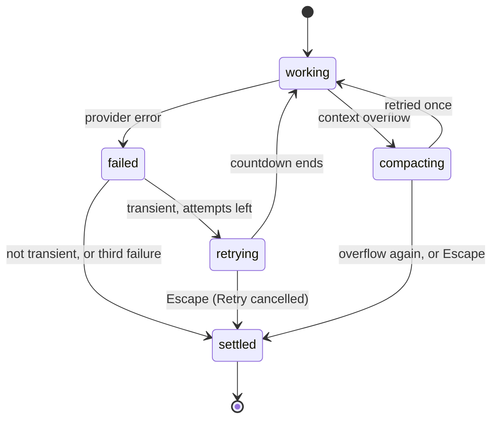

# Errors and retries

## Summary

Everything that goes wrong in pi is shown in one of four places: an `Error:` or `Warning:` line in the transcript, an error line at the end of the assistant message that failed, the error tint on a tool or shell box, or the retry countdown in the status line. Nothing pops up and nothing needs dismissing. This document lists every error the user can meet in the default configuration, how it looks, what pi does next on its own (retry, compact, nothing), what the user can do, and what is written to the session. The turn-level definitions (working, settled, abort, retry) are in [the turn](../foundations/the-turn.md); this document is the catalogue.

The one automatic recovery is the retry: a model call that fails with a transient error is tried again up to three times, after 2, 4, and 8 seconds, with the context unchanged. Quota and billing errors, credential errors, and anything pi does not recognise fail at once. Context overflow is handled by compaction rather than by the retry, and only once.

## The simple case

The model is mid-response when the provider returns an overloaded error. The assistant message stops growing and ends with a line in the error colour: `Error: overloaded_error` (whatever text the provider sent). The status line changes from `Working... (escape to interrupt)` to `Retrying (1/3) in 2s... (escape to cancel)` with the spinner in the warning colour, and the seconds count down. At zero the status line reads `Working...` again and a fresh assistant message starts below the failed one, from the same context. It streams to completion; the turn settles as if nothing had happened, except that the failed block stays in the transcript above the good one and the footer's cost includes both.

Had the second and third attempts failed too, the status line would have counted `(2/3) in 4s` and `(3/3) in 8s`, and after the third failure a line `Error: Retry failed after 3 attempts: overloaded_error` would have appeared and the turn would have settled with no answer. The prompt is still in the session; the user can press Up, recall it, and send it again.

## Errors, one by one

### Quick reference

What pi does with a failed model call depends only on the error's text:

| The error text says | Class | What happens |
| --- | --- | --- |
| `overloaded`, `rate limit`, `too many requests`, `429`, `500`, `502`, `503`, `504`, `524`, `service unavailable`, `server error`, `internal error` | Transient | `Retrying (n/3)…`, up to three times |
| `connection refused`, `connection lost`, `fetch failed`, `getaddrinfo`, `ENOTFOUND`, `EAI_AGAIN`, `socket hang up`, `other side closed`, `terminated`, `timeout`, `timed out`, `websocket closed` | Transient | Same |
| `stream ended before message_stop`, `ended without`, `http2 request did not get a response`, `you can retry your request`, `try your request again`, `retry delay` | Transient | Same |
| `insufficient_quota`, `quota exceeded`, `billing`, `out of budget`, `available balance`, `Monthly usage limit reached`, a provider usage-limit error type | Quota | Fails at once; checked before the transient list |
| `prompt is too long`, `request_too_large`, `exceeds the context window`, `maximum context length`, `too many tokens`, and each provider's equivalent | Overflow | Compact and retry the call once |
| Anything else (`invalid_api_key`, `not found`, a validation message) | Unknown | Fails at once with its text |

An aborted call is never retried. A stop reason of length is not an error. A credential error raised by pi itself (`No API key found for …`) is unknown, not transient.

### The retry, second by second

At the moment of failure the assistant block stops and gains its `Error:` line; the status line switches to `Retrying (1/3) in 2s... (escape to cancel)` with a warning-coloured spinner. One second later it reads `in 1s`. When the delay elapses, the line becomes `Working... (escape to interrupt)` and a new assistant block starts below the failed one. If that fails, `Retrying (2/3) in 4s...` counts `4s, 3s, 2s, 1s`; then `(3/3) in 8s` counts from `8s`. After the third attempt's failure the status line clears, `Error: Retry failed after 3 attempts: <message>` is added, and the editor is idle. The whole sequence, if every attempt fails instantly, takes about 14 seconds plus the three calls.

### Refused prompts

These fail before anything is sent; the prompt is not in the session, the editor is emptied, and the text is in the prompt history.

- **No model selected.** `Error: No model selected.`, a blank line, `Use /login to log into a provider via OAuth or API key. See:` with two documentation paths, and `Then use /model to select a model.` Happens with no credentials at all (the footer shows `no-model`).
- **No credential for the model's provider.** `Error: No API key found for <provider>.` followed by the same login help. For a provider logged in with OAuth whose token cannot be refreshed: `Error: Authentication failed for "<provider>". Credentials may have expired or network is unavailable. Run '/login <provider>' to re-authenticate.`
- **Compaction in progress.** Not an error the user normally sees: Enter during compaction goes to the holding queue with `Queued message for after compaction`. The refusal `Cannot submit a prompt while compaction is in progress. Wait for compaction to finish and retry.` exists for programmatic callers and surfaces in the terminal only as `Error: Failed to send queued message: …` if the holding queue is flushed at a bad moment, in which case the messages go back into the holding queue.
- **Setting the model to one without a credential** (`/model <id>` or Ctrl+P onto it): `Error: No API key for <provider>/<id>`; the model is unchanged.
- **An unknown thinking level** (`/thinking foo`): `Error: Unknown thinking level "foo". Available levels: off, minimal, …`.

### Provider errors mid-turn

When a model call fails, the assistant message in progress is ended with the failure. If it had no tool calls, `Error: <provider message>` is appended under whatever text had streamed; if it had tool calls, each unfinished tool box takes the error tint and shows the message instead. The message is written to the session with its error. Then one of three things happens:

- **Transient.** The error text matches pi's transient list (see the glossary's *transient error*: overloaded, rate limit, too many requests, a 429, 500, 502, 503, 504, or 524 status, service unavailable, server or internal error, connection refused, reset, or lost, `fetch failed`, a DNS failure such as `getaddrinfo ENOTFOUND` or `EAI_AGAIN`, socket hang up, a timeout, `terminated`, a stream that ended before its end marker, or explicit provider advice to retry). The status line shows `Retrying (n/3) in Ns... (escape to cancel)`, counting whole seconds down from 2, 4, or 8. When it reaches zero, the context is re-sent unchanged: the failed message is dropped from what the model sees but stays in the session file. The counter resets whenever an attempt succeeds, so a turn with several tool-call rounds can retry three times at each round.
- **Not transient.** The text matches the quota list (`insufficient_quota`, `quota exceeded`, `billing`, `out of budget`, `available balance`, `Monthly usage limit reached`, or a provider's usage-limit error type) or matches nothing pi knows (`invalid_api_key`, a malformed request, an unknown model). No retry: the turn settles at once with the `Error:` line already shown. A quota error that also says `429` is still not retried; the quota list is checked first.
- **Third failure.** `Error: Retry failed after 3 attempts: <provider message>` is added as a separate transcript line and the turn settles. The three failed messages are all in the session.

Escape during the countdown cancels it: `Error: Retry failed after N attempts: Retry cancelled`, where N is the attempt that was waiting. Escape during the retried attempt itself is an ordinary abort, and the aborted message reads `Aborted after N retry attempts` instead of `Operation aborted`. Queued steering and follow-up messages survive a retry and are delivered when it succeeds; after a final failure a leftover queue is delivered by a fresh model call (see [the message queue](../conversation/the-message-queue.md#open-questions-and-verification)).

> Technical note: the retry is pi's own, above the provider SDK; `retry.provider.maxRetries` is 0 by default so the SDK does not retry underneath it. The transient decision is a case-insensitive text match, so a provider whose wording is not on the list fails at once even when the cause was transient; the regression tests for `Network connection lost.`, `getaddrinfo ENOTFOUND`, and `you can retry your request` are additions to that list.

### Rate limits and quotas

A rate limit (`rate_limit_error`, `429 Too Many Requests`, `overloaded`) is transient and retried after 2, 4, and 8 seconds, which is usually long enough for a per-minute limit and never for a per-day one. A provider that asks for a longer wait than `retry.provider.maxRetryDelayMs` (60 seconds) fails at once with a message mentioning the retry delay, which is itself transient and retried three times. A quota, budget, balance, or billing error fails at once with its text; pi does not wait on it. Switching provider with Ctrl+P or `/model` and pressing Up, Enter is the user's recovery.

### The idle timeout

A model call whose stream goes silent for five minutes (`httpIdleTimeoutMs`, default 300000; `disabled` turns it off) is ended with a timeout error. Its text contains `Timeout`, so it is transient and retried. The user sees `Working...` for five minutes with nothing streaming, then the `Error:` line and the countdown. Nothing warns earlier; there is no elapsed-time counter.

### Network loss

If the network drops mid-call, the stream ends with a transport error (`fetch failed`, `terminated`, `socket hang up`, `other side closed`, `Network connection lost.`) and is retried. If DNS fails (`getaddrinfo ENOTFOUND`, `EAI_AGAIN`), the same. pi does not wait for connectivity to return: three attempts take about 14 seconds in total, after which the turn fails with `Error: Retry failed after 3 attempts: …`. A prompt sent with no network fails the same way on its first call. Tools do not need the network, so a `bash` tool call in progress finishes normally and its result is sent when the next call succeeds.

### Context overflow

When the provider rejects a call because the context is too large (each provider's wording is recognised, from Anthropic's `prompt is too long` to a bare `413`), or accepts it but reports more input tokens than the window holds, the failed message is dropped from the context and the status line shows `Context overflow detected, Auto-compacting... (escape to cancel)`. The transcript is rebuilt with the `[compaction]` box in place and the same call is made once more. If that call overflows too, the turn settles with `Context overflow recovery failed after one compact-and-retry attempt. Try reducing context or switching to a larger-context model.` in the error colour (without an `Error:` prefix; see "Open questions"). Escape during the compaction prints `Auto-compaction cancelled` and the turn settles failed. A response that succeeded but left the context over the window compacts after the turn without a retry.

### The length stop

A response cut off at the provider's output limit ends with `Response was truncated before completion.` in the error colour. It is not an error for retry purposes: any tool calls in it are not run and each gets an error result telling the model its arguments may be truncated, and the model is called again. If the limit was lower than the model's own maximum, pi treats it as recoverable and compacts once before the call, as for an overflow.

### Tool errors

A tool that fails (a file that does not exist, a command that exits non-zero, an edit whose old text is not found, an argument that does not validate) does not end the turn. Its box takes the error tint and shows the tool's message; the result is sent to the model, which usually tries something else. A tool killed by an abort shows `Operation aborted`. A tool that threw unexpectedly shows the exception text. None of these produce an `Error:` transcript line.

### Shell command failures

A `!` command that exits non-zero shows `(exit N)` in the error colour after its output and is recorded with the code. A command that cannot start (the working directory is gone, no shell is found on Windows) completes its box with no exit code and adds `Error: Bash command failed: <reason>`. A second `!` while one runs is refused with `Warning: A bash command is already running. Press Esc to cancel it first.` See [shell commands](../conversation/shell-commands.md).

### Compaction and branch-summary failures

- Manual `/compact` cancelled with Escape: `Error: Compaction cancelled`. Automatic compaction cancelled: the status message `Auto-compaction cancelled`.
- Nothing to do: `Error: Nothing to compact (session too small)` or `Error: Already compacted`.
- The summarization call fails with a transient error: `Error: <provider message>` is added, the status line shows the same `Retrying (n/3) in Ns...` countdown, and on the next attempt the compaction indicator returns. Three failures end it: manual, `Error: Compaction failed: <message>`; automatic, `Auto-compaction failed: <message>` or `Context overflow recovery failed: <message>` in the error colour with no prefix. A non-transient error (quota) ends it at once.
- A branch summary cancelled with Escape: `Branch summarization cancelled`, and the tree reopens at the same entry. A branch summary that fails: `Error: <message>`, and the navigation does not happen.
- No model selected when compacting: the same `No model selected.` text as a refused prompt.

### Login and logout failures

Escape anywhere in the login dialog abandons it silently; nothing is printed. A failed OAuth flow prints `Error: Failed to login to <Provider>: <reason>`; a failed API-key save, `Error: Failed to save API key for <Provider>: <reason>`. A login that saved the credential but could not refresh the model list prints `Error: Logged in to <Provider>, but local model state could not be synchronized: …`; the credential is kept. A successful login whose provider has no usable default model prints the success status and then `Error: Logged in to <Provider>, but … Use /model to select a model.` `/logout` failures print `Error: Logout failed: <reason>`; a logout that could not read the store, `Error: Could not read stored credentials: …`.

### Startup diagnostics and warnings

Printed into the transcript, under the header, before the first prompt: each startup diagnostic as an `Error:`, `Warning:`, or status line (in the default configuration these come from a malformed settings file or an invalid `--models` pattern); `Warning: Migrated credentials to auth.json: <providers>` once after an upgrade; `Error: models.json error: …` if that file exists and is broken; `Warning: Could not restore model <provider>/<id>` when a resumed session's model is no longer available, or `Warning: No models available. Use /login …` when nothing is; a warning about tmux key handling when pi detects it is needed; an `Update Available` box when a newer pi exists; and `Session compacted N times` when resuming a compacted session. These are screen-only and disappear on the next transcript rebuild.

### Crashes

An exception nobody caught (in the default configuration, a bug in pi itself) restores the terminal, prints `pi exiting due to uncaughtException:` followed by the error and its stack to the terminal, and exits with code 1. No resume hint is printed, but the session file holds everything written up to that point. A terminal that has gone away (writes fail with EIO or EPIPE) exits with code 129 and no cleanup at all. A session that cannot be created or imported prints `Error: Failed to create session: …` or `Error: Failed to import session: …` and exits with code 1.

### What is persisted

| Event | In the session file | Screen only |
| --- | --- | --- |
| A refused prompt | Nothing | The `Error:` lines |
| A failed model call, each retry attempt | The assistant message with its error and, for tool-call messages, nothing for the tools | The `Error:` line under it; the countdown |
| `Retry failed after N attempts`, `Retry cancelled` | Nothing beyond the failed messages | The `Error:` line |
| An aborted message | The partial message marked aborted; `Operation aborted` tool results | The abort line |
| A tool error | The tool result, marked as an error | The box tint |
| A shell command failure | The shell record with its exit code or cancelled flag | `(exit N)`, `Error: Bash command failed` |
| A compaction that failed or was cancelled | Nothing | The error or status line |
| Startup warnings, login errors, crashes | Nothing | Everything |

A resumed session therefore shows the failed attempts again as assistant blocks with their error text, but none of the `Error:` or `Warning:` lines that accompanied them.

## Modifiers

| Modifier | Set before sending | Changed while working |
| --- | --- | --- |
| Model | Decides which provider's wording arrives; the transient lists are provider-neutral. A model whose provider has no credential is refused before sending. | A model changed during the countdown is used by the retried call; a failed attempt's error is judged against the model that produced it, so an overflow on a small-context model does not compact after switching to a larger one. |
| Thinking level | No effect on errors. | No effect. |
| Agent busy | Idle: refusals are shown at once. Working: a submitted prompt is queued and any error it meets happens when it is delivered. | Errors during the retry countdown, compaction, and branch summarization are described above; the matrix of what the user can do meanwhile is [busy state](busy-state.md). |
| Attachments | A model that cannot take images drops them with a note to the model rather than failing. An `@file` that does not exist on the command line fails at startup before the TUI. | No effect. |
| Session kind | Saved: failed attempts are written. Ephemeral: nothing is, and a crash loses everything. | No effect. |

## Cancel and interrupt

| Event | During a retry countdown | During any other error |
| --- | --- | --- |
| Escape (once; twice within 500 ms) | Cancels the retry: `Error: Retry failed after N attempts: Retry cancelled`; the turn settles; the queue is not returned to the editor. A second Escape on an empty editor opens the tree. | An `Error:` line is not cancellable; Escape does whatever the state allows (abort, cancel compaction, nothing). |
| Ctrl+C once / twice; Ctrl+D | Ctrl+C clears the editor; twice, or Ctrl+D, quits: the retry is cancelled silently and the failed attempts are already in the file. | Same. |
| Another message submitted (Enter; Alt+Enter follow-up) | Queued as a steering message or follow-up; delivered with the retried call. | After a final failure: sent as a new prompt, idle. |
| A slash command or shortcut that opens an overlay or changes the session | Overlays open over the countdown. `/new`, `/fork`, `/clone`, `/resume`, `/import`, `/tree` elsewhere, and `/compact` cancel the retry, then act. `/reload` is refused. | As in [busy state](busy-state.md). |
| Model or thinking level changed | Applies to the retried call. | Applies to the next prompt. |
| Provider error, rate limit, timeout, or network lost | The retried call can fail again; the counter advances. | This document. |
| Context window exhausted (auto-compaction) | An overflow on the retried call is handled as an overflow, not as a fourth retry. | Overflow recovery is once per turn; a second overflow fails the turn. |
| Terminal resized; pi suspended (Ctrl+Z) and resumed | The countdown continues unseen; on `fg` the status line shows where it got to. | Redraw only. |
| Process ends: terminal closed (SIGHUP), SIGTERM, killed | Orderly signals cancel the retry and write the aborted state. A kill loses nothing more: the failed attempts were written as they happened. | Same. |
| Session or files changed from outside | No effect. | No effect. |
| Credentials lost, or logged out | The retried call fails with a credential error, which is not transient: the turn settles with `Error: No API key found for <provider>.` or the OAuth text. | A credential error is never retried. |

## Interactions with other systems

**Session persistence.** Failed attempts are ordinary assistant entries with a stop reason of error and the provider's text; `/tree` lists them and `/session` counts them in the message totals and in cost. `Error:` and `Warning:` lines are not entries and do not survive a rebuild.

**Branching and history.** Failed and aborted assistant messages stay on the branch but are excluded from what the model is sent, so the model sees the user message followed by the next user message. Forking from a user message before a failure carries the failure along in the file but not in the context.

**Compaction.** Overflow recovery is a compaction with a single retry; threshold compaction after a failed turn estimates the context from the last successful response so a session stuck on persistent provider errors can still compact. Summarization calls use the same retry budget and the same countdown as the turn.

**Context files and the system prompt.** No interaction.

**Settings and keybindings.** `retry.enabled` (default `true`), `retry.maxRetries` (3), `retry.baseDelayMs` (2000) shape the countdown; `retry.provider.maxRetryDelayMs` (60000) caps a provider-requested wait; `retry.provider.maxRetries` (0) and `retry.provider.timeoutMs` are passed to the SDK; `httpIdleTimeoutMs` (300000) is the idle timeout, also in `/settings`; `compaction.enabled` turns overflow recovery off with the rest of compaction. `app.interrupt` (Escape) cancels the countdown.

**Tools and the working directory.** Tool errors are the model's problem, not the user's: they are sent back and the turn continues. A tool killed by an abort may leave a file partly written.

**Terminal and rendering.** The retry spinner is in the warning colour; error text is in the error colour; tool boxes use the error background tint. An `Error:` line is padded like a message (`outputPad`); a `Warning:` line always has one column of padding.

**Credentials and providers.** Credential errors are decided per model call, never retried, and fixed by `/login`. The Anthropic subscription warning (`Warning: …`) is shown at most once per run when an Anthropic OAuth credential is in use; it is a warning, not an error.

## Edge cases

- An error text that matches neither list (`invalid_api_key`, `model not found`, a 400 with a validation message) fails at once with that text; pi does not guess that it might be transient.
- `Retrying (1/3) in 2s...` starts at the ceiling of the delay, so the first countdown reads `2s`, `1s`, then the attempt starts; it never shows `0s`.
- A turn in which attempt 2 succeeds and a later tool-call round fails again starts a fresh `(1/3)`; the counter is per failure run, not per turn.
- `Error: Retry failed after 3 attempts: …` is a separate line below the third failed message's own `Error:` line, so the final failure is shown twice with the same text.
- A compaction that retries prints `Error: <message>` for every failed attempt even when the compaction eventually succeeds; the lines stay in the transcript above the `[compaction]` box until the next rebuild.
- A prompt submitted during the countdown is delivered with the retried call, so a user who types a correction while waiting sees it answered together with the original.
- Escape during the countdown does not return the queue to the editor; Alt+Up before Escape does.
- With `retry.enabled` off, every provider error settles the turn at once with its `Error:` line and no countdown.
- The `Response was truncated before completion.` line is shown even for a message whose tool calls will be re-issued; it is not an error for the retry counter.
- A `models.json error` at startup is shown once and the file is ignored for the run.
- A failed attempt that had streamed some text keeps that text on screen above its `Error:` line; the retried attempt starts a fresh block, so the user may read the same opening paragraph twice.
- A failed attempt that had begun a tool call shows the error in the tool box rather than under the text, and the box stays in the error tint after the retry succeeds.
- Overflow recovery and the retry are independent counters: a turn can overflow once (compact, retry) and then meet three transient failures on the retried call.
- A provider error during a branch summary does not abort the navigation by itself; after the retries fail, the error is shown and the active position stays where it was.
- An error whose text is empty is shown as `Error: Unknown error`, and `Retry failed after N attempts: Unknown error` if it was transient by some other wording.
- The footer's context percentage shows `?` after an overflow compaction until the retried call responds, and keeps the last good figure after a retry that did not compact.

## Open questions and verification

- The on-screen fate of a failed attempt (the failed assistant block stays, ending with `Error: <message>`, and the next attempt streams in below it) is read from the code and agreed with [sending a prompt](../conversation/sending-a-prompt.md#cancel-and-interrupt); it still needs a hand check with a real provider error.
- The exact provider wordings (`overloaded_error`, `rate_limit_error`, the Anthropic 529 text) were not observed; the examples here are from the tests and the classifier's comments.
- The idle timeout's error text was read from the HTTP layer's timeout classes (`Headers Timeout Error`, `Body Timeout Error`) and assumed to contain `Timeout`; whether the provider SDK rewraps it into something that still matches the transient list was not confirmed. Also unconfirmed: whether five silent minutes is counted from the last byte or from the start of the request.
- Overflow recovery's failure text, `Auto-compaction failed: …`, and `Context overflow recovery failed: …` are added as plain error-coloured text without the `Error:` prefix that every other error has, while the manual path uses the prefix. May be worth treating as a bug rather than documenting.
- The double display of the final error (once under the message, once as `Retry failed after 3 attempts`) was read from two code paths and not observed; may be worth treating as a bug rather than documenting.
- Whether a provider-requested retry delay over 60 seconds produces a transient error (its text contains `retry delay`, which is on the list) and therefore three more 2/4/8-second attempts, each of which is told to wait again, was read from the classifier and not observed.
- The "length stop with tool calls compacts first" path (recoverable length) was read from the compaction check and not observed with a provider.
- What the user sees when the crash handler itself runs during shutdown (exit 1 with no message) was not tried.
- Whether `Warning: Could not restore model …` is shown for a resumed session whose provider credential was removed, or only when the model id is gone from the catalogue, was not determined.
- Startup diagnostics in the default configuration were inferred to be limited to settings and `--models` problems; a full list of what can produce one was not compiled.

Verified against pi-mono commit `a69bef789`.
