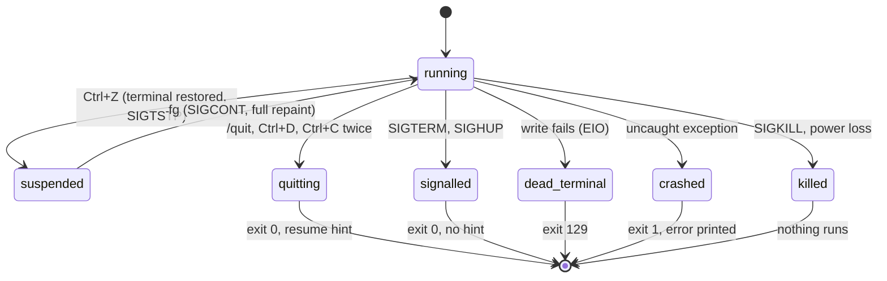

# Process lifecycle

## Summary

pi is one process that owns the terminal from start to exit. This document describes what happens to that process when something other than a normal quit ends or pauses it: Ctrl+Z to suspend and `fg` to come back; a SIGTERM from `kill` or a SIGHUP from a closed window; a terminal that has vanished; an internal crash; and a hard kill that gives pi no chance to do anything. For each it says what the user sees, what is left on disk, what happens to processes pi started, what state the terminal is left in, and which exit code the shell reports. The orderly quit (`/quit`, Ctrl+D, Ctrl+C twice) is described in [quitting](../sessions/quitting.md); it is summarised here only as the baseline the other exits are compared to.

The rule that makes most of this simple: the session file is appended one complete line at a time, the moment each message completes (see [sessions](../foundations/sessions.md)). Whatever kind of exit happens, the file holds everything up to the last completed entry and nothing half-written.

## The simple case

The user is waiting on a long response and wants their shell for a moment. They press Ctrl+Z. pi's bottom block stops updating, the terminal's cursor reappears, and the shell prints `[1]+  Stopped                 pi` and its prompt. They run a command or two, then type `fg`. The screen redraws in full: the transcript, the editor with the text they had been typing, and the footer, with the response having caught up with everything that arrived in the meantime. Nothing was lost and nothing was sent.

Later they close the terminal window while pi is still open. pi gets SIGHUP, ends the turn, and exits. The next `pi -c` in that directory reopens the session with every completed message in place.

## Suspend, signals, crashes, and kills

### The baseline: an orderly quit

`/quit`, Ctrl+D on an empty editor, or Ctrl+C twice within 500 ms. pi stops listening for input and waits up to one second for any keys still in flight (it stops early after 50 ms of silence), restores the terminal, then disposes the session: the turn in progress is aborted (without waiting for the aborted message to be written), extensions are told to shut down, and running shell processes end with it. Then the resume hint is printed below the last frame and the process exits with code 0. The transcript stays in the terminal's scrollback exactly as it was drawn; the editor and footer remain on screen as the last frame, followed by `To resume this session: pi --session <id>`.

> Technical note: the one-second drain exists because a terminal speaking the Kitty protocol may still be sending key-release events for the keys that triggered the quit; without the drain they would land in the shell as stray characters. The terminal is restored before extensions are disposed so that extension cleanup cannot repaint over the final frame.

### Ctrl+Z and `fg`

Ctrl+Z (the `app.suspend` action; unbound on Windows) is read by pi as a key, not by the terminal as a signal, and pi suspends itself. The terminal is restored first: raw mode off, the cursor shown, bracketed paste and the keyboard protocol switched off, the progress indicator cleared. Then pi stops its own process group. The shell prints its `Stopped` line and a prompt; pi's last frame stays on screen above it.

While suspended nothing in pi runs. A model response in progress is not cancelled; its data waits in the connection and is read when pi resumes, so the transcript catches up on `fg`. Shell commands started by the user or by the `bash` tool are not stopped: they run in their own process groups and keep running, writing into their buffers. Ctrl+C typed at the shell prompt while pi is stopped does not kill pi; a SIGINT delivered to the stopped process is ignored on resume.

`fg` (or `%1`, or `bg` followed by `fg`) delivers SIGCONT. pi puts the terminal back into raw mode, re-negotiates the keyboard protocol, re-reads the terminal size, and repaints the whole screen from scratch: the transcript is reprinted below the shell's prompt line, followed by the pending area, status line, editor (with its text intact), and footer. The old copy above the shell prompt remains in scrollback, so the transcript appears twice. The editor's text, the prompt history, the queue, and the kill ring are all as they were.

On Windows, Ctrl+Z shows the status message `Suspend to background is not supported on Windows` and does nothing else.

> Technical note: SIGTSTP is sent to the process group, so anything pi spawned in its own group stops too, but the `bash` tool and `!` commands are spawned detached into separate groups and are unaffected. A keepalive timer is armed before stopping so that Node does not exit on `fg` for lack of pending work. Ctrl+Z pressed inside the external editor (Ctrl+G) suspends the editor, not pi; pi is waiting for the editor to exit.

### SIGTERM and SIGHUP

`kill <pid>`, the terminal closing its window or tab, an SSH connection dropping, or the system logging out. SIGHUP is handled on macOS and Linux only; Windows has no SIGHUP, and a closed window there ends pi without any of this.

pi does, in order: kills every shell process it started that is still running (the `bash` tool's and the user's `!` commands, each with its whole process group); disposes the session and extensions (the turn in progress is aborted); waits for in-flight keys for up to a second; restores the terminal; exits with code 0. No resume hint is printed. The order is the reverse of the orderly quit: cleanup that does not touch the terminal runs first, so that if the terminal is already gone the cleanup still happens.

If the terminal is gone (the usual case for SIGHUP from a closed window), the restore writes fail and pi takes the dead-terminal exit below instead, with code 129. Either way the session file is complete up to the last entry written before the signal.

> Technical note: pi keeps its signal handlers registered until the restore is done. A library pi uses for file locking installs its own signal listener that re-raises the signal if it sees no other listener, which would end the process half-way through cleanup (regression 5724).

### A dead terminal

When a write to the terminal fails with `EIO`, `EPIPE`, or `ENOTCONN` (the pseudo-terminal was closed under pi), pi kills its shell children, unregisters its handlers, and exits at once with code 129. It does not try to restore the terminal, print anything, or dispose extensions, because every one of those would write to the dead terminal and fail again. The session file is as it was; an assistant message that was streaming is lost.

### An uncaught exception

If something inside pi throws where nothing catches it, pi kills its shell children, restores the terminal (raw mode off, cursor shown, paste and keyboard protocol off), prints `pi exiting due to uncaughtException:` followed by the error and its stack trace to stderr, and exits with code 1. The transcript is left in scrollback; the error is visible below it. The session file holds every completed entry. If the crash happens while a shutdown is already in progress, pi exits with code 1 without printing.

### A hard kill

`kill -9`, an out-of-memory kill, a crashed terminal process taking its children with it, or power loss. Nothing in pi runs. What is left:

- **The session file** is intact up to the last completed entry (user message, assistant message, tool result, shell record, or change entry). A streaming assistant message and any queued messages are gone. The file is never corrupt: each entry is one line written in one call.
- **Shell processes** started by the `bash` tool or by `!` are orphaned and keep running to completion; their output goes nowhere. A command that was writing a file keeps writing it.
- **Temp files** may remain in the system temp directory: `pi-bash-<id>.log` (the full output of a command whose output exceeded 50 KB), `pi-clipboard-<uuid>.png` (and `.jpg`, `.gif`, `.webp`) from every image paste, which are never cleaned up even on an orderly exit, and a `pi-editor-<random>/prompt.md` directory if the kill happened while the external editor was open.
- **The terminal** is left in raw mode with the cursor hidden, bracketed paste on, and the keyboard protocol on. Typing at the shell shows nothing and Enter does not work as expected. `reset` (or `stty sane`) fixes it. This is the only kind of exit that leaves the terminal this way.
- **Settings, credentials, and trust** are never affected: each is written whole under a lock at the moment it changes, not at exit.

### Exit codes and what is on disk

| Exit | Code | Resume hint | Terminal after | Session file |
| --- | --- | --- | --- | --- |
| `/quit`, Ctrl+D, Ctrl+C twice | 0 | Yes, if the session has a file | Restored; last frame kept | Complete, including the aborted turn |
| SIGTERM, SIGHUP (terminal alive) | 0 | No | Restored | Complete up to the abort |
| SIGHUP or write failure (terminal dead) | 129 | No | Not touched | Up to the last completed entry |
| Uncaught exception | 1 | No | Restored; error printed | Up to the last completed entry |
| SIGKILL, power loss | (shell reports the signal) | No | Raw mode left behind | Up to the last completed entry |
| Startup failure (bad argument, unreadable `@file`, invalid session file) | 1 | No | Never entered raw mode | Untouched |

The resume hint is printed only on an orderly quit, only when stdout is a terminal, only for a saved session (not `--no-session`), and only when the session file exists on disk, which means at least one assistant message completed. Its form is `pi --session <id>`, with `--session-dir <dir>` in front of `--session` when a non-default session directory is in use; a directory path with spaces or shell characters is single-quoted. The label `To resume this session:` is dim.

## Modifiers

| Modifier | Set before sending | Changed while working |
| --- | --- | --- |
| Model | No effect on any exit. | No effect. |
| Thinking level | No effect. | No effect. |
| Agent busy | Idle: every exit is clean and nothing is aborted. | Working: an orderly quit, SIGTERM, or SIGHUP aborts the turn first; a dead terminal, crash, or kill loses the streaming message. |
| Attachments | Clipboard temp files remain after every kind of exit. | No effect. |
| Session kind | Saved: the file holds everything completed. Ephemeral: nothing is on disk after any exit, and no resume hint is printed. | No effect. |

## Cancel and interrupt

| Event | While idle | While working |
| --- | --- | --- |
| Escape (once; twice within 500 ms) | No effect on the process. | Aborts the turn; the process continues. |
| Ctrl+C once / twice; Ctrl+D | Once clears the editor; twice, or Ctrl+D, is the orderly quit (exit 0, hint). | Same; the turn is aborted on the way out, without waiting for the aborted message to reach the file. |
| Another message submitted (Enter; Alt+Enter follow-up) | No effect. | Queued messages are in memory only and are lost on every exit except the orderly quit and signals, which return nothing either: the queue is dropped. |
| A slash command or shortcut that opens an overlay or changes the session | `/quit` is the orderly quit. A session switch disposes the old session cleanly. | Same. |
| Model or thinking level changed | Written to the session file at once, so it survives any later exit. | Same. |
| Provider error, rate limit, timeout, or network lost | No effect on the process. | A retry countdown is abandoned by any exit; the failed attempts are already in the file. |
| Context window exhausted (auto-compaction) | No effect. | A compaction in progress is abandoned by any exit; its summary is written only when complete, so an interrupted compaction leaves nothing. |
| Terminal resized; pi suspended (Ctrl+Z) and resumed | Resize redraws; suspend and resume as above. | Same; the turn continues across a suspend. |
| Process ends: terminal closed (SIGHUP), SIGTERM, killed | This document. | This document. |
| Session or files changed from outside | Deleting the session file while pi runs is an open question in [sessions](../foundations/sessions.md). | Same. |
| Credentials lost, or logged out | No effect. | No effect. |

## Interactions with other systems

**Session persistence.** Everything above reduces to: the file holds completed entries, written synchronously, and nothing else. A turn aborted by quit or signal adds its aborted assistant message (see the open questions in [the turn](../foundations/the-turn.md)). Resuming after any exit rebuilds the transcript from the file; the header, warnings, and status messages are not restored.

**Branching and history.** The active position is implied by the last entry on the branch, so an exit never loses the position. The prompt history (Up/Down) is in memory and is lost on every exit; it is re-seeded from the session's user messages on resume.

**Compaction.** A compaction entry is appended only when the summary is complete; no exit leaves a partial one.

**Context files and the system prompt.** Not touched by any exit.

**Settings and keybindings.** `settings.json`, `auth.json`, and `trust.json` are written whole, under a file lock, when a value changes (`/settings`, `/login`, `/logout`, an OAuth refresh, a trust decision). Two pi processes cannot write them at the same time. Session files are not locked. `keybindings.json` is only read.

**Tools and the working directory.** Shell processes from the `bash` tool and from `!` commands are killed on an orderly quit, SIGTERM, SIGHUP, dead terminal, and crash; they are orphaned by a hard kill. They keep running across Ctrl+Z. A tool's temp output file (`pi-bash-<id>.log`) is never deleted by pi.

**Terminal and rendering.** Each exit restores the terminal except the dead-terminal exit (nothing to restore) and the hard kill (`reset`). The window title is left as pi set it. See [the terminal](the-terminal.md).

**Credentials and providers.** An OAuth refresh that was in flight when the process ended is simply repeated next time; the stored credential is only replaced when the refresh completes.

## Edge cases

- Ctrl+Z while an overlay is open suspends all the same; on `fg` the overlay is repainted with its state.
- Ctrl+Z with a shell command running: the command keeps running; its box catches up on `fg`, and its record is written when it finishes, as usual.
- After `fg`, the transcript appears twice on screen: the copy drawn before the suspend, then the shell's `Stopped` line and prompt, then the fresh repaint. Only the bottom copy is live.
- `kill -TERM` while the external editor is open: pi's handler runs, but the editor still owns the terminal; the editor is left running in a restored terminal and pi is gone when it exits.
- Ctrl+D over SSH: pi pauses its input before leaving raw mode so that a Ctrl+D still in the pipe cannot reach the remote shell and close the connection.
- A quit during the first turn of a new session, before any assistant message completed, leaves no file and prints no hint; the prompt typed is gone.
- A SIGTERM that arrives while a previous shutdown is already in progress is ignored; the first shutdown finishes.
- The crash path prints to stderr after restoring the terminal, so the message is readable; if stderr is redirected the terminal is still restored.
- A terminal that is merely stalled (a frozen SSH session) rather than dead makes the restore writes block instead of fail; pi then waits on the write rather than exiting, and the user sees nothing until the connection resumes or drops.
- `pi` started with stdout redirected to a file is not interactive and never enters any of the states above.

## Open questions and verification

- Whether the aborted assistant message from a turn interrupted by SIGTERM or SIGHUP reliably reaches the session file was not confirmed; the dispose path aborts and the abort is asynchronous. Carried over from [the turn](../foundations/the-turn.md).
- The "transcript appears twice after `fg`" description is read from the repaint (a full render without clearing the screen, below the shell's prompt) and not observed.
- Whether the provider connection survives a long suspend (minutes) or times out, producing a retry or error on resume, was not determined; it depends on the provider's idle timeout.
- On an orderly quit, the session's dispose path is what ends running shell processes; the interactive shutdown does not call the detached-child cleanup directly. Read from the dispose path, not observed. Carried over from [shell commands](../conversation/shell-commands.md).
- The crash path is reached for any uncaught exception, including ones from extension code; whether there are internal errors that are caught and shown as `Error:` lines instead (and which) was not enumerated.
- The startup-failure row of the exit-code table is read from `main.ts` exits; the exact set of startup errors belongs to [launching pi](../startup/launching-pi.md).
- Whether SIGINT sent directly to the process (`kill -INT`, not Ctrl+C) while running does anything was not determined; Ctrl+C itself arrives as a key in raw mode. A stray SIGINT may terminate Node with its default handler, which would behave like a hard kill. May be worth treating as a bug rather than documenting if so.
- Clipboard temp files are never deleted, even on an orderly quit; over many sessions they accumulate in the temp directory. May be worth treating as a bug rather than documenting.

Verified against pi-mono commit `a69bef789`.
