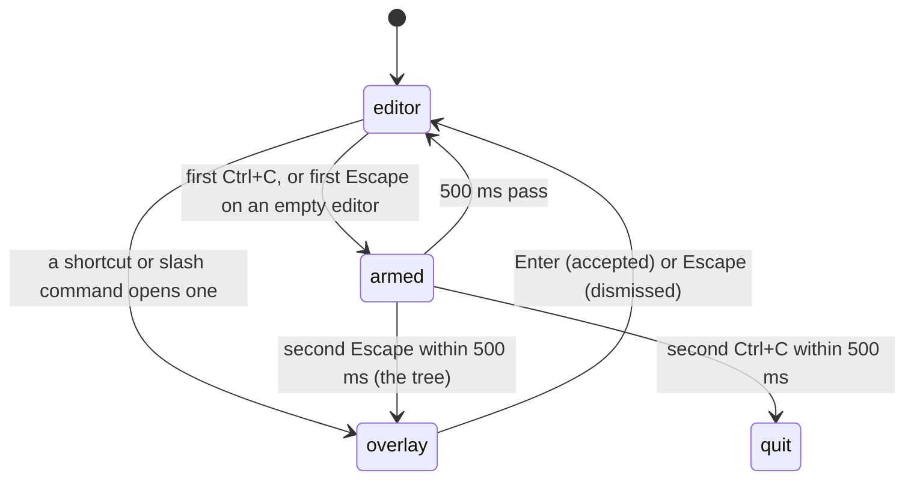

# Input

## Summary

Everything the user does in pi is a keystroke, a paste, or a dropped file, all arriving through the terminal. This document owns how keys are read and what the default keybindings are; the 500 ms double-press windows; the priority order of Escape; what Ctrl+C and Ctrl+D do; and the definitions of *cancel*, *complete*, *interrupt*, and *switch* that every cancel-and-interrupt table in the repo uses. It also records how key names are written in these documents.

Keys are configurable in `~/.pi/agent/keybindings.json`; these documents describe the defaults. On macOS the product's own hints print `Option` where these documents write `Alt` (`Alt+Enter` is shown as `option+enter`); the key is the same.

## The simple case

The user presses a key. If an overlay is open, the overlay gets it. Otherwise the key is checked, in order, against the application shortcuts (Escape, Ctrl+C, Ctrl+D, Ctrl+P, Ctrl+L, Ctrl+O, Ctrl+T, Ctrl+G, Ctrl+X, Ctrl+V, Ctrl+Z, Shift+Tab, Alt+Enter, Alt+Up) and then against the editor's own bindings (cursor movement, deletion, the kill ring, undo, newline, submit, Tab, history). A printable character with no binding is inserted at the cursor. Enter submits; Shift+Enter inserts a newline.

Two keys are time-sensitive: Ctrl+C twice within 500 ms quits, and Escape twice within 500 ms on an empty editor opens the session tree.

## A keystroke, event by event

### Where a key goes

With the editor focused, a key is offered in this order, and the first taker wins:

1. The paste-image shortcut (Ctrl+V; Alt+V on Windows).
2. Escape, unless the autocomplete popup is open, in which case the popup takes it and closes.
3. Ctrl+D, only when the editor is empty; otherwise it falls through to the editor as delete-forward.
4. Explicit history bindings, if the user has bound `tui.editor.historyPrevious`/`historyNext` (none by default).
5. The remaining application shortcuts in the table below.
6. The editor: jump-to-character mode if armed, a bracketed paste, undo, the autocomplete popup's own keys when it is open, Tab, deletion, the kill ring, history, cursor movement, newline, submit, and finally plain characters.

With an overlay open, the overlay has focus and the editor sees nothing. Escape and Ctrl+C both dismiss list-style overlays (they share the `tui.select.cancel` binding), so Ctrl+C in a selector cancels the selector instead of clearing the editor or counting toward a quit.

> Technical note: pi asks the terminal for the Kitty keyboard protocol at startup (flags for disambiguated escape codes, key-event reporting, and alternate keys). When the terminal supports it, Shift+Enter, Alt+Enter, and Ctrl+letter combinations arrive as distinct keys. When it does not, pi falls back to xterm's modifyOtherKeys, and in terminals without that either, Shift+Enter and Ctrl+Enter are indistinguishable from Enter. A lone Escape byte is treated as the Escape key after 10 ms (100 ms over SSH), so a very fast Escape-then-key sequence can be read as an Alt chord. See [the terminal](../cross-cutting/the-terminal.md).

### Default keybindings

Application shortcuts, active whenever the editor is focused:

| Key | Action | Notes |
| --- | --- | --- |
| Escape | Interrupt | Context-dependent; see "Escape" below. |
| Ctrl+C | Clear the editor; twice within 500 ms, quit | The window is measured from the first press. |
| Ctrl+D | Quit, only when the editor is empty | With text, deletes the character under the cursor. |
| Ctrl+Z | Suspend pi to the background | Not bound on Windows. |
| Shift+Tab | Cycle the thinking level | See [thinking](../conversation/thinking.md). |
| Ctrl+P / Shift+Ctrl+P | Next / previous model | See [cycling models](../models/cycling-models.md). |
| Ctrl+L | Open the model selector | See [the model selector](../models/the-model-selector.md). |
| Ctrl+O | Expand or collapse all tool output | Also expands the startup header. |
| Ctrl+T | Hide or show thinking blocks | Rebuilds the transcript. |
| Ctrl+G | Open the editor text in the external editor | `externalEditor` setting, else `$VISUAL`, `$EDITOR`, `nano` (Notepad on Windows). |
| Ctrl+X | Copy the last assistant message | In `/tree`, copies the selected entry. |
| Ctrl+V (Alt+V on Windows) | Paste an image from the clipboard, or text if there is no image | See [clipboard](../cross-cutting/clipboard.md). |
| Alt+Enter | Queue a follow-up message | Behaves as Enter when the agent is idle. |
| Alt+Up | Return all queued messages to the editor | |

Editor keys:

| Key | Action |
| --- | --- |
| Enter | Submit. If the character before the cursor is `\`, delete it and insert a newline instead. |
| Shift+Enter, Ctrl+J | Insert a newline. |
| Tab | Accept the highlighted completion, or start path completion. |
| Up / Down | Move the cursor; at the top or bottom edge of the text, browse the prompt history. |
| Left / Right, Ctrl+B / Ctrl+F | Move one character. |
| Alt+Left / Alt+Right, Ctrl+Left / Ctrl+Right, Alt+B / Alt+F | Move one word. |
| Home / End, Ctrl+A / Ctrl+E | Line start / line end. |
| Page Up / Page Down | Scroll the editor by a page. |
| Ctrl+] then a character | Jump forward to the next occurrence of that character; Ctrl+Alt+] jumps backward. Press Ctrl+] again to cancel. |
| Backspace / Delete | Delete backward / forward (Ctrl+D also deletes forward when the editor is not empty). |
| Ctrl+W, Alt+Backspace | Delete the word before the cursor. |
| Alt+D, Alt+Delete | Delete the word after the cursor. |
| Ctrl+U / Ctrl+K | Delete to the start / end of the line. |
| Ctrl+Y / Alt+Y | Yank the last deleted text / cycle through earlier deletions right after a yank. |
| Ctrl+- | Undo. There is no redo. |
| Shift+Space | Insert a space (for terminals that send something else). |

Keys inside overlays are listed with each overlay. Keys that exist but have no default binding: `/new`, `/tree`, `/fork`, `/resume` as shortcuts, dedicated history-previous/next, and the fullscreen transcript keys.

### Escape

One Escape does the first of these that applies:

1. If the autocomplete popup is open: close it.
2. If the agent is working: return the queue to the editor and abort the turn ([the turn](the-turn.md#cancel-and-interrupt)).
3. If a shell command is running: kill it ([shell commands](../conversation/shell-commands.md)).
4. If the editor text starts with `!`: clear the editor.
5. If the editor is empty: arm the double-Escape. A second Escape within 500 ms opens `/tree` (or `/fork`, or nothing, per the `doubleEscapeAction` setting).
6. Otherwise: nothing.

While a retry countdown, compaction, or branch summarization is running, Escape cancels that instead of any of the above. While an overlay is open, Escape dismisses it.

### Ctrl+C and Ctrl+D

Ctrl+C never interrupts the model. One press clears the editor (the text is not added to history and cannot be recovered with undo). A second press within 500 ms of the first quits pi with the normal shutdown: the turn in progress is aborted (without waiting for the aborted message to be written), and `To resume this session: pi --session <id>` is printed when the session has a file. The window is not extended by the second press; a third press 600 ms after the first starts a new window.

Ctrl+D quits at once, with no confirmation, when the editor is empty; with text in the editor it deletes forward. Quitting is described in [quitting](../sessions/quitting.md).

## Modifiers

Input has no variant axis of its own; the shortcuts above mean the same thing whatever the model or session. The one variant that matters is whether the agent is busy:

| Modifier | Set before sending | Changed while working |
| --- | --- | --- |
| Model | No effect on keys. | No effect. |
| Thinking level | No effect on keys. | No effect. |
| Agent busy | Idle: Enter sends, Escape arms the double-Escape or clears bash mode. | Working: Enter queues a steering message, Alt+Enter a follow-up, Escape aborts. Every other shortcut works the same; see [busy state](../cross-cutting/busy-state.md) for the full matrix. |
| Attachments | No effect. | No effect. |
| Session kind | No effect. | No effect. |

## Cancel and interrupt

These are the words every cancel-and-interrupt table in the repo uses.

**Cancel** is the user's explicit abort, always Escape. What it cancels depends on what is happening, in the priority order above. A cancel never loses the editor's text, and an abort of the turn returns queued messages to the editor.

**Complete** is the clean end of an interaction: the model stopping without a tool call, a shell command exiting, Enter in an overlay, a setting changed in the settings panel. What a complete commits is stated in each document's "Done" or "Accepted" section.

**Interrupt** is anything that ends an interaction that is neither the user's Escape nor a clean end: a provider error, a lost connection, a context overflow, a dead terminal, a signal. Every document's table says what is kept after each.

**Switch** is replacing the current session with another: `/new`, `/resume`, `/fork`, `/clone`, or `/import`. A switch aborts a turn in progress, writes the aborted state to the old session, and drops the queue without returning it to the editor. Choosing another entry in `/tree` is a move within the session, not a switch: it aborts too, but returns the queue to the editor first.

| Event | While idle | While working |
| --- | --- | --- |
| Escape (once; twice within 500 ms) | Clears bash mode, or arms the double-Escape; twice opens the tree. | Aborts the turn; a second Escape on the now-empty editor arms the double-Escape. |
| Ctrl+C once / twice; Ctrl+D | Clear; quit; quit if empty. | Same; quitting aborts the turn first. |
| Another message submitted (Enter; Alt+Enter follow-up) | Enter sends; Alt+Enter sends. | Enter steers; Alt+Enter queues a follow-up. |
| A slash command or shortcut that opens an overlay or changes the session | The overlay takes focus; the editor text is kept behind it. | Same; the turn continues behind the overlay. |
| Model or thinking level changed | Takes effect for the next prompt. | Takes effect for the next model call. |
| Provider error, rate limit, timeout, or network lost | No effect on input. | No effect on input; the status line changes. |
| Context window exhausted (auto-compaction) | No effect on input. | Submissions are queued with `Queued message for after compaction` until it ends. |
| Terminal resized; pi suspended (Ctrl+Z) and resumed | The editor re-wraps; suspend keeps the text. | Same. |
| Process ends: terminal closed (SIGHUP), SIGTERM, killed | The editor text is lost; prompt history is lost. | Same. |
| Session or files changed from outside | Editing `keybindings.json` takes effect after `/reload`. | Same. |
| Credentials lost, or logged out | No effect on input. | No effect on input. |

## Interactions with other systems

**Session persistence.** Keys are not recorded. The prompt history is not persisted: it starts empty on every run, and is seeded from the session's user messages when a session is resumed.

**Branching and history.** Up/Down history is the submitted-lines history, not the session tree; the two are unrelated.

**Compaction.** No interaction beyond the queueing noted above.

**Context files and the system prompt.** No interaction.

**Settings and keybindings.** Every action above is rebindable in `~/.pi/agent/keybindings.json` by its id (`app.interrupt`, `app.clear`, `tui.input.submit`, …); `/reload` applies changes without restarting. `doubleEscapeAction` changes step 5 of Escape. `editorPaddingX` and `autocompleteMaxVisible` change the editor's look. Old un-namespaced ids in the file are migrated on startup.

**Tools and the working directory.** No interaction.

**Terminal and rendering.** Which keys can be told apart depends on the terminal; see the technical note above and [the terminal](../cross-cutting/the-terminal.md). Key hints in the product are generated from the live bindings, so a rebound key shows its new name in hints.

**Credentials and providers.** No interaction.

## Edge cases

- Ctrl+C while an overlay is open cancels the overlay and does not arm the quit window.
- Ctrl+C while the editor already shows a large-paste marker clears the marker and its hidden content together.
- Escape with text in the editor and the agent idle does nothing; the text is kept. Only bash-mode text is cleared.
- The double-Escape window is armed even when the setting is `none`; it just does nothing when it fires.
- Alt+Enter with the agent idle submits exactly as Enter would, including running a slash command or a shell command.
- Binding a key to history-previous that is also an application shortcut (Ctrl+P) makes history win while the editor is focused and leaves the shortcut working in overlays.
- Ctrl+D with an empty editor quits even while the agent is working; there is no "are you sure".
- Holding a key repeats it at the terminal's rate; pi does not distinguish repeat from separate presses, so a held Ctrl+C quits.

## Open questions and verification

- The Escape timing (10 ms, 100 ms over SSH) is read from the terminal layer; whether a fast Escape followed by a letter is ever misread as Alt+letter in a modern terminal with the Kitty protocol was not tested.
- Whether a held Ctrl+C (auto-repeat) reaches pi as two presses within 500 ms, and therefore quits, was not tested.
- The claim that prompt history is seeded from a resumed session's user messages is read from the transcript-rebuild path and not confirmed by hand.
- Whether Ctrl+C in the login dialog cancels the login (like Escape) or clears the input was not determined.

Verified against pi-mono commit `a69bef789`.
