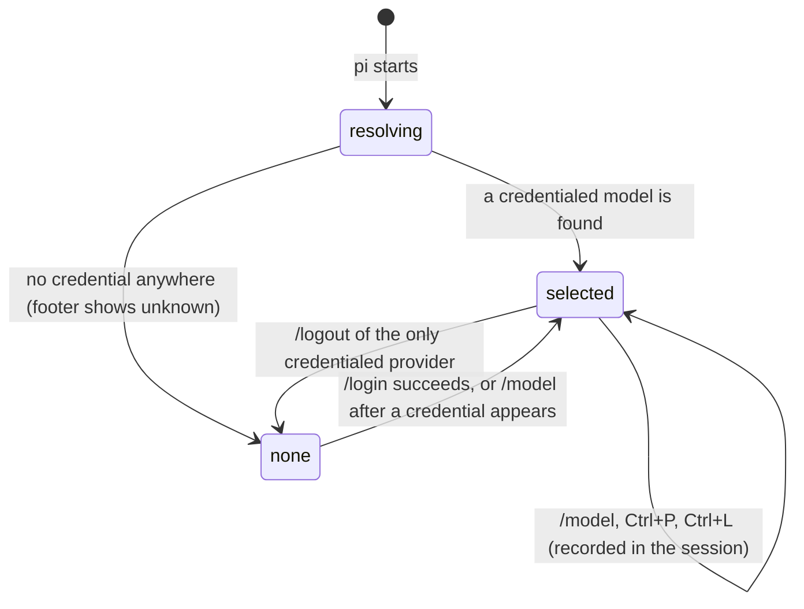

# Models and credentials

## Summary

pi talks to a model through a provider, and can only use a model whose provider it has a credential for. This document owns what a model and a provider are from the user's side, how the model in the footer is chosen at startup, what the thinking levels are and how a model limits them, where credentials live and which one wins, and what pi does with no credentials at all. Choosing and cycling models, and logging in and out, are in `models/`.

## The simple case

The user has `ANTHROPIC_API_KEY` set in their shell. They run `pi`; the footer's right side reads `claude-opus-4-8 • medium`. Every prompt goes to that model at that thinking level. Ctrl+L opens the model selector with every model of every provider they have a credential for; choosing one changes the footer at once and is remembered in the session. Ctrl+S in the selector makes it the default for future sessions.

## Models, providers, and availability

**A provider** is one vendor or endpoint (Anthropic, OpenAI, Google, GitHub Copilot, OpenRouter, and a few dozen more). Each has its own list of models, refreshed from the vendor in the background at startup and after `/login`.

**A model** is a `provider/id` pair. The footer shows the id, with `(provider)` in front when more than one provider is available. Models have a context window (the figure after `/` in the footer's context readout), may or may not support reasoning (`• thinking off` or `• medium` appears only for those that do), and may or may not accept images.

**Available** means the provider has a credential. The model selector lists only available models; Ctrl+P cycles only available models; a session's recorded model is restored on resume only if it is still available.

**The startup model**, when `--model` is not given:

1. A resumed session with messages: the model recorded in the session, if available. Otherwise the rule below, with a `Could not restore model <provider>/<id> (<reason>). Using <provider>/<id>.` warning.
2. The saved default (`defaultProvider` and `defaultModel` in settings, written by Ctrl+S in the model selector), if available and, when `--models` or `enabledModels` restricts the scope, inside the scope.
3. Otherwise the first model of the scope, or with no scope the first available provider's default model, walking pi's provider list in its own order (Amazon Bedrock, Ant Ling, Anthropic, OpenAI, …). With one credential this is simply that provider's default model: `claude-opus-4-8` for Anthropic, `gpt-5.5` for OpenAI, `gemini-3.1-pro-preview` for Google, `gpt-5.4` for GitHub Copilot.
4. No available model: a placeholder is selected, the footer shows `unknown`, and the first prompt fails; see "No credentials".

`--model <pattern>` accepts `provider/id`, a bare id, or a substring (`sonnet`), optionally with `:level` for the thinking level (`sonnet:high`); an ambiguous bare id is an error, and a substring prefers the undated alias over dated versions. `--thinking <level>` overrides any suffix.

**Thinking levels** are `off`, `minimal`, `low`, `medium`, `high`, `xhigh`, `max`. The default is `medium` (`defaultThinkingLevel` in settings, or a per-model override set in the settings panel). A model that supports fewer levels clamps the request to what it has; a model that does not reason at all is always `off`, and Shift+Tab on it does nothing visible except a status message. The level is recorded in the session and restored on resume.

**Scoped models** (`--models claude-*,gpt-5.5` or `enabledModels` in settings, or `/scoped-models`) restrict what Ctrl+P cycles and what the startup rule considers. With a scope set, startup prints `Model scope: <ids> (Ctrl+P to cycle)` before the header. Patterns that match nothing warn `No models match pattern "…"`.

## Credentials

**Where they come from**, in order for one provider:

1. `--api-key <key>` on the command line (requires `--model`), for this run only.
2. A stored credential in `~/.pi/agent/auth.json`, written by `/login`: either an API key or an OAuth token with its refresh token and expiry. A stored credential owns the provider: an environment variable for the same provider is ignored while a stored credential exists.
3. An environment variable: `ANTHROPIC_API_KEY`, `OPENAI_API_KEY`, `GEMINI_API_KEY`, `COPILOT_GITHUB_TOKEN`, `OPENROUTER_API_KEY`, and the rest listed by `pi --help`. Anthropic checks `ANTHROPIC_AUTH_TOKEN`, then `ANTHROPIC_OAUTH_TOKEN`, then `ANTHROPIC_API_KEY`. Cloud providers also accept their SDKs' ambient configuration (an AWS profile, Google application-default credentials).

`/logout` removes only the stored credential; an environment variable keeps the provider available, and pi says so.

**OAuth tokens** are refreshed automatically when fewer than five minutes of validity remain, at the start of the model call that needs them, with a 15 second limit on the refresh. A failed refresh fails that call with `OAuth refresh failed for <provider>`; pi does not fall back to an environment variable. Subscription providers (Anthropic Pro/Max, ChatGPT, GitHub Copilot) mark the footer's cost with `(sub)`; the Anthropic subscription shows a one-time warning about paid extra usage unless `warnings.anthropicExtraUsage` is off.

**No credentials.** pi starts normally and draws everything, with a warning under the header: `Warning: No models available. Use /login to log into a provider via OAuth or API key. See:` followed by the paths of the providers and models documentation. The footer's right side reads `unknown` (a placeholder stands in for the model), `(provider)` is absent, and the first prompt ends at once with `Error: No API key found for the selected model.`, a blank line, and the same login instructions. The prompt is not recorded and is not drawn in the transcript. Nothing else is restricted: `/login` works, `/settings` works, shell commands work, sessions resume. After `/login` succeeds pi selects that provider's default model if none was selected. (`Error: No model selected.` with `Then use /model to select a model.` is the message when a model was deliberately cleared, which the default configuration cannot reach.)

> Technical note: `auth.json` is created with owner-only permissions (0600) inside an owner-only directory, and writes to it are serialised through a lock file so that two pi processes logging in at once do not clobber each other. A stored API key may be a command to run or `$VAR` to expand rather than a literal key.

## Modifiers

| Modifier | Set before sending | Changed while working |
| --- | --- | --- |
| Model | The model in the footer is used for the next model call and recorded in the session when it changes. | Applies from the next model call in the turn. |
| Thinking level | Clamped to the model; shown in the footer and the editor border. | Applies from the next model call. Switching to a model that does not support the current level clamps it and shows the new level. |
| Agent busy | No effect on which model is used. | Model and level changes are allowed and recorded mid-turn. |
| Attachments | Sending an image to a model that does not accept images: the image is dropped from the request and the model is told so in text. | No effect. |
| Session kind | Saved: model and level restored on resume. Ephemeral: the choice lasts for the run. | No effect. |

## Cancel and interrupt

| Event | While idle | While working |
| --- | --- | --- |
| Escape (once; twice within 500 ms) | Closes the model selector or login dialog without changes (a login in progress is abandoned). | Aborts the turn; the model is unchanged. |
| Ctrl+C once / twice; Ctrl+D | Quitting keeps the default; a session-only model choice is in the session file. | Same. |
| Another message submitted (Enter; Alt+Enter follow-up) | Uses the current model. | Queued; delivered to whichever model is current when it is sent. |
| A slash command or shortcut that opens an overlay or changes the session | A session switch restores the new session's model. `/new` does not keep the current model: it chooses the startup model again (the saved default, else the first available), so a session-only choice is lost. | Same, after aborting. |
| Model or thinking level changed | Recorded in the session at once. | Recorded at once; used from the next call. |
| Provider error, rate limit, timeout, or network lost | The catalogue refresh at startup fails silently; the built-in model list is used. | The call fails and retries per [the turn](the-turn.md#cancel-and-interrupt). |
| Context window exhausted (auto-compaction) | Switching to a model with a larger window lifts an overflow without compaction: the overflow check is skipped when the last message came from a different model. | Same. |
| Terminal resized; pi suspended (Ctrl+Z) and resumed | No effect. | No effect. |
| Process ends: terminal closed (SIGHUP), SIGTERM, killed | A login in progress is abandoned; the browser tab it opened is orphaned. | Same. |
| Session or files changed from outside | `auth.json` edited or written by another pi process is picked up on the next call (it is re-read when its revision changes). `models.json` changes are picked up without restart. | Same. |
| Credentials lost, or logged out | The model stays selected until a call fails or `/logout` removes the provider; after `/logout` of the current provider the selector must be used to pick another. | The next call fails. |

## Interactions with other systems

**Session persistence.** Model and thinking-level changes are entries in the session; the default lives in settings.

**Branching and history.** Moving the active position with `/tree` changes the messages only; the model and level stay as they are. Resuming, forking, or cloning restores the model and level recorded on the branch that is opened.

**Compaction.** The context window of the current model sets the auto-compaction threshold; a model switch changes the threshold immediately and skips the overflow check for messages from the old model.

**Context files and the system prompt.** No interaction.

**Settings and keybindings.** `defaultProvider`, `defaultModel`, `defaultThinkingLevel`, `modelThinkingLevels`, `enabledModels`, `thinkingBudgets`, `transport`, `warnings.anthropicExtraUsage`, `httpProxy`; `app.model.select` (Ctrl+L), `app.model.cycleForward`/`cycleBackward` (Ctrl+P, Shift+Ctrl+P), `app.thinking.cycle` (Shift+Tab).

**Tools and the working directory.** The `bash` tool's environment includes `PI_PROVIDER`, `PI_MODEL`, and `PI_REASONING_LEVEL` for the current selection; user `!` commands do not get them.

**Terminal and rendering.** The footer's right side; the thinking-level border colour.

**Credentials and providers.** This document.

## Edge cases

- `pi --help` describes `--provider` as defaulting to `google`; no such default exists in the resolution above. Noted in "Open questions".
- A stored credential for a provider whose API-key handler is missing yields nothing, not a fallback to the environment variable.
- `--api-key` without `--model` is an error at startup.
- The `(provider)` prefix counts providers that are available, not providers with a selected model, so logging in to a second provider changes the footer even before any model of it is chosen.
- A model id that exists under two providers needs the `provider/` prefix in `--model` and `/model`.
- Thinking level `max` exists for models that support it and falls back to `xhigh` in themes without a `thinkingMax` colour.

## Open questions and verification

- The `--help` text's `(default: google)` for `--provider` contradicts the resolution order read from the code. May be worth treating as a bug rather than documenting.
- The exact provider order used when several credentials exist and no default is saved was read from the provider table's declaration order and not confirmed by hand.
- Whether an OAuth refresh that fails mid-turn is retried as a transient error or fails the turn at once was not determined; the error text does not match the transient list, so the turn probably fails.
- Whether `/logout` of the current provider immediately clears the footer's model or leaves it until the next call was not confirmed.

Verified against pi-mono commit `a69bef789`.
