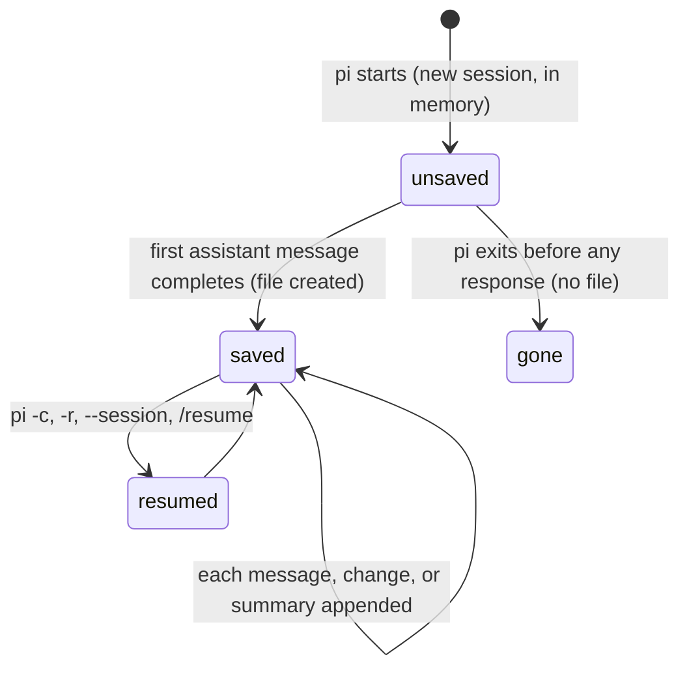

# Sessions

## Summary

A session is one conversation: its messages, the model and thinking level in use, its name, and the tree of branches the user has explored. Every session is one file under `~/.pi/agent/sessions/`, filed by the working directory pi was started in, and pi writes to it as the conversation proceeds so that nothing is lost on exit. This document owns what a session is, how the file for a directory is chosen, when bytes are written, what an entry and the active position are, and what happens when two processes or a corrupt file get in the way. The commands that create, resume, and branch sessions have their own documents in `sessions/`.

## The simple case

The user runs `pi` in `~/code/app`. A new session starts with a fresh id; nothing is on disk yet. They send a prompt and the model answers; at that moment `~/.pi/agent/sessions/--Users-me-code-app--/2026-08-23T10-15-02-123Z_0198…​.jsonl` is created holding the header, the prompt, and the response. Each later message is appended as it completes. They quit; pi prints `To resume this session: pi --session 0198…`. Next day, `pi -c` in the same directory reopens it, the transcript is redrawn, and the model and thinking level are what they were.

## The session model

**Where the file is.** The session directory for a working directory is `~/.pi/agent/sessions/` plus the directory's absolute path with the leading slash removed and every `/`, `\`, and `:` replaced by `-`, wrapped in `--`: `/Users/me/code/app` becomes `--Users-me-code-app--`. All sessions started in that directory live there. The file name is the start time as an ISO timestamp with `:` and `.` replaced by `-`, an underscore, and the session id (a time-ordered UUID). `--session-dir`, `PI_CODING_AGENT_SESSION_DIR`, or the `sessionDir` setting move the whole tree elsewhere.

**What is in the file.** One JSON line per entry, the first being the header (`type: session`, version 3, the id, start time, working directory, and the parent session when forked). Entries are: a message (user, assistant, tool result, shell record, compaction summary, branch summary, or a custom message), a model change, a thinking-level change, a session-name change, a label, a compaction, or a branch summary. Each entry has an id and the id of its parent, so the file is a tree.

**The active position.** The entry the conversation continues from. Sending a prompt appends its user message as a child of the active position and moves the position to it; each later entry does the same. `/tree` moves the position to any earlier entry, after which the next prompt starts a new branch. Everything on other branches stays in the file and is shown by `/tree`, but the model's context is built only from the path from the root to the active position.

**When bytes are written.** The file is created the first time an assistant message completes. Until then every entry (the header, the user message, any model change) is held in memory; a session that never gets a response leaves no file, `pi -c` will not find it, and `/fork` and `/clone` refuse with `This session has not been saved yet. Wait for the first assistant response before cloning or forking it.` After creation each entry is appended synchronously the moment it completes: the user message when sent, the assistant message when it ends (including aborted and errored ones), each tool result when its tool ends, the shell record when the command ends (or, if the agent was working, when the turn ends). There is no periodic save and no "unsaved changes" state.

**Ephemeral sessions.** `--no-session` keeps everything in memory. The screen behaves identically; nothing is written; `/fork` and `/clone` replace the session in place rather than creating files; no resume hint is printed on exit.

**What is restored.** Resuming a session redraws the transcript from the active branch, restores the model and thinking level from the last recorded change on that branch (falling back to the defaults, with a `Could not restore model …` warning, if the model is no longer available), restores the name, seeds the prompt history with the branch's user messages, and shows `Session compacted N times` if it was.

**Which session is "most recent".** `pi -c` opens the newest file in the directory's session directory by file modification time. `/resume` and `pi -r` list sessions sorted by the time of their last user or assistant message.

> Technical note: session files are not locked. Two pi processes on the same file each append their own entries, each parenting to entries it knows about; the file becomes a forest and `/tree` shows the extra roots. A new session that happens to collide on file name fails to create its file. Settings, credentials, and trust files are locked; sessions are the exception.

## Modifiers

| Modifier | Set before sending | Changed while working |
| --- | --- | --- |
| Model | Recorded as a model-change entry when it differs from the session's current model; restored on resume. | Recorded at the moment of the change, between messages. |
| Thinking level | Recorded as a thinking-level entry; restored on resume. | Same. |
| Agent busy | No effect on what is written. | Entries are appended as each message completes, not at the end of the turn. |
| Attachments | Images are stored in the user message in the file (base64), so a session with many images grows fast. | No effect. |
| Session kind | Saved: as above. Ephemeral: nothing written. | No effect. |

## Cancel and interrupt

| Event | Unsaved (no response yet) | Saved |
| --- | --- | --- |
| Escape (once; twice within 500 ms) | Aborting the first turn produces an aborted assistant message, which creates the file. | The aborted message and its tool results are appended. |
| Ctrl+C once / twice; Ctrl+D | Quitting before a response leaves no file and no resume hint. | The turn in progress is aborted and appended; the resume hint names the file. |
| Another message submitted (Enter; Alt+Enter follow-up) | Queued messages are not in the file until delivered. | Same. |
| A slash command or shortcut that opens an overlay or changes the session | `/fork` and `/clone` refuse. `/new` discards the unsaved session silently. | `/new`, `/resume`, `/fork`, `/clone`, `/import` abort the turn, append the aborted state, and switch; see [new session](../sessions/new-session.md) and the rest. |
| Model or thinking level changed | Held in memory with the rest. | Appended as an entry at once. |
| Provider error, rate limit, timeout, or network lost | An errored assistant message creates the file. | Each failed attempt is appended. |
| Context window exhausted (auto-compaction) | Not applicable. | The compaction entry is appended when the summary is ready; nothing is removed. |
| Terminal resized; pi suspended (Ctrl+Z) and resumed | No effect. | No effect. |
| Process ends: terminal closed (SIGHUP), SIGTERM, killed | Nothing on disk. | Everything appended so far is on disk; a message in progress is lost. The file is never left half-written because each entry is one `write` of one line. |
| Session or files changed from outside | Not applicable. | Another process appending to the same file interleaves entries (technical note above). Deleting the file from outside while pi runs: later appends recreate nothing and fail silently; see "Open questions". |
| Credentials lost, or logged out | No effect. | No effect. |

## Interactions with other systems

**Session persistence.** This document.

**Branching and history.** The tree, the active position, labels, and branch summaries are all entries; see [the tree](../sessions/the-tree.md). `/fork` and `/clone` copy the path to a new file whose header names the parent session; see [fork and clone](../sessions/fork-and-clone.md).

**Compaction.** A compaction entry records the summary and the id of the first kept entry; context is built from the summary plus the entries after that id. Repeated compactions chain. See [compaction](../sessions/compaction.md).

**Context files and the system prompt.** Not stored in the session; rebuilt on every run from the files on disk, so a resumed session sees the current `AGENTS.md`.

**Settings and keybindings.** `sessionDir`; the `--session-dir`, `--session`, `--fork`, `--session-id`, `-c`, `-r`, `--no-session`, and `--name` flags; see [resuming](../sessions/resuming.md) and [naming and info](../sessions/naming-and-info.md).

**Tools and the working directory.** The session records the working directory in its header. Resuming a session whose directory no longer exists asks `Continue` or `Cancel` at startup. A session found under a different directory (`--session <id>` from elsewhere) is offered as a fork into the current one.

**Terminal and rendering.** No interaction.

**Credentials and providers.** The model recorded in the session must be available on resume; otherwise the default is used with a warning.

## Edge cases

- The session id in the resume hint is the full UUID; `--session` accepts a prefix of it, and an ambiguous prefix opens the first match without a warning.
- The directory name encodes the path, so the same project reached through a symlink gets a separate session directory.
- Old session files (versions 1 and 2) are migrated in place when opened.
- A zero-byte file given to `--session` is initialised as a new session in place; a non-empty file that is not a session is refused with `Session file is not a valid pi session` and pi exits.
- Malformed lines inside an otherwise valid file are skipped silently.
- Deleting a session from the picker uses the `trash` command when installed, otherwise deletes outright; the active session cannot be deleted from the picker.
- `/session` shows the file path, id, and counts; the path is the only way to learn where the file is from inside pi.

## Open questions and verification

- What happens when the session file is deleted from outside while pi is running was not determined: appends may recreate the file without its header, or fail.
- Whether the "most recent" session for `-c` is by file modification time (read from the discovery code) or by last message time (the picker's sort) was read as two different rules and not confirmed by hand.
- The exact format of the header timestamp in the file name was read from the code (`:` and `.` replaced by `-`) and not checked against a real file name.
- Whether a session with only an aborted, empty assistant message (Escape before the first token) creates the file was read from the persistence rule and not observed.

Verified against pi-mono commit `a69bef789`.
