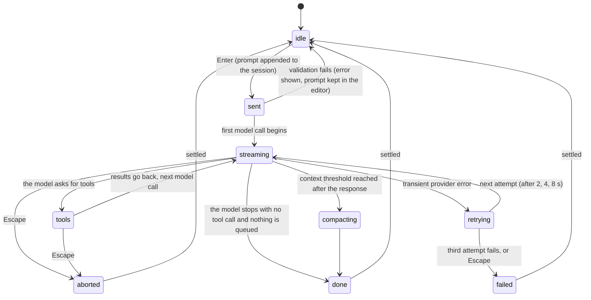

# The turn

## Summary

A turn is the unit of everything pi does: the user sends a prompt, the model answers, possibly calling tools and answering again, until it stops. This document owns the words the rest of the description relies on: what *sent*, *working*, and *settled* mean; what is recorded in the session and when; what Escape does at each stage; when pi retries on its own; and when queued messages are delivered. Feature documents link here rather than restating any of it.

A turn begins with Enter in the editor (or with a message given on the command line at startup) and ends when the agent settles. While a turn is in progress the status line reads `Working...` and the editor stays usable. Nothing about a turn requires a particular model; a turn with no model selected fails before anything is sent.

## The simple case

The user types `Summarize this repository` and presses Enter. The editor empties, the text appears in the transcript in the user-message colour, and the status line shows a spinner: `Working... (escape to interrupt)`. After a moment the assistant's text starts to appear below the prompt and grows as it streams in. If the model decides to look at a file, a box appears for the tool call (`read README.md`) before its arguments have finished arriving, turns from the pending colour to the success colour when the tool has run, and the model's next message streams in below it. When the model finishes without asking for another tool, the spinner disappears, the footer's token and cost figures update, and the editor border is back to the thinking-level colour. The user can type the next prompt.

From the first keystroke of the next prompt nothing waits on anything else; the turn is over.

## The turn, event by event

### Compose

Before Enter, nothing in this document applies: the editor is described in [the editor](../conversation/the-editor.md) and the keys in [input](input.md). Enter trims the text; an empty or whitespace-only submission does nothing at all. The first character decides what kind of submission it is: `/` for a [slash command](../glossary.md#input), `!` for a [shell command](../conversation/shell-commands.md), anything else for a prompt.

### Resolves at once

A submission ends without a turn in these cases:

- **Empty.** Nothing happens, nothing is recorded.
- **A built-in slash command.** It runs immediately, whatever the agent is doing, and does not start a turn. (`/reload` refuses while the agent is working or compacting.)
- **A shell command.** It runs in the shell, not the model; see [shell commands](../conversation/shell-commands.md).
- **The agent is working.** The text is queued as a steering message rather than sent; see [the message queue](../conversation/the-message-queue.md). Alt+Enter queues a follow-up instead. While compaction is running, the text is queued and a status message says `Queued message for after compaction`.
- **No model is selected.** The turn fails before anything is sent with `Error: No model selected.` followed by instructions to use `/login` and `/model`. The prompt is not recorded; the text is gone from the editor and is in the prompt history.
- **The model's provider has no credential.** Same shape: an error naming the provider and, for OAuth providers, `/login <provider>`. Not recorded.

### Sent

On Enter with the agent idle, the prompt is committed: the user message is appended to the session (and, if it is the first response-bearing session, will be written to disk with the first assistant message; see [sessions](sessions.md)) and drawn in the transcript before the model is called. It cannot be taken back; aborting a moment later leaves it in the session and in the transcript. The prompt also goes into the prompt history.

Three things happen before the model call that the user can notice:

- If the previous turn was aborted while its context was over the limit, auto-compaction runs now, with `Auto-compacting... (escape to cancel)` in the status line, and the prompt is sent after it.
- The status line shows `Working... (escape to interrupt)` in the accent colour. The editor's border does not change; the editor stays focused and editable.
- The model and thinking level current at this moment are the ones used for the first model call; a change mid-turn applies from the next model call (see "Modifiers").

> Technical note: pi reads the provider credential fresh for every model call, so an OAuth token that expires mid-session is refreshed (when less than five minutes of validity remain) without the user doing anything. A refresh that fails is an error on that call.

### While working

The model's response streams in. The assistant message appears as soon as the first piece arrives and grows: thinking (italic, in the thinking colour, or a single `Thinking...` line when hidden) and text render as they come. A tool call appears as its own box the moment the model starts emitting it, before the arguments are complete, in the pending background colour; when the arguments are complete and the tool runs, the box shows live output for tools that stream (bash), then the result, and the background turns to the success or error colour. Tools in one assistant message run in parallel by default. Their results go back to the model and the next model call begins; the status line does not change between calls.

What the user can do meanwhile is the subject of [busy state](../cross-cutting/busy-state.md). In short: type freely; Enter queues a steering message; Alt+Enter queues a follow-up; Escape aborts; every built-in slash command runs; every overlay opens; Ctrl+P and Shift+Tab change the model or thinking level for the next model call; `!` commands run, with their record held until the turn ends.

Queued steering messages are delivered as user messages before the next model call, after the current assistant message and all of its tool calls have finished. Follow-up messages are delivered only when the model has stopped with no tool call and no steering message is waiting, which starts another model call inside the same turn. By default one message from each queue is delivered at a time (`steeringMode` and `followUpMode`, both `one-at-a-time`); with `all`, the whole queue goes in one batch.

There is no limit on how many model calls a turn may contain. A turn ends only when the model stops without a tool call and nothing is queued, or is aborted, or fails.

Two things the model can do that end a model call oddly:

- **Output cut off** (the provider's length limit). The assistant message ends with `Response was truncated before completion.` in the error colour. Any tool call in that message is not run; each is given an error result telling the model its arguments may be truncated, and the model is called again with those results.
- **An error from the provider.** See "Cancel and interrupt".

### Done

When the model stops and nothing is queued, the spinner is cleared. Then pi checks two things before the turn settles:

- **Retry.** If the last model call failed with a transient error, a retry is scheduled (below); the turn is not over.
- **Compaction.** If the context the model just used is over the threshold (the model's window minus 16,384 tokens), auto-compaction runs now, with `Auto-compacting... (escape to cancel)` in the status line; the transcript is rebuilt with the summary in place; see [compaction](../sessions/compaction.md).

Only after these is the turn *settled*: the agent is idle, the footer shows the turn's token totals and cost, and the next Enter starts a new turn. Everything in the turn is in the session: the user message, every assistant message, every tool result, every model and thinking-level change made during it. The editor keeps whatever the user typed meanwhile.

## Modifiers

| Modifier | Set before sending | Changed while working |
| --- | --- | --- |
| Model | The first model call uses the model shown in the footer at the moment of Enter. | Ctrl+P, `/model`, or the model selector change the footer at once and take effect from the next model call in the same turn; the change is recorded in the session at the point it was made. |
| Thinking level | Used for the first model call; shown in the footer and as the editor border colour. | Shift+Tab or `/thinking` take effect from the next model call; the border colour changes at once. |
| Agent busy | Idle: Enter sends. Working: Enter queues a steering message; the queued text is shown in the pending area and is not in the session until delivered. | No effect; the queue rules above apply. |
| Attachments | Images pasted or dropped into the editor are sent with the prompt as part of the user message; `@file` references are plain text the model may choose to read. See [attachments](../conversation/attachments.md). | No effect. |
| Session kind | Saved: the turn is written to the session file (created on the first assistant message). Ephemeral (`--no-session`): identical on screen, nothing on disk. | No effect. |

Model and thinking-level changes are never retroactive: a model call that has started finishes with the settings it started with.

## Cancel and interrupt

| Event | Before the first model call | While working |
| --- | --- | --- |
| Escape (once; twice within 500 ms) | If validation has not yet failed, the prompt has already been sent; Escape aborts as in the next column. | Aborts the turn. The queue is emptied back into the editor (joined with blank lines, ahead of any text already there), the model call is cancelled, the partial assistant message is kept and ends with `Operation aborted` in the error colour (or the tool boxes show it, when there are tool calls), running tools are killed and recorded as `Operation aborted`, and the turn settles. During a retry countdown, Escape cancels the retry instead: `Error: Retry failed after N attempts: Retry cancelled`. During auto-compaction, Escape cancels the compaction (`Auto-compaction cancelled`) and the turn settles without it. A second Escape on the now-empty editor is the double-Escape action. |
| Ctrl+C once / twice; Ctrl+D | One Ctrl+C clears the editor; it does not touch the turn. Two within 500 ms quit pi; see [quitting](../sessions/quitting.md). Ctrl+D quits only with an empty editor. | Same. Quitting mid-turn aborts the turn first so the partial assistant message and tool results are written to the session. |
| Another message submitted (Enter; Alt+Enter follow-up) | Not applicable. | Enter queues a steering message; Alt+Enter a follow-up. Neither interrupts the current model call. |
| A slash command or shortcut that opens an overlay or changes the session | Not applicable. | Overlays open over the editor and the turn continues behind them. `/new`, `/resume`, `/fork`, `/clone`, `/import`, and choosing another branch in `/tree` abort the turn first, write the aborted state to the old session, drop the queue (it is not returned to the editor), and then switch. `/compact` aborts the turn and compacts; the turn is not resumed. `/quit` aborts and exits. `/reload` is refused with a warning. |
| Model or thinking level changed | Applies to the first call. | Applies from the next model call; see "Modifiers". |
| Provider error, rate limit, timeout, or network lost | A failure on the first call is handled as in the next column. | The assistant message ends. If the error is transient (overloaded, rate-limited, a 5xx, a dropped or refused connection, a timeout), the status line shows `Retrying (1/3) in 2s... (escape to cancel)` counting down, then `(2/3) in 4s`, then `(3/3) in 8s`; the context is re-sent unchanged; the failed attempt stays in the session file but is not sent to the model. A success clears the counter. After the third failure: `Error: Retry failed after 3 attempts: <message>` and the turn settles. Quota, billing, and usage-limit errors are not retried: the message ends with `Error: <message>` and the turn settles. Tool calls in a failed message are not run. |
| Context window exhausted (auto-compaction) | If the previous turn was aborted over the limit, compaction runs before the call. | A provider overflow error (or a silent overflow detected from the usage figures) triggers `Context overflow detected, Auto-compacting... (escape to cancel)`; the failed call is dropped, the context is compacted, and the same call is retried once. If it overflows again: `Context overflow recovery failed after one compact-and-retry attempt. Try reducing context or switching to a larger-context model.` A response that succeeded but left the context over the threshold compacts after the turn, without a retry. |
| Terminal resized; pi suspended (Ctrl+Z) and resumed | The screen redraws; nothing else. | The screen redraws at the new width. Suspend stops drawing but not the turn; on `fg` the transcript catches up with everything that streamed meanwhile. |
| Process ends: terminal closed (SIGHUP), SIGTERM, killed | Whatever was not yet in the session file is lost. | SIGHUP and SIGTERM: pi shuts down cleanly; the turn is aborted, but the aborted assistant message is not guaranteed to reach the file (see "Open questions"). Killed outright: the session file holds everything up to the last completed message; a partially streamed assistant message is lost. Running shell processes started by tools are killed on SIGHUP/SIGTERM and orphaned on a kill. |
| Session or files changed from outside | No effect. | The model's tools see the files as they are when the tool runs. Another pi process writing to the same session file interleaves its entries; see [sessions](sessions.md). |
| Credentials lost, or logged out | The first call fails with a credential error; no retry. | The next model call fails with a credential error and the turn settles; the current call is unaffected. `/logout` of the current provider mid-turn has the same effect on the next call. |

After an abort the editor holds the returned queue plus whatever was typed; after a failure it holds whatever was typed. Neither path clears it.

> Technical note: a transient error is decided by matching the provider's error text against a list (overloaded, rate limit, too many requests, 429, 5xx, service unavailable, connection refused or reset, fetch failed, DNS failure, socket hang up, timeout, a stream that ended before its end marker). Messages about quota, billing, balance, or a usage limit are matched first and never retried, so a subscription that has run out fails at once rather than waiting 14 seconds.

## Interactions with other systems

**Session persistence.** The user message is appended at send; each assistant message when it ends (including aborted and errored ones, and each failed retry attempt); each tool result when its tool ends; model and thinking-level changes when made. The file itself is created with the first assistant message; see [sessions](sessions.md).

**Branching and history.** A turn always continues from the active position and becomes the new active position. Sending a prompt after `/tree` moved the position backwards starts a new branch; nothing from the abandoned branch is in the model's context unless a branch summary was made.

**Compaction.** Checked before each prompt (only for an aborted-and-overflowed previous turn) and after each turn; see "Done" and [compaction](../sessions/compaction.md). Aborted and errored assistant messages are excluded from the model's context but still count in the session file.

**Context files and the system prompt.** The system prompt is built once per model call from the context files, the tool list, and the skills list; a context file edited on disk mid-turn is picked up on the next model call only after `/reload`.

**Settings and keybindings.** `steeringMode`, `followUpMode`, `retry.*`, `compaction.*`, `hideThinkingBlock`, and `showCacheMissNotices` change what the turn does or shows; all are in [configuration](configuration.md). `app.interrupt` (Escape), `app.message.followUp` (Alt+Enter), `app.message.dequeue` (Alt+Up).

**Tools and the working directory.** Tools run in the working directory pi was started in, in parallel within one assistant message, each `bash` call in a fresh shell. A tool cannot be cancelled individually; Escape aborts the whole turn. See [tool calls](../conversation/tool-calls.md).

**Terminal and rendering.** Streaming text is re-wrapped on resize. The status spinner is the only animated element. When `showCacheMissNotices` is on, a dim notice such as `Cache miss: 120k tokens re-billed (~$0.36)` follows an assistant message that missed the provider's prompt cache, but only above 20,000 tokens and $0.10.

**Credentials and providers.** Resolved per model call; see the technical note under "Sent". The footer's `(sub)` marker after the cost means the provider is subscription-billed.

## Edge cases

- A prompt given on the command line (`pi "Summarize this"`) starts a turn as soon as startup finishes, before the user has typed anything; typing during startup is held and replayed afterwards with `Startup is still in progress`.
- Two prompts given on the command line run as two turns in order.
- A steering message typed before the first model call of a turn has begun is delivered before that call, so the model sees both messages together.
- A `/` line pi does not recognise (for example `/foo bar`) is not an error: it is sent to the model as text, and if the agent is working it is queued as a steering message and delivered as text.
- The failed attempts of a retried call are in the session file; `/tree` shows them and `/session` counts them.
- After an abort, the aborted assistant message is in the file but the next model call does not see it; the model sees the user message followed directly by the next user message.
- A turn whose model was switched mid-way ends up with assistant messages from two models in one turn; the session records the switch between them and the footer shows whichever is current.
- A response that contains only thinking and no text, with no tool calls, ends the turn with an assistant message that shows only the thinking block (or the `Thinking...` line).

## Open questions and verification

- Whether the aborted assistant message reliably reaches the session file on SIGTERM and SIGHUP was read from the shutdown path (abort, then dispose) but not confirmed by hand; the signal path disposes the runtime before the terminal is touched and may not wait for the abort to settle.
- The exact moment the footer's token figures update (per assistant message or at settle) was not checked by hand.
- Whether `Working...` shows the `(escape to interrupt)` suffix from the first frame or only after extensions are bound was read from two code paths that set the message and not confirmed.
- The length-stop path with tool calls (the calls are failed and the model is called again) was read from the agent loop and its tests, not observed with a real provider.
- The silent-overflow detection (usage figures exceeding the window with zero output) depends on provider usage reporting and was not observed.
- Whether a steering message typed during the pre-prompt auto-compaction is delivered before the first call or after compaction ends was not determined.

Verified against pi-mono commit `a69bef789`.
