# Cycling models

## Summary

Ctrl+P switches to the next model and Shift+Ctrl+P to the previous one without opening anything: a status line `Switched to <model> (thinking: <level>)` is added, the footer and border update, and the change is recorded in the session. With no scope the keys walk every available model in the catalogue's order; with a scope they walk the scoped models in the scope's order. A scope is set for the run with `--models <patterns>`, for every run with the `enabledModels` setting, or edited live in the `/scoped-models` overlay, which lists every available model with a tick or a cross, toggles them with Enter, reorders them with Alt+Up and Alt+Down, applies every change to the session at once, and writes them to the settings file only on Ctrl+S.

A scope also changes what [the model selector](the-model-selector.md) shows (its scoped list) and which model pi starts with (see [models and credentials](../foundations/models-and-credentials.md)). With a scope, the startup output begins with a dim `Model scope: <ids> (Ctrl+P to cycle)` line.

## The simple case

The user has credentials for Anthropic and OpenAI and presses Ctrl+P. A dim status line reads `Switched to GPT-5.5 (thinking: medium)`, the footer's right side now reads `(openai) gpt-5.5 • medium`, and the border keeps the medium colour. Ctrl+P again moves on to the next model in the list; at the end it wraps to the first. Shift+Ctrl+P goes the other way.

To narrow the list the user types `/scoped-models`. The editor is replaced by a panel titled `Model Configuration` with `Session-only. Ctrl+S to save to settings.` under it, a search box, and eight rows of models with their provider in brackets. The footer line of the panel reads `Enter toggle · Ctrl+A all · Ctrl+X clear · Ctrl+P provider · Alt+Up/Alt+Down reorder · Ctrl+S save · all enabled`. Pressing Enter on `claude-opus-4-8` leaves only that model enabled (`1/14 enabled (unsaved)`); pressing Enter on `gpt-5.5` adds it (`2/14 enabled`). Ctrl+S writes the pair to settings, `Model selection saved to settings` appears in the transcript, and `(unsaved)` disappears. Escape closes the panel. From now on Ctrl+P alternates between those two models, and the next `pi` starts with `Model scope: claude-opus-4-8, gpt-5.5 (Ctrl+P to cycle)`.

## The interaction, event by event

Ctrl+P has no overlay: its whole interaction resolves the moment it is pressed and is described under "Dismissed at once". The five phases otherwise describe the `/scoped-models` overlay.

```mermaid
stateDiagram-v2
    [*] --> editor
    editor --> editor : Ctrl+P or Shift+Ctrl+P ("Switched to …", or "Only one model available" / "in scope")
    editor --> open : /scoped-models
    open --> open : Up/Down, typing filters, Ctrl+C clears the search
    open --> changed : Enter, Ctrl+A, Ctrl+X, Ctrl+P, Alt+Up, Alt+Down (applied to the session, "(unsaved)")
    changed --> changed : further edits
    changed --> saved : Ctrl+S ("Model selection saved to settings")
    saved --> changed : further edits
    open --> editor : Escape, or Ctrl+C with an empty search
    changed --> editor : Escape (session keeps the changes; settings do not)
    saved --> editor : Escape
```

### Open

`/scoped-models` empties the editor and replaces it with the panel. It opens while the agent is working, retrying, or compacting; the turn continues behind it. From the top:

- a border line and a blank line;
- `Model Configuration` in bold accent, and under it `Session-only. Ctrl+S to save to settings.` in the muted colour;
- a blank line, the search box, a blank line;
- the list: up to eight rows, each `<id> [<provider>]` followed by a green `✓` for an enabled model or a dim `✗` for a disabled one; when everything is enabled (no scope), available rows carry no mark at all; a model named in the settings or the scope that is not in the catalogue (its provider has no credential, or the id does not exist) is shown as `<provider>/<id> [unavailable] ✗`; the highlighted row starts with `→ ` in the accent colour;
- a muted `(i/n)` counter when there are more than eight rows; the visible window keeps the highlight in its middle;
- a blank line and `Model Name: <name>` in the muted colour for the highlighted model, or `Model unavailable` for an unavailable row;
- a blank line and `Refreshing model catalogs…` in the muted colour;
- the footer line, dim: `Enter toggle · Ctrl+A all · Ctrl+X clear · Ctrl+P provider · Alt+Up/Alt+Down reorder · Ctrl+S save · <count>`, with ` (unsaved)` in the warning colour appended once something has changed;
- a border line.

The rows are ordered enabled models first, in scope order, then the disabled ones in catalogue order. The highlight starts on the first row. The count in the footer line is `all enabled`, or `<enabled>/<total> enabled`, with ` · <n> unavailable` appended when unavailable ids are listed.

The initial enabled set is the session's scope if one exists (from `--models`, `enabledModels`, or an earlier visit to this overlay); otherwise the `enabledModels` patterns resolved against the catalogue, with unmatched patterns kept as unavailable rows; otherwise all enabled.

> Technical note: like the model selector, the panel is drawn from the in-memory catalogue and refreshed in the background with a 15-second limit. When the refresh completes the rows are rebuilt with the highlight kept on the same model where possible; if nothing has been changed yet and there was no session scope, the enabled set is recomputed from the settings patterns against the fresh catalogue.

### Dismissed at once

Ctrl+P (`app.model.cycleForward`) and Shift+Ctrl+P (`app.model.cycleBackward`) act immediately from the editor, idle or working. With a scope, the candidates are the scoped models that are currently available, in scope order; with no scope, every available model in the catalogue's order (providers in pi's order, each provider's models in its own order). The model after (or before) the current one is selected, wrapping at the ends. A status line reads `Switched to <name> (thinking: <level>)`, using the model's display name (`Claude Opus 4.8`) or its id when it has none; the `(thinking: …)` suffix is omitted for a model that does not reason or when the level is `off`. The footer and border update and the change is recorded in the session. It is not saved as the default.

The thinking level for the new model is, in order: the level given in the scope pattern (`claude-opus-4-8:high`); the per-model level from the settings panel; the saved `defaultThinkingLevel` if one is set; otherwise the current level. The result is clamped to the nearest level the new model supports (upward first, then downward), and `off` for a model that does not reason.

> Technical note: with no scope the order is the order of the availability snapshot: providers in pi's own declaration order (Amazon Bedrock, Ant Ling, Anthropic, OpenAI, …, the same order the startup model rule walks), and each provider's models in its catalogue order. Ctrl+P therefore walks all of one provider's models before reaching the next provider's. With several providers and dozens of models each, the model selector is the quicker route; Ctrl+P is meant for a small scope.

When there is at most one candidate the status reads `Only one model available` (no scope) or `Only one model in scope` (a scope whose available members number one or none) and nothing changes. Switching to an Anthropic model under a subscription credential shows the one-time warning described in [the model selector](the-model-selector.md#accepted).

Inside the `/scoped-models` overlay, Escape closes it at once, and Ctrl+C closes it when the search box is empty. Changes already made stay in effect for the session; unsaved changes are not written to settings and the `(unsaved)` marker is simply gone. Enter on an empty filtered list does nothing.

### First change

Typing goes to the search box and filters the rows fuzzily by id, provider, and display name (by the raw `provider/id` for unavailable rows); the highlight stays at its index, clamped to the shorter list, and the count in the footer line is unaffected by the filter. `No matching models` replaces the rows when nothing matches.

Enter on a row toggles it. From `all enabled`, the first Enter enables only that model: the count becomes `1/N enabled`, every other row gains a `✗`, and Ctrl+P from now on reports `Only one model in scope`. From a partial set, Enter adds or removes the row. Each toggle marks the panel `(unsaved)` in the warning colour at the end of the footer line and applies to the session at once: the scope becomes the enabled models that are available, in the enabled order. Two outcomes clear the session's scope instead of setting it: enabling every available model, and leaving no available model enabled; in both Ctrl+P cycles everything again and the model selector loses its scoped list.

The main footer's `(provider)` prefix follows the scope: it counts the providers of the scoped models, so narrowing to one provider removes the prefix and widening restores it.

### While open

Up and Down move the highlight and wrap. Ctrl+A enables every model, or every row matching the current search when one is typed; enabling the last disabled model returns the panel to `all enabled`. Ctrl+X disables every model, or every matching row (`0/N enabled`). Ctrl+P toggles the highlighted row's whole provider: all of its models are enabled unless they already all are, in which case all are disabled. Ctrl+P here is not the cycle key; it never switches the model. Alt+Up and Alt+Down move the highlighted row one step within the enabled order and carry the highlight with it; they do nothing in `all enabled`, on a disabled row, or at the ends of the enabled block. Enter on an unavailable row removes it from the list of enabled ids (the count's `· 1 unavailable` drops), and Enter again restores it.

Every change applies to the session as it is made; there is no confirmation. Ctrl+C with text in the search box clears the search and nothing else. The refresh line changes to `Model catalogs refreshed.` in the success colour, or a warning-coloured `Model refresh timed out; showing cached models.`, `Could not refresh <providers>; showing cached models.`, or `Could not refresh model catalogs: <message>`; the rows are usable throughout.

The current model is never changed by the overlay. Excluding it from the scope leaves it in the footer; the next Ctrl+P then starts from the top of the scope (see "Edge cases").

### Accepted

Ctrl+S writes the enabled ids, unavailable ones included, as the `enabledModels` setting in the global settings file, as `provider/id` strings in the panel's order; when every available model is enabled the setting is removed instead. A status `Model selection saved to settings` is added to the transcript behind the panel, `(unsaved)` disappears, and the panel stays open for further changes. The saved list is what the next `pi` prints as `Model scope: …`.

Escape is the only way out. Nothing is recorded in the session by the overlay itself: the scope is run state, and only a Ctrl+P switch that follows adds entries.

## Modifiers

| Modifier | Before open | While open |
| --- | --- | --- |
| Model | Ctrl+P starts from the current model's position in the list; a model outside the list starts from the top. | The overlay never changes the current model, even when it removes it from the scope. |
| Thinking level | Ctrl+P carries it to the new model unless a scope pattern, per-model setting, or saved default overrides it; always clamped. | No effect. |
| Agent busy | Ctrl+P works while working; the switch applies from the next model call. | The overlay opens over a turn; scope changes apply to the next Ctrl+P. |
| Attachments | No effect; editor text and images are kept behind the overlay. | No effect. |
| Session kind | Saved: each Ctrl+P switch is a model-change entry. Ephemeral: the switch lasts for the run. | Ctrl+S writes settings in both kinds. |

## Cancel and interrupt

| Event | Before open | While open |
| --- | --- | --- |
| Escape (once; twice within 500 ms) | The editor's Escape; it does not undo a Ctrl+P switch. | Closes the panel; session changes stay, unsaved settings changes are dropped. Does not arm the double-Escape window. |
| Ctrl+C once / twice; Ctrl+D | Clears the editor; twice quits. A quit keeps the session's recorded model; an unsaved scope is lost. | Ctrl+C clears the search, or closes the panel when the search is empty; never counts toward quitting. Ctrl+D goes to the search box. |
| Another message submitted (Enter; Alt+Enter follow-up) | A prompt sent after Ctrl+P uses the new model. | Enter toggles a row. Alt+Enter goes to the search box and does nothing. |
| A slash command or shortcut that opens an overlay or changes the session | A session switch (`/new`, `/resume`, `/fork`, `/clone`, `/import`) restores the new session's model and rebuilds the scope from what pi started with: edits made in `/scoped-models`, saved or not, are dropped until the next run. | No slash command can be typed; Ctrl+L, Ctrl+O, Ctrl+T, Shift+Tab, Ctrl+Z are swallowed. |
| Model or thinking level changed | Ctrl+P is the change. `/model` can pick a model outside the scope; Ctrl+P then re-enters the scope at its second member (see "Edge cases"). | Only Ctrl+P-the-provider-toggle exists here; the model is unchanged. |
| Provider error, rate limit, timeout, or network lost | The refresh at startup failing leaves the scope resolved against the built-in catalogue. | The refresh fails: a warning line, cached rows, everything still works. |
| Context window exhausted (auto-compaction) | Switching to a larger-window model with Ctrl+P lifts an overflow without compaction. | Compaction continues behind the panel. |
| Terminal resized; pi suspended (Ctrl+Z) and resumed | No effect. | Redraws at the new width; Ctrl+Z does not suspend while the panel is open. |
| Process ends: terminal closed (SIGHUP), SIGTERM, killed | The session file holds the model-change entries made so far; the scope is gone unless saved. | Unsaved changes are lost; saved ones are already on disk. |
| Session or files changed from outside | Editing `enabledModels` in the settings file takes effect on the next run, not live. | The panel's refresh re-reads `models.json`; it does not re-read settings. |
| Credentials lost, or logged out | A scoped model whose provider was logged out is skipped by Ctrl+P; with one left, `Only one model in scope`. | Another process removing a credential shows up as an `[unavailable]` row after the refresh. |

## Interactions with other systems

**Session persistence.** A Ctrl+P switch appends a model-change entry and, when the level changes, a thinking-level entry. The scope itself is not in the session: a resumed session uses the scope the run started with, and its recorded model is restored even when it is outside that scope.

**Branching and history.** `/tree` restores the model recorded on the chosen branch, scope or no scope. The `/scoped-models` line is in the prompt history.

**Compaction.** The threshold follows the model Ctrl+P lands on; see [compaction](../sessions/compaction.md).

**Context files and the system prompt.** No interaction.

**Settings and keybindings.** `enabledModels` (read at startup, written by Ctrl+S), `defaultThinkingLevel`, `modelThinkingLevels`, `defaultProvider`/`defaultModel` (the startup model when inside the scope), `quietStartup` (hides the `Model scope:` line). Keys: `app.model.cycleForward` (Ctrl+P), `app.model.cycleBackward` (Shift+Ctrl+P); inside the panel `app.models.save` (Ctrl+S), `app.models.enableAll` (Ctrl+A), `app.models.clearAll` (Ctrl+X), `app.models.toggleProvider` (Ctrl+P), `app.models.reorderUp`/`reorderDown` (Alt+Up/Alt+Down), `tui.select.confirm` (Enter); Escape and the Ctrl+C behaviour are fixed. The hints in the panel's footer line are generated from the live bindings.

**Tools and the working directory.** The `bash` tool's `PI_MODEL`, `PI_PROVIDER`, and `PI_REASONING_LEVEL` reflect the switch from its next call.

**Terminal and rendering.** The `Model scope:` line is printed before the TUI starts and scrolls away with the header. The panel takes the editor's slot; long rows wrap. In terminals that cannot tell Shift+Ctrl+P from Ctrl+P, both cycle forward; see [the terminal](../cross-cutting/the-terminal.md).

**Credentials and providers.** `--models` (comma-separated) and `enabledModels` (an array in settings) are resolved against the available models at startup, with a 15-second limit on the catalogue refresh that precedes it. Each pattern is tried, case-insensitively, as:

- an exact `provider/id` (`anthropic/claude-opus-4-8`) or an exact bare id that exists under one provider (`gpt-5.5`);
- otherwise a substring of an id or display name (`sonnet`), taking the undated alias when there is one and the newest dated version when there is not;
- when it contains `*`, `?`, or `[`, a glob matched against `provider/id` and against `id` (`anthropic/*`, `*sonnet*`), adding every match in catalogue order;
- with an optional `:<level>` suffix (`claude-opus-4-8:high`, `openai/*:low`) that sets that model's thinking level for cycling.

Duplicates are collapsed and the scope keeps pattern order. A pattern matching nothing prints `Warning: No models match pattern "<pattern>"` in yellow before the header and is kept as an unavailable row in the overlay; an unknown level suffix prints a warning and the level is ignored. `--models` replaces the setting for the run. Logging in to a provider during the run does not add its models to a scope; the overlay's refresh lists them for enabling.

## Edge cases

- A scope with one available member makes Ctrl+P say `Only one model in scope` even if ten other providers are available; the scoped list in the model selector shows the same one model and Tab shows the rest.
- When the current model is not in the scope (picked with `/model` from the all list, or the scope was edited around it), Ctrl+P goes to the scope's second model and Shift+Ctrl+P to its last; the first is skipped.
- Passing through a model that does not reason sets the level to `off`, and with no saved default the next switch to a reasoning model keeps `off`: `Switched to Claude Opus 4.8` with no `(thinking: …)` suffix, and the border in the `off` colour.
- `--models` that matches nothing at all (`--models nonexistent`) prints the warning and starts with no scope; `Model scope:` is not printed.
- `enabledModels: []` in settings is the same as no setting.
- The `Model scope:` line shows ids with their `:level` suffixes (`claude-opus-4-8:high, gpt-5.5`) and the live cycle key, so a rebound key appears there by its new name.
- Ctrl+P with no model selected at all (`no-model` in the footer) and two providers available switches to the second available model; with one provider, `Only one model available`.
- Glob patterns match against both `provider/id` and `id`, so `--models '*opus*'` matches Opus models of every available provider, not only Anthropic's.
- An `[unavailable]` row shows the raw pattern text as saved, which for a glob pattern that matched nothing is the glob itself (`anthropic/* [unavailable] ✗`).
- From `all enabled`, Ctrl+X then Ctrl+A returns to `all enabled`; Enter on one row then Ctrl+A also returns to `all enabled`.
- Ctrl+A with a search typed enables only the matching rows; with the search cleared afterwards the count shows the partial set.
- Reordering with Alt+Up/Alt+Down while a search is typed moves the row in the real enabled order, which may not be adjacent in the filtered view.
- `Model selection saved to settings` is a status line behind the panel; it is visible only after Escape if the panel covers it.
- The startup model with a scope is the saved default only when it is in the scope; otherwise the first scoped model, with the thinking level from its `:level` suffix if it has one. `--thinking` overrides the suffix.
- A resumed session with messages keeps its recorded model even outside the scope; the `Model scope:` line is still printed.
- Narrow the scope in `/scoped-models`, press Ctrl+S, then `/new`: Ctrl+P cycles the startup scope again (everything, if pi started without one). The saved setting applies from the next run.

## Open questions and verification

- Ctrl+P from a model outside the scope skipping the scope's first member was read from the index arithmetic (missing model treated as index 0, then +1) and not observed. May be worth treating as a bug rather than documenting.
- The thinking level dropping to `off` for good after passing through a non-reasoning model (when no `defaultThinkingLevel` is saved) was read from the switch logic and not observed. May be worth treating as a bug rather than documenting.
- A session switch rebuilding the session with the startup scope, discarding `/scoped-models` edits even after Ctrl+S, was read from the session factory (it reuses the startup options) and not observed. May be worth treating as a bug rather than documenting.
- The first Enter in `all enabled` narrowing the scope to one model is by design in the code (`toggle(null, id)` starts a list with that id) but is easy to read as "disable this one"; worth confirming the intent.
- Whether the `(provider)` prefix in the main footer updates on the same frame as the panel's count was not checked.
- The claim that the status `Only one model in scope` appears when every scoped model but one has been logged out was read from the availability filter and not tried.
- The display name used in `Switched to …` comes from the catalogue; which models have a display name that differs from the id was not enumerated.
- Whether `Shift+Ctrl+P` arrives as a distinct key in the reference terminals is stated in [the terminal](../cross-cutting/the-terminal.md) and not re-verified here.
- The startup resolution's 15-second limit failing (offline) and what scope results was not tried by hand.
- Whether Alt+Up inside the panel arrives as the reorder key in every reference terminal, or is read as the editor's dequeue key in some, was not tested; both are `alt+up`, and the panel has focus, so the panel should win.
- The claim that the main footer's `(provider)` prefix disappears when the scope is narrowed to one provider was read from the provider-count update the panel triggers and not observed.
- How the panel behaves when the catalogue refresh removes the highlighted model (the highlight is clamped; where it lands) was not checked.

Verified against pi-mono commit `a69bef789`.
