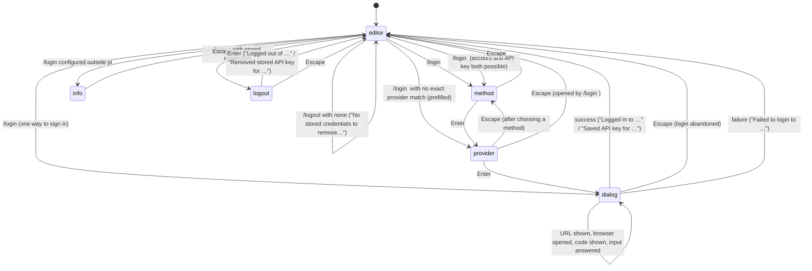

# Login and logout

## Summary

`/login` stores a credential for a provider in `~/.pi/agent/auth.json` so that its models become available; `/logout` removes a stored credential. `/login` with no argument walks through two selectors, the authentication method (`Sign in with an account` or `Sign in with an API key`) and the provider, and then replaces the editor with the login dialog: for an account sign-in the dialog shows a hyperlinked URL (and opens the browser), a device code, or an input for a pasted callback code, depending on the provider; for an API key it shows one input. `/login <provider>` skips the selectors when the provider is unambiguous. On success a status line names the provider and the file, the model catalogue for that provider is refreshed, and, when no model was selected, the provider's default model is selected and saved as the default.

`/logout` lists only credentials saved by `/login`; environment variables are never touched, and pi says so. Neither command starts or stops a turn: the overlays open over a working turn, and a credential change is felt on the next model call.

This document describes what pi draws. What the vendor's own browser page asks for is the vendor's and is not described.

## The simple case

With `ANTHROPIC_API_KEY` already in the shell, the user types `/login`. The editor is replaced by a small panel titled `Select authentication method:` with two rows, `Sign in with an account` highlighted and `Sign in with an API key` under it, and the hint `↑↓ navigate  Enter select  Esc cancel`. The user presses Down and Enter. The panel becomes `Select provider to configure:` with a search box and eight provider rows, each with a status: `Anthropic ✓ env: ANTHROPIC_API_KEY`, `OpenAI • unconfigured`, and so on. They type `open`, the list shrinks to OpenAI, and they press Enter.

The panel becomes `Login to OpenAI` with `Enter OpenAI API key` and an input line under it, and `(Esc to cancel, Enter to submit)`. They paste the key and press Enter. The editor returns with its old text, a dim status line reads `Saved API key for OpenAI. Credentials saved to /Users/me/.pi/agent/auth.json`, and the footer's right side changes from `claude-opus-4-8 • medium` to `(anthropic) claude-opus-4-8 • medium` because two providers are now available. The model is unchanged; Ctrl+L now lists OpenAI's models too.

Later they type `/logout`, see `Select provider to logout:` with the single row `OpenAI ✓ configured`, press Enter, and read `Removed stored API key for OpenAI. Environment variables and models.json config are unchanged.` The `(anthropic)` prefix disappears.

## The interaction, event by event

### Open

`/login` empties the editor and opens the method selector: a bordered panel, the title `Select authentication method:` in bold accent, the rows `Sign in with an account` and `Sign in with an API key`, and the hint line. Up, Down, `k`, and `j` move; Enter chooses; Escape or Ctrl+C closes. Choosing a method opens the provider selector:

- the title `Select provider to configure:` in bold accent;
- a search box;
- up to eight rows of providers sorted by display name, the highlighted one starting with `→ `, with a muted `(i/n)` counter when there are more; the highlight does not wrap;
- after each name, the provider's status: ` • unconfigured` in the muted colour; ` ✓ configured` in green for a stored credential or an account sign-in; ` ✓ env: OPENAI_API_KEY` in green for an environment variable (several are listed comma-separated); ` ✓ key in models.json` or ` ✓ command in models.json` for a custom provider; or, when the provider is configured by the other method, ` • subscription configured` or ` • API key configured` in the warning colour.

Only providers that offer the chosen method are listed, so the account list is short (Anthropic, GitHub Copilot, OpenAI, OpenRouter, xAI, and a few more) and the API-key list is long.

`/login <term>` matches the term against provider ids and display names, case-insensitively and exactly (`/login anthropic`, `/login OpenAI`). One match with one way to sign in opens its dialog directly. One provider offering both an account sign-in and an API key opens the method selector titled `Select authentication method for <Name>:`; some providers name their account option differently (`Sign in with OpenRouter`, `Sign in with SuperGrok or X Premium`). No match opens the provider selector with every provider of both kinds, the term already in the search box, and a `[subscription]` or `[API key]` label after each name because the list mixes the two. `/login ` with only spaces is `/login`.

`/logout` reads the stored credentials (15-second limit) and opens `Select provider to logout:` listing only those, each as `<Name> ✓ configured`, with `[subscription]`/`[API key]` labels when both kinds are present. Typing filters; Enter removes; Escape or Ctrl+C closes.

All of these open while the agent is working, retrying, or compacting; the turn continues behind them. Any other overlay is closed first.

### Dismissed at once

`/logout` with nothing stored does not open anything: a status line reads `No stored credentials to remove. /logout only removes credentials saved by /login; environment variables and models.json config are unchanged.` If the file cannot be read, `Error: Could not read stored credentials: <message>`.

`/login <provider>` for a provider whose API key is configured outside pi and has no login of its own (Google Vertex AI, for example) opens an information panel titled `<Name> setup` with `<credential name> is configured outside pi.` and `(Esc to close)`; Escape or Ctrl+C closes it and nothing else happens.

In the method selector, Escape closes and the editor returns. In the provider selector reached through the method selector, Escape steps back to the method selector; in the provider selector opened by `/login <term>`, Escape closes. A filter that matches nothing shows `No matching providers`; Enter then does nothing. A method with no providers (`No subscription providers available.`, `No API key providers available.`, `No login providers available.`, `No login methods available.`) shows that status instead of a selector.

### First change

Choosing a provider replaces the selector with the login dialog: a bordered panel titled `Login to <Name>` whose content the sign-in builds up step by step. For an API key the first and only step is the prompt `Enter <credential name>` (the credential name is the provider's, such as `Enter OpenAI API key` or `Enter Gemini API key`), an input line, and `(Esc to cancel, Enter to submit)`. Amazon Bedrock first shows three lines saying an AWS profile, IAM keys, or role-based credentials work too and where `providers.md` is.

For an account sign-in the first step depends on the provider and is one of:

- a URL in the accent colour that is a terminal hyperlink, under it `Cmd+click to open` (macOS) or `Ctrl+click to open` in the dim colour, optional instructions in the warning colour, and the browser opened automatically;
- a URL in the same form followed by `Enter code: XXXX-XXXX` in the warning colour, then `Waiting for authentication...` in the dim colour and `(Esc to cancel)`; the browser is not opened for this kind;
- a question with an input line, such as `GitHub Enterprise URL/domain (blank for github.com)`, answered with Enter (an empty answer is allowed where the question says so);
- a small selector (`Select OpenAI Codex login method:`) with the same keys as the method selector, which takes the dialog's place and gives it back after Enter; Escape there abandons the login.

### While open

The dialog only grows. Progress lines (`Exchanging authorization code for tokens...`, `Enabling models...`) are appended in the dim colour. When a step needs typing, an input line appears under its message with `(Esc to cancel, Enter to submit)`, or for a pasted callback code `Complete login in your browser, or paste the authorization code / redirect URL here:` with `(Esc to cancel)`. Enter submits the input; the line is replaced by `> <what was typed>` so earlier answers stay visible. What is typed is shown as typed, API keys included; there is no masking. A step that waits on the browser finishes by itself when the vendor calls back, and the input, if any, is withdrawn. When a provider's flow was abandoned on the vendor's side, the dialog stays until Escape or until the provider's own time limit fails the login.

Escape or Ctrl+C at any point abandons the login: the dialog's abort reaches the sign-in in progress, the editor returns with its text, and nothing is written. Whether a line is printed is in "Open questions". The turn behind the dialog keeps streaming; the status line and footer keep updating; no key reaches the editor.

> Technical note: the dialog is a single component that the provider's sign-in drives through four kinds of event (information, an authorisation URL, a device code, progress) and four kinds of question (text, secret, a selection, a manual code). pi draws each the same way for every provider; which ones a provider uses, and in what order, is the provider's. A second login for the same provider waits for the first to finish.

### Accepted

When the sign-in completes, the credential is written to `auth.json` (creating the file with owner-only permissions if needed), the editor returns, and a status line is added: `Logged in to <Name>. Credentials saved to <path>` for an account, `Saved API key for <Name>. Credentials saved to <path>` for a key, with the full path of `auth.json`. The footer's provider count updates at once, so `(provider)` may appear in front of the model; the border is redrawn.

If no real model was selected when the login started (the footer read `unknown`), the provider's default model (`claude-opus-4-8` for Anthropic, `gpt-5.5` for OpenAI, `gemini-3.1-pro-preview` for Google, `gpt-5.4` for GitHub Copilot) is selected, recorded in the session, and saved as the default model; the status reads `Logged in to <Name>. Selected <id>. Credentials saved to <path>` and the footer shows the model with the thinking level derived for it. When that cannot be done the plain status is followed by an error line, one of:

- `Logged in to <Name>, but no default model is configured for provider "<id>". Use /model to select a model.`
- `Logged in to <Name>, but no models are available for that provider. Use /model to select a model.`
- `Logged in to <Name>, but its default model "<id>" is not available. Use /model to select a model.`
- `Logged in to <Name>, but selecting its default model failed: <message>. Use /model to select a model.`

(with `Saved API key for <Name>` in place of `Logged in to <Name>` after a key). A model already selected is never changed by a login, whatever provider it belongs to.

An Anthropic login by account (or a key beginning `sk-ant-oat`) shows the one-time subscription warning described in [the model selector](the-model-selector.md#accepted), immediately if the Anthropic model was just selected, otherwise only if the current model is Anthropic's.

Then the provider's catalogue is refreshed in the background (15-second limit); the footer updates again when it finishes. A refresh that times out or fails adds `Warning: Logged in to <Name>, but its model catalog refresh timed out; using cached models.`, `…, but its model catalog could not be refreshed; using cached models.`, or `…, but its model catalog could not be refreshed: <message>`; the built-in catalogue is used.

A sign-in that fails ends with `Error: Failed to login to <Name>: <message>` or `Error: Failed to save API key for <Name>: <message>`; the editor returns and nothing is stored. If the credential was stored but pi's own model list could not be rebuilt, the message is `Logged in to <Name>, but local model state could not be synchronized: <message>` (or the `Saved API key` form); the file has the credential and a restart or `/reload` picks it up.

`/logout` on a row removes that credential (15-second limit) and shows `Logged out of <Name>` for an account, or `Removed stored API key for <Name>. Environment variables and models.json config are unchanged.` for a key; the provider count and footer update. Failures: `Error: Logout failed: <message>`, or `Error: Credentials removed for <Name>, but local model state could not be synchronized: <message>`. The current model is not changed by a logout, even when it belongs to that provider.

## Modifiers

| Modifier | Before open | While open |
| --- | --- | --- |
| Model | A selected model is never changed by `/login`; with the `unknown` placeholder in the footer, a login selects and saves the provider's default. `/logout` never changes it. | No effect until accepted. |
| Thinking level | Unchanged by logout. A login that selects a model re-derives the level for it (per-model setting, saved default, else the current level, clamped). | No effect. |
| Agent busy | The overlays open over a working turn; the turn continues. A new credential is used from the next model call; a removed one fails the next model call of that provider. | The current model call finishes with the credential it started with. |
| Attachments | Editor text and images are kept behind the overlays and return. | No effect. |
| Session kind | Saved or ephemeral, credentials go to `auth.json` and the default model to settings; the auto-selected model is a session entry only in a saved session. | No effect. |

## Cancel and interrupt

| Event | Before open | While open |
| --- | --- | --- |
| Escape (once; twice within 500 ms) | The editor's Escape; see [input](../foundations/input.md#escape). | Method selector: closes. Provider selector: back to the method selector, or closes when opened by `/login <term>`. Dialog: abandons the login; nothing stored. Logout selector: closes. None of these arm the double-Escape window. |
| Ctrl+C once / twice; Ctrl+D | Clears the editor; twice quits. | Ctrl+C does exactly what Escape does in every panel and never counts toward quitting. Ctrl+D goes to the search box or the dialog's input. |
| Another message submitted (Enter; Alt+Enter follow-up) | A prompt sent after a login uses the current model, which a login does not change unless none was selected. | Enter chooses a row or submits the input. Alt+Enter goes to the search box or input and does nothing. |
| A slash command or shortcut that opens an overlay or changes the session | A session switch does not touch credentials. `/login` and `/logout` close any other overlay first. | No slash command can be typed; Ctrl+L, Ctrl+P, Ctrl+O, and the rest are swallowed. |
| Model or thinking level changed | No effect. | Not possible until the panel closes. |
| Provider error, rate limit, timeout, or network lost | `/logout` reading the file fails: `Error: Could not read stored credentials: …`. | The vendor rejecting or timing out ends the dialog with `Error: Failed to login to <Name>: <message>`. The post-login catalogue refresh failing only adds a warning. A turn failing behind the panel is shown in the transcript as usual. |
| Context window exhausted (auto-compaction) | No effect. | Compaction continues behind the panel. |
| Terminal resized; pi suspended (Ctrl+Z) and resumed | No effect. | Panels redraw at the new width; long URLs wrap. Ctrl+Z goes to the input; pi is not suspended while a panel is open. |
| Process ends: terminal closed (SIGHUP), SIGTERM, killed | No effect. | A login in progress is abandoned and nothing is written; the browser tab it opened is left open. A credential already written stays. |
| Session or files changed from outside | `auth.json` written by another pi process is re-read when it changes, so a login elsewhere shows up in the next `/login` status column and `/logout` list. | Two logins for the same provider from two processes are serialised on the file; the later one wins. |
| Credentials lost, or logged out | `/logout` of the provider in use leaves the model in the footer; the next model call fails with a credential error (see [the turn](../foundations/the-turn.md#cancel-and-interrupt)). An environment variable for the same provider keeps it available after `/logout`. | Not possible from inside the panels. |

## Interactions with other systems

**Session persistence.** Credentials are not in the session. The only session entries a login can add are the model-change (and thinking-level) entries of an auto-selected model. A logout adds nothing.

**Branching and history.** No interaction; `/login …` and `/logout` are in the prompt history like any submitted line.

**Compaction.** No interaction.

**Context files and the system prompt.** No interaction.

**Settings and keybindings.** An auto-selected model is written to `defaultProvider` and `defaultModel`. `warnings.anthropicExtraUsage` turns the subscription warning off. Keys inside the panels: `tui.select.up`/`down` (Up/Down, plus `j`/`k` in the method selector), `tui.select.confirm` (Enter), `tui.select.cancel` (Escape and Ctrl+C). The autocomplete popup for `/login ` lists provider ids with a description of the sign-in kind and status.

**Tools and the working directory.** No interaction. The `bash` tool's environment does not carry API keys from `auth.json`.

**Terminal and rendering.** URLs are written as terminal hyperlinks (clickable where the terminal supports them; plain text elsewhere) with the click hint under them. The browser is opened with the platform's opener; on a headless machine nothing opens and the URL must be copied. Typed input, including keys, is echoed in plain text. Each panel takes the editor's slot; the footer stays below.

**Credentials and providers.** A stored credential takes precedence over an environment variable for the same provider; `/logout` removes only the stored one, after which the environment variable applies again. Account tokens are refreshed automatically before they expire; a refresh failure fails a model call, not the login. Where the file lives, its permissions, and the precedence are in [models and credentials](../foundations/models-and-credentials.md#credentials).

## Edge cases

- `/login` with no credentials at all works the same; after success the footer goes from `unknown` to the provider's default model without a visit to the model selector, and the first prompt works. The no-credentials startup is in [launching pi](../startup/launching-pi.md).
- A provider configured by environment variable shows `✓ env: …` in `/login` but is absent from `/logout`, which lists stored credentials only.
- `/login anthropic` offers both `Sign in with an account` and `Sign in with an API key`; choosing the key when an account sign-in is stored replaces the stored credential (one per provider).
- Logging in to a provider that already has a stored credential replaces it silently; there is no confirmation.
- The `(provider)` prefix in the footer counts providers with available models, so a login for a provider whose catalogue is empty until the refresh completes can change the footer twice.
- A login that auto-selects a model also saves it as the default model for future runs, which Ctrl+L's Enter would not have done.
- Escape in the provider selector opened by `/login <term>` closes everything; the same panel reached by `/login` and a method choice steps back instead.
- `Select provider to logout:` never shows `No providers logged in. Use /login first.`; the empty case is caught before the panel opens.
- The method selector accepts `j` and `k` as Down and Up; the provider selector and the dialog do not (they are typed into the search box or input).
- `/logout` while a model call of that provider is in flight does not interrupt the call.
- The `/login ` autocomplete popup lists provider ids (`anthropic`, `openai`, …), not display names, though `/login OpenAI` typed by hand also works.
- A provider offering only an account sign-in (no API key) skips the method selector when named: `/login github-copilot` opens its dialog directly.
- Two pi processes logging in to the same provider at once both succeed; the file is written under a lock and the later write wins.
- The path in the success status is the real path (`/Users/me/.pi/agent/auth.json`, or wherever `PI_CODING_AGENT_DIR` points), not `~`.

## Open questions and verification

- What is printed on Escape in the login dialog was not settled. The dialog's own completion message is `Login cancelled`, but it is discarded in the default flows; the abandoned sign-in rejects with the abort's own text, which the handler compares against `Login cancelled` and otherwise prints as `Error: Failed to login to <Name>: <message>` (or `Failed to save API key…`). Reading the code, an Escape probably prints `Error: Failed to login to <Name>: This operation was aborted`. May be worth treating as a bug rather than documenting.
- That Ctrl+C in the login dialog behaves as Escape (both are the cancel binding) answers the question left open in [input](../foundations/input.md); it was read from the dialog and not tried.
- The typed API key being shown in plain text while typing was read from the input component (no masking); worth confirming by hand and considering as a defect.
- Whether the footer loses its model after `/logout` of the current provider, or keeps it until the next call, was read from the logout path (nothing clears it) and not observed.
- The exact `✓ …` status texts for custom and cloud providers were read from the selector's tests; the set of providers shown in the default build was not enumerated.
- Whether the browser opens before or after the URL is drawn, and what happens when no opener exists, was not tried.
- The 15-second limits on reading and removing credentials were read from the handlers; what the user sees if one is hit (probably `Logout failed: …`) was not observed.
- Whether a login for the provider of a model call in flight affects that call (it should not: credentials are resolved at the start of each call) was not tried.

Verified against pi-mono commit `a69bef789`.
