# The model selector

## Summary

The model selector is the overlay that lists every available model and lets the user pick one. It opens with `/model` or Ctrl+L, or with `/model <term>` when the term does not name exactly one model. It replaces the editor with a search box and a list of up to ten rows; typing filters the list, Up and Down move the highlight, Enter picks the highlighted model for this session, Ctrl+S picks it and saves it as the default model for future sessions, and Escape closes without changing anything. When a model scope exists, Tab switches the list between every available model and the scope. While the overlay is open, pi refreshes the model catalogue in the background and reports a failure inline without closing.

`/model <term>` is a shortcut: when the term names exactly one available model (`provider/id` or a bare id that exists under one provider), the model is selected at once with no overlay. A model whose provider has no credential cannot be chosen: the all list does not show it, and choosing it from the scoped list is refused with `Error: No API key for <provider>/<id>`.

Selecting a model is recorded in the session and shown in the footer at once. It does not start a turn; if the agent is working, the new model is used from the next model call.

## The simple case

The user presses Ctrl+L. The editor is replaced by a bordered panel: a warning-coloured line `Only showing models from configured providers. Use /login to add providers.`, an empty search box, and a list whose first row is the current model, marked with a green `✓` and highlighted with `→`. Below the list a dim `Model Name: Claude Opus 4.8` line names the highlighted model, and a muted `Refreshing model catalogs…` line sits under that; a moment later it reads `Model catalogs refreshed.` in the success colour. The hint at the bottom reads `Enter to select · Ctrl+S to set as default · Esc to cancel`.

The user types `sonnet`; the list shrinks to the models whose id, name, or provider matches, and the highlight moves to the top row. They press Enter. The overlay closes, the editor returns with its text intact, a dim status line `Model: claude-sonnet-4-6` is added to the transcript, the footer's right side changes to the new id, and the editor border takes the colour of the thinking level now in effect.

## The interaction, event by event

```mermaid
stateDiagram-v2
    [*] --> editor
    editor --> selected : /model <term> names exactly one model (status "Model: id")
    editor --> open : Ctrl+L, /model, or /model <term> with no single match
    open --> open : typing filters; Up/Down move; Tab switches all/scoped
    open --> open : catalogue refresh completes (list rebuilt, or an error line)
    open --> editor : Escape or Ctrl+C (nothing changes)
    open --> selected : Enter (session only)
    open --> saved : Ctrl+S (session and default)
    open --> refused : Enter on a model whose provider has no credential
    selected --> editor : status "Model: id"
    saved --> editor : status "Default model: provider/id"
    refused --> editor : "Error: No API key for provider/id"
```

### Open

Three things open the overlay. Ctrl+L (`app.model.select`) opens it with an empty search box. `/model` on its own does the same; the editor is emptied first. `/model <term>` first tries to resolve the term without the overlay (see "Dismissed at once") and opens the overlay with the term already in the search box only when that fails. All three work while the agent is working, retrying, or compacting; the turn continues behind the overlay. If another overlay is open it is closed first.

From the top, the panel shows:

- a border line in the editor's border colour, then a blank line;
- with no scope, `Only showing models from configured providers. Use /login to add providers.` in the warning colour; with a scope, `Scope: all | scoped` with the active word in the accent colour and the other muted, and under it `Tab scope (all/scoped)`;
- a blank line, the search box (one line, with the cursor), a blank line;
- the list: up to ten rows, each `<id> [<provider>]`, with ` · default` in the muted colour after the saved default model and ` ✓` in green after the current model; the highlighted row starts with `→ ` and its id is in the accent colour;
- when the list is longer than ten, a muted `(i/n)` counter: the highlighted row's position and the list length; the visible window keeps the highlight in its middle as it moves and stops at the ends;
- a blank line and `Model Name: <name>` in the muted colour: the highlighted model's display name (`Claude Opus 4.8`), not its id;
- a blank line and `Refreshing model catalogs…` in the muted colour while the refresh runs;
- a blank line, the dim hint `Enter to select · Ctrl+S to set as default · Esc to cancel`, and a border line.

The all list is sorted with the current model first, the saved default second, then by provider name, models within a provider in catalogue order. The scoped list keeps the scope's own order. The highlight starts on the current model in either list; if the current model is not in the list, on the first row. With a scope, the overlay opens on the scoped list.

> Technical note: the list is drawn from the catalogue snapshot already in memory, so the overlay appears instantly; the refresh that follows asks every configured provider for its current model list with a 15-second limit and is cancelled if the overlay closes first. Several overlays opened in succession share one refresh.

### Dismissed at once

`/model <term>` ends without the overlay when the term is an exact reference to one available model. The match is case-insensitive and tries, in order:

1. the whole term against `provider/id`;
2. the term split at its first `/` into a provider and an id (so an id containing `/`, as some gateway models have, still matches);
3. the term as a bare id, accepted only if exactly one available model has it.

A bare id present under two providers is not a match, and neither is a substring (`/model opus`). With a scope, only the scoped models are searched and nothing is refreshed. With no scope, the in-memory catalogue is searched first; on a miss, a status `Refreshing model catalogs…` is shown, the catalogue is refreshed (15-second limit), a warning is added if that failed (`Model refresh timed out; searching cached models.`, `Could not refresh <providers>; searching cached models.`, or `Could not refresh model catalogs: <message>`), and the search is repeated against the refreshed list. On a match the model is selected exactly as Enter in the overlay would select it: status `Model: <id>`, footer and border updated, recorded in the session. On no match the overlay opens with the term in the search box and the list already filtered, so `/model opus` is a quick way to open the selector on the matching rows.

Escape or Ctrl+C in the overlay closes it at once: the editor returns with its text, the highlight is forgotten, the refresh is cancelled, and nothing is recorded. Neither key counts toward the double-Escape or double-Ctrl+C window.

Enter with an empty list (the filter matched nothing, or no model is available) does nothing; the overlay stays open.

### First change

The first keystroke that is not Up, Down, Tab, Enter, Ctrl+S, Escape, or Ctrl+C goes to the search box. The list is filtered at once, fuzzily, against each model's id, provider, and display name, and the highlight moves to the top row so the best match is highlighted. Any prefix of the word `default` (`d`, `de`, `def`, …) floats the saved default model to the top of the results. With a scope, Tab switches between the all list and the scoped list, keeping the query and putting the highlight back on the current model (or the first row); the `Scope:` line changes which word is accented. Without a scope, Tab does nothing.

### While open

Up and Down move the highlight and wrap at both ends. Editing the query re-filters and puts the highlight on the top row again; clearing the query restores the full list with the highlight left where it was (clamped to the list). `Model Name:` follows the highlight.

When the background refresh finishes, the list is rebuilt from the fresh catalogue with the same query: models added by a vendor appear, models withdrawn disappear, and the scoped list is re-pointed at the refreshed entries. With an empty query the highlight is put back on the current model; with a query it goes to the top row. On success the muted line becomes `Model catalogs refreshed.` in the success colour. On failure the muted line disappears and one or more lines in the error colour take the place of the `Model Name:` line:

- `Model refresh timed out; showing cached models.` after 15 seconds;
- `Could not refresh <provider>; showing cached models.` when one vendor failed;
- `Could not refresh N model catalogs (<providers>); showing cached models.` when several did;
- `Could not refresh model catalogs: <message>` when the refresh itself threw;
- otherwise the runtime's own configuration error, such as a `models.json` that does not parse or a provider that failed to load, which can span several lines.

The list stays usable with the cached models; every key works as before.

Behind the overlay the turn, if any, keeps streaming into the transcript; the status line and footer keep updating. No key reaches the editor.

### Accepted

Enter selects the highlighted model for this session. Ctrl+S selects it and also writes it as the default (`defaultProvider` and `defaultModel` in the global settings). Either way the overlay closes, the editor returns, and a status line is added: `Model: <id>` for Enter, `Default model: <provider>/<id>` for Ctrl+S. The footer's right side shows the new id (with `(provider)` in front when more than one provider is available), and the editor border takes the colour of the thinking level that now applies.

The thinking level is re-derived for the new model: a per-model level from the settings panel wins, then the saved `defaultThinkingLevel` if one is set, otherwise the current level carries over; the result is clamped to what the new model supports, and `off` for a model that does not reason. No status line mentions the level; the footer and the border show it.

Both the model change and any thinking-level change are appended to the session as entries. If the agent is working, the current model call finishes with the old model and the next call uses the new one. Ctrl+S does not change the default thinking level.

> Technical note: Ctrl+S writes the settings file at once, field-merged under a lock, so a second pi process sees the new default on its next start. The session-only choice made with Enter is equally durable for that session: resuming it restores the chosen model, not the default.

When the new model is an Anthropic model and the Anthropic credential is a subscription login (or an `sk-ant-oat…` key), a one-time warning follows the status line: `Warning: Anthropic subscription auth is active. Third-party harness usage draws from extra usage and is billed per token, not your Claude plan limits. Manage extra usage at https://claude.ai/settings/usage. Disable this warning in /settings.` It is shown at most once per run, including the startup check.

If the chosen model's provider has no credential (only possible from the scoped list, which is not filtered by availability, or when a credential vanished since the list was drawn), the overlay closes and `Error: No API key for <provider>/<id>` is shown; the model is unchanged. See [login and logout](login-and-logout.md).

## Modifiers

| Modifier | Before open | While open |
| --- | --- | --- |
| Model | The current model is ticked, listed first in the all list, and highlighted at open. `(provider)` in the footer counts available providers, not listed ones. | Cannot be changed except by accepting; Ctrl+P is swallowed by the search box. |
| Thinking level | Shown in the footer and the border, not in the overlay. | Accepting re-derives it for the new model (per-model setting, then saved default, then the current level, clamped). |
| Agent busy | Idle or working, the overlay opens the same way. | The turn continues behind it. Accepting mid-turn takes effect from the next model call; the call in progress finishes with the old model. |
| Attachments | Editor text and attached images are kept behind the overlay and return with it. | No effect. |
| Session kind | Saved: the change is an entry in the session. Ephemeral: the change lasts for the run; Ctrl+S still writes the settings file. | No effect. |

The list itself depends on which providers have credentials and, for the scoped list, on `--models`, `enabledModels`, and `/scoped-models`; see [cycling models](cycling-models.md).

## Cancel and interrupt

| Event | Before open | While open |
| --- | --- | --- |
| Escape (once; twice within 500 ms) | The editor's Escape; see [input](../foundations/input.md#escape). | Closes the overlay with nothing changed; the refresh is cancelled. The press does not arm the double-Escape window, so a second Escape is a first Escape on the editor. |
| Ctrl+C once / twice; Ctrl+D | Clears the editor; twice quits. | Ctrl+C closes the overlay like Escape and does not count toward quitting. Ctrl+D goes to the search box and does not quit. |
| Another message submitted (Enter; Alt+Enter follow-up) | Enter sends or queues as usual; a `/model` line is a slash command and never reaches the model. | Enter accepts the highlighted model. Alt+Enter goes to the search box and does nothing. |
| A slash command or shortcut that opens an overlay or changes the session | Opening the selector closes any other overlay first. | No slash command can be typed; every application shortcut (Ctrl+L, Ctrl+O, Ctrl+T, Shift+Tab, Ctrl+P) is swallowed by the search box. |
| Model or thinking level changed | `/model <term>` with one match changes the model without an overlay. | Only by accepting. |
| Provider error, rate limit, timeout, or network lost | `/model <term>` on a cache miss shows a warning and searches the cached catalogue. | The refresh fails: an error line replaces `Model Name:`, the cached list stays selectable. A turn failing behind the overlay is shown in the transcript as usual. |
| Context window exhausted (auto-compaction) | No effect. | Compaction runs behind the overlay; accepting during it records the change and the next model call uses the new model and its window. |
| Terminal resized; pi suspended (Ctrl+Z) and resumed | No effect. | The panel redraws at the new width. Ctrl+Z goes to the search box; pi is not suspended while an overlay is open. |
| Process ends: terminal closed (SIGHUP), SIGTERM, killed | No effect. | The overlay is gone; nothing was changed or recorded. |
| Session or files changed from outside | `models.json` is re-read by every refresh, so an edit shows up when the overlay next opens. | A credential written by another pi process is picked up when the refresh completes. |
| Credentials lost, or logged out | The all list omits models of providers without a credential; the scoped list does not. | Enter on a model whose provider lost its credential is refused with `Error: No API key for <provider>/<id>`. |

After any close the editor has the text it had before, the cursor where it was, and bash mode if the text starts with `!`.

## Interactions with other systems

**Session persistence.** Accepting appends a model-change entry and, when the level changed, a thinking-level entry, at the active position. They are written with the session file like any other entry (the file itself is created with the first assistant message; see [sessions](../foundations/sessions.md)). Resuming the session restores the model recorded last if it is still available.

**Branching and history.** The entries are part of the branch they were made on. Moving the active position with `/tree` changes the messages only and leaves the model as it is; resuming, forking, or cloning restores the model recorded on the branch opened, and the selector then shows that model as current. Like every built-in slash command, the `/model` line is not added to the prompt history.

**Compaction.** The new model's context window sets the auto-compaction threshold from the next model call. A switch to a model with a larger window lifts an overflow without compaction: the overflow check is skipped when the last assistant message came from a different model. See [compaction](../sessions/compaction.md).

**Context files and the system prompt.** No interaction.

**Settings and keybindings.** Ctrl+S writes `defaultProvider` and `defaultModel`. The per-model level comes from `modelThinkingLevels` (the settings panel's per-model submenu) and the fallback from `defaultThinkingLevel`. `enabledModels` decides whether the scoped list exists. `warnings.anthropicExtraUsage` turns the subscription warning off. Keys: `app.model.select` (Ctrl+L) opens; `tui.select.up`, `tui.select.down`, `tui.select.confirm` (Enter), `tui.select.cancel` (Escape and Ctrl+C), and `tui.input.tab` (Tab) work inside; Ctrl+S is fixed and not rebindable.

**Tools and the working directory.** The model's `bash` tool sees `PI_PROVIDER`, `PI_MODEL`, and `PI_REASONING_LEVEL` for the new selection from its next call.

**Terminal and rendering.** The panel takes the editor's slot between the status line and the footer and grows with its content (header, box, up to ten rows, counter, name line, refresh line, hint). Long rows wrap at the terminal width. The only animation is a turn streaming behind it.

**Credentials and providers.** "Available" means the provider has a credential at the moment the list is drawn; see [models and credentials](../foundations/models-and-credentials.md). The refresh is per provider, so one failing vendor is named and the others still update. `/login` adds a provider's models to the next list; `/logout` removes them from the all list but not from a scope.

## Edge cases

- With no credentials at all the overlay still opens: the hint line about `/login`, an empty search box, and `No matching models`.
- `/model` with trailing spaces is `/model`. `/model Claude-Opus-4-8` matches case-insensitively. `/model opus` (a substring, not an id) opens the overlay filtered to `opus`; the fuzzy partial matching that `--model` uses on the command line is not used by `/model`.
- A bare id that exists under two providers (`/model gpt-5.5` with both OpenAI and GitHub Copilot available) opens the overlay instead of choosing; `/model openai/gpt-5.5` chooses.
- Choosing the model that is already current still records a model-change entry and shows `Model: <id>`.
- The `(i/n)` counter appears only when more than ten rows match; with ten or fewer there is no counter.
- Once a refresh error is shown, the `Model Name:` line and the `No matching models` line are not shown again for the life of that overlay; the error lines take their place even while filtering.
- When the refresh completes with an empty query, the highlight jumps back to the current model even if the user had moved it in the meantime.
- `Ctrl+S` on a model that is already the default rewrites the same values and still shows `Default model: …`.
- The autocomplete popup for `/model ` offers every available model: the id as the label, the provider as the description, and `provider/id` as the value inserted.
- The scoped list can contain a model whose provider has been logged out since startup; the all list never can. Tab between them shows the difference.
- Tab with no scope does nothing at all: no hint changes, no list changes. The `Scope:` header exists only when a scope does.
- Up on the top row wraps to the bottom row and Down on the bottom row to the top, so the counter can jump from `(1/37)` to `(37/37)`.
- A paste into the search box is treated as typed text (bracketed paste is handled by the box), so pasting `anthropic/claude-opus-4-8` filters as if typed.
- The search box starts empty for Ctrl+L and `/model`; only `/model <term>` pre-fills it. A query is never remembered from one opening to the next.
- The easter-egg component some model ids trigger is out of scope and not described.

## Open questions and verification

- The highlight jumping back to the current model when the background refresh completes (empty query) was read from the refresh path and not observed by hand. It makes the first second after opening unreliable for Down-then-Enter. May be worth treating as a bug rather than documenting.
- Once a refresh error is displayed, the `Model Name:` line never returns in that overlay because the error branch is exclusive with it. May be worth treating as a bug rather than documenting.
- Whether the `Only showing models from configured providers…` line is drawn in the warning colour or the theme's muted colour was read from the component (warning) and not checked against both themes.
- What Ctrl+D does inside the search box (delete forward, or nothing) was not determined; that it does not quit was.
- The refusal `Error: No API key for <provider>/<id>` was read from the session's model setter; reaching it requires a scoped model whose provider has been logged out, which was not tried by hand.
- Whether the `(provider)` prefix in the footer changes on the same frame as the `Model:` status, or one frame later, was not checked.
- Whether Ctrl+L pressed during startup (while the editor still answers `Startup is still in progress`) is dropped, held, or opens the selector early was not determined.
- The Anthropic subscription warning's once-per-run guard is shared with the startup check; whether a user who saw it at startup ever sees it from the selector was inferred (no) and not confirmed.

Verified against pi-mono commit `a69bef789`.
