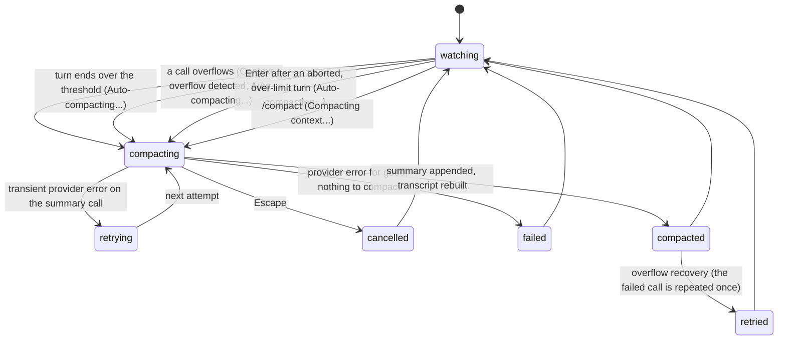

# Compaction

## Summary

Compaction keeps a long session inside the model's context window. When the context the model last used grows past the window minus 16,384 tokens, or when a model call fails because the context no longer fits, pi asks the model for a structured summary of the older part of the conversation, appends that summary to the session as a compaction entry, and from then on sends the model the summary followed by only the newest messages (about 20,000 tokens of them). The user can also ask for it at any time with `/compact`, optionally with instructions about what the summary should focus on. Nothing is removed from the session file or from `/tree`; what changes is what the model is sent and how the transcript is drawn.

Compaction runs on its own at three moments: after a turn whose context crossed the threshold, in the middle of a turn when a call overflowed (in which case the call is retried once), and just before a prompt is sent if the previous turn was aborted while over the limit. It is on by default (`compaction.enabled`), shown by `(auto)` in the footer, and can be cancelled with Escape while it runs.

## The simple case

A session has been going for an hour. The footer's context figure has turned from the warning colour at `72.4%/200k (auto)` to the error colour at `92.1%/200k (auto)`. The model finishes a response and, instead of the status line clearing, it reads `Auto-compacting... (escape to cancel)` for ten seconds or so. Then the transcript is redrawn: the older messages are gone from the screen, the last few exchanges remain, and at the bottom sits a shaded box labelled `[compaction]` reading `Compacted from 185,212 tokens (Ctrl+O to expand)`. The footer shows `?/200k (auto)` because pi does not yet know how big the new context is. The editor is ready; the status line is empty.

The user presses Ctrl+O to read the summary: goals, what is done and in progress, the decisions made, the next steps, and a list of the files that were read and modified. They send the next prompt; the model answers with full knowledge of what came before, and the footer shows `14.8%/200k (auto)`.

## The interaction, event by event



### Compose

Compaction has no composition of its own except the command. `/compact` alone, or `/compact <instructions>` with anything after a space, is a built-in slash command: it is matched on the trimmed text, runs at once whatever the agent is doing, and is never queued. The instructions are free text; they are appended to the summariser's own instructions as `Additional focus: …`, so `/compact focus on the database schema decisions` steers the summary without replacing its structure.

### Resolves at once

- **`/compact` with nothing to summarise.** The status line flashes `Compacting context... (escape to cancel)` and the transcript shows `Error: Compaction failed: Nothing to compact (session too small)`. This is the case whenever the whole branch fits within the 20,000 tokens that are always kept, including an empty session.
- **`/compact` right after a compaction.** `Error: Compaction failed: Already compacted`.
- **`/compact` with no model or no credential.** `Error: Compaction failed: No model selected.` (followed by the usual `/login` and `/model` hints) or `Error: Compaction failed: No API key found for <provider>.`
- **Auto-compaction with no model.** Nothing happens and nothing is shown; the turn settles.
- **Auto-compaction when the branch fits in the kept budget.** Nothing happens; the threshold can be crossed by a single huge turn that cannot be cut (see "Edge cases").

### Sent

Whichever way it starts, compaction begins with a status line and an Escape rebinding:

- `/compact` first aborts the turn in progress, if any, exactly as Escape would except that queued messages are dropped rather than returned to the editor. The partial assistant message is written with `Operation aborted`. The aborted turn is not resumed afterwards. The status line then reads `Compacting context... (escape to cancel)`.
- A threshold compaction after a turn shows `Auto-compacting... (escape to cancel)` in place of `Working...`. The same text appears before a prompt is sent when the previous turn was aborted over the limit; the prompt is held until compaction ends and appears in the transcript after the `[compaction]` box.
- An overflow shows `Context overflow detected, Auto-compacting... (escape to cancel)`. The failed call's error is already in the transcript as the end of the assistant message.

The five ways in, side by side:

| Trigger | When it runs | Status line | Afterwards |
| --- | --- | --- | --- |
| Threshold | After the turn settles with the last call's context over the window minus 16,384 tokens. | `Auto-compacting... (escape to cancel)` | The turn settles; queued messages are delivered. |
| Overflow, call failed | Mid-turn, right after the failed call. | `Context overflow detected, Auto-compacting... (escape to cancel)` | The call is repeated once with the compacted context. |
| Overflow, call succeeded | After the turn, when the response's reported input exceeded the window. | `Context overflow detected, Auto-compacting... (escape to cancel)` | The response is kept; nothing is repeated. |
| Aborted over the limit | On Enter, before the new prompt is sent, when the previous turn was aborted with its context over the threshold or overflowed. | `Auto-compacting... (escape to cancel)`, or the overflow text if the aborted call overflowed. | The prompt is sent. |
| `/compact` | At once, after aborting any turn in progress. | `Compacting context... (escape to cancel)` | Nothing resumes; the editor waits. |

The editor stays usable. Enter and Alt+Enter queue into the holding queue with `Queued message for after compaction`; built-in slash commands run; `/reload` refuses; shell commands run. See [the message queue](../conversation/the-message-queue.md) for the holding queue and [busy state](../cross-cutting/busy-state.md) for the full matrix.

> Technical note: the context figure that is compared with the threshold is the token total the provider reported for the last completed model call. When that call failed or reported zero usage, pi estimates instead: the last valid usage plus four characters per token for every message since it, with 4,800 characters per image. Usage reported before the latest compaction is ignored so that a freshly compacted session cannot be compacted again at once. Overflow is detected from the provider's error text (about twenty known phrasings), from a successful call whose input alone exceeded the window, from a length-stop with no output that filled 99% of the window, and from any length-stop that ended below the model's own output limit.

### While working

The summary is a single one-off model call (two for a split turn), made with the current model and credential, tools disabled, and prompt caching off. What the model is given is the older part of the conversation rendered as text (`[User]:`, `[Assistant thinking]:`, `[Assistant]:`, `[Assistant tool calls]: read(path="…")`, `[Tool result]:` with each result cut to 2,000 characters) and instructions to produce a summary in a fixed shape. When a previous compaction exists, its summary is passed in too and the model is told to update it: keep everything, add the new progress, move items from In Progress to Done.

A transient provider error on this call (overloaded, rate limit, network) is retried on the turn's schedule: `Error: <message>` in the transcript, `Retrying (1/3) in 2s... (escape to cancel)` in the status line, then the compaction status again; up to three attempts. Quota and billing errors are not retried.

The cut is decided before the call. Walking back from the newest message, messages are kept until roughly 20,000 tokens have accumulated (`compaction.keepRecentTokens`). The cut lands on the nearest message boundary at or after that point that is a user message, an assistant message, a shell record, or a summary; it never lands on a tool result, which always stays with the call that produced it. A cut that lands on an assistant message is inside a turn: the turn is *split*, and the earlier part of that turn is summarised separately, in a shorter form (`## Original Request`, `## Early Progress`, `## Context for Suffix`), and appended to the main summary under a `---` rule as `**Turn Context (split turn):**`. Model and thinking-level changes immediately before the cut are kept with it. A second compaction summarises from the previous compaction's first kept message, so the messages that survived the first compaction are folded into the updated summary rather than dropped.

### Done

On success the compaction entry is appended: the summary, the id of the first kept message, the token count before, the cost of the call, and the lists of files read and modified. Then:

- The status line clears and Escape goes back to its usual meaning.
- The transcript is cleared and redrawn: the kept messages, then the new `[compaction]` box at the bottom. The box has the bold label `[compaction]` in the custom-message label colour, a blank line, and `Compacted from 185,212 tokens (Ctrl+O to expand)`, on the shaded custom-message background. Expanded (Ctrl+O, together with every other box), it shows `**Compacted from 185,212 tokens**` and the summary as markdown. Status lines, warnings, and errors that were on screen are gone. A later redraw of the transcript (resume, `/tree`, Ctrl+T) puts the box above the kept messages instead, where the model sees it; see "Open questions".
- With `showCacheMissNotices` on, a warning-coloured `Compaction: 12k tokens billed (~$0.04)` follows the box.

  The bottom of the transcript right after a threshold compaction, colours omitted:

  ```
    user: Now add the migration for the users table
    assistant: I'll create the migration…
    [edit src/db/migrations/003_users.ts]
    assistant: The migration is in place and the test passes.

    [compaction]
    Compacted from 185,212 tokens (Ctrl+O to expand)

    Compaction: 14k tokens billed (~$0.05)
  ```
- The footer's context figure becomes `?/200k (auto)` until the next assistant message arrives. The token and cost totals include the summary call.
- Queued messages are released: with an overflow retry pending, holding-queue messages are re-queued as steering or follow-up messages for the retried call; otherwise the first becomes a new prompt and the rest are queued behind it. Steering and follow-up messages already in the queue are delivered by a continuation of the run.
- For an overflow with retry, the failed call is repeated with the new context: `Working...` returns and the response streams in as if the error had not happened. The failed assistant message stays in the file but is not in the context. If the repeated call overflows too, the transcript shows, in the error colour, `Context overflow recovery failed after one compact-and-retry attempt. Try reducing context or switching to a larger-context model.` (or `Truncated response recovery failed after one compact-and-retry attempt.` for a length-stop) and the turn settles.
- For `/compact`, the turn that was aborted is not resumed; the editor waits for the next prompt.

The summary the model sees from then on has this shape:

```
## Goal
## Constraints & Preferences
## Progress
### Done
### In Progress
### Blocked
## Key Decisions
## Next Steps
## Critical Context

<read-files>
src/app.ts
</read-files>

<modified-files>
src/app.ts
</modified-files>
```

Each section is the model's prose or bullet points; the file lists are gathered by pi from the `read`, `write`, and `edit` calls in the summarised messages and carried forward from earlier compactions, so they accumulate across the session.

On failure, nothing is appended. `/compact` shows `Error: Compaction failed: <message>`; an automatic compaction adds a line in the error colour, `Auto-compaction failed: <message>` or `Context overflow recovery failed: <message>`, without the `Error:` prefix. The turn settles, and for an overflow the original error stands.

## Modifiers

| Modifier | Set before sending | Changed while working |
| --- | --- | --- |
| Model | The threshold is the current model's window minus 16,384 tokens. The summary is written by the current model and billed to it; a small-window model compacts sooner and summarises with less room. An overflow error from a model other than the current one is ignored (switching to a larger-window model after an overflow does not compact). | Ctrl+P or `/model` during compaction changes the footer; the summary call keeps the model it started with. The retried call after an overflow uses the new model. |
| Thinking level | Applied to the summary call when the model supports reasoning and the level is not `off`; `/compact` and auto-compaction both pass it. | The running call keeps its level. |
| Agent busy | Idle: `/compact` compacts at once. Working: `/compact` aborts the turn first and drops the queue. Compacting: `/compact` starts a second compaction alongside the first (see "Open questions"). Auto-compaction never runs while a call is in progress; it waits for the run to end. | Submissions queue with `Queued message for after compaction`. |
| Attachments | Images in the summarised messages count 4,800 characters each toward the estimate and are replaced by the summary; the files they came from, if read by a tool, appear in the file lists. | No effect. |
| Session kind | Saved: the compaction entry is appended to the file. Ephemeral (`--no-session`): identical on screen, nothing on disk; a resumed ephemeral session does not exist, so the `?` and the summary are gone on exit. | No effect. |

## Cancel and interrupt

| Event | Automatic | `/compact` |
| --- | --- | --- |
| Escape (once; twice within 500 ms) | Cancels the compaction: `Auto-compaction cancelled` as a dim status, nothing appended, the turn settles. For an overflow, the failed call is not retried and its error stands; the next Enter runs the pre-prompt check, which compacts again before sending. A second Escape on the empty editor is the double-Escape action. | Cancels: `Error: Compaction cancelled` in the error colour; nothing appended; the aborted turn stays aborted. |
| Ctrl+C once / twice; Ctrl+D | Ctrl+C clears the editor; the compaction continues. Twice within 500 ms, or Ctrl+D on an empty editor, quits: the compaction is abandoned and nothing is appended. The aborted turn's messages are already in the file. | Same. |
| Another message submitted (Enter; Alt+Enter follow-up) | Queued with `Queued message for after compaction`; released when compaction ends, re-queued into the retried call when an overflow retry follows, sent as a prompt otherwise. If the compaction is cancelled, the queued messages stay in the pending area until the next compaction or `/tree` move ends (see "Open questions"). | Same; after `/compact` there is no retry, so the first queued message becomes the next prompt. |
| A slash command or shortcut that opens an overlay or changes the session | Overlays open over the status line; compaction continues behind them. `/new`, `/resume`, `/fork`, `/clone`, `/import`, and a `/tree` move abandon the compaction (nothing appended) and switch; the pre-switch abort writes nothing new. `/reload` is refused. `/quit` abandons it and exits. | Same. |
| Model or thinking level changed | Shown in the footer; the running call is unaffected; recorded in the session. | Same. |
| Provider error, rate limit, timeout, or network lost | Transient: `Error: <message>` then `Retrying (n/3) in Ns... (escape to cancel)`, up to three attempts, then `Auto-compaction failed: <message>` (or `Context overflow recovery failed: <message>`) in the error colour and the turn settles. Quota or billing: fails at once. Escape during the countdown cancels the compaction. | Same, with `Error: Compaction failed: <message>` at the end. |
| Context window exhausted (auto-compaction) | This document. The summary call itself is sized to fit: at most the window minus 16,384 tokens of input and 80% of the reserve as output (50% for the split-turn part). | Same. |
| Terminal resized; pi suspended (Ctrl+Z) and resumed | The status line redraws. Suspend does not stop the call; on `fg` the rebuilt transcript appears. | Same. |
| Process ends: terminal closed (SIGHUP), SIGTERM, killed | The summary is lost; nothing is appended; the file holds the turn as it was. On resume the context is still over the threshold, so the first prompt compacts first. | Same. |
| Session or files changed from outside | The summary is built from memory; a context file edited meanwhile is not part of the summary. Another process appending to the file interleaves as described in [sessions](../foundations/sessions.md). | Same. |
| Credentials lost, or logged out | The summary call fails with a credential error: `Auto-compaction failed: …` in the error colour, nothing appended, the turn settles. | `Error: Compaction failed: No API key found for <provider>.` |

After any cancel or failure the editor holds whatever was typed, the status line is empty, and the transcript is as it was plus the message above. The session is in the same state as before the compaction started: the next prompt will trigger the same check again.

## Interactions with other systems

**Session persistence.** One compaction entry per compaction, appended when the summary is ready, as a child of the active position; it records the summary, the first kept entry, the token count before, and the summary call's usage. Nothing is rewritten or deleted. On resume, `Session compacted N times` is shown as a dim status under the redrawn transcript, and the `?` context figure persists until the next response. See [sessions](../foundations/sessions.md).

**Branching and history.** The compaction entry is part of the branch it was made on: `/tree` lists it as `[compaction: 185k tokens]` in the `default` filter and it can be chosen as a point to continue from. Moving to an earlier point with `/tree` leaves the compaction behind on its branch; the model's context is then rebuilt from that branch, compacted or not. `/fork` and `/clone` copy the path including the compaction. Each branch is compacted on its own; a branch summary (see [the tree](the-tree.md)) is a valid cut point and is summarised like a message.

**Compaction.** This document.

**Context files and the system prompt.** The system prompt is not summarised and does not count toward the cut; it is rebuilt for every call as usual. The summary is sent as the first message after it.

**Settings and keybindings.** `compaction.enabled` (the `Auto-compact` row in `/settings`, applied at once; with `false` nothing automatic happens, `(auto)` leaves the footer, an overflow is shown as a plain error and the turn settles, and `/compact` still works), `compaction.reserveTokens` (16,384), `compaction.keepRecentTokens` (20,000), `retry.*` for the summary call, `showCacheMissNotices` for the cost line. Escape is `app.interrupt`; Ctrl+O is `app.tools.expand`.

**Tools and the working directory.** Tool results are the bulk of most contexts and the usual reason for compaction; each is cut to 2,000 characters in what the summariser reads, and the files they touched are listed in the summary so the model can reread them. A tool result is never separated from its call. Compaction runs between model calls, never while a tool runs.

**Terminal and rendering.** The `[compaction]` box wraps to the width and re-wraps on resize. The rebuild after compaction is a full clear and redraw of the transcript below the header, as after `/tree`; in regular mode the old lines remain in the terminal's scrollback above.

**Credentials and providers.** The summary call resolves the credential fresh and is billed like any other call; `/session` and the footer include it. Overflow phrasings differ per provider and a few providers overflow silently, which is why pi also compares the reported input to the window.

## Edge cases

- A single turn larger than the kept budget is split: the user's request and the early tool calls are summarised into a `Turn Context` section and the late part is kept verbatim, so the model may see tool results without the message that asked for them.
- After compaction the next call's context is usually far below the threshold, but one huge tool result can put it over again; compaction then runs after every turn until the result falls out of the kept window. Results already compacted once are re-summarised, not dropped.
- The failed attempts of a retried call and aborted messages are in the file but not in the context; they neither trigger nor survive compaction.
- An overflow on the very first call of a session (a huge prompt or context file) compacts nothing, since there is nothing older than the kept window; the retried call overflows again and the recovery error is shown.
- `/compact` while the agent is idle and the context is over the threshold runs one compaction, not two; the threshold check is skipped because the last message was aborted by the command.
- `/compact` during a response cancels the response: it ends with `Operation aborted`, and after the compaction the editor waits. The half-finished work is not continued.
- A compaction cancelled with Escape during an overflow leaves the failed call's error in the transcript; the next Enter compacts before sending, so the user's prompt goes out against the compacted context on the first try.
- The cost line under the box and the footer totals count the summary call; `/session` does too.
- Switching to a smaller-window model does not compact until the next turn ends; the threshold is checked only after a call.
- The custom instructions given to `/compact` apply to the main summary, not to the split-turn part.
- A summary that asks to call a tool is rejected: `Error: Compaction failed: Summarization attempted to call a tool`.
- `/tree` lists the entry as `[compaction: 185k tokens]`, rounded to thousands; the box in the transcript shows the exact figure.
- Everything after `/compact ` is the instruction, including further lines typed with Shift+Enter; `/compact` followed only by spaces is a plain `/compact`.
- With `compaction.enabled: false` the footer's context figure keeps climbing past 100% and an overflow ends the turn with `Error: <provider message>` (for example `prompt is too long: 213462 tokens > 200000 maximum`) and no retry. `/compact` is the way out; it works regardless of the setting.
- Resuming a compacted session shows `Session compacted N times` under the redrawn transcript and `?` in the footer until the first new response.
- The `?` also appears after a `/tree` move onto a branch whose newest response is older than its compaction.
- A compaction cancelled with Escape during `/compact` still leaves the turn aborted; there is no way to resume it.

## Open questions and verification

- Right after a compaction the `[compaction]` box is drawn at the bottom of the transcript, below the kept messages; every later redraw (resume, `/tree`, Ctrl+T) draws it above them. [The screen](../foundations/the-screen.md) and [the transcript](../conversation/the-transcript.md) describe only the second placement. Whether the first is intended (it is where the compaction happened in time) was read from a code comment and not observed; the two placements may be worth reconciling.
- `/compact` submitted while a compaction is already running starts a second one; Escape then cancels only the newer. May be worth treating as a bug rather than documenting.
- Holding-queue messages after a cancelled compaction are not released until some later compaction or tree move ends; they sit in the pending area with no way to send them other than Alt+Up. May be worth treating as a bug rather than documenting.
- The `/compact` abort drops queued messages instead of returning them to the editor, unlike Escape. Shared with [the message queue](../conversation/the-message-queue.md)'s open question.
- A length-stop below the model's output limit is treated as an overflow and compacts-and-retries even when the context is small; [the turn](../foundations/the-turn.md) describes the length-stop as a plain `Response was truncated before completion.` The two descriptions are of different stages (the loop, then the post-run check) and were not reconciled by hand.
- Whether `Working... (escape to interrupt)` reappears for the retried call after overflow recovery, or the status line stays empty until the first token, was read from the continuation path and not observed.
- The silent-overflow and length-stop detections depend on provider usage reporting and were not observed with a real provider.
- The exact moment the footer switches from `?` back to a percentage (first streamed token or message end) was not checked.
- Whether the summary call honours the thinking level in practice (the level is passed, but reasoning output is not part of the summary) was not observed.
- The timing and appearance of the status line on the pre-prompt path (whether the user's prompt is visible anywhere before compaction ends) were read from the order of calls and not observed.

Verified against pi-mono commit `a69bef789`.
