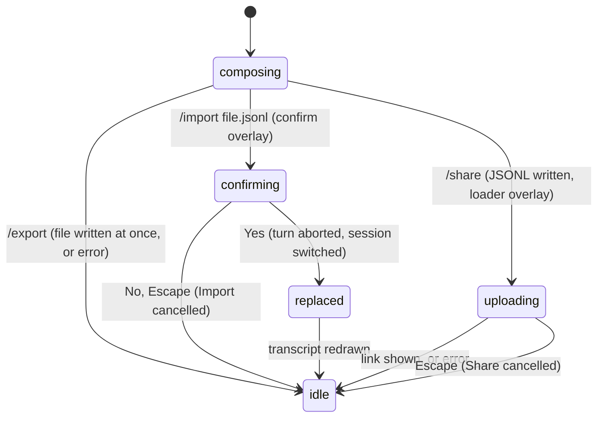

# Export, import, and share

## Summary

Three slash commands move a session out of or into pi. `/export [file]` writes the current session to a file: a self-contained HTML page by default, in the colours of the current theme, or a JSONL file when the name ends in `.jsonl`. `/import <file.jsonl>` replaces the current session with one read from a JSONL file, after a confirm overlay, copying the file into the session directory first. `/share` exports and uploads in one step: to Radius when that provider is logged in, otherwise as a secret GitHub gist through the `gh` command, and prints a link. The command line has one related form, `pi --export <in> [out]`, which converts a session file to HTML without starting pi.

All three are built-in slash commands, so they run immediately even while the agent is working (see [busy state](../cross-cutting/busy-state.md)). `/export` finishes at once. `/import` and `/share` open an overlay in the editor's place: a Yes/No confirm for import, a spinner box for the upload. Nothing here changes the model, the thinking level, or the working directory; `/import` changes the session.

## The simple case

After a conversation the user types `/export` and presses Enter. The editor empties and a dim status message reads `Session exported to: pi-session-2026-08-23T10-15-02-123Z_0198….html`. The file is in the working directory, named after the session file, and opens in a browser as a page with the conversation on the right and a collapsible tree of entries on the left, in the dark or light colours pi is using.

The user types `/share`. A bordered box with a spinner, `Creating gist...`, replaces the editor for a second or two; then the editor is back and a status message shows two links: `Share URL: https://pi.dev/session/<id>` and `Gist: https://gist.github.com/<user>/<id>`. The first opens a viewer for the session; the second is the gist itself, visible only to people who have the link.

Later, from another machine, the user runs `/export backup.jsonl`, copies the file over, and in a fresh pi types `/import backup.jsonl`. A box asks `Replace current session with backup.jsonl?` with `Yes` and `No`; on `Yes` the transcript is redrawn from the imported conversation, `Session imported from: backup.jsonl` is shown, and the next prompt continues it.

## The interaction, event by event

### Compose

The user types the command into the editor. `/export` and `/import` are matched on the exact word followed by a space or the end of the line, so `/exporter x` or `/important x` are not these commands and go to the model as text. `/share` is matched only on the exact text `/share`; `/share now` is sent to the model.

The file argument is one path. It may be wrapped in double or single quotes to include spaces; an unquoted path ends at the first whitespace, so `/export my notes.html` exports to `my` (HTML, since it does not end in `.jsonl`). Apostrophes inside an unquoted path are kept (`/import john's/session.jsonl`). A quote that is never closed counts as no argument at all. `~` is expanded; relative paths are relative to the working directory.

The `/` autocomplete popup offers all three commands; none of them offers file completion for the argument.

### Resolves at once

- **`/export` succeeds or fails immediately.** There is no overlay and no spinner. Success is a status message `Session exported to: <path>`; failure is `Error: Failed to export session: <reason>`. The two reasons a default session can hit: `Cannot export in-memory session to HTML` for an ephemeral session, and `Nothing to export yet - start a conversation first` when the session has no file yet (no assistant message has arrived; see [sessions](../foundations/sessions.md)). A directory in the HTML path that does not exist is an `ENOENT` error from the file system; a JSONL path's directories are created.
- **`/import` with no argument** (or an unterminated quote): `Error: Usage: /import <path.jsonl>`. Nothing else happens.
- **`/import` answered `No`, or Escape in the confirm:** status `Import cancelled`.
- **`/share` when the JSONL export fails:** `Error: Failed to export session: <reason>`; nothing is uploaded. (The JSONL export works for ephemeral and unsaved sessions, so in the default configuration this does not occur.)
- **`/share` when `gh` is not logged in:** `Error: GitHub CLI is not logged in. Run 'gh auth login' first.` The same message appears when `gh` is not installed at all; see "Open questions".
- **`/share` of an ephemeral session, or one with no file yet:** after the `gh` check, the HTML export fails with the same `Failed to export session` errors as `/export`.

In every case the editor is cleared when the command returns.

### Sent

**`/export`.** With no argument, or an argument not ending in `.jsonl`, the HTML page is generated from the session file and the current state and written to the given path or to `pi-session-<session file name>.html` in the working directory. The page carries the whole session file (every branch, not only the active one), the active position, the system prompt, and the tool definitions, and uses the colours of the theme currently on screen. With a `.jsonl` argument, the active branch is written as a new session file: a header with the same session id and a fresh timestamp, then the entries from the root to the active position, re-chained into a straight line. Other branches are not included.

**`/import`.** A confirm overlay replaces the editor: a bordered box titled `Import session`, the line `Replace current session with <path as typed>?`, then `Yes` and `No` with `Yes` highlighted, and the hint `↑↓ navigate  Enter select  Escape cancel`. On `Yes` the status line is cleared and the import starts: the file must exist (`Error: Failed to import session: File not found: <absolute path>` otherwise), it is copied into the current session directory under its own file name (unless it is already there), any turn in progress is aborted and its aborted state written to the old session, and the copy is opened as the current session.

**`/share`.** The active branch is written as JSONL to `session.jsonl` in the system temporary directory. If the Radius provider is logged in, an `Uploading to Radius...` loader replaces the editor and the JSONL is uploaded; in the default configuration it is not, and pi runs `gh auth status`. If that succeeds, the HTML page is written to `session.html` in the temporary directory with the current theme, and a loader replaces the editor: a bordered box with a spinner, `Creating gist...`, and `Escape cancel` underneath. `gh gist create --public=false session.html` runs in the background.

**`pi --export <in> [out]`.** From the shell, not the editor. The input is a session file path (`~` expanded, relative to the shell's directory); the optional second positional argument is the output path, otherwise `pi-session-<input file name>.html` in the shell's directory. Nothing else starts: no session is opened, no trust prompt, no network. It is one of the command-line forms that resolve before pi's screen appears; see [launching pi](../startup/launching-pi.md).

### While working

**`/import`** has no visible in-progress state beyond the confirm overlay; the switch happens as fast as the file can be read.

**`/share`** shows the loader until `gh` exits. The editor and its text are hidden behind the loader and come back unchanged. The agent, if it was working, keeps working behind the overlay; the status line stays visible above it.

### Done

**`/export`:** status `Session exported to: <path>`. For HTML the path is shown as given (relative when no argument was given); for JSONL it is the absolute path. The session itself is not touched.

**`/import`:** the transcript is cleared and redrawn from the imported file's active branch, the model and thinking level recorded in it are restored (with the usual `Could not restore model …` warning if unavailable), the footer shows its name if it has one, and status `Session imported from: <path as typed>`. From here on every message is appended to the copy in the session directory; the original file is never written to. If the imported file records a working directory that no longer exists, a second confirm appears first: `Session cwd not found` / `cwd from session file does not exist` / the old directory / `continue in current cwd` / the current directory, with `Yes` and `No`. `Yes` opens the session in the current directory; `No` is `Import cancelled`. Any other failure while opening the file (a file that is not a pi session, a permissions error) is fatal: `Error: Failed to import session: <message>` is shown, the screen is restored, and pi exits with status 1; see "Open questions".

**`/share`:** the loader is removed, the editor returns, and a status message shows `Share URL: <viewer link>` on one line and `Gist: <gist link>` on the next. Both are clickable in terminals that support links; the text is the URL in either case. The viewer URL is `https://pi.dev/session/<gist id>` (`PI_SHARE_VIEWER_URL` changes the base). A non-zero exit from `gh` is `Error: Failed to create gist: <gh's stderr>`; output that does not end in a gist id is `Error: Failed to parse gist ID from gh output`. The two temporary files are deleted whatever happened. Nothing is recorded in the session.

**The page itself.** A single HTML file with no external dependencies: a left sidebar with a search box, five filter buttons (`Default` hides model and thinking changes, `No-tools` also hides tool results, `User` shows only user messages, `Labeled` only labelled entries, `All` everything), and the entry tree; on the right the header block (session id, working directory, the system prompt and the tool list, collapsed), then the messages. User messages are in a card, assistant text is rendered markdown with highlighted code, tool calls show their call and a collapsed result with an expand control, images open in a modal when clicked. The colours are the theme's: a light theme gives a light page.

> Technical note: the HTML export and the gist carry the entire session file in a base64 block, including images, aborted and errored messages, and every abandoned branch. A secret gist is hidden from listings but readable by anyone with the link. `/share` therefore publishes more than the transcript on screen shows.

## Modifiers

| Modifier | Set before sending | Changed while working |
| --- | --- | --- |
| Model | No effect on the commands. The HTML and JSONL carry the model changes recorded in the session; `/import` restores the imported session's model. | No effect. |
| Thinking level | No effect; recorded levels are carried like the model. `/import` restores the imported level. | No effect. |
| Agent busy | Idle: as described. Working: `/export` and `/share` run at once and capture what is in the session file and the completed messages; the assistant message currently streaming is not in either. `/import` aborts the turn, writes the aborted message to the old session, and drops the queue before switching. | Starting a turn while the share loader is open is not possible (the editor is hidden); the turn behind it continues. |
| Attachments | Images in user messages are embedded in the HTML and JSONL as base64, so the files and the gist grow with them. `/import` restores them with the messages. | No effect. |
| Session kind | Saved: all three work. Ephemeral: `/export` to HTML and `/share` fail with `Cannot export in-memory session to HTML`; `/export x.jsonl` works and is the way to keep an ephemeral conversation; `/import` into an ephemeral session fails fatally, see "Open questions". | No effect. |

## Cancel and interrupt

| Event | While the import confirm is open | While the share loader is open |
| --- | --- | --- |
| Escape (once; twice within 500 ms) | Closes the confirm; `Import cancelled`; the editor returns with its text. A second Escape on an empty editor is the double-Escape action. | Kills `gh`, removes the loader, `Share cancelled`. A second Escape acts on the editor as usual. |
| Ctrl+C once / twice; Ctrl+D | The confirm is a selector: Ctrl+C cancels it like Escape. Ctrl+D does nothing while it is open. | Ctrl+C cancels the loader like Escape. Ctrl+D does nothing while it is open. |
| Another message submitted (Enter; Alt+Enter follow-up) | Enter chooses the highlighted option (`Yes` by default). Alt+Enter does nothing. | Not possible; the editor is hidden. Keys other than the cancel key are ignored. |
| A slash command or shortcut that opens an overlay or changes the session | Cannot be typed; shortcuts such as Ctrl+L are swallowed by the confirm. | Same. `/export` from the editor before `/share` has no interaction with it. |
| Model or thinking level changed | Ctrl+P and Shift+Tab are not delivered to the confirm. | Same. |
| Provider error, rate limit, timeout, or network lost | No effect on the confirm. A turn running behind it fails or retries as in [the turn](../foundations/the-turn.md#cancel-and-interrupt). | The gist upload fails with `Failed to create gist: <message>` from `gh`; the Radius upload with `Failed to upload Radius artifact: <message>`. There is no retry. |
| Context window exhausted (auto-compaction) | A turn behind the confirm compacts as usual; the import, when confirmed, aborts it. | Compaction runs behind the loader; the exported file was written before it began and does not include the summary. |
| Terminal resized; pi suspended (Ctrl+Z) and resumed | The overlay re-wraps. Suspend and `fg` redraw it. | Same; `gh` keeps running while suspended. |
| Process ends: terminal closed (SIGHUP), SIGTERM, killed | Nothing has changed yet; the old session is intact. | `gh` is not killed on SIGTERM or SIGHUP and may still create the gist; the link is never shown. The temporary files are left in the temporary directory. |
| Session or files changed from outside | The file is read only after `Yes`; edits before that are seen. | The file was already written. A session file edited from outside is exported as it is on disk. |
| Credentials lost, or logged out | No effect. | `gh` logging out between the status check and the upload fails the upload. A Radius logout is noticed only on the next `/share`. |

After any cancel the editor is back with whatever it held before the command (the command text itself was cleared on submit).

## Interactions with other systems

**Session persistence.** `/export` reads the session file for HTML (hence the refusal before the first assistant message) and the in-memory branch for JSONL. `/import` copies the file into `~/.pi/agent/sessions/<cwd dir>/` and opens the copy; the original is untouched. The copy keeps the original session id, so `/session` shows that id and `pi --session <id>` finds the copy. A file already in the session directory is opened in place, not copied. `/share` writes nothing to the session.

**Branching and history.** HTML and the gist carry every branch; the page's sidebar shows the tree with filters (Default, No-tools, User, Labeled, All) and a search box. JSONL carries only the active branch and flattens it, so `/import` of an exported JSONL shows a single-branch `/tree`. Importing a session's original file (not an export) keeps its branches. Like every built-in slash command, `/export` is not added to the prompt history.

**Compaction.** Compaction entries and summaries are exported as entries and shown in the HTML as `[compaction]` blocks; an imported session keeps its compactions and shows `Session compacted N times` after the switch, like a resume.

**Context files and the system prompt.** The HTML includes the system prompt in effect at export time (context files, tools, skills as sent to the model) in a collapsible header block. JSONL does not. An imported session rebuilds the system prompt from the current directory's context files, not the exporter's.

**Settings and keybindings.** `theme` (or `--use-theme`) chooses the export colours; a theme with explicit export colours is used as written, others derive page and card backgrounds from the user-message colour. `sessionDir` decides where `/import` copies to. The confirm and the loader use the selector keys (`tui.select.confirm`, `tui.select.cancel`).

**Tools and the working directory.** Paths resolve against the working directory. `/import` of a session recorded elsewhere keeps that session's working directory if it exists, so tools run there afterwards, and the footer's first line changes to it; this is the same as resuming a session from another project, see [resuming](resuming.md). `gh` is found on `PATH` as the user's shell sees it, with `~/.pi/agent/bin` in front.

**Terminal and rendering.** The status lines are dim; the links use OSC 8 hyperlinks when the terminal advertises support and plain text otherwise. The export page renders markdown with highlighted code and shows images inline with a click-to-enlarge modal; it needs no network.

**Credentials and providers.** `/share` prefers Radius only when a Radius credential is stored (a provider not in the default set-up). Otherwise the GitHub CLI's own login is used; pi never sees the token. Neither path uses the model provider's credential.

## Edge cases

- `/export notes.md` or `/export notes.txt` writes HTML under that name; only the `.jsonl` suffix changes the format, and the suffix check is case-sensitive (`.JSONL` is HTML).
- `/export` with no argument writes into the working directory, not the session directory, even though the file is named after the session file. Running it twice overwrites the same file silently; `/export x.jsonl` twice also overwrites.
- A JSONL export of an unsaved session (no response yet) succeeds and produces a file with the header and the user message; importing it gives a session that, again, has no file until a response arrives, because the copy is opened and not re-saved.
- `/import` of the current session's own file (`/import <its path>`) is accepted: the path is already in the session directory, so nothing is copied; the turn is aborted and the session re-opened in place.
- Two imports of files with the same name from different directories overwrite each other's copy in the session directory; the second import silently replaces the first's history on disk while its session id may differ from the file name's.
- `/share` always writes and deletes `session.jsonl` and `session.html` in the temporary directory; two pi processes sharing at the same moment race on the same two names.
- A Radius upload that is cancelled with Escape still reports nothing; the artifact may exist on the server.
- A `!!` shell record is present in the HTML, the JSONL, and the gist (it is in the file) although the model never saw it.
- `/export` during compaction or a retry countdown runs at once; the file holds the session as persisted so far, without the summary that is still being written.
- `/share` while a `!` shell command is running is allowed; the loader hides the editor but not the command's box, which keeps updating above it.
- With an automatic theme pair (`dark/light`), the export uses whichever of the two is on screen at that moment, so the same session exported at night and by day gives two differently coloured pages.
- `/import ~/Downloads/session.jsonl` expands `~`; `/import "~/My Files/s.jsonl"` expands it inside the quotes too.
- `pi --export <in> [out]` runs before any session or terminal set-up: it prints `Exported to: <path>` and exits 0, or `Error: File not found: <absolute path>` (or the session manager's message for an invalid file) in red and exits 1. The theme used is the built-in default, not the user's setting; see "Open questions".

## Open questions and verification

- `/share` checks for `gh` with a synchronous spawn whose failure to find the executable is returned as a result, not thrown, so a missing `gh` produces `GitHub CLI is not logged in. Run 'gh auth login' first.` and the `GitHub CLI (gh) is not installed. Install it from https://cli.github.com/` message is unreachable. May be worth treating as a bug rather than documenting.
- `/import` of a file that exists but is not a pi session (or any error other than "file not found" and "cwd missing") goes through the fatal path and exits pi with status 1 after printing the error. Losing the running session to a typo'd path that happens to name a non-session file may be worth treating as a bug rather than documenting.
- `/import` in an ephemeral session (`--no-session`) has an empty session directory; the copy step appears to fail with a file-system error, which is fatal as above. Read from the code, not tried. May be worth treating as a bug rather than documenting.
- `pi --export` passes no theme name, and the theme has not been initialised from settings at that point; which colours the standalone export actually uses was not confirmed.
- Whether the HTML export's `Session exported to:` path for the no-argument case is shown relative (as read from the code) or absolute was not confirmed by hand.
- Whether `gh` is killed or orphaned when pi exits on SIGTERM during an upload was read from the shutdown path (only tracked detached children are killed, and `gh` is not tracked) and not observed.
- The exact look of the export page (sidebar, filters, header block) was read from the template and its tests, not opened in a browser for this document.
- The Radius path (`Uploading to Radius...`, organisation visibility, `Pi session` title) was read from the code only; no Radius credential was available.

Verified against pi-mono commit `a69bef789`.
