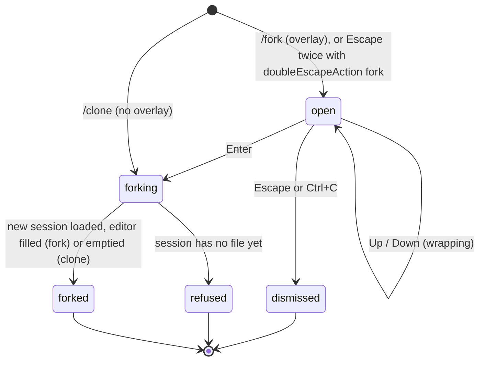

# Fork and clone

## Summary

`/fork` and `/clone` both copy part of the current session into a new session file and switch to it, leaving the original untouched. `/fork` opens an overlay listing every user message in the session; choosing one creates a new session holding the conversation up to, but not including, that message, and puts the message's text back in the editor to be edited and resent. `/clone` takes no choice: it copies the conversation up to the active position as it stands, so the user can carry on in a duplicate and keep the original as it was. Both new files record which session they came from, and the session picker shows them nested under it.

`pi --fork <path|id>` does a coarser version at startup: it copies a whole session file, every branch included, into the current project and starts there. It is described with the other command-line entry points in [resuming](resuming.md) and only summarised here.

Both commands are a [switch](../glossary.md#events-that-end-or-interrupt-a-turn). A turn in progress is aborted and written to the old session before the copy is made. Neither needs the model, and neither is refused while the agent is working. Both are refused on a session that has no file yet, with one exception: forking from the very first message starts a plain new session and needs no file.

## The simple case

After three exchanges the user decides the second question was wrong. They type `/fork` and press Enter. The editor is replaced by a panel headed `Fork from Message` with the explanation `Select a user message to copy the active path up to that point into a new session`, a rule, and the three prompts, each on its own line with `Message 1 of 3`, `Message 2 of 3`, `Message 3 of 3` beneath; the last is selected. The user presses Up once and Enter.

The panel disappears. The transcript is cleared and redrawn showing only the first exchange, the editor now holds the text of the second prompt, and `Forked to new session` is added in dim text. The footer shows the same directory; the session name, if one was set before the fork point, is kept. The user edits the prompt and presses Enter; the answer goes into the new session. Typing `/resume` shows the new session under the old one, joined by `└─`.

`/clone` is the same without the panel: the transcript is redrawn unchanged, the editor is emptied, and `Cloned to new session` appears. From here the two sessions diverge: prompts sent now go into the clone, and `pi -c` tomorrow opens whichever file was written to last.

## The interaction, event by event

### Open

`/fork` clears the editor and opens the *fork panel* in its place, whatever the agent is doing. From top to bottom: a blank line, `Fork from Message` in bold, the dim explanation `Select a user message to copy the active path up to that point into a new session`, a blank line, a rule across the width, a blank line, the list, a blank line, and a closing rule. There is no search field and no hint line.

The list holds every user message in the session file that has any text, in file order, from every branch, not only the active one. Each item takes three lines: the message on one line (newlines replaced by spaces, truncated to the width, bold when selected, with a `›` cursor), `Message N of M` in dim text, and a blank. `M` counts the listed messages, so it can exceed the number of prompts visible in the transcript when other branches exist. Ten items are visible; with more, a dim `(n/M)` line follows and the list scrolls to keep the selection centred. The newest message is selected when the panel opens.

Messages whose only content is an image are not listed; shell records and the model's messages never are. A session with no listed messages does not open the panel: `No messages to fork from` is shown as a status message and nothing else happens.

With `doubleEscapeAction` set to `fork`, Escape twice within 500 ms on an empty editor opens the same panel; the default opens `/tree` instead (see [input](../foundations/input.md#escape)).

`/clone` has no overlay. It clears the editor and goes straight to the switch.

### Dismissed at once

- **Escape or Ctrl+C** in the panel closes it; the editor returns, empty.
- **`No messages to fork from`** for a session with no user messages; no panel.
- **`Nothing to clone yet`** for `/clone` on a session with no entries at all. In the default configuration this does not happen: every session starts with a recorded model and thinking level, so a fresh session has entries and `/clone` goes on to the refusal below.
- **`Error: This session has not been saved yet. Wait for the first assistant response before cloning or forking it.`** when the session file does not exist yet, that is, before the first assistant message of a new session (see [sessions](../foundations/sessions.md)). For `/fork` this is shown after Enter in the panel, and only when the chosen message is not the first one; forking from the very first message needs no file and succeeds. The current session is left as it was. The message is an error line, not a status message, so it stays in the transcript.

### First change

Up and Down move the selection and wrap at both ends: Up on the first message goes to the last. Nothing else changes; there is no search, and typing is ignored. Nothing is written.

### While open

| Key | Action |
| --- | --- |
| Up / Down | Move the selection one item; wraps at both ends. |
| Enter | Fork at the selected message. |
| Escape, Ctrl+C | Close the panel. |

The agent keeps working behind the panel; text and tool results keep arriving above it, and the status line keeps updating. Every key other than the five above is dropped: PageUp and PageDown do nothing, typing does nothing, and the application shortcuts (Ctrl+L, Ctrl+O, Ctrl+T, Ctrl+P, Shift+Tab) are not handled. Resizing re-wraps the items. Nothing is written while the panel is open.

### Accepted

Enter closes the panel and the editor comes back. Then, for `/fork`:

1. The branch from the root to the chosen message's parent is taken from the session file on disk. If the chosen message is the first entry (its parent is the root), the new session is empty.
2. The current session is torn down: a turn in progress is aborted and its partial assistant message and tool results are appended to the old file; a running shell command is killed; a retry or compaction is cancelled; queued messages are dropped.
3. A new session is created in the same session directory, named `<timestamp>_<new id>.jsonl`, with a header that records the working directory and, as *parent session*, the path of the file it was forked from. The copied entries keep their ids and timestamps. Labels set with `/tree` on entries in the copied branch are carried over; labels on other branches are not. The new file is written at once if the copied branch contains an assistant message; otherwise it is created with the first response, like any new session.
4. The new session is loaded as a switch: model and thinking level are restored from the last changes recorded on the copied branch (which may be older than the ones in use a moment ago), settings and context files are re-read, the transcript is cleared and redrawn from the copy, the footer updates, and the prompt history gains the copy's user messages.
5. The editor's contents are replaced by the chosen message's text (its text parts only; images and the rest are dropped). Anything typed into the editor before `/fork` is gone.
6. `Forked to new session` is added as a status message.

For `/clone`, steps 1 to 4 are the same with the active position as the cut: the copied branch is root to the active position inclusive, so the redrawn transcript is identical to the one before. The editor is emptied, and `Cloned to new session` is shown.

In both cases the original file is not modified; its active position and branches are as they were, and `/resume` lists both.

> Technical note: the copy is taken from the file on disk, not from memory, which is why the file must exist. The copied entries are re-chained so that removed label entries do not leave gaps, then the labels are appended at the end of the new file. A fork whose cut is the root does not copy anything: it creates a plain new session whose header names the parent, so nothing is written until the first response.

> Technical note: forking from the first message creates the new session through the ordinary new-session path, so its model is the startup default, not the model in use in the session being left; the copied-branch path restores the model from the branch instead. See "Open questions".

`pi --fork <path|id>` at startup copies every entry of the source file, all branches, into a new file in the current project's session directory, with the current directory as the working directory and the source as parent session; the active position is the last entry in the file. The argument is resolved exactly as for `--session`: a path (anything containing `/` or `\`, or ending in `.jsonl`) is used as given; otherwise an exact id, then an id prefix, in the current project first and then in every project. Unlike `--session`, a match in another project is forked without the `[y/N]` question. Nothing is printed on success: pi starts with the copied transcript drawn, the model restored from the copy, and no `Forked…` status. `No session found matching '<arg>'` in red, exit code 1, when nothing matches. It refuses to combine with `--session`, `-c`, `-r`, or `--no-session`, and with `--session-id` when that id already exists in the project (`Session already exists with id '…'`, exit code 1).

What the user sees during an in-session fork or clone is brief: the panel (if any) vanishes, the editor returns, the transcript above is replaced in one redraw, and the status message appears under it. The old transcript is still in the terminal's scrollback above the new one. There is no spinner and no confirmation.

## Modifiers

| Modifier | Before open | While open |
| --- | --- | --- |
| Model | No effect on the panel. | The forked or cloned session restores the model from the copied branch; a model changed after the fork point is not carried. Forking from the first message resets to the default model. |
| Thinking level | No effect. | Restored from the copied branch in the same way; the border colour follows. |
| Agent busy | Working or compacting: `/fork` opens the panel and `/clone` proceeds at once. | Enter aborts the turn as part of the switch. The copy is taken from the file before the abort, so the aborted assistant message and its tool results land in the old file only; a `/clone` made mid-turn ends at the prompt, without the answer that was being streamed. Escape in the panel leaves the turn running. |
| Attachments | No effect. | The text put into the editor by `/fork` has no images even if the original message had them. The editor's own pending images before the command were not determined (see "Open questions"). |
| Session kind | Saved: a new file is created as described. Ephemeral (`--no-session`): the same copy is made in memory and replaces the current session in place; no file is created and the parent session recorded in the header is empty. | No effect. |

## Cancel and interrupt

| Event | While open (`/fork` panel) | After Enter, and `/clone` |
| --- | --- | --- |
| Escape (once; twice within 500 ms) | Closes the panel; a second Escape on the empty editor arms the double-Escape. | The switch cannot be cancelled; it completes in well under a second. Escape afterwards acts on the new session. |
| Ctrl+C once / twice; Ctrl+D | Ctrl+C closes the panel without arming the quit window. Ctrl+D is not handled by the panel. | Quitting after the switch prints the resume hint for the new session, if it has a file. |
| Another message submitted (Enter; Alt+Enter follow-up) | Enter forks at the selection. Alt+Enter is not handled. | The next Enter sends to the new session. |
| A slash command or shortcut that opens an overlay or changes the session | Not reachable while the panel has focus. | Any of them act on the new session; the old one is closed. |
| Model or thinking level changed | Not reachable from the panel. | Restored from the copy as described under "Modifiers". |
| Provider error, rate limit, timeout, or network lost | A retry countdown continues behind the panel. | Cancelled by the switch; the failed attempt stays in the old file and is not copied unless it lies on the copied branch. |
| Context window exhausted (auto-compaction) | Compaction continues behind the panel. | Cancelled by the switch. A compaction already recorded on the copied branch is copied with it; the clone starts compacted. |
| Terminal resized; pi suspended (Ctrl+Z) and resumed | The panel re-wraps. | No effect. |
| Process ends: terminal closed (SIGHUP), SIGTERM, killed | Nothing written. | Killed mid-switch: the old file holds the aborted turn if the abort completed; the new file may exist and be complete, since it is written in one step, or not exist at all. |
| Session or files changed from outside | The list reflects the file as loaded at startup or last switch, not edits on disk. | The copy reads the file from disk, so entries appended by another pi process to the same file are copied if they are on the chosen branch. |
| Credentials lost, or logged out | No effect. | If the copied branch's model has no credential, the default model is chosen instead. |

## Interactions with other systems

**Session persistence.** The new file is written whole at the moment of the fork or clone when it contains an assistant message, and appended to from then on; see [sessions](../foundations/sessions.md). The old file receives the aborted turn, if any, and nothing else. Renaming the original later does not rename the copy; a name entry already on the copied branch is copied.

**Branching and history.** `/fork` is the only command that lists messages from abandoned branches, so it can revive a branch that `/tree` moved away from. The copy has a single branch. The new session's parent is shown by `/resume` in Threaded sort (`└─` under the original) and by `/session` (see [naming and info](naming-and-info.md)). `/tree` in the copy shows only the copied branch. The prompt history is extended with the copy's user messages, and `/fork` puts the chosen text in the editor rather than in the history.

**Compaction.** Compaction entries on the copied branch are copied, so the new session's context is built from the same summary. The old session's `Session compacted N times` count is reproduced on the copy if the compactions are on the branch; see [compaction](compaction.md).

**Context files and the system prompt.** Re-read for the working directory on switch, like any session start.

**Settings and keybindings.** `doubleEscapeAction` (`tree` by default; `fork` opens the panel) and the unbound `app.session.fork` action. `tui.select.up`/`down`/`confirm`/`cancel` inside the panel. `sessionDir` decides where the new file goes: the same directory as the original.

**Tools and the working directory.** Unchanged: the copy records the same working directory as the original, and tools keep running there. A running shell command is killed by the switch and its output is not recorded.

**Terminal and rendering.** The panel is a fixed-height list; the transcript is redrawn from scratch on switch, so the scrollback holds both the old transcript and the new one.

**Credentials and providers.** The restored model must have a credential now; otherwise the default is used. No warning is shown for this in-session (see "Open questions").

## Edge cases

- `/fork` on the newest message (the default selection) produces a session identical to the current one minus the last exchange, with the last prompt in the editor: the way to retry the last question.
- `/fork` on a message from an abandoned branch copies that branch's ancestors, not the active branch's.
- `/fork` on a steering message (one delivered mid-turn, after a tool result) cuts inside the turn: the copy ends with the tool result that preceded it, and the next prompt continues from there, so the model sees the tool result followed by a new user message.
- `/fork` on the only message of a one-exchange session gives an empty session with the prompt in the editor, the same result as `/new` followed by retyping it, except that the picker nests it under the original.
- A message that was a slash command sent to the model as text, or a `!` line queued as a follow-up, is listed like any other user message.
- Two forks from the same message make two files with the same content and different ids; the picker shows both under the original.
- `/clone` immediately after `/clone` makes a clone of the clone, nested two deep in the picker.
- `/clone` right after `/tree` moved the active position backwards copies only up to that position; the abandoned tail is left in the original.
- A session loaded with `pi --fork` shows every branch in `/tree`, unlike an in-session fork or clone, which always has one.
- Forking while a branch summary or compaction is being generated cancels it; the summary is not in either file.
- Forking from the first message of a named session loses the name: the name entry is after the cut.
- `/fork` text placed in the editor is a single string; a prompt that used Shift+Enter newlines comes back with its newlines intact, although the panel showed it on one line.
- A fork from the first message of a session started with `--name` or renamed before any prompt still loses the name, because the name entry precedes the first message and the cut is at the root.
- The copied entries keep their original ids and timestamps; the picker's age column for the copy is therefore the age of the last copied message, not the moment of the fork, until something new is written.
- In an ephemeral session, `/fork` and `/clone` replace the session in memory and the old conversation is unrecoverable; there is no file to go back to.
- `/fork` and `/clone` typed with trailing text (`/fork now`) are not recognised as commands and are sent to the model as text, like any unknown `/` line.
- A session whose file was deleted from outside while pi was running is refused with the `has not been saved yet` message, which is misleading in that case.

## Open questions and verification

- `Nothing to clone yet` cannot be reached in the default configuration because a new session always records its model and thinking level; a fresh session gets the `has not been saved yet` error instead. The `/clone` test covers the unreachable branch. Worth noting for the triage pass.
- Forking from the first message creates the new session through the plain new-session path and so picks the startup default model rather than the current one, while forking from any later message restores the model from the copied branch. May be worth treating as a bug rather than documenting.
- After a fork or clone, the `Could not restore model …` warning is not shown even when the model falls back; only the footer changes. May be worth treating as a bug rather than documenting.
- Whether images attached to the editor before `/fork` or `/clone` are discarded along with the text was not determined.
- Whether the session name survives a `/clone` was read from the copy rule (name entries on the branch are copied) and not confirmed by hand.
- Whether the new file is visible in `/resume` immediately when the copied branch has no assistant message (the file is deferred) was read from the deferral rule: it is not, until the first response.
- Whether the forked session's active position, after `pi --fork` of a session whose `/tree` position had been moved backwards, is the last entry in the file or the recorded position was not determined.
- The claim that the user-message panel is reached by double Escape only with `doubleEscapeAction: fork` was read from the key handler and not tried.
- Timing of the switch on a large session (hundreds of entries) was not measured.
- In an ephemeral session the copy is made on the same in-memory session before the turn is aborted, so an aborted assistant message from a turn in progress may be appended to the new session rather than the old one. Read from the order of operations, not observed. May be worth treating as a bug rather than documenting.
- The `No messages to fork from` status is produced before the panel would open; the panel's own `No user messages found` text and its 100 ms self-closing are therefore unreachable in this flow.

Verified against pi-mono commit `a69bef789`.
