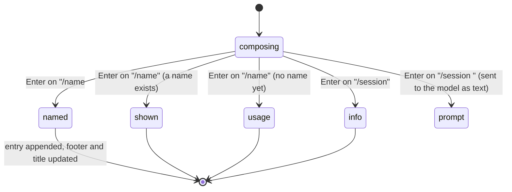

# Naming and info

## Summary

A session name is a label the user gives a conversation so it can be told apart from the others in the session picker and in the footer. `/name <name>` sets it from inside pi; `--name <name>` (or `-n`) sets it at startup; `/name` alone shows it. The name is an entry in the session, so it is saved with the session and restored with it, and it can be changed as often as wanted; the newest name wins. `/session` prints a block of facts about the current session: its name, file, and id, how many messages it holds, how many tokens it has used, and what it has cost.

All three are built-in slash commands: they run at once whatever the agent is doing and never start a turn. They need nothing set up and no model.

## The simple case

The user types `/name Refactor auth module` and presses Enter. The editor empties and a dim line appears in the transcript: `Session name set: Refactor auth module`. The footer's first line now ends ` • Refactor auth module`, and the terminal's window title becomes `π - Refactor auth module - <directory>`. Later, `/session` prints:

```
Session Info

Name: Refactor auth module
File: /Users/me/.pi/agent/sessions/--Users-me-code-app--/2026-08-23T10-15-02-123Z_0198….jsonl
ID: 0198…

Messages
Total: 7
User: 2
Assistant: 3
Tools: 2 calls, 2 results

Tokens
Input: 24,310
  Cached: 20,100 (82.7%)
  Uncached: 4,210 (1,900 written to cache)
Output: 1,204
Total: 25,514

Cost
Total: $0.041
```

Next time, `/resume` and `pi -r` list the session by that name.

## The interaction, event by event



### Compose

`/name` and `/session` are typed like any other line and offered by the autocomplete popup after `/`. `/name` takes the rest of the line as the name: everything after `/name` and any spaces following it, with leading and trailing whitespace removed. The name may contain any characters, including spaces, quotes, and `/`. A newline inside the name (Shift+Enter) is allowed in the editor but is replaced on submit; see "Sent". `/session` takes no argument: `/session foo` is not a command and is sent to the model as text. `/name` is matched on `/name` alone or `/name ` followed by anything, so `/names` is also sent to the model.

### Resolves at once

Every form of these commands resolves at once; none starts a turn.

- **`/name` with nothing after it**, and the session has a name: a dim line `Session name: <name>` in the transcript. Nothing is written.
- **`/name` with nothing after it**, and no name: `Warning: Usage: /name <name>`. Nothing is written.
- **`/session`**: the info block, described under "Done". Nothing is written.
- **Startup still in progress**: the line is put back in the editor with `Startup is still in progress`.

None of the three is added to the prompt history, and the editor is emptied in every case.

### Sent

`/name <name>` appends a name entry to the session at the active position. Before it is stored the name is normalised: every run of carriage returns and line feeds becomes a single space, then leading and trailing whitespace is removed. If that changed the text, a warning precedes the confirmation, with both versions quoted in JSON style so the difference is visible: `Warning: Session name was normalized from "first\nsecond" to "first second"`. Then the dim line `Session name set: <name>` is added.

The footer's first line and the terminal title update on the same frame. The entry is on disk immediately if the session file exists; otherwise it waits in memory with the rest of the session and is written when the first assistant message creates the file ([sessions](../foundations/sessions.md)). Nothing is sent to the model; the model never sees the name.

**`--name` at startup.** `pi --name "CI audit"` (or `-n`) names the session pi starts or opens: a new session, the one `-c` continues, the one `--session` names, or the one picked with `-r`. The value is trimmed; a value that is empty or only whitespace stops pi before anything is drawn with `Error: --name requires a non-empty value` on stderr and exit status 1. `--name` with no value at all is a parse error, `--name requires a value`, also exit status 1. Newlines in the value become spaces as with `/name`, with no warning.

The entry is appended before the model is resolved and before the trust prompt, so on an existing session it is on disk even if startup later fails (for example `--model` naming a model that does not exist). On a new session it waits in memory for the first assistant message like everything else. A session resumed with `--name` keeps the new name from then on; the old one stays in the file as an earlier entry.

> Technical note: the name is read by scanning the whole file from the end for the newest name entry, not by walking the active branch. A name set on one branch is therefore the session's name on every branch, and moving the active position with `/tree` never changes it. A name entry whose text is empty clears the name, but `/name` cannot produce one because an empty argument shows the current name instead.

### While working

There is nothing in progress for these commands. While the agent is working, `/name` and `/session` behave exactly as when it is idle: the name entry is appended between the turn's messages, and `/session` counts what is in the session at that instant (the user message and any assistant messages that have ended, not the one still streaming).

### Done

`/name` leaves the name in the session, the footer, the terminal title, and the session picker. It is restored whenever the session is resumed, forked, or cloned (the entry is copied with the rest of the tree).

`/session` adds the info block to the transcript after a blank line. The fields, in order:

- `Session Info` (bold).
- `Name:` only when a name is set.
- `File:` the session file's full path, or `In-memory` for an ephemeral session. For a new session that has not had a response yet, this is the path the file will have; the file does not exist yet.
- `ID:` the session id (the full UUID, the one `--session` takes).
- `Messages` (bold): `Total:`, `User:`, `Assistant:`, and `Tools: N calls, M results`. These count every message entry in the file: every branch, every failed retry attempt, every aborted message, and shell records and other non-model messages too, so `Total` can exceed the sum of the other three, and the counts do not shrink after `/tree` moves the active position or after compaction.
- `Tokens` (bold): `Input:` is the full prompt volume (fresh input plus cache reads plus cache writes). When any caching happened, two indented lines follow: `Cached: N (P%)` with the share of input served from cache, and `Uncached: N`, with ` (N written to cache)` appended when cache writes were reported. Then `Output:` and `Total:` (input plus output plus both cache figures). Thousands separators are used. Tokens spent on compaction and branch summaries are included.
- `Cost` (bold) only when there is something to show: `Total: $X.XXX` to three decimals; one indented line per provider/model when more than one was used, `provider/model: $X.XXX (N tokens)` with the token count abbreviated as in the footer (`12k`, `1.2M`); and `Cache Re-billed: $X.XXX (N tokens, M misses)` when prompt-cache misses re-billed tokens that could have been cached (or just the detail in parentheses when the re-billed cost rounds to nothing).

Context usage is not part of `/session`; the footer shows it.

## Modifiers

| Modifier | Set before sending | Changed while working |
| --- | --- | --- |
| Model | No effect on the name. `/session` attributes cost per model used; with one model there is no breakdown. | No effect. |
| Thinking level | No effect. | No effect. |
| Agent busy | Idle or working: both commands run at once; `/name` mid-turn puts the name entry between that turn's messages. | No effect. |
| Attachments | No effect. Images count toward the input tokens `/session` reports. | No effect. |
| Session kind | Saved: the name is written to the file (at once, or with the first assistant message). Ephemeral: kept in memory, shown in the footer, gone on exit; `/session` shows `File: In-memory`. | No effect. |

## Cancel and interrupt

| Event | While composing | After the command |
| --- | --- | --- |
| Escape (once; twice within 500 ms) | With text in the editor and the agent idle, nothing; while working, aborts the turn and keeps the text. | No effect; the name is already an entry and the info block is already printed. |
| Ctrl+C once / twice; Ctrl+D | Clears the editor; twice quits; Ctrl+D deletes forward. | A quit after `/name` keeps the name if the file exists or is created later in the run; a session that never gets a response loses the name with the rest. |
| Another message submitted (Enter; Alt+Enter follow-up) | Enter runs the command; Alt+Enter while working queues the line as a follow-up, later sent to the model as text. | The next prompt is unaffected. |
| A slash command or shortcut that opens an overlay or changes the session | An overlay opens over the editor with the line still in it. | `/new` starts a session with no name. `/resume` shows the name in the picker and restores the chosen session's own name. `/fork` and `/clone` copy the name entry. |
| Model or thinking level changed | No effect. | No effect on the name. `/session` gains a per-model cost breakdown once two models have been used. |
| Provider error, rate limit, timeout, or network lost | No effect. | No effect. Failed attempts add assistant messages to `/session`'s counts and their tokens to its totals. |
| Context window exhausted (auto-compaction) | No effect. | The name survives compaction (the entry is not a message). `/session` keeps counting the compacted-away messages and adds the compaction's own tokens. |
| Terminal resized; pi suspended (Ctrl+Z) and resumed | The editor re-wraps. | The info block re-wraps; a long name in the footer is cut to the width. |
| Process ends: terminal closed (SIGHUP), SIGTERM, killed | The text is lost. | The name is on disk if the file existed when it was set or was created afterwards; otherwise it is gone. See [process lifecycle](../cross-cutting/process-lifecycle.md). |
| Session or files changed from outside | No effect. | Renaming the session from another pi's session picker appends a name entry to the same file; this pi shows the new name only after resuming. |
| Credentials lost, or logged out | No effect. | No effect. |

## Interactions with other systems

**Session persistence.** A name is a `session_info` entry with the name as its only content, parented to the active position like any other entry. It is written when appended if the file exists, else with the file's creation. Setting the name again appends another entry; old names stay in the file. See [sessions](../foundations/sessions.md).

**Branching and history.** The name belongs to the file, not to a branch (technical note above). `/tree` lists name entries among the others. `/fork` and `/clone` copy the entries up to the chosen point, name entries included, so the new session starts with the same name; see [fork and clone](fork-and-clone.md). The session picker can rename a session in place (Ctrl+R) and filter to named sessions (Ctrl+N); see [resuming](resuming.md).

**Compaction.** Name entries are not messages and are neither summarised nor dropped. `/session`'s totals include the tokens each compaction and branch summary cost.

**Context files and the system prompt.** No interaction; the name is never sent to the model.

**Settings and keybindings.** None. `--name`/`-n` is a command-line flag only.

**Tools and the working directory.** No interaction. The terminal title combines the name with the working directory's last path component.

**Terminal and rendering.** The footer's first line becomes `<cwd> (<branch>) • <name>`, dim, truncated to the width. The terminal title is `π - <name> - <dir>`, or `π - <dir>` with no name. The info block is plain text, one field per line, bold section headings and dim field labels.

**Credentials and providers.** `/session`'s cost uses the price list of each model actually used; a model with no price contributes zero cost but still contributes tokens.

## Edge cases

- `/name` with only spaces after it is `/name` with nothing: it shows the current name or the usage warning.
- A name typed over two lines with Shift+Enter is stored with a space in place of the line break, and the warning shows both forms.
- The warning quotes names in JSON style, so a name containing `"` is shown with a backslash before it.
- There is no way to remove a name from inside pi; `/name` can only replace it. An empty name entry would clear it, but `/name` never produces one.
- `/session` on a brand-new session shows a `File:` path to a file that does not exist yet, and zero counts. The path is where the file will be created. See "Open questions".
- `/session` immediately after `/new` shows `Total: 0` messages even though the session already holds model and thinking-level entries; those are not messages.
- After a retry that failed three times, `/session` counts three more assistant messages than the user saw replies.
- `Cost` is omitted entirely for a session whose model reports no price and had no cache misses.
- The name does not appear in the header, the transcript, or the model's context; only the footer, the terminal title, the session picker, and `/session`.

## Open questions and verification

- `/session` reports a `File:` path for a session that has not been saved yet, with no indication that the file does not exist. A user who copies that path finds nothing. May be worth treating as a bug rather than documenting.
- `Total:` under `Messages` counts shell records and other non-model messages, so it does not equal `User + Assistant + results`; whether that is intended was not determined.
- The exact rendering of the `Cost` breakdown lines (indentation, dim labels) and of `Cache Re-billed` was read from the formatting code and not observed.
- Whether the footer truncates or wraps a session name longer than the terminal width was not checked.
- Whether the terminal title is restored when pi quits was not checked; see [quitting](quitting.md).
- The behaviour when two pi processes rename the same file (technical note under "Session or files changed from outside") was inferred from the no-lock rule in [sessions](../foundations/sessions.md) and not tried.
- `--name` before the trust prompt and before model resolution is pinned by `test/startup-session-name.test.ts` for an existing session; the new-session (in-memory) case was read from the persistence rule and not observed.

Verified against pi-mono commit `a69bef789`.
