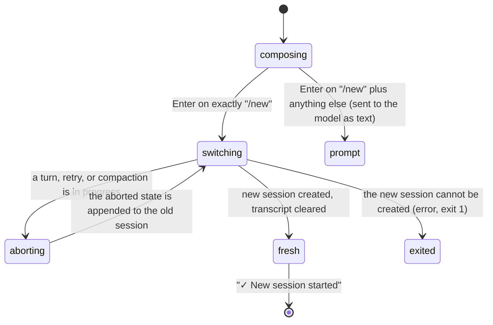

# New session

## Summary

`/new` ends the current conversation and starts a fresh one in the same working directory, without leaving pi. The transcript is cleared, a new session with a new id is created in memory, and the model and thinking level are chosen again from the defaults, as they would be on a fresh start. The old session is left on disk as it was, with anything a turn in progress had produced appended to it; it can be reopened with `/resume` or `pi --session`. `/new` is a switch in the sense of [input](../foundations/input.md#cancel-and-interrupt): it aborts a turn in progress and drops the queue.

The command needs nothing to be set up and works at every moment the editor is available, including while the agent is working, during a retry countdown, and during compaction. There is no confirmation. There is a keybinding action for it (`app.session.new`) with no default key.

## The simple case

The user has been working for a while and wants to start on something unrelated. They type `/new` and press Enter. The editor empties, the transcript disappears from pi's frame, the loaded-resources block (`[Context]` and the context files it found) is drawn again under the header, and a line in the accent colour reads `✓ New session started`. The footer's session name, if there was one, is gone; its token counts and cost read zero; the context percentage reads `0%`. The model at the right of the footer is the default model and the thinking level is the default level, and the editor border takes that level's colour. The next prompt starts the new conversation with no memory of the old one. Nothing is on disk for the new session until the model's first answer arrives; see [sessions](../foundations/sessions.md).

## The interaction, event by event

### Compose

`/new` is typed like any other line; the autocomplete popup offers it after `/`. Nothing happens until Enter. The command is matched on the exact trimmed text: `/new` with leading or trailing spaces is still `/new`; `/new foo` is not a command and goes to the model as the text `/new foo` (queued as a steering message if the agent is working). Alt+Enter with the agent idle submits the command as Enter would; with the agent working, Alt+Enter queues `/new` as a follow-up, which is later delivered to the model as text, not run.

### Resolves at once

Two things end the command before anything changes:

- **The editor text is not exactly `/new`.** See above; a turn starts instead.
- **Startup is still in progress.** The line is put back in the editor with the status message `Startup is still in progress`.

The command itself never refuses: there is no "are you sure", no busy check, and an unsaved session is discarded without a word.

### Sent

On Enter the editor is emptied first, before the switch starts, and the status line is cleared. `/new` is not added to the prompt history; no built-in slash command is.

If a turn is in progress, it is aborted and pi waits for it to settle: the model call is cancelled, running tools are killed, the partial assistant message is kept with `Operation aborted` and appended to the old session together with the `Operation aborted` tool results, exactly as Escape would do it ([the turn](../foundations/the-turn.md#cancel-and-interrupt)). A retry countdown is cancelled. Queued steering and follow-up messages are dropped: they are not delivered, not written anywhere, and not returned to the editor. Messages held back during compaction are dropped in the same way. A compaction or branch summary in progress is cancelled and no summary is written.

Then the old session is closed and the new one is created, in the same session directory as the old one (so `--session-dir` is honoured) and for the same working directory. It is an ephemeral session if the old one was.

> Technical note: the switch first aborts the session and waits for it to become idle, so the aborted assistant message and tool results are appended to the outgoing file before it is replaced; a test in `agent-session-runtime.test.ts` pins this order. The queue is not returned to the editor because the abort that returns it is the Escape handler's, not the session's.

### While working

There is nothing to watch; the switch takes a moment. Keys typed during it go to the editor as usual and are waiting there when the new session appears; a submission during it is not possible, because Enter is not read again until the switch has finished. The old transcript, the pending area, and the status line are removed from pi's frame. In the regular TUI mode, whatever had already scrolled into the terminal's own scrollback stays there; pi does not clear the terminal. The header at the top of the frame is not redrawn, but the loaded-resources block beneath it is.

> Technical note: creating the new session re-reads settings, context files, and the extension, skill, prompt, and theme lists from disk, and resolves the model catalog again with a 15 second limit. In the default configuration this is fast and invisible. Settings changed on disk since startup take effect here, the same as after `/reload`.

### Done

The new session is in place:

- The transcript holds only `✓ New session started` (in the accent colour, after a blank line).
- The **model** is chosen again as on a fresh start: the saved default model if it is available, else the first available model in pi's provider order ([models and credentials](../foundations/models-and-credentials.md)). A model picked with `/model` or Ctrl+P for the old session only is not carried over. A `--model` given on the command line is honoured again.
- The **thinking level** is the default again: the per-model default from settings if one is set, else `medium`, clamped to the model. A level set with Shift+Tab or `/thinking` for the old session is not carried over. The editor border changes colour to match.
- Both are recorded as the new session's first entries, in memory until the file is created.
- The **footer** shows no session name, zero tokens and cost, `0%` context, and the new model and level. The terminal title drops the old session name.
- The **editor** is empty. The prompt history is kept: Up still recalls the old session's prompts.
- Thinking-block visibility returns to the `hideThinkingBlock` setting, so a Ctrl+T toggle made during the old session is undone. The Ctrl+O expanded state is kept.
- The old session's file is untouched and complete. If the old session never got a response it had no file and now never will; nothing says so.

If the new session cannot be created, the transcript shows `Error: Failed to create session: <reason>` and pi exits with status 1, leaving the old session on disk.

## Modifiers

| Modifier | Set before sending | Changed while working |
| --- | --- | --- |
| Model | Not carried over: the new session starts on the default model, whatever the old session was using. | A model change made during the old session's turn is in the old file only. |
| Thinking level | Not carried over: the new session starts on the default level. | Same. |
| Agent busy | Idle: the switch is immediate. Working: the turn is aborted and settled first, then the switch; the queue is dropped. Compacting: the compaction is cancelled, the messages queued behind it are dropped. Retrying: the countdown is cancelled. | Not applicable; `/new` completes before anything else runs. |
| Attachments | Images in the old session stay in the old file. Nothing is carried into the new session. | No effect. |
| Session kind | Saved: a new file-backed session, created on disk at the first assistant message. Ephemeral (`--no-session`): a new in-memory session; the old one is gone. | No effect. |

A `--name` given at startup applied to the first session only; the new session has no name until `/name` is used ([naming and info](naming-and-info.md)).

## Cancel and interrupt

| Event | While composing | During the switch |
| --- | --- | --- |
| Escape (once; twice within 500 ms) | Does nothing to the text `/new` in the editor (Escape with text and the agent idle is a no-op); with the agent working it aborts the turn instead and keeps the text. | No effect; the switch cannot be cancelled. |
| Ctrl+C once / twice; Ctrl+D | One Ctrl+C clears the editor. Two within 500 ms quit; Ctrl+D with text deletes forward. | A quit during the switch exits after it; see [quitting](quitting.md). |
| Another message submitted (Enter; Alt+Enter follow-up) | Enter is the command. Alt+Enter while working queues `/new` as a follow-up, delivered later to the model as text. | Not possible; the editor is not read until the switch is done. |
| A slash command or shortcut that opens an overlay or changes the session | A shortcut such as Ctrl+L opens its overlay over the editor with `/new` still in it. Another slash command cannot be typed without replacing the text. | Not possible. |
| Model or thinking level changed | Takes effect in the old session and is then replaced by the defaults. | Not possible. |
| Provider error, rate limit, timeout, or network lost | No effect on the command. | A model catalog that cannot be refreshed within 15 seconds does not stop the switch; the new session uses the last known catalog. |
| Context window exhausted (auto-compaction) | `/new` during auto-compaction cancels it and drops the messages queued behind it. | No effect. |
| Terminal resized; pi suspended (Ctrl+Z) and resumed | The editor re-wraps; suspend keeps the text. | The new frame is drawn at the current width on resume. |
| Process ends: terminal closed (SIGHUP), SIGTERM, killed | The text is lost. | Whatever was appended to the old file is there; the new session has no file yet. See [process lifecycle](../cross-cutting/process-lifecycle.md). |
| Session or files changed from outside | No effect. | The new session re-reads context files and settings from disk, so changes made since startup are picked up. |
| Credentials lost, or logged out | No effect. | With no available model the new session starts with the `unknown` placeholder in the footer; the first prompt fails with `No API key found for the selected model.` |

After the switch the editor is empty whatever happened, and nothing from the old session is recoverable except by `/resume`.

## Interactions with other systems

**Session persistence.** The old file gets the aborted turn, if any, and nothing else. The new session records its model and thinking level at once, in memory, and is written to disk with the first assistant message, in the same directory as the old one; see [sessions](../foundations/sessions.md). An old session that was never saved is discarded.

**Branching and history.** The old session's tree is intact and reachable through `/resume`. The new session has a single root and no branches. The new file's header does not name the old session as a parent (unlike `/fork` and `/clone`; see [fork and clone](fork-and-clone.md)).

**Compaction.** Counters reset: the new session has no compaction entries and starts at `0%` context. A compaction in progress in the old session is cancelled and its summary is not written.

**Context files and the system prompt.** Read again from disk for the new session, so an `AGENTS.md` edited since startup is in effect without `/reload`. The `[Context]` listing under the header is redrawn to match.

**Settings and keybindings.** `app.session.new` (no default key) runs the same switch without going through the editor, so text in the editor is kept rather than cleared; see "Edge cases". The `defaultProvider`, `defaultModel`, `defaultThinkingLevel`, and `modelThinkingLevels` settings decide the new session's model and level. Settings are re-read from disk at the switch.

**Tools and the working directory.** Unchanged: the new session uses the same working directory as the old one (the one pi was started in, or the one a resumed session had). A user shell command that is still running when `/new` is submitted is handled as in [shell commands](../conversation/shell-commands.md#cancel-and-interrupt); see "Open questions".

**Terminal and rendering.** In the regular TUI mode the cleared transcript is still in the terminal's scrollback above the new frame; only the frame pi owns is redrawn. The terminal title is updated (the old session's name is removed).

**Credentials and providers.** The credential check is the one a fresh start would make; a provider logged out during the old session is not available to the new one, and the footer shows no model if nothing is available.

## Edge cases

- `/new` while a response is streaming: the partial response and `Operation aborted` are appended to the old file, then the screen clears; the user never sees the aborted state drawn.
- `/new` during a retry countdown cancels the retry; the failed attempts are already in the old file.
- `/new` on a session that has a name: the name stays with the old session and is gone from the footer and terminal title.
- `/new` after `/model` chose a non-default model: the footer goes back to the default model. This surprises users who expect the choice to stick; Ctrl+S in the model selector saves the choice as the default and makes it stick.
- `/new` after Ctrl+T hid thinking blocks: the new session shows thinking again unless `hideThinkingBlock` is set.
- `/new` in an ephemeral session (`--no-session`) starts another ephemeral session; the old one is gone for good.
- The keybinding action `app.session.new`, when bound, runs the switch without clearing the editor, so text typed so far survives into the new session.
- Sending `/new` while the old session has no response yet leaves no file for it; `pi -c` afterwards opens whatever the previous saved session was.
- A session-file name collision (two sessions created in the same millisecond with the same id) cannot happen for `/new`: the id is time-ordered and freshly generated.
- `/new` while the very first turn of an unsaved session is still streaming: the abort produces an aborted assistant message, and that message creates the old session's file. The old session is therefore saved after all, holding the prompt and a partial answer, and `/resume` lists it.
- `/new` twice in a row leaves two abandoned sessions: the first is unsaved and vanishes; the second is the same. Only sessions that got a response accumulate on disk.
- The `Session compacted N times` status shown when resuming a compacted session never appears after `/new`; the new session has no compactions.
- A `/new` typed with trailing spaces (`/new   `) still runs; the editor trims before matching.

## Open questions and verification

- `/new` resets a session-only `/model` choice: the new session's model comes from the same resolution a fresh start uses (saved default, else first available), with no carry-over from the old session. Read from the switch path, not confirmed by hand; may be worth treating as a bug rather than documenting.
- A user shell command (`!`) running at `/new`: [shell commands](../conversation/shell-commands.md) reads that the command keeps running and its record lands in the new session. The switch path read here also aborts the old session's running shell commands when it closes the session, which would kill the command and record it as cancelled in the old session. Not confirmed by hand.
- Whether the old transcript is visibly cleared from the frame or simply scrolls away (regular TUI mode) was not observed.
- The `✓ New session started` line is the only feedback; whether the loaded-resources block is visibly redrawn above it, or looks identical to before, was not observed.
- The queue being dropped silently on `/new` (no status message, not returned to the editor) is consistent with the other switches; [the message queue](../conversation/the-message-queue.md) already flags it. May be worth treating as a bug rather than documenting.
- The 15 second model-catalog limit during the switch was read from the runtime factory; what the user sees if it expires was not determined.
- Built-in slash commands, `/new` included, are not added to the prompt history (the submit handler returns before the history step); [the editor](../conversation/the-editor.md) describes the history step as applying to every submission. The two should be reconciled by trying it.

Verified against pi-mono commit `a69bef789`.
