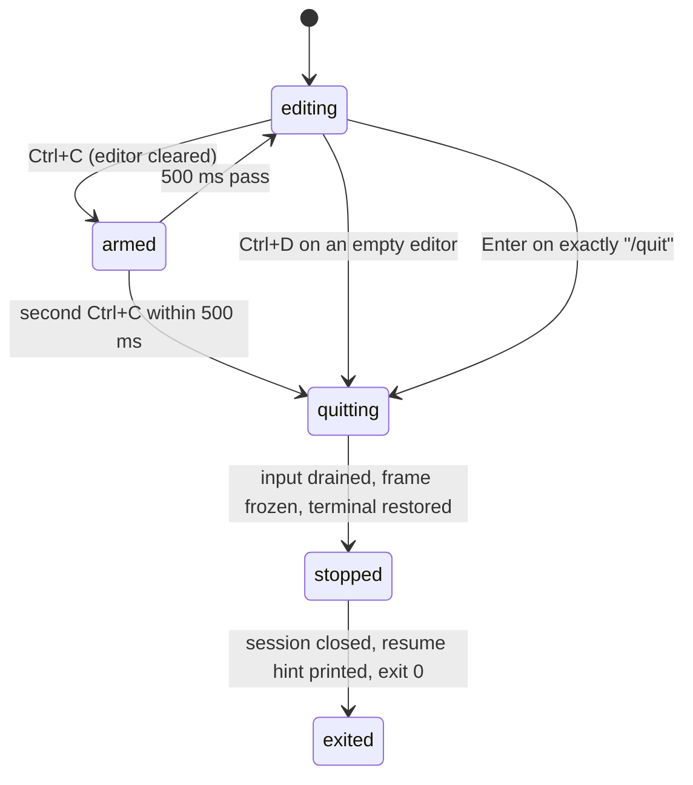

# Quitting

## Summary

Quitting is the orderly way out of pi: `/quit`, Ctrl+D on an empty editor, or Ctrl+C twice within 500 ms. pi stops drawing, hands the terminal back in its normal state, stops whatever the session was doing, prints a resume hint naming the session, and exits with status 0. Nothing is asked and nothing is confirmed, not even mid-turn. The transcript stays in the terminal's scrollback; the session file stays on disk with everything appended up to that point.

This document covers the three deliberate quits and what is left behind. Exits pi does not choose (the terminal closing, SIGTERM, a kill, a crash) and Ctrl+Z suspension are in [process lifecycle](../cross-cutting/process-lifecycle.md).

## The simple case

The user has finished and presses Ctrl+D with the editor empty. The frame stops updating, the cursor reappears below the footer, and one more line is printed in the shell:

```
To resume this session: pi --session 0198a3f2-7c1e-7a4b-9d2e-3f4a5b6c7d8e
```

The shell prompt follows. Everything pi drew is still above it in the scrollback. Running the printed command in the same directory later reopens the conversation ([resuming](resuming.md)).

## The interaction, event by event



### Compose

Three gestures quit. `/quit` is a line typed into the editor; the autocomplete popup offers it after `/`. It is matched on the exact trimmed text, so `/quit now` is not a command and goes to the model as text; so does `/exit`, which pi does not know. Ctrl+D quits only when the editor holds no characters at all (a single space counts as text); with text it deletes the character under the cursor, in bash mode too. Ctrl+C quits on the second press within 500 ms of the first, measured from the first press; the first press clears the editor, the second quits. A third press 600 ms after the first is a new first press. The window is not reset by typing in between. All of this is in [input](../foundations/input.md#ctrlc-and-ctrld).

None of the three works while an overlay is open: Ctrl+C and Escape dismiss the overlay, Ctrl+D goes to the overlay (in the session picker it deletes the highlighted session), and `/quit` cannot be typed. Close the overlay first.

### Resolves at once

- **Ctrl+D with text in the editor**: deletes forward; no quit.
- **One Ctrl+C**: clears the editor (the text is not in history and cannot be undone); no quit. With the agent working, Ctrl+C does not touch the turn.
- **`/quit` with anything else on the line, or `/exit`**: sent to the model as a prompt, or queued as a steering message if the agent is working. See "Open questions".
- **Startup still in progress**: `/quit` is put back in the editor with `Startup is still in progress`. Ctrl+C and Ctrl+D during startup are covered in [launching pi](../startup/launching-pi.md).
- **A second quit while one is in progress**: ignored.

### Sent

Once a quit is accepted, nothing can stop it. `/quit` empties the editor first. Then, in order:

1. Theme auto-detection is switched off and pi stops reading keys. Any keystrokes still in flight are swallowed, for up to one second, so that a key-release sequence from a fast terminal does not leak into the shell prompt.
2. Drawing stops: an open status spinner is removed, the cursor is moved below the last line of the frame, a newline is written, the cursor is shown again, and the terminal's raw mode, bracketed paste, and the Kitty keyboard protocol are turned off. In the regular TUI mode the last frame (transcript, editor, footer) stays on screen as ordinary scrollback.
3. The session is closed: a retry countdown, a compaction, a branch summary, and a running shell command are cancelled, and a turn in progress is aborted. Queued messages are dropped.
4. The resume hint is printed below the frame, when there is one (see "Done").
5. pi exits with status 0.

> Technical note: the quit aborts the turn but does not wait for it to settle before exiting, unlike Escape and the session switches. The aborted assistant message and its `Operation aborted` tool results are appended by the same path Escape uses, but only if that path runs before the process exits, which is a matter of event-loop timing. The established rule that a quit "aborts the turn first so the partial assistant message and tool results are written" describes the intent; see "Open questions".

### While working

The quit takes at most about a second, almost all of it the input drain, which ends as soon as 50 ms pass with no input. There is nothing to see: the frame is frozen from step 2.

### Done

The resume hint is `To resume this session: ` (dim) followed by the command, in one of two forms:

- `pi --session <id>` when the session lives in the default session directory for its working directory.
- `pi --session-dir <dir> --session <id>` when it does not (`--session-dir`, `PI_CODING_AGENT_SESSION_DIR`, or the `sessionDir` setting). The directory is single-quoted when it contains a space or any character outside letters, digits, and `_-./~:@`, with a `'` inside it escaped the shell way.

The id is the full session id. No hint is printed when the session is ephemeral (`--no-session`), when the session file does not exist (no assistant message ever arrived, so nothing was saved), or when pi's standard output is not a terminal. In those cases pi exits silently after restoring the terminal.

After exit: the editor's text and the prompt history are gone (both live in memory only); the session file holds every entry appended before the quit; and the terminal is back in its normal mode. The terminal title is not reset; see "Open questions".

## Modifiers

| Modifier | Set before sending | Changed while working |
| --- | --- | --- |
| Model | No effect. The model is in the file and is restored on resume. | A model changed mid-turn is recorded before the quit and restored on resume. |
| Thinking level | No effect; restored on resume. | Same. |
| Agent busy | Idle: the quit is immediate and the file is complete. Working: the turn is aborted on the way out; see the technical note under "Sent" for what reaches the file. Retrying: the countdown is cancelled; the failed attempts are already in the file. Compacting: the compaction is cancelled and no summary is written. | Not applicable; the quit is not interruptible. |
| Attachments | No effect. Images already sent are in the file. | No effect. |
| Session kind | Saved: the hint is printed if the file exists. Ephemeral: nothing was written and no hint is printed; the conversation is gone. | No effect. |

Ctrl+D and double Ctrl+C are not affected by what the editor contained a moment ago: the first Ctrl+C's clear is what makes the editor empty, and Ctrl+D needs it empty already.

## Cancel and interrupt

| Event | While composing | During the quit |
| --- | --- | --- |
| Escape (once; twice within 500 ms) | Does not affect the quit gestures. Escape after a first Ctrl+C (editor now empty) arms the double-Escape and does not reset the Ctrl+C window; a second Ctrl+C within 500 ms of the first still quits. | No effect; keys are no longer read. |
| Ctrl+C once / twice; Ctrl+D | These are the quit. | Ignored; a quit already in progress is not restarted. |
| Another message submitted (Enter; Alt+Enter follow-up) | Enter on `/quit` quits. Alt+Enter with the agent idle quits too; with the agent working it queues `/quit` as a follow-up, later sent to the model as text, and pi does not quit. | Not possible. |
| A slash command or shortcut that opens an overlay or changes the session | With an overlay open, Ctrl+C and Escape close it, Ctrl+D acts inside it; the quit gestures are not reachable until it closes. A switch (`/new`, `/resume`) completes before a quit can be typed. | Not possible. |
| Model or thinking level changed | Recorded in the file before the quit. | Not possible. |
| Provider error, rate limit, timeout, or network lost | A quit during a retry countdown cancels the retry; the error message is not added to the file (only the failed attempts already are). | No effect. |
| Context window exhausted (auto-compaction) | A quit during auto-compaction cancels it; the session is left uncompacted and compacts again on the next turn after resume. Messages queued behind the compaction are dropped. | No effect. |
| Terminal resized; pi suspended (Ctrl+Z) and resumed | No effect on the gestures. After `fg`, the Ctrl+C window has long expired. | A resize during the drain is ignored; the frame is frozen. |
| Process ends: terminal closed (SIGHUP), SIGTERM, killed | Not a quit; see [process lifecycle](../cross-cutting/process-lifecycle.md). SIGHUP and SIGTERM take a similar path but print no resume hint. | A signal during the quit is handled by the same shutdown, which is already running; the process exits once. |
| Session or files changed from outside | No effect. | If the session file was deleted from outside, no hint is printed (the file must exist). |
| Credentials lost, or logged out | No effect. | No effect. |

Nothing in the table can cancel a quit once a gesture has been accepted.

## Interactions with other systems

**Session persistence.** Nothing is written by the quit itself. What is in the file is what was appended as each message completed ([sessions](../foundations/sessions.md)); the aborted partial message of a turn in progress is the one thing whose arrival is not guaranteed (technical note under "Sent"). A session that never got a response leaves no file and prints no hint.

**Branching and history.** The active position at the quit is what `pi --session <id>` reopens; the whole tree is in the file. The editor's prompt history is not saved.

**Compaction.** A compaction in progress is cancelled without a summary. A session over the threshold at the quit is compacted before the first prompt after resume, as [compaction](compaction.md) describes.

**Context files and the system prompt.** No interaction.

**Settings and keybindings.** `app.exit` (Ctrl+D) and `app.clear` (Ctrl+C) are rebindable; the 500 ms window is not configurable. `sessionDir` and `--session-dir` change the resume hint's form. `fullscreenExitOutput` applies only in fullscreen mode and is out of scope.

**Tools and the working directory.** A `bash` tool call running at the quit is killed with the turn; a user shell command (`!`) is killed and nothing is recorded for it ([shell commands](../conversation/shell-commands.md)). Detached processes a command started are killed with their process group; a process that escaped the group survives.

**Terminal and rendering.** The last frame remains in scrollback in the regular TUI mode; the resume hint is printed immediately below it, then the shell prompt. Raw mode, bracketed paste, the Kitty keyboard protocol, and cursor hiding are undone. The terminal title set by pi is left as it is.

**Credentials and providers.** No interaction; an OAuth refresh in flight is abandoned, and the credential on disk is whatever was last saved.

## Edge cases

- `/exit`, `/q`, and `:q` are not commands; each is sent to the model as text. The model usually answers that it cannot quit pi.
- Ctrl+C twice with a large-paste marker in the editor: the first press clears the marker and its hidden content, the second quits.
- Ctrl+D with the editor holding only a newline (Shift+Enter on an empty box) deletes the newline instead of quitting; a second Ctrl+D quits.
- A held Ctrl+C (key repeat) arrives as repeated presses and quits; see [input](../foundations/input.md#edge-cases).
- Quitting with queued steering or follow-up messages drops them; they were never in the file.
- Quitting during a `/tree` branch summary cancels the summary; the active position has not moved yet, so the session reopens where it was.
- Quitting while the status line reads `Retrying (2/3) in 4s...` leaves two failed assistant messages in the file; `/session` after resume counts them.
- The hint names the session directory only when it is not the default; after `pi --session-dir ~/tmp/s`, the hint is `pi --session-dir ~/tmp/s --session <id>` (unquoted, because `~`, `/`, and letters are safe characters).
- The hint does not name the working directory. Run from a different directory, `pi --session <id>` still finds the session (it searches every project's session directory after the current one) but offers to fork it into the current directory rather than resuming it in place; see [resuming](resuming.md).
- The hint goes to standard output, not standard error, after the terminal is restored, so it is the last line pi prints and the first thing the shell prompt follows.

## Open questions and verification

- The quit path signals the abort of a turn in progress and exits without waiting for it to settle, so the partial assistant message and the `Operation aborted` tool results may not reach the session file. [The turn](../foundations/the-turn.md) and [input](../foundations/input.md) say the same. Not confirmed by hand; if they are lost, it may be worth treating as a bug rather than documenting.
- `/exit` being sent to the model as text is a consequence of the unknown-slash-command rule and is probably not what anyone typing it wants. May be worth treating as a bug rather than documenting.
- Whether the terminal title is reset on quit was not determined; no reset was found in the shutdown path, so the title probably stays `π - <dir>` until the shell or the next program changes it.
- The exact look of the frozen frame after the cursor is moved below it (whether the editor border and footer remain, whether the status line's blank rows remain) was read from the render code and not observed.
- How long the input drain takes in practice (the 50 ms idle rule versus the 1 second cap) was not measured.
- Whether a quit with a running `!` command kills it was inferred from the session's close path; [shell commands](../conversation/shell-commands.md) notes the same uncertainty.
- What Ctrl+C and Ctrl+D do during startup, before the key handlers are active, was not determined here and is left to [launching pi](../startup/launching-pi.md).

Verified against pi-mono commit `a69bef789`.
