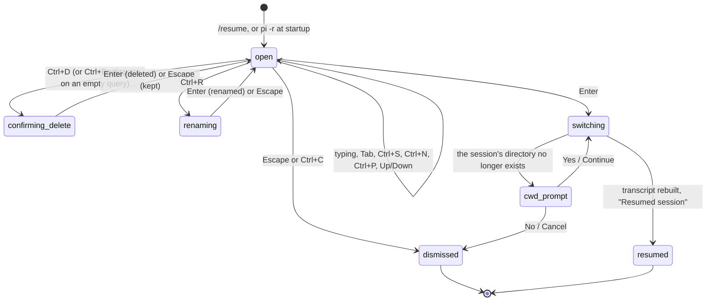

# Resuming

## Summary

Resuming is opening an existing session in place of the current one: the transcript is replaced by the other session's active branch, its model, thinking level, and name come back, and the next prompt continues that conversation. There are five ways in. `/resume` opens the *session picker*, an overlay listing the sessions of the current project (and, on Tab, of every project) with search, sort, rename, and delete; Enter switches. `pi -r` shows the same picker before pi starts. `pi -c` opens the newest session of the working directory with no picker. `pi --session <path|id>` opens a particular file, by path or by id prefix, and offers to fork it if it belongs to another project. `pi --fork <path|id>` copies a session into the current project and starts there.

Every one of these is a [switch](../glossary.md#events-that-end-or-interrupt-a-turn): a turn in progress is aborted and written to the old session, the queue is dropped, and only then is the other session loaded. In the default configuration, with no extensions, nothing can veto it.

## The simple case

The user has two sessions in `~/code/app` and types `/resume`. The editor is replaced by a bordered panel titled `Resume Session (Current Folder)`; on its right, `◉ Current Folder | ○ All  Name: All  Sort: Threaded`; under that, two dim hint lines; then an empty search field and, one per line, the sessions: the first prompt of each, truncated to fit, with the message count and an age such as `2h` or `3d` at the right edge. The newest is at the top and selected. The user presses Down, then Enter.

The panel disappears, the editor returns, the transcript is cleared and redrawn from the chosen session, the footer's name and model change to that session's, and a dim `Resumed session` is added at the bottom. The editor is empty and ready; the next prompt continues the resumed conversation.

## The interaction, event by event

### Open

`/resume` (or Alt+Enter on that text, or the unbound `app.session.resume` action) clears the editor and opens the picker in its place, whatever the agent is doing. The picker lists sessions of the current project first; while the list is being read the header's right side reads `○ Current Folder | Loading 3/12` and the list is empty. Reading is quick for a handful of sessions and noticeably slow for hundreds, because every file is read end to end to find its name, first prompt, and last activity.

The header's two hint lines read `tab scope · re:<pattern> regex · "phrase" exact` and `ctrl+s sort · ctrl+n named · ctrl+d delete · ctrl+p path (off) · ctrl+r rename`. The key names in them come from the live keybindings.

Each row is one line: a `›` cursor on the selected row; in Threaded sort, a tree prefix (`├─ `, `└─ `, `│  `) under the session it was forked or cloned from; the session name if it has one (in the warning colour) or else its first user message, control characters replaced by spaces, truncated with `…`; and at the right edge, dim, the number of messages and the age: `now`, `12m`, `3h`, `2d`, `1w`, `2mo`, `1y`. The row for the session pi is currently in is drawn in the accent colour. The selected row is bold on the selection background. Ten rows are visible; when there are more, a dim `(4/37)` line follows the list and the window scrolls to keep the selection centred.

`pi -r` shows the same picker on a bare terminal before anything else is drawn, with one difference: the rename hint is absent and Ctrl+R does nothing.

### Dismissed at once

- **Escape or Ctrl+C** closes the picker; the editor returns empty (the `/resume` text was cleared on submit). From `pi -r`, the terminal is cleared and pi prints `No session selected` and exits with code 0.
- **No sessions.** The list shows `No sessions in current folder. Press Tab to view all.` in place of rows; in the All scope, `No sessions found`. The picker stays open.
- **`pi -c` with no session for the directory** starts a new session silently; there is no picker and no message.
- **`pi --session <arg>` that matches nothing** prints `No session found matching '<arg>'` in red and exits with code 1. `pi --fork <arg>` does the same.
- **`pi --session <path>` to a file that is not a session** prints `Error: Session file is not a valid pi session: <path>` and exits with code 1; the file is left untouched. A zero-byte file is treated as a new session stored at that path.
- **The cross-project prompt answered no.** `--session <id>` that matches only in another project prints `Session found in different project: <that directory>` in yellow and asks `Fork this session into current directory? [y/N] ` on a plain line. Anything but `y` or `yes` prints `Aborted.` and exits with code 0.
- **Cancel at the missing-directory prompt** (below) exits with code 0 at startup, or shows `Resume cancelled` in the session.
- **`--fork` combined with `--session`, `-c`, `-r`, or `--no-session`** is refused before anything starts: `Error: --fork cannot be combined with …`, exit code 1.

### First change

Printable keys go into the search field and filter the list on every keystroke. The list is filtered, not the transcript; nothing is written. The selection index is kept where it was (clamped to the shorter list), so the cursor may land on a different session after typing.

Search covers, for each session, its id, its name, the text of every user and assistant message on every branch, and its directory path, so a fragment of a path or an id matches too. Three forms:

- **Words** are matched fuzzily, each word independently, all must match.
- **`"quoted phrase"`** must appear literally, case-insensitively, with runs of whitespace treated as one space. Quotes can be mixed with words: `auth "node cve"`. An unclosed quote falls back to plain words.
- **`re:<pattern>`** is a case-insensitive regular expression. `re:` alone, or an invalid pattern, matches nothing and the list is empty.

While a query is present the tree layout is dropped: Threaded and Fuzzy both show a flat list ordered by match quality (earlier matches first; ties broken by newest first), and Recent keeps newest-first order and only filters.

### While open

The keys, all of them taking effect at once and none of them leaving the picker:

| Key | Action |
| --- | --- |
| Up / Down, PageUp / PageDown | Move the selection one row or ten rows; no wrap. |
| Tab | Switch the scope between `Current Folder` and `All`. The first switch to All reads every project's sessions, with `Loading n/total` in the header meanwhile; later switches are instant. In All, each row also shows the session's directory (with `~` for home) before the count. Switching back while All is still loading shows the current-folder list at once and the All result is kept for next time. |
| Ctrl+S | Cycle the sort: `Threaded` (forks and clones nested under their parent, each group ordered by its newest activity), `Recent` (flat, newest last activity first), `Fuzzy` (flat; the same as Recent until a query is typed). Shown as `Sort: …` in the header. |
| Ctrl+N | Toggle `Name: All` / `Name: Named`. Named shows only sessions with a non-blank name; when none match the list reads `No named sessions in current folder. Press ctrl+n to show all, or Tab to view all.` (or `No named sessions found. Press ctrl+n to show all.` in All). |
| Ctrl+P | Toggle `path (on)` / `path (off)`: each row gains the session file's path, with `~` for home, before the count and age. This shadows the model-cycling shortcut while the picker is open. |
| Ctrl+R | Rename the selected session (below). |
| Ctrl+D; Ctrl+Backspace | Start deleting the selected session (below). Ctrl+Backspace does so only when the search field is empty; with text in it, it deletes the word before the cursor instead. Ctrl+D deletes regardless and never quits pi here. |
| Enter | Resume the selected session. |
| Escape, Ctrl+C | Close the picker. |

**Deleting.** The hint lines are replaced by `Delete session? enter confirm · escape cancel` in the error colour and the selected row turns the error colour. Every other key is ignored until Enter or Escape. Enter removes the file, by the `trash` command if one is installed and otherwise by deleting it outright, and the hint line shows `Session moved to trash` or `Session deleted` in the accent colour for two seconds while the list is re-read from disk. A failure shows `Failed to delete: <reason>` for three seconds. The session pi is currently in cannot be deleted: `Cannot delete the currently active session` for three seconds and no confirmation.

**Renaming.** The whole panel is replaced by `Rename Session`, a text field holding the current name (empty if none), and `enter to save · escape to cancel`. Enter with a non-blank name appends a name entry to that session's file on disk and returns to the list, which is re-read so the new name shows at once; the list's search text and selection are kept. Escape or Ctrl+C returns without renaming. Enter on a blank name does nothing and leaves the rename field open. Renaming is ignored while the list is loading.

The agent keeps working behind the picker: streaming text and tool results keep arriving in the transcript above it, and the status line keeps updating. Nothing typed into the picker reaches the editor.

### Accepted

Enter closes the picker and the editor returns. Then, in order:

1. The status line is cleared.
2. The chosen file is opened and its header read. If the directory recorded in it no longer exists, a confirmation overlay `Session cwd not found` appears with the text `cwd from session file does not exist`, the missing path, `continue in current cwd`, and the current directory, with `Yes` and `No`. `No` (or Escape) shows `Resume cancelled` and nothing changes. `Yes` resumes the session with the current directory as its working directory for this run.
3. The current session is torn down: a turn in progress is aborted and its partial assistant message and tool results are appended to the old file, a running shell command is killed, a retry countdown or compaction is cancelled, and queued messages are dropped (not returned to the editor).
4. The resumed session is loaded: settings and context files are re-read for its directory, the model is restored from the last model change on its active branch if that model is still available, otherwise the default is chosen as at startup; the thinking level likewise.
5. The transcript is cleared and redrawn from the active branch (see [the transcript](../conversation/the-transcript.md)); the header at the top of the screen stays. `Session compacted N times` follows if the session was compacted. The prompt history gains the branch's user messages. The footer shows the session's directory, name, model, and thinking level; the editor border takes the thinking-level colour; the terminal title changes.
6. `Resumed session` is added as a status message, or `Resumed session in current cwd` after the directory prompt.

The editor's text survives the switch; whatever was in it before `/resume` was replaced by the command itself, so it is normally empty.

At startup the same steps happen before the first frame, without the teardown: `pi -r`, `pi -c`, and `pi --session` draw the resumed transcript in place of the empty screen, skip the changelog notice, and warn `Could not restore model <provider>/<id> (…). Using <provider>/<id>.` if the recorded model is unavailable. The missing-directory prompt at startup is a bare-terminal overlay with the same text and the choices `Continue` and `Cancel`; Cancel (or Escape) exits with code 0 and prints nothing.

> Technical note: the in-session switch builds a whole new runtime for the resumed session's directory: its project settings, context files, and tool working directory follow the session, not the directory pi was started in. The directory prompt's "current cwd" is the directory of the session being left, not necessarily the shell's.

## Modifiers

| Modifier | Before open | While open |
| --- | --- | --- |
| Model | No effect on the picker. | The resumed session brings its own model; the current one is forgotten for that session. Ctrl+P inside the picker toggles paths, not models. |
| Thinking level | No effect. | Restored from the resumed session; the border colour changes on switch. |
| Agent busy | Working or compacting: `/resume` still opens the picker. | Enter aborts the turn as part of the switch; the aborted state lands in the old file and the queue is dropped. Escape leaves the turn running. |
| Attachments | No effect. | The editor is not cleared by the switch, so text typed before `/resume` was opened by a shortcut survives; whether pending images do was not checked (see "Open questions"). |
| Session kind | Saved: the current session is listed (accent colour) and cannot be deleted. Ephemeral (`--no-session`): the current session is not in the list; the picker works the same. | Resuming from an ephemeral session discards it entirely; the resumed session is saved as normal. |

## Cancel and interrupt

| Event | While open | After Enter (switching) |
| --- | --- | --- |
| Escape (once; twice within 500 ms) | Closes the picker (or the delete confirmation, or the rename field, whichever is innermost). A second Escape goes to the editor: empty editor, so it arms the double-Escape. | Escape at the directory prompt answers No: `Resume cancelled`. Otherwise the switch is not cancellable; it finishes in well under a second. |
| Ctrl+C once / twice; Ctrl+D | Ctrl+C closes the picker and does not arm the quit window. Ctrl+D starts a delete confirmation; it never quits from inside the picker. | Ctrl+C and Ctrl+D behave as usual once the editor is back; quitting mid-switch is not possible because no key is read until it ends. |
| Another message submitted (Enter; Alt+Enter follow-up) | Enter resumes the selected session; Alt+Enter is not handled by the picker. | Not applicable. |
| A slash command or shortcut that opens an overlay or changes the session | The picker has focus; slash commands cannot be typed. Ctrl+L, Ctrl+O, Ctrl+T and the rest are not handled. | Not applicable. |
| Model or thinking level changed | Ctrl+P toggles paths; Shift+Tab is not handled. | The resumed session's model and thinking level replace the current ones. |
| Provider error, rate limit, timeout, or network lost | A retry countdown continues behind the picker. | Cancelled by the switch; the failed attempt is in the old file. |
| Context window exhausted (auto-compaction) | Compaction continues behind the picker. | Cancelled by the switch; no summary is written. |
| Terminal resized; pi suspended (Ctrl+Z) and resumed | The picker re-wraps rows and hints to the new width. Suspend keeps it open. | No effect. |
| Process ends: terminal closed (SIGHUP), SIGTERM, killed | Nothing is written; a rename or delete already confirmed is on disk. | Killed mid-switch: the old file holds the aborted turn if the abort had completed; the resumed session is untouched. |
| Session or files changed from outside | The list is a snapshot: a session created, renamed, or deleted by another pi after the picker opened is not reflected until a rename or delete here re-reads the list. | A file deleted between listing and Enter: see "Open questions". |
| Credentials lost, or logged out | No effect on the picker. | If the resumed session's model has no credential, the default model is chosen instead. |

A failure to load the chosen session that is not the missing-directory case ends pi: `Failed to resume session: <reason>` is shown and pi exits with code 1.

## Interactions with other systems

**Session persistence.** Resuming writes nothing to the resumed file until the next entry is appended; the switch writes the aborted turn to the old file. Rename appends a name entry to the target file; delete removes it (to the trash when `trash` is installed). `pi -c` picks the newest file by modification time, the picker orders by last message time; see [sessions](../foundations/sessions.md).

**Branching and history.** The transcript and the model's context come from the resumed session's active branch only; other branches are there in `/tree` ([the tree](the-tree.md)). Forks and clones appear nested under their parent in Threaded sort because their header names the parent file; see [fork and clone](fork-and-clone.md). The prompt history is extended with the resumed branch's user messages.

**Compaction.** A compacted session shows `Session compacted N times` on resume and its context is built from the last summary forward; see [compaction](compaction.md).

**Context files and the system prompt.** Rebuilt for the resumed session's directory on switch, so `AGENTS.md` edits made since are picked up, and a session from another project brings that project's context files.

**Settings and keybindings.** `sessionDir` and `--session-dir` change where all sessions are read from; with a custom directory the current-folder scope filters by the recorded directory. `app.session.resume` (unbound) opens the picker; `app.session.toggleSort` (Ctrl+S), `toggleNamedFilter` (Ctrl+N), `togglePath` (Ctrl+P), `rename` (Ctrl+R), `delete` (Ctrl+D), `deleteNoninvasive` (Ctrl+Backspace); `tui.select.*` for movement, Enter, and Escape/Ctrl+C. Project settings and trust are re-resolved for the resumed directory; see [project trust](../settings/project-trust.md).

**Tools and the working directory.** After the switch, tools run in the resumed session's directory, which may differ from the one pi was started in; the footer shows which. The directory prompt is the only case where a session runs somewhere other than where it was recorded.

**Terminal and rendering.** The picker is a fixed-height panel: ten rows plus header and hints; the search field takes keyboard focus so the hardware cursor, when enabled, sits there. The startup picker draws on a bare terminal and is cleared before pi's own screen starts.

**Credentials and providers.** The recorded model is restored only if its provider has a credential now; otherwise the fallback rule from [models and credentials](../foundations/models-and-credentials.md) applies, with a warning at startup and none in-session (see "Open questions").

## Edge cases

- Selecting the session pi is already in is allowed: the turn is aborted, the file is re-read, the transcript redrawn, and `Resumed session` shown.
- The message count at the right of a row counts every message entry in the file across all branches, including tool results and shell records, so it is larger than the number of prompts.
- A session that has no prompt yet but does have a response (an aborted first turn) shows `(no messages)` as its title.
- A whitespace-only name counts as no name: the row falls back to the first message and `Name: Named` hides it.
- Typing a query in Threaded sort flattens the tree; clearing the query restores it.
- `--session <id>` accepts any prefix of the id; an exact match in the current project wins over a prefix match, the current project wins over other projects, and a prefix that matches several sessions opens the first match in the picker's order with no warning.
- `--session` with a path is opened wherever it is, without the cross-project prompt, and sessions started from it with `/new` are filed in that file's directory.
- `--fork` of a session in the current project makes a copy in the same directory; the copy contains every branch of the original and its header names the original as parent.
- `pi -c` with a custom session directory only considers files whose recorded directory is the current one; with the default layout it takes the newest file in the per-directory folder regardless.
- Answering the startup directory prompt with Continue does not rewrite the file's recorded directory; the next resume asks again.
- `/resume` while a shell command is running kills the command when a session is chosen; its output is not recorded.

## Open questions and verification

- After an in-session `/resume`, the `Could not restore model …` warning is computed but never shown; only the footer reveals that the model fell back. May be worth treating as a bug rather than documenting.
- Enter on a blank rename field does nothing and leaves the field open rather than cancelling; whether that is intended was not determined.
- Renaming the session pi is currently in, from the picker, writes the name to the file but the running session and footer do not learn of it until the session is resumed again. May be worth treating as a bug rather than documenting.
- A failure to open the chosen session (other than a missing directory) exits pi with code 1 rather than returning to the editor. May be worth treating as a bug rather than documenting.
- What happens when the chosen file was deleted between listing and Enter was not determined: the loader treats a missing file as empty, so the likely result is an empty session at that path.
- Whether `pi --session <path>` to a nonexistent path starts a new session at that path or fails was read as the former (missing file loads as empty) and not confirmed.
- The picker's `onExit` callback, wired to shut pi down, is never invoked by any key; whether a quit key was intended for the picker is not recorded.
- Whether the All-scope load reports progress per file as described, and how long it takes for a few hundred sessions, was not timed.
- Whether the startup picker honours the automatic light/dark theme before its first frame or only after the 100 ms detection was not checked.
- The exact rendering when a row's title is shorter than the minimum 10 columns reserved for it on a very narrow terminal was not checked.
- Whether images attached to the editor survive an in-session switch was not determined; the editor component itself is not cleared.

Verified against pi-mono commit `a69bef789`.
