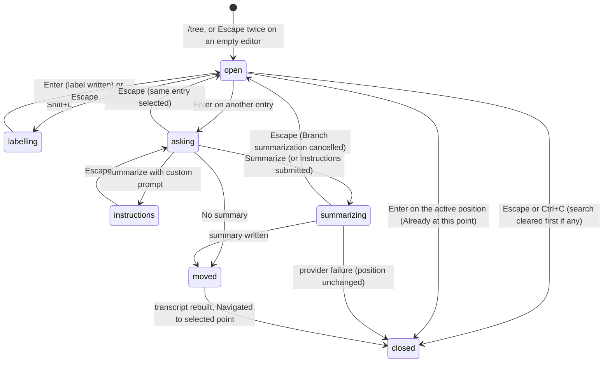

# The tree

## Summary

`/tree` opens an overlay that shows every entry in the session, including branches the user has abandoned, as an indented tree with the active position marked. The user moves through it, folds branches, filters what is listed, searches by typing, copies an entry, and puts labels on entries they want to find again. Pressing Enter on an entry moves the active position there: choosing a user message puts its text back into the editor so it can be edited and re-sent as a new branch; choosing anything else continues the conversation from that point. Before moving, pi offers to write a *branch summary* of the branch being left so the model keeps what was learned there. Nothing is deleted and no new file is made; the old branch stays in the session file and in the tree.

The overlay is reached with `/tree` or with Escape pressed twice within 500 ms on an empty editor (the `doubleEscapeAction` setting, default `tree`). It can be opened while the agent is working; committing to a move then aborts the turn first.

## The simple case

After a few exchanges the user decides the second prompt sent the model down the wrong path. They press Escape twice on the empty editor. The editor is replaced by a box headed `Session Tree`, a row of key hints, a `Type to search:` line, and the list of entries: `user: …`, `assistant: …`, `[read: src/app.ts]`, each indented under its parent, with a `•` before every entry on the current path and `›` on the selected row, which is the newest entry. They press Up until the second `user:` row is highlighted and press Enter.

The overlay closes and a short prompt takes its place: `Summarize branch?` with `No summary`, `Summarize`, and `Summarize with custom prompt`. They choose `Summarize`. The status line reads `Summarizing branch... (escape to cancel)` for a few seconds. Then the transcript is redrawn showing only the first exchange, ending with a shaded `[branch]` box reading `Branch summary (Ctrl+O to expand)`; a dim `Navigated to selected point` line follows; and the editor holds the text of the second prompt, ready to be edited. They change it and press Enter. The new prompt starts a second branch from the first exchange; the old branch is still in `/tree`, listed below the new one.

## The interaction, event by event



### Open

`/tree` (typed and submitted, even while the agent is working or compacting) or the second Escape of a double press on an empty editor replaces the editor with the overlay. `app.session.tree` has no default key. If the session has no entries at all the overlay does not open; a dim `No entries in session` status is shown instead.

The overlay is, top to bottom: a blank line, a rule across the width in the border colour, `Session Tree` in bold, the key hints in the muted colour wrapped to the width (`↑/↓ move · ←/→ page · alt+←/→ branch · ctrl+x copy · shift+l label · shift+t label time · filters ctrl+d/t/u/l/a · cycle ctrl+o/shift+ctrl+o`, with `option` in place of `alt` on macOS), the line `Type to search:`, a rule, a blank line, the list, a blank line, and a closing rule. The editor's text is kept and is back when the overlay closes.

A session with one abandoned branch, with the newest entry selected, looks like this (colours omitted):

```
──────────────────────────────────────────────────────────────
  Session Tree
  ↑/↓ move · ←/→ page · alt+←/→ branch · ctrl+x copy · shift+l label
  · shift+t label time · filters ctrl+d/t/u/l/a · cycle ctrl+o/shift+ctrl+o
  Type to search:
──────────────────────────────────────────────────────────────

  • user: Summarize this repository
  • assistant: This repository is a command-line tool for…
  • [read: ~/code/app/README.md]
  • assistant: The README describes three commands…
  ├⊟ • user: Add a test for the parser
  │     • assistant: I'll add a test that…
  │     • [write: ~/code/app/test/parser.test.ts]
› │     • assistant: Done. The test covers…
  └⊟ [checkpoint] user: Refactor the parser first
        assistant: Sure. I'll start by…
  (8/10)

──────────────────────────────────────────────────────────────
```

The list shows up to half the terminal's rows (never fewer than five), scrolled so the selected row stays near the middle, and ends with a counter line such as `(12/37)`. When a filter or the timestamp toggle is on, the counter carries tags: `[no-tools]`, `[user]`, `[labeled]`, `[all]`, `[+label time]`. When nothing matches, the list reads `No entries found` above `(0/0)`.

Each row is: `› ` in the accent colour on the selected row (two spaces otherwise); the tree prefix in dim, built from `│`, `├─`, and `└─`, where the `─` of a branch connector becomes `⊟` if the entry can be folded and `⊞` if it is folded; `• ` in the accent colour if the entry lies on the path from the root to the active position; `[label] ` in the warning colour if the entry has a label, followed by the label's time when Shift+T is on; then the entry itself. The selected row is drawn bold on the selection background. Rows wider than the terminal are clipped, and when the selected row's text would start off-screen the whole body of the list shifts left while the `›` column stays put.

What an entry looks like:

- `user: ` (accent) followed by the message's first 200 characters with newlines flattened.
- `assistant: ` (success colour) followed by the text; `(aborted)` in muted for an aborted message with no text; the error text in the error colour for a failed one; `(no content)` otherwise.
- A tool result as its call: `[read: ~/src/app.ts:1-40]`, `[write: path]`, `[edit: path]`, `[bash: <first 50 characters>...]`, `[grep: /pattern/ in path]`, `[find: pattern in path]`, `[ls: path]`, in muted.
- A shell command as `[bash]: <command>` in dim.
- `[compaction: 150k tokens]` in the accent border colour; `[branch summary]: <text>` in the warning colour.
- `[model: <id>]`, `[thinking: <level>]`, `[label: <name>]` or `[label: (cleared)]`, `[title: <name>]` or `[title: empty]`, and `[custom: <type>]` in dim. These only appear in the `all` filter.

Assistant messages that contain no text and ended normally (the tool-call-only ones) are never listed, whatever the filter, unless one is the active position. Children are listed oldest first, except that the child leading to the active position is always listed first. If the file has more than one root (see [sessions](../foundations/sessions.md)), the roots are shown as siblings at the top.

The selection starts on the active position, or on its nearest listed ancestor when the active position itself is filtered out (for example when the newest entry is a model change and the default filter hides it). The starting filter is the `treeFilterMode` setting, `default` unless changed.

### Dismissed at once

- **Escape or Ctrl+C** closes the overlay and returns the editor with its text. If a search is typed, the first press only clears the search (and any folds); a second press closes. Ctrl+C here does not count toward the double-press quit.
- **Enter on the active position** closes the overlay and shows `Already at this point`. Nothing changes.
- **Enter, then Escape in `Summarize branch?`** reopens the tree with the same entry selected, as if nothing had happened.

Nothing is written to the session in any of these cases, except labels made with Shift+L, which are written the moment they are saved.

### First change

The first keystroke in the list selects, folds, filters, searches, or labels; none of these touches the session or the transcript, except a saved label.

- **Up / Down** move one row and wrap from either end to the other.
- **Left / Right**, and **PgUp / PgDn**, move by one screenful.
- **Ctrl+Left** (or Alt+Left): if the selected entry can be folded and is not, fold it: its descendants disappear and the connector shows `⊞`. Otherwise jump up to the first entry of the current branch segment (the entry just after the nearest branch point above), or, if already there, to the start of the segment above, up to the root. An entry can be folded if it has listed children and is either a root or the first entry of a branch segment.
- **Ctrl+Right** (or Alt+Right): unfold the selected entry if it is folded. Otherwise jump down the branch to the first child of the next branch point, or to the end of the branch if there is none.
- **Typing** any printable character adds it to the search shown after `Type to search:`. The list keeps only entries whose label, role word, text (the first 200 characters), or shell command contains every space-separated word of the search, case-insensitively. Backspace deletes the last character. Searching clears folds.
- **Ctrl+D** sets the `default` filter. **Ctrl+T** toggles `no-tools` (default without tool results), **Ctrl+U** toggles `user-only`, **Ctrl+L** toggles `labeled-only`, **Ctrl+A** toggles `all`; each toggles back to `default` when pressed again. **Ctrl+O** cycles `default → no-tools → user-only → labeled-only → all → default`, and **Shift+Ctrl+O** cycles the other way. Changing the filter clears folds and moves the selection to the nearest listed ancestor of the entry that was selected; if the new filter lists nothing, the selection is remembered and restored when a filter lists it again.
- **Ctrl+X** copies the selected entry's full text (a message's text, a shell command's command line, a summary's text) to the clipboard and shows `Copied selected message to clipboard` in the transcript behind the overlay, or `Error: Selected entry has no text to copy` for an entry with none (a tool result, a model change). The overlay stays open.
- **Shift+T** shows or hides the time next to each label: `14:32` for today, `3/28 14:32` for this year, `26/3/28 14:32` otherwise. The counter line gains `[+label time]`.
- **Shift+L** replaces the list with a one-line label editor: `Label (empty to remove):`, an input holding the current label if any, and the hint `enter save  escape cancel`. Enter saves (an empty or blank label removes the existing one) and returns to the list with the label shown; Escape returns without change. The label is written to the session at once as a label entry and stays after the overlay closes.

### While open

The list is a snapshot taken when the overlay opened. If the agent is working behind it, its new messages, tool results, and any compaction that lands meanwhile are not added to the list until the overlay is reopened. The transcript, status line, and footer keep updating behind the overlay.

Every key goes to the overlay. The application shortcuts (Ctrl+P, Ctrl+L, Shift+Tab, Ctrl+O, Ctrl+G, Alt+Enter, Alt+Up) are either taken by the tree's own bindings (Ctrl+L is the labeled filter, Ctrl+O cycles the filter, Ctrl+X copies the selected entry) or ignored; no other overlay can be opened and no slash command can be typed, because `/` is a search character.

### Accepted

Enter on an entry other than the active position closes the overlay and, unless `branchSummary.skipPrompt` is `true`, shows `Summarize branch?` in the editor's place: a rule, the question in bold accent, the three options `No summary`, `Summarize`, `Summarize with custom prompt` with `→` on the selected one, the hint `↑↓ navigate  enter select  escape cancel`, and a rule. Up/Down (or `k`/`j`) move, Enter chooses, Escape goes back to the tree with the same entry selected. `Summarize with custom prompt` opens a multi-line editor titled `Custom summarization instructions` with the hint `enter submit  shift+enter newline  escape cancel  ctrl+g external editor`; Escape there returns to the question. With `skipPrompt` on, the question is skipped and no summary is made.

Once the choice is complete, and only then, a turn in progress is ended: queued messages are returned to the editor and the turn is aborted as in [the turn](../foundations/the-turn.md#cancel-and-interrupt), so the aborted assistant message and tool results are written to the session before the move.

**Without a summary**, the move happens at once.

**With a summary**, a blank line is added to the transcript and the status line shows `Summarizing branch... (escape to cancel)`. The editor stays usable. The entries from the old active position back to (not including) the entry the two branches share are serialised and sent to the current model with instructions to produce a structured summary: `## Goal`, `## Constraints & Preferences`, `## Progress` (`Done`, `In Progress`, `Blocked`), `## Key Decisions`, `## Next Steps`, followed by `<read-files>` and `<modified-files>` lists gathered from the tool calls in those entries and from any earlier summaries among them. Custom instructions are appended to the default ones as `Additional focus: …`. The text is prefixed with `The user explored a different conversation branch before returning here. Summary of that exploration:`. A transient provider error is retried with the same schedule as a turn: `Error: <message>` in the transcript, `Retrying (1/3) in 2s... (escape to cancel)` in the status line, then `Summarizing branch...` again. Submissions during the summary are queued with `Queued message for after compaction` (see [the message queue](../conversation/the-message-queue.md)).

> Technical note: the summary request is a one-off call with tools disabled and no prompt caching, limited to the model's window minus 16,384 tokens (`branchSummary.reserveTokens`) of input taken newest-first, and 2,048 tokens of output. A branch too long to fit is summarised from its newest end; earlier compaction and branch summaries on the branch are squeezed in if they fit within 90% of the budget. The thinking level is not applied to this call.

**The move.** For a user message (or a custom message), the active position becomes that message's parent, so the message itself is off the branch, and its text is placed in the editor if the editor is empty; choosing the very first user message makes the conversation empty. For any other entry (an assistant message, a tool result, a shell record, a compaction, a summary), the active position becomes that entry and the editor is left alone. If a summary was made, a branch summary entry is appended as a child of the new position and becomes the active position itself, so the summary is the last thing the model sees.

Then the transcript is cleared and redrawn from the new branch: the messages up to the new position, the `[branch]` box with `Branch summary (Ctrl+O to expand)` at the end if one was made (expanded, `Branch Summary` and the summary as markdown in the shaded box), a dim `Session compacted N times` if the branch contains compactions, and `Navigated to selected point`. Status lines, warnings, and errors from before are gone. Messages queued during the summary are then released: the first becomes a new prompt from the new position and the rest are queued behind it. The next Enter starts a new branch.

A move without a summary writes nothing to the session file. A move with a summary writes the branch summary entry (with the model's usage for the call). Labels are written when saved.

## Modifiers

| Modifier | Before open | While open |
| --- | --- | --- |
| Model | The summary is generated by the model shown in the footer at the moment of Enter; a move needs no model unless a summary is asked for. Moving to another branch does not change the model, even if that branch recorded a different one (see "Open questions"). | Cannot be changed from inside the overlay; Ctrl+P and Ctrl+L are taken or ignored. |
| Thinking level | Not applied to the summary request. Not changed by the move. | Shift+Tab is ignored while the overlay is open. |
| Agent busy | Idle: as described. Working: the overlay opens over the turn and the turn continues behind it; Enter on another entry, once the summary choice is complete, returns the queue to the editor and aborts the turn before moving. Compacting: the overlay opens; after the choice, the move waits for the compaction to finish (see "Open questions"). | No effect on the keys; the list does not update. |
| Attachments | No effect. Images in a chosen user message are not restored to the editor; only its text is. | No effect. |
| Session kind | Saved: labels and branch summaries are appended to the file. Ephemeral (`--no-session`): identical on screen, nothing on disk. | No effect. |

## Cancel and interrupt

| Event | While the tree is open | After Enter (the question, summarising, the move) |
| --- | --- | --- |
| Escape (once; twice within 500 ms) | Clears the search if there is one; otherwise closes the overlay, editor text intact. The second Escape of the pair that opened the tree is already consumed; a further double press on the now-empty editor opens it again. | In `Summarize branch?`: back to the tree at the same entry. In the instructions editor: back to the question. While summarising: the request is cancelled, `Branch summarization cancelled` is shown, nothing is written, and the tree reopens at the same entry. After the move: the usual Escape. |
| Ctrl+C once / twice; Ctrl+D | Ctrl+C behaves as Escape (clear search, then close) and does not arm the quit window. Ctrl+D sets the `default` filter; it never quits from the tree. | In the question: Ctrl+C cancels back to the tree; Ctrl+D does nothing. While summarising: Ctrl+C clears the editor; twice within 500 ms quits, abandoning the summary with nothing written; Ctrl+D quits if the editor is empty. See [quitting](quitting.md). |
| Another message submitted (Enter; Alt+Enter follow-up) | Enter selects. Alt+Enter and Alt+Up are ignored. | While summarising: Enter and Alt+Enter queue the text with `Queued message for after compaction`; after the move the first queued message is sent as a prompt from the new position and the rest are queued. If the summary is cancelled, the queued messages stay in the pending area (see "Open questions"). |
| A slash command or shortcut that opens an overlay or changes the session | Not possible; every key goes to the tree. | While summarising, slash commands run: `/new`, `/resume`, `/fork`, `/clone`, `/import` abort the summary and switch sessions; the move never happens. `/compact` starts a compaction alongside the summary (see "Open questions"). `/tree` again opens a second tree over the running summary. |
| Model or thinking level changed | Not possible from the overlay. | Ctrl+P or Shift+Tab while summarising apply to the next turn; the running summary keeps its model. The move itself changes neither. |
| Provider error, rate limit, timeout, or network lost | No effect. | Transient errors retry up to three times with the 2, 4, 8 s countdown. After the third failure, or on a non-retryable error (quota, billing, credentials), the transcript shows `Error: <provider message>`, the position is unchanged, the tree does not reopen, and nothing is written. |
| Context window exhausted (auto-compaction) | A compaction finishing behind the overlay is not in the list until reopened. | The summary request cannot overflow; its input is capped. After the move, the next prompt's pre-send compaction check looks at the last assistant message on the new branch. |
| Terminal resized; pi suspended (Ctrl+Z) and resumed | The overlay redraws at the new width; long rows are clipped and the list shifts to keep the selected row's text visible. Ctrl+Z is ignored while the overlay has focus. | Redraws. Suspend does not stop the summary request; on `fg` the result is applied. |
| Process ends: terminal closed (SIGHUP), SIGTERM, killed | Nothing changes on disk; labels already saved are in the file. | The summary is lost and nothing is written. A move made without a summary is not in the file either: on resume, the session reopens at the last entry in the file, not at the chosen position (see "Edge cases"). |
| Session or files changed from outside | The list is a snapshot; entries appended by another process appear on reopen. | The summary and the move use what is in memory. |
| Credentials lost, or logged out | No effect. | `Summarize` fails with the provider's credential error and the position is unchanged; `No summary` needs no credential. |

After a cancel from the question or from summarising, the tree is back with the same entry selected and the editor text (including any queue returned by an abort) is intact. After a failed summary the editor is back and nothing has moved.

## Interactions with other systems

**Session persistence.** A label is one label entry, appended as a child of the active position at the time it is saved, naming the target entry. A branch summary is one branch summary entry, appended as a child of the new position. A move itself is not an entry: the session file has no record of the active position, and on load the position is the last entry in the file. A move followed by a prompt is persisted by that prompt's user message; a move with a summary is persisted by the summary entry; a move with neither is forgotten on quit. See [sessions](../foundations/sessions.md).

**Branching and history.** This document. Branches are created by sending a prompt after a move. `/fork` and `/clone` ([fork and clone](fork-and-clone.md)) copy the path to the active position into a new file, so the abandoned branches are not carried along. The prompt history is reseeded from the new branch's user messages when the transcript is rebuilt.

**Compaction.** Compaction entries appear in the tree as `[compaction: Nk tokens]` and can be chosen like any other entry; choosing one continues from the compacted state. A branch summary is a valid cut point for a later compaction and is summarised with the rest. Branch summarisation and compaction share the same structured summary format and the same retry policy; see [compaction](compaction.md).

**Context files and the system prompt.** No interaction.

**Settings and keybindings.** `doubleEscapeAction` (`tree`, `fork`, `none`) decides what the double Escape opens; `treeFilterMode` sets the starting filter; `branchSummary.skipPrompt` skips the question (always no summary); `branchSummary.reserveTokens` caps the summary request. The first three are in `/settings` as Double-escape action and Tree filter mode. Keys: `app.session.tree` (unbound), `app.tree.foldOrUp`, `app.tree.unfoldOrDown`, `app.tree.editLabel`, `app.tree.toggleLabelTimestamp`, `app.tree.filter.*`, `app.message.copy` (Ctrl+X), and the shared `tui.select.*` bindings. The hint row is generated from the live bindings.

**Tools and the working directory.** Tool results are listed by their call with paths shortened with `~`. Moving the active position does not undo anything on disk: files written on the abandoned branch stay written.

**Terminal and rendering.** Ctrl+Left/Right and Alt+Left/Right need a terminal that reports the modifiers; where only one arrives, the other is an alias. Shift+L and Shift+T arrive as the capital letters `L` and `T`, which is why they cannot be typed into the search. The fold glyphs `⊟` and `⊞` and the box-drawing characters need a font that has them.

**Credentials and providers.** Only `Summarize` talks to a provider. It resolves the credential fresh, as a turn does.

## Edge cases

- Typing `L` or `T` (capitals) into the search is impossible: they are the label and timestamp keys. Lower-case `l` and `t` search as expected. See "Open questions".
- Search matches only the first 200 characters of a message; a word further into a long message does not find it.
- Choosing the first user message of the session empties the conversation: the transcript is blank, the footer's context figure resets, and the message's text is in the editor. Sending it starts a second root in the same file, shown as a sibling of the first at the top of the tree.
- Choosing a user message while the editor already has text leaves that text in place; the message's text is not inserted. After an abort of a working turn, the returned queue fills the editor, so the chosen message's text is dropped in that case too.
- Choosing a tool result moves the active position to the result, so the model continues as if the tool had just returned.
- Choosing the retry attempts of a failed call, which are listed, continues from the errored message; the model's next call excludes it as usual.
- A label put on an entry of another branch is written as a child of the current active position, so under the `all` filter it appears where the cursor was, not under the entry it labels; the `[label]` tag still appears on the labelled entry.
- A label on an entry hidden by the default filter (a model change, say) is visible only under `all` or `labeled-only`.
- With a summary requested but nothing to summarise (the branch being left contains only tool results or bookkeeping entries), a branch summary reading `No content to summarize` is still written.
- `/tree` from a session resumed in a different directory, or one with orphaned entries, shows several roots.
- Enter on the active position from a filtered view where it is hidden is impossible; the nearest ancestor is selected instead, and Enter there moves backwards.
- The branch summary's cost is added to the footer totals and, with `showCacheMissNotices` on, shown as `Branch summary: 12k tokens billed (~$0.04)` under the `[branch]` box.
- Under the `all` filter, bookkeeping entries (`[model: …]`, `[thinking: …]`, `[label: …]`, `[title: …]`) can be chosen. The active position becomes that entry; the model's context is the same as at its parent, and the next prompt is appended under it.
- The tree opens on a session that has not been saved yet (a prompt sent, no response): the entries are in memory. A move there, without a summary, can be made and is lost on quit like any other unsaved entry.
- Folds are not remembered: every opening starts fully unfolded, with the filter from the setting and no search.
- Ctrl+O inside the tree cycles the filter and does not touch tool output; Ctrl+O inside `Summarize branch?` does expand and collapse tool output behind it.
- A search with several words matches entries that contain all of them, in any order; the search is not cleared by moving or by Enter, only by Escape, Ctrl+C, or Backspace.
- Up on the first row wraps to the last and Down on the last wraps to the first, so a long tree can be reached from either end.
- With `doubleEscapeAction` set to `fork`, the double Escape opens the `/fork` overlay instead; `/tree` still opens the tree. With `none`, only `/tree` does.
- A tool result whose call is not found (the assistant message was lost or the session was imported) is listed as `[tool]` or `[<name>]`.

## Open questions and verification

- Shift+L and Shift+T are matched before search input, so a search containing a capital `L` or `T` opens the label editor or toggles timestamps instead. May be worth treating as a bug rather than documenting.
- A move without a summary is not recorded anywhere; quitting and resuming returns to the last entry in the file. Whether this is intended (the tree is a view, the file is append-only) or an oversight is not recorded in the code. Noted because users may expect `/tree` to "stick".
- Messages queued during a branch summary that is then cancelled with Escape stay in the holding queue; they are released only by the next compaction or tree move that completes. May be worth treating as a bug rather than documenting.
- `/compact` submitted while a branch summary is running starts a compaction in parallel; both append entries, in whatever order they finish. May be worth treating as a bug rather than documenting.
- Enter on another entry while auto-compaction is running behind the overlay waits for the compaction to settle before moving (the abort waits for idle); this was read from the abort path and not observed.
- `navigateTree` sets only the messages; the model and thinking level are not restored from the chosen branch. [thinking](../conversation/thinking.md) says the branch's level is restored; one of the two documents is wrong and this one follows the code as read.
- The editor's text is replaced by the chosen message only when the editor is empty; [the editor](../conversation/the-editor.md) says "replacing whatever was there". This document follows the code as read.
- Whether Ctrl+Z is ignored or suspends while the overlay has focus was read from the key routing and not tried.
- The exact wrapping of the hint row at narrow widths, and whether the `option` substitution on macOS appears in it, were read from the renderer and not observed.
- Whether `Session compacted N times` is shown after a `/tree` rebuild as it is after a resume (both use the same redraw) was not confirmed.
- The behaviour of `Summarize branch?` when `branchSummary.skipPrompt` is `true` and the agent is working (abort still happens after the instant choice) was read from the code path and not observed.

Verified against pi-mono commit `a69bef789`.
