# Project trust

## Summary

A project can carry its own pi configuration: `.pi/settings.json`, `.pi/extensions`, `.pi/skills`, `.pi/prompts`, `.pi/themes`, `.pi/SYSTEM.md`, `.pi/APPEND_SYSTEM.md`, or a `.agents/skills` directory in the working directory or one of its ancestors. Because those files can run code and change what the model is told, pi loads them only for a project the user has trusted. The first time pi starts in such a project, and every time until a decision is saved, it asks with a [trust prompt](../glossary.md#configuration) before drawing anything else. The answer is remembered in `~/.pi/agent/trust.json`, keyed by directory, and the nearest ancestor with a saved decision wins. A project with none of those files is never asked and is treated as trusted; `AGENTS.md` alone does not trigger the prompt.

Inside a session, `/trust` opens an overlay that saves a decision for future runs; it does not change the current run, and a restart is needed. `--approve` / `--no-approve` decide trust for one run without saving anything. An untrusted project gets a warning in the transcript and its `.pi/` files are ignored.

## The simple case

The user changes into a repository that has a `.pi/settings.json` and runs `pi`. Before the header, a bordered box appears in the theme's colours:

```
─────────────────────────────────────────────────────────
 Trust project folder?
 /Users/me/work/repo

 This allows pi to load .pi settings and resources, install missing project packages, and execute project extensions.

 → Trust
   Trust parent folder (/Users/me/work)
   Trust (this session only)
   Do not trust
   Do not trust (this session only)

 ↑↓ navigate  enter select  escape/ctrl+c cancel
─────────────────────────────────────────────────────────
```

The user presses Enter on `Trust`. The box is cleared, pi starts as usual with the project's settings in force, and `trust.json` now holds `"/Users/me/work/repo": true`. The next start in that directory, or any directory beneath it, asks nothing.

## The interaction, event by event

```mermaid
stateDiagram-v2
    [*] --> prompt : start with trust-requiring files and no saved decision
    [*] --> trusted : no trust-requiring files, saved true, --approve, or Always trust
    [*] --> untrusted : saved false, --no-approve, or Never trust
    prompt --> trusted : Trust / Trust parent folder (saved) / Trust (this session only)
    prompt --> untrusted : Do not trust (saved) / Do not trust (this session only) / Escape
    trusted --> running
    untrusted --> running : warning line in the transcript
    running --> overlay : /trust
    overlay --> running : Enter (decision saved; restart needed) or Escape
```



### Open

**The trust prompt** appears only when all of these hold: the working directory has at least one trust-requiring file; neither `--approve` nor `--no-approve` was given; `trust.json` has no decision for the directory or any ancestor; and `defaultProjectTrust` is `ask` (the default). It appears after the session has been chosen (so after the `-r` picker, if any) and before the header, the loaded-resources block, and the editor. It is drawn in the theme from settings or, when none is set, in the theme detected from the terminal, so a light terminal gets a light prompt.

The box has border lines top and bottom, the title `Trust project folder?` in bold accent followed by the directory and the explanation, the five options with `→ ` on the highlighted one, and the hint `↑↓ navigate  enter select  escape/ctrl+c cancel`. The highlight starts on `Trust`. Up and Down (or `k` and `j`) move without wrapping. The second option names the parent directory; it is omitted when the directory has no parent.

**The `/trust` overlay** replaces the editor with a box titled `Project trust` in bold accent, the directory in the muted colour, then `Saved decision: none`, or `trusted (<path>)` / `untrusted (<path>)` for a decision on this directory, or `trusted (inherited from <ancestor>)` for one on an ancestor; then `Current session: trusted` or `untrusted`; then three options, `Trust`, `Trust parent folder (<parent>)`, `Do not trust`, with ` ✓` in the success colour after the one matching the saved decision; then the hint `↑↓ navigate  enter save  escape/ctrl+c cancel`. The highlight starts on the option with the check mark, else `Trust`. The overlay opens whatever the agent is doing and in every project, including one with no trust-requiring files.

### Dismissed at once

At the startup prompt, Escape or Ctrl+C closes the box, saves nothing, and starts pi with the project untrusted for this run; the prompt returns next time. It does not quit pi. In the `/trust` overlay, Escape or Ctrl+C closes it with nothing written.

### First change

Moving the highlight changes nothing on disk in either box. Enter is the only action.

### While open

The startup prompt blocks everything: no header, no model loading messages, no editor until it is answered. The terminal can be resized and the box re-wraps. The `/trust` overlay sits over a running session: a turn in progress keeps streaming behind it and the status line keeps updating.

### Accepted

At the startup prompt, Enter on:

- **`Trust`** writes `"<dir>": true` and starts trusted.
- **`Trust parent folder (<parent>)`** writes `"<parent>": true` and removes any entry for the directory itself, so the parent's decision covers this project and every sibling; starts trusted.
- **`Trust (this session only)`** writes nothing and starts trusted; the prompt returns next time.
- **`Do not trust`** writes `"<dir>": false` and starts untrusted; no prompt next time.
- **`Do not trust (this session only)`** writes nothing and starts untrusted; the prompt returns next time.

The box is cleared from the screen (a short pause, then the startup continues) and the rest of startup proceeds as in [launching pi](../startup/launching-pi.md). When the run is untrusted and the project has trust-requiring files, the transcript gets a line in the warning colour, after the header: `This project is not trusted. Project .pi resources and packages are ignored. Use /trust to save a trust decision, then restart pi.` Project settings, extensions, skills, prompts, themes, system-prompt files, and `.agents/skills` are all ignored for the run; `AGENTS.md` is still read.

In the `/trust` overlay, Enter writes the chosen decision the same way (`Trust parent folder` again removes the directory's own entry), closes the overlay, restores the editor with its text, and adds the status line `Saved trust decision: trusted. Restart pi for this to take effect.` (or `untrusted`). The current session is not changed: `Current session:` in a reopened overlay still shows the old state, an untrusted project stays untrusted until restart, and a trusted one stays trusted even after `Do not trust`.

**Flags and the default.** `--approve` (`-a`) treats the project as trusted for this run, `--no-approve` (`-na`) as untrusted; neither writes `trust.json`, neither prompts, and a saved decision is ignored. With no flag, a saved decision (nearest ancestor) is used without a prompt. With no saved decision, `defaultProjectTrust` decides: `ask` prompts, `always` trusts silently, `never` refuses silently (with the warning line); the setting is read from the global file only and is editable in [the settings panel](the-settings-panel.md) as `Default project trust`.

> Technical note: directory keys in `trust.json` are the canonical path (symlinks resolved), so a project reached through a symlink is keyed by its real location. The file is sorted by key and written under a lock; a value of `null` is the same as no entry. An extension can decide trust through a `project_trust` hook ahead of the saved decision; that is out of scope.

## Modifiers

| Modifier | Before open | While open |
| --- | --- | --- |
| Model | No effect; the prompt is shown before a model is chosen. | No effect. |
| Thinking level | No effect. | No effect. |
| Agent busy | The startup prompt precedes any turn. `/trust` opens while working or compacting. | A turn continues behind the `/trust` overlay; nothing about trust affects it. |
| Attachments | No effect. `@file` arguments on the command line are read after the prompt. | No effect. |
| Session kind | Saved or ephemeral: identical. `trust.json` is written either way; `--no-session` does not stop it. | No effect. |

## Cancel and interrupt

| Event | At the startup prompt | In the `/trust` overlay |
| --- | --- | --- |
| Escape (once; twice within 500 ms) | Closes the prompt: untrusted for this run, nothing saved. A second Escape arrives at the editor once startup finishes. | Closes the overlay with nothing written; a second Escape on an empty editor arms the double-Escape. |
| Ctrl+C once / twice; Ctrl+D | Ctrl+C acts as Escape; it does not quit and a second press does nothing more (the prompt is already gone). Ctrl+D is not handled. | Ctrl+C closes the overlay and does not arm the quit window. Ctrl+D does nothing. |
| Another message submitted (Enter; Alt+Enter follow-up) | Enter chooses the highlighted option. Alt+Enter does nothing. | Enter saves and closes. Alt+Enter does nothing. |
| A slash command or shortcut that opens an overlay or changes the session | Not available before startup. | None can be typed. |
| Model or thinking level changed | Not available. | Not possible from inside. |
| Provider error, rate limit, timeout, or network lost | No effect. | The status line changes behind the overlay. |
| Context window exhausted (auto-compaction) | Not applicable. | Compaction runs behind the overlay. |
| Terminal resized; pi suspended (Ctrl+Z) and resumed | The box re-wraps. Ctrl+Z is not handled. | The box re-wraps. Ctrl+Z is not handled. |
| Process ends: terminal closed (SIGHUP), SIGTERM, killed | Nothing saved; the prompt returns next time. The terminal may be left in raw mode on a kill. | Nothing saved unless Enter was already pressed, in which case the file was written before the status line appeared. |
| Session or files changed from outside | `trust.json` is read once when the prompt is decided. | `trust.json` is re-read when the overlay opens, so a decision saved by another pi process shows in `Saved decision`. |
| Credentials lost, or logged out | No effect. | No effect. |

## Interactions with other systems

**Session persistence.** Trust is not recorded in the session. A session resumed in a directory that has since gained trust-requiring files is subject to the prompt like a new one.

**Branching and history.** No interaction.

**Compaction.** No interaction.

**Context files and the system prompt.** `.pi/SYSTEM.md` and `.pi/APPEND_SYSTEM.md` are loaded only when trusted; `AGENTS.md` in the project and its ancestors is always loaded. An untrusted project's system prompt is therefore the default one plus context files.

**Settings and keybindings.** `.pi/settings.json` is ignored when untrusted, so every setting comes from the global file and defaults. `defaultProjectTrust` is global only. `/reload` keeps the run's trust state; it does not re-read `trust.json`. If the project had no trust-requiring files at startup and gains some during the run, `/reload` loads them and saves `true` for the directory without asking, because the project was already implicitly trusted (see [reload and hotkeys](reload-and-hotkeys.md)).

**Tools and the working directory.** The decision is keyed by the session's working directory. Tools run there regardless of trust. Project packages are installed only when trusted.

**Terminal and rendering.** The startup prompt is drawn by a short-lived screen of its own; after the answer it is cleared and pi's normal screen starts, so the box does not remain in the terminal's history. The `/trust` overlay is an ordinary overlay in the editor's slot.

**Credentials and providers.** No interaction; credentials are never project-local.

## Edge cases

- A `false` saved on an ancestor makes every project beneath it untrusted without a prompt. The way out is `/trust` → `Trust` in the project (which writes a nearer `true`), then a restart.
- `Trust parent folder` deletes the directory's own entry, so a `false` previously saved for the project is dropped, not overridden.
- A project whose only project-local file is `AGENTS.md` or `CLAUDE.md` is never asked, and `/trust` in it shows `Current session: trusted` with `Saved decision: none`.
- `~/.agents/skills` in the home directory does not count as a project resource, even when pi is started in the home directory itself.
- `.agents/skills` is found by walking up from the working directory; `.pi/*` files are looked for in the working directory only.
- `--approve` in a project with a saved `false` trusts it for that run and leaves the `false` in place.
- `/trust` → `Do not trust` in a currently trusted run saves `false` but the run keeps its loaded project settings and extensions until restart.
- Non-interactive modes never prompt; they use the saved decision or `defaultProjectTrust`, treating `ask` as untrusted. Out of scope.
- A `trust.json` that is not valid JSON, or holds a value other than `true`, `false`, or `null`, makes pi fail to read the trust store (`Failed to read trust store <path>: …` or `Invalid trust store <path>: …`).
- The startup prompt's hint shows `escape/ctrl+c cancel` for the same key group every selector uses; "cancel" here means "start untrusted", not "quit".

## Open questions and verification

- `/trust` tells the user to restart pi although `/reload` exists; `/reload` preserves the run's trust state rather than re-resolving it from `trust.json`. May be worth treating as a bug rather than documenting.
- What pi does when `trust.json` cannot be read at startup (whether it exits with the error or starts untrusted) was read from the store's errors but the startup handling was not followed; not confirmed.
- Whether SIGTERM or a closed terminal during the startup prompt restores the terminal cleanly was not determined; the signal handlers are installed later in startup.
- The claim that the prompt follows the `-r` session picker and precedes the header is read from the startup order and not observed.
- Resuming, through the picker's all-projects view, a session whose directory differs from the current one: whether trust for that directory is resolved silently (the prompt is only offered for the initial runtime) was not determined.
- The implicit save of `true` on `/reload` after `.pi/` files appear mid-run happens without a prompt. It is deliberate (the user created the files) but may be worth treating as a bug rather than documenting if a tool or clone created them.
- Whether `j`/`k` as alternatives to Up/Down in both boxes are intended for users or a leftover was not determined; they work.

Verified against pi-mono commit `a69bef789`.
