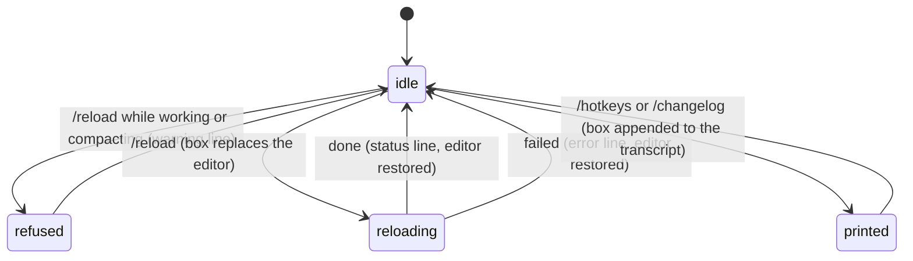

# Reload, hotkeys, and the changelog

## Summary

Three slash commands that change nothing in the conversation. `/reload` re-reads the files pi loaded at startup (keybindings, extensions, skills, prompt templates, themes, context files, and the settings file) and applies them to the running session without restarting; while it runs, a bordered `Reloading…` box stands in for the editor. `/hotkeys` prints a table of every keyboard shortcut, with the keys as currently bound. `/changelog` prints the whole release history in a bordered box. Related to the last: after an upgrade, the first new session shows a `What's New` box with the entries added since the version last seen; the `collapseChangelog` setting shrinks it to one line.

`/reload` is the only built-in slash command that refuses while the agent is working or compacting; the other two run whenever they are typed.

## The simple case

The user rebinds a key in `~/.pi/agent/keybindings.json` and types `/reload`. The editor is replaced by a box between two lines in the border colour containing, in the muted colour, `Reloading keybindings, extensions, skills, prompts, themes, and context files...`. A moment later the transcript is redrawn from the session, the `[Context]` block near the top of the screen is refreshed, a status line `Reloaded keybindings, extensions, skills, prompts, themes, and context files` appears above the editor, and the editor is back with the text it had. The new binding works from the next keystroke.

Typing `/hotkeys` adds a box titled `Keyboard Shortcuts` to the bottom of the transcript with three tables; typing `/changelog` adds a box titled `What's New` holding every release's notes.

## The interaction, event by event

### Compose

Each command is the whole trimmed line; `/reload now` is not a command and goes to the model. The autocomplete popup lists them as `/reload` (`Reload keybindings, extensions, skills, prompts, themes, and context files`), `/hotkeys` (`Show all keyboard shortcuts`), and `/changelog` (`Show changelog entries`). Enter submits; the editor is cleared.

### Resolves at once

- **`/hotkeys`** appends to the transcript: a blank line, a line in the border colour, `Keyboard Shortcuts` in bold accent, a blank line, three Markdown tables headed **Navigation**, **Editing**, and **Other**, and a closing border line. The rows, with the default bindings, are exactly these. On macOS the product prints `Option` where the tables say `Alt`; a rebound key shows its new name; an action with no binding shows an empty pair of backticks.

  | Key | Action |
  | --- | --- |
  | `Up` / `Down` / `Left/Ctrl+B` / `Right/Ctrl+F` | Move cursor / browse history |
  | `Alt+Left/Ctrl+Left/Alt+B` / `Alt+Right/Ctrl+Right/Alt+F` | Move by word |
  | `Home/Ctrl+Home/Ctrl+A` | Start of line |
  | `End/Ctrl+End/Ctrl+E` | End of line |
  | `Ctrl+]` | Jump forward to character |
  | `Ctrl+Alt+]` | Jump backward to character |
  | `PageUp/Ctrl+PageUp` / `PageDown/Ctrl+PageDown` | Scroll by page |

  | Key | Action |
  | --- | --- |
  | `Enter` | Send message |
  | `Shift+Enter/Ctrl+J` | New line (on Windows: `New line (Ctrl+Enter on Windows Terminal)`) |
  | `Ctrl+W/Alt+Backspace` | Delete word backwards |
  | `Alt+D/Alt+Delete` | Delete word forwards |
  | `Ctrl+U` | Delete to start of line |
  | `Ctrl+K` | Delete to end of line |
  | `Ctrl+Y` | Paste the most-recently-deleted text |
  | `Alt+Y` | Cycle through the deleted text after pasting |
  | `Ctrl+-` | Undo |

  | Key | Action |
  | --- | --- |
  | `Tab` | Path completion / accept autocomplete |
  | `Escape` | Cancel autocomplete / abort streaming |
  | `Ctrl+C` | Clear editor (first) / exit (second) |
  | `Ctrl+D` | Exit (when editor is empty) |
  | `Ctrl+Z` | Suspend to background |
  | `Shift+Tab` | Cycle thinking level |
  | `Ctrl+P` / `Shift+Ctrl+P` | Cycle models |
  | `Ctrl+L` | Open model selector |
  | `Ctrl+O` | Toggle tool output expansion |
  | `Ctrl+T` | Toggle thinking block visibility |
  | `Ctrl+G` | Edit message in external editor |
  | `Ctrl+X` | Copy last assistant message |
  | `Alt+Enter` | Queue follow-up message |
  | `Alt+Up` | Restore queued messages |
  | `Ctrl+V` | Paste image or text from clipboard |
  | `/` | Slash commands |
  | `!` | Run bash command |
  | `!!` | Run bash command (excluded from context) |

  A fourth table, **Extensions**, appears only when an extension registered shortcuts; never in the default configuration. The table does not list overlay keys (the selectors' own Up/Down/Enter/Escape), the tree's filter keys, or Ctrl+S in the selectors; those are in each overlay's document and in [input](../foundations/input.md).

- **`/changelog`** appends the same kind of box titled `What's New`, holding every versioned entry of pi's `CHANGELOG.md` rendered as Markdown, separated by blank lines, oldest first and newest last, so the most recent release is nearest the editor. The `Unreleased` section is skipped. If the file is missing or has no versioned entries the box says `No changelog entries found.`

- **`/reload` while the agent is working** adds `Warning: Wait for the current response to finish before reloading.`; **while compacting**, `Warning: Wait for compaction to finish before reloading.` Nothing else happens.

### Sent

`/reload` with the agent idle: any extension-provided UI is cleared (none in the default configuration), and the editor is swapped for the reload box, which takes focus. The box is drawn once before the work begins, so it is visible even when the reload is quick.

### While working

The reload runs in order: the settings file is re-read from disk (global and, if trusted, project); the resource directories are scanned again; extensions, skills, prompt templates, and themes are loaded; the transcript is rebuilt from the session; the keybindings file is re-read; the theme is re-applied from the (possibly changed) setting; the runtime settings that the settings panel also controls are applied (HTTP idle timeout, hide thinking, output padding, hardware cursor, clear on shrink, editor padding, autocomplete size, queue modes); the autocomplete provider is rebuilt; and the loaded-resources block is redrawn. Keys pressed while the box is showing are not acted on.

> Technical note: the transcript rebuild is the same one `/tree` and Ctrl+T use. It redraws from session entries only, so status lines, warnings, errors, and the `/hotkeys` and `/changelog` boxes, none of which are in the session, disappear from the screen.

### Done

On success the status line `Reloaded keybindings, extensions, skills, prompts, themes, and context files` is added (or `…; saved project trust` in the case described under "Edge cases"), the box is replaced by the editor with its text and cursor intact, and focus returns to it. If `models.json` failed to parse, `Error: models.json error: <reason>` is added too. On failure the editor is restored and `Error: Reload failed: <reason>` is added; whatever had already been reloaded stays reloaded.

What `/reload` re-reads and what it applies:

| Source | Re-read | Applied to the running session |
| --- | --- | --- |
| `keybindings.json` | Yes | Every binding, at once; hints in overlays and `/hotkeys` show the new names. |
| `AGENTS.md` and the other context files; `SYSTEM.md`, `APPEND_SYSTEM.md` | Yes | From the next model call. |
| `settings.json` (global; project if trusted) | Yes | `theme`, `httpIdleTimeoutMs`, `hideThinkingBlock`, `outputPad`, `showHardwareCursor`, `terminal.clearOnShrink`, `editorPaddingX`, `autocompleteMaxVisible`, `steeringMode`, `followUpMode`, `fullscreenScrollbar`, and the resource lists. Not applied: `defaultModel`, `defaultThinkingLevel`, `defaultTools`, `tuiMode`, `compaction.enabled`, `quietStartup`. |
| Extensions, skills, prompt templates, themes | Yes | At once; none in the default configuration. |
| `trust.json` | No | The run keeps the trust state it started with. |
| `auth.json`, `models.json` | Not by `/reload` | Both are picked up on their own; a `models.json` parse error is reported after the reload. |
| The session file | No | Messages, active position, model, and thinking level are untouched. |

The startup header's hint line is not regenerated, so a rebound key keeps its old name there until the next start.

**The `What's New` box after an upgrade.** On a new session (not when resuming one with messages), pi compares the version recorded as `lastChangelogVersion` in the global settings file with the running version. If entries newer than the recorded version exist, a box is added under the loaded-resources block: a border line, `What's New` in bold accent, the new entries rendered as Markdown newest first, and a closing line; `lastChangelogVersion` is updated; and one anonymous install ping is sent unless `enableInstallTelemetry` is `false` or pi is offline. With `collapseChangelog` set to `true`, the box holds one line instead: `Updated to v<version>. Use /changelog to view full changelog.` On a fresh install with no recorded version nothing is shown; the version is recorded silently.

## Modifiers

| Modifier | Set before sending | Changed while working |
| --- | --- | --- |
| Model | No effect on any of the three. `/reload` keeps the current model. | No effect. |
| Thinking level | No effect. `/reload` keeps the current level even if `defaultThinkingLevel` in the file changed. | No effect. |
| Agent busy | Idle: all three run. Working or compacting: `/reload` is refused with a warning; `/hotkeys` and `/changelog` run and their boxes are appended below the streaming assistant message, which keeps growing above them. | Not applicable: `/reload` cannot start while busy, and a turn cannot start while the reload box has focus. |
| Attachments | No effect. Images in the editor survive the reload with the text. | No effect. |
| Session kind | Saved or ephemeral: identical. Nothing here is written to the session. | No effect. |

## Cancel and interrupt

| Event | Before (editor focused) | While reloading |
| --- | --- | --- |
| Escape (once; twice within 500 ms) | Clears bash mode or arms the double-Escape as usual; the typed command is not affected. | Not acted on; the box has focus and handles no keys. |
| Ctrl+C once / twice; Ctrl+D | Ctrl+C clears the typed command; twice quits. | Not acted on while the box has focus. |
| Another message submitted (Enter; Alt+Enter follow-up) | Enter submits the command; Alt+Enter when idle does the same. | Cannot be typed. |
| A slash command or shortcut that opens an overlay or changes the session | An overlay already open is closed when the command is submitted. | None can be opened. A session switch cannot happen. |
| Model or thinking level changed | No effect. | Not possible. |
| Provider error, rate limit, timeout, or network lost | No effect. | No effect; the reload makes no model call. |
| Context window exhausted (auto-compaction) | `/reload` is refused during compaction. | Not applicable. |
| Terminal resized; pi suspended (Ctrl+Z) and resumed | The printed boxes re-wrap. | The box re-wraps. Ctrl+Z is not acted on. |
| Process ends: terminal closed (SIGHUP), SIGTERM, killed | Nothing to lose; the boxes are screen-only. | The reload is abandoned mid-way; nothing on disk is written by a reload except the trust case below. |
| Session or files changed from outside | This is the case `/reload` exists for: edited `keybindings.json`, `settings.json`, `AGENTS.md`, or resource directories are picked up. | A file changed during the reload is read in whatever state it is in. |
| Credentials lost, or logged out | No effect. | No effect. |

## Interactions with other systems

**Session persistence.** None of the three writes to the session. The `/hotkeys` and `/changelog` boxes are not entries and do not survive a transcript rebuild, `/export`, or a resume.

**Branching and history.** No interaction. The commands are not added to the prompt history.

**Compaction.** `/reload` is refused while compaction runs. A reload does not change whether auto-compaction is on.

**Context files and the system prompt.** `/reload` re-reads `AGENTS.md` (and its alternatives) from the agent directory, the ancestors of the working directory, and the working directory, and `SYSTEM.md` / `APPEND_SYSTEM.md`; the next model call uses the new system prompt. The `[Context]` listing is redrawn to match.

**Settings and keybindings.** `/reload` re-reads both files. From `settings.json` it applies the keys listed under "While working" and the theme; keys such as `defaultModel`, `defaultThinkingLevel`, `defaultTools`, `compaction.*`, and `tuiMode` are read but not applied to the running session. From `keybindings.json` every binding is applied, and the `/hotkeys` table and the overlays' hints show the new names. `collapseChangelog` and `lastChangelogVersion` govern the startup box; `enableInstallTelemetry` the ping.

**Tools and the working directory.** The active tool set is unchanged by `/reload`. Context files are found relative to the session's working directory.

**Terminal and rendering.** The reload box is the editor's height or more; the bottom block grows for it. The `/changelog` box can be several hundred lines and scrolls into the terminal's history like any transcript content. Changelog links are rendered as terminal hyperlinks where supported.

**Credentials and providers.** `/reload` does not re-read `auth.json` (it is re-read per model call anyway) and does not change the provider catalogue.

## Edge cases

- The `/hotkeys` and `/changelog` boxes vanish the next time the transcript is rebuilt (Ctrl+T, `/tree`, `/reload`, output-padding change, compaction). They are decorations, not messages.
- Ctrl+O does not collapse or expand either box.
- Links in the changelog are rewritten to point at the matching release tag on GitHub, so `docs/settings.md` in an entry for 0.84.2 links to that file at `v0.84.2`.
- Resuming a session (`-c`, `-r`, `--session`) after an upgrade shows no `What's New` box and does not update `lastChangelogVersion`, so the box appears on the next new session instead.
- Downgrading pi shows no box (no entries are newer than the recorded version) and leaves the higher recorded version in place; upgrading back to that version shows nothing either.
- `/changelog` works offline; the changelog ships with pi.
- If the project had no `.pi/` directory at startup and the user creates one (for example `.pi/settings.json`) during the session, `/reload` loads it and, because the project was implicitly trusted, writes `true` for the directory into `trust.json` without asking; the status line ends `; saved project trust`. See [project trust](project-trust.md).
- `/reload` does not re-read the trust file, so a decision saved with `/trust` during the session does not take effect on reload; a restart is needed.
- `/reload` re-applies the theme from the settings file, which also cancels a `--use-theme` override only if the override was replaced in `/settings`; otherwise the run override is kept.
- On Windows the `Ctrl+Z` row of `/hotkeys` prints an empty key, since suspend has no default binding there.

## Open questions and verification

- That keys pressed while the reload box shows are dropped (not queued for the editor) follows from the box having focus and no key handler; not confirmed by hand.
- Whether `/reload` is refused during a retry countdown (the agent run may still count as active) was not determined.
- The startup header's shortcut strip is built once at startup and is not rebuilt by `/reload`; a rebound key therefore shows its old name in the header and its new name in `/hotkeys`. May be worth treating as a bug rather than documenting.
- `/changelog` prints entries oldest first although the startup `What's New` box prints newest first and the slash-command description does not say. Whether the order is intended was not determined; it reads as deliberate (newest nearest the editor) but may be worth treating as a bug rather than documenting.
- `/reload` re-reads `settings.json` but applies only the keys listed; whether `compaction.reserveTokens` and `keepRecentTokens` edited by hand take effect at the next compaction without a restart was not determined.
- Whether the reload box is tall enough to be noticed when the reload finishes within one frame was not observed.
- The `/trust` then `/reload` gap above: `/trust` says to restart although `/reload` exists and could re-resolve trust. May be worth treating as a bug rather than documenting.

Verified against pi-mono commit `a69bef789`.
