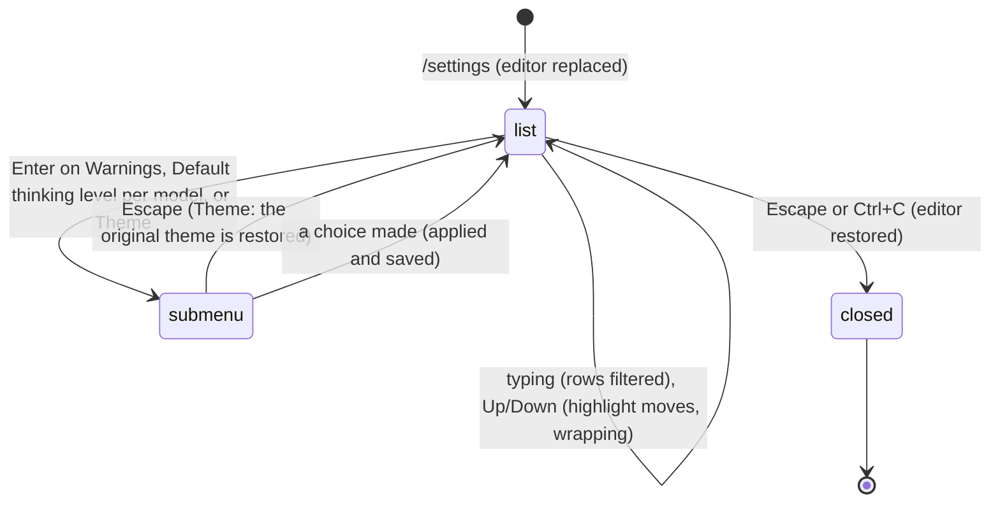

# The settings panel

## Summary

`/settings` opens an overlay in the editor's place: a searchable list of every setting pi lets the user change from inside the product, each row a label on the left and its current value on the right. Enter (or Space) on a row advances its value to the next choice; the change is applied to the running session at once and written to `~/.pi/agent/settings.json` in the same moment. There is no OK button and nothing to confirm: the panel is a set of switches, not a form. Three rows open a [submenu](../glossary.md#the-screen) instead of cycling: Warnings, Default thinking level per model, and Theme. Escape closes the panel and brings the editor back with its text intact.

The panel can be opened whenever the editor is, including while the agent is working or compacting. Most rows take effect immediately; a handful only matter at the next start or the next upgrade, and the table below says which.

## The simple case

The user types `/settings` and presses Enter. The editor is replaced by a box between two horizontal lines in the border colour: an empty search line, a blank line, then ten rows, the first marked with `→ ` and drawn in the accent colour:

```
→ Auto-compact                    true
  Show images                     true
  Image width                     60
  Auto-resize images              true
  Block images                    false
  Skill commands                  true
  Show hardware cursor            false
  Editor padding                  0
  Output padding                  1
  Autocomplete max items          5
  (1/31)

  Automatically compact context when it gets too large

  Type to search · Enter/Space to change · Esc to cancel
```

The user presses Down until `Hide thinking` is highlighted and presses Enter. The value flips to `true`, every thinking block in the transcript collapses to a single `Thinking...` line at once, and `settings.json` now contains `"hideThinkingBlock": true`. Escape closes the panel; the editor returns with whatever was typed before `/settings`, and the footer and transcript stay as the change left them.

## The interaction, event by event



### Open

`/settings` must be the whole trimmed line; `/settings foo` is not a command and goes to the model as text. The editor is cleared, the panel takes its slot, and keyboard focus moves to the list. The transcript above and the footer below stay where they are; the status line keeps showing whatever the agent is doing.

The panel shows, top to bottom: a line in the border colour; the search line (empty, with the cursor in it); a blank line; up to ten rows, labels padded to a common width so the values line up; a dim `(n/N)` line when there are more rows than fit, giving the highlighted row's position; a blank line; the highlighted row's description in the dim colour, wrapped to the width; a blank line; the hint `Type to search · Enter/Space to change · Esc to cancel`; and a closing line in the border colour. The highlighted row has a `→ ` cursor and its label and value in the accent colour; other values are in the muted colour. The list scrolls to keep the highlight roughly centred.

The values shown are the ones in force right now: what the session is using for auto-compaction and the queue modes, and what the settings file says for the rest. A value set only in a project `.pi/settings.json` shows as the effective value.

Keys inside the panel:

| Key | In the list | In a submenu |
| --- | --- | --- |
| Up / Down | Move the highlight; wraps at both ends. | Move the highlight; wraps at both ends in every submenu. |
| Enter | Cycle the row's value, or open its submenu. | Choose; in the two-step thinking submenu, advance to step two, then apply and loop back. |
| Space | As Enter while the search line is empty; otherwise typed into the search. | As Enter in the Warnings and automatic-theme lists; typed into the filter in the model pick. |
| Printable characters, Backspace | Edit the search line; the list filters as you type. | Edit the model filter (step one of per-model thinking); ignored elsewhere. |
| Escape, Ctrl+C | Close the panel. | Back one level; in the Theme submenu, also restore the original theme. |
| Anything else | Ignored; nothing reaches the editor or the application shortcuts. | Same. |

Every row, in the order drawn, with its choices, the default, and when a change takes effect:

| Row | Values | Default | Takes effect |
| --- | --- | --- | --- |
| Auto-compact | `true`, `false` | `true` | At once; the footer's ` (auto)` suffix appears or disappears. |
| Show images | `true`, `false` | `true` | At once; images already drawn in tool boxes are shown or hidden. Row present only in terminals that can display images. |
| Image width | `60`, `80`, `120` | `60` | At once, for images already drawn and for later ones. Present only with image support. |
| Auto-resize images | `true`, `false` | `true` | The next image read or attached (largest side capped at 2000 pixels). |
| Block images | `true`, `false` | `false` | The next prompt: images are not sent to the model. |
| Skill commands | `true`, `false` | `true` | At once; the `/` autocomplete list is rebuilt. No visible effect with no skills. |
| Show hardware cursor | `true`, `false` | `false` | At once. |
| Editor padding | `0`, `1`, `2`, `3` | `0` | At once; the editor's text moves in from the border. |
| Output padding | `0`, `1` | `1` | At once; the transcript is rebuilt from the session (or, while the agent is working, each message is re-padded in place). |
| Autocomplete max items | `3`, `5`, `7`, `10`, `15`, `20` | `5` | The next autocomplete popup. |
| Clear on shrink | `true`, `false` | `false` | At once. |
| Terminal progress | `true`, `false` | `false` | The next turn; an OSC 9;4 progress indicator in terminals that show one. Undocumented in the user docs. |
| Steering mode | `one-at-a-time`, `all` | `one-at-a-time` | The next delivery from the queue; see [the message queue](../conversation/the-message-queue.md). |
| Follow-up mode | `one-at-a-time`, `all` | `one-at-a-time` | The next delivery. |
| Transport | `sse`, `websocket`, `websocket-cached`, `auto` | `auto` | The next model call. |
| HTTP idle timeout | `30 sec`, `1 min`, `2 min`, `5 min`, `disabled` | `5 min` | At once, and a status line `HTTP idle timeout: <value>` is added to the transcript. |
| Hide thinking | `true`, `false` | `false` | At once; the transcript is rebuilt. The same switch Ctrl+T flips. |
| Mermaid diagrams | `off`, `final`, `streaming` | `streaming` | At once; the transcript is redrawn. |
| Cache miss notices | `true`, `false` | `false` | At once; the transcript is rebuilt. |
| Collapse changelog | `true`, `false` | `false` | The next upgrade; see [reload and hotkeys](reload-and-hotkeys.md). |
| Quiet startup | `true`, `false` | `false` | The next start. |
| Install telemetry | `true`, `false` | `true` | The next install or upgrade. |
| Default project trust | `Ask`, `Always trust`, `Never trust` | `Ask` | The next start in a project without a saved decision; see [project trust](project-trust.md). |
| Double-escape action | `tree`, `fork`, `none` | `tree` | The next double Escape. |
| Tree filter mode | `default`, `no-tools`, `user-only`, `labeled-only`, `all` | `default` | The next `/tree`. |
| Warnings | `configure` (submenu) | | See below. |
| Default thinking level per model | `none` or `N configured` (submenu) | `none` | See below. |
| TUI mode | `regular`, `fullscreen` | `regular` | At once; the screen is switched and a status line `TUI mode: <mode>` is added. Fullscreen mode is out of scope. |
| Fullscreen exit output | `transcript`, `resume-hint` | `transcript` | Fullscreen mode only. |
| Fullscreen scrollbar | `auto`, `always`, `hidden` | `auto` | Fullscreen mode only. |
| Theme | the current theme name (submenu) | detected, else `dark` | See below and [themes](themes.md). |

Without image support the list has 29 rows and `Auto-resize images` is second.

### Dismissed at once

Escape or Ctrl+C with nothing changed closes the panel: nothing is written, the editor returns with its text, and Ctrl+C does not count toward the double-press quit. Space on an empty search line acts as Enter; once the search line has text, Space types a space into it.

### First change

Enter on a value row moves it to the next choice in its list, wrapping from the last back to the first. Two things happen in the same keystroke: the row's callback applies the value to the running session (the third column of the table), and the key is written to the global settings file, merging with whatever else the file holds so that hand edits and other keys survive. The panel stays open with the same row highlighted, ready for another press. Nothing is undone by Escape later; to reverse a change, cycle the row back.

Enter on a submenu row replaces the list with the submenu. Escape in a submenu returns to the list with the same row highlighted.

> Technical note: a value that is not in the row's list (for example an `httpIdleTimeoutMs` of 45000 written by hand, shown as `45 sec`) cycles to the first choice, not the next one, because the current value has no position in the list.

### While open

Up and Down move the highlight and wrap at both ends. Typing into the search line filters the rows by fuzzy match on their labels and moves the highlight to the first match; `No matching settings` is shown when nothing matches; Backspace edits the search. The description under the list follows the highlight.

The agent keeps working behind the panel: text keeps streaming into the transcript, tool boxes keep updating, the status line keeps its spinner, and a queued follow-up is still delivered. The list takes every key, so Enter never sends a prompt, Ctrl+P does not cycle models, and Escape closes the panel rather than aborting the turn.

**Warnings.** A list with one row, `Anthropic extra usage` (`true`/`false`, default `true`), description `Warn when Anthropic subscription auth may use paid extra usage`, with the hint `Enter/Space to change · Esc to cancel` and no search line. Enter flips it and writes `warnings.anthropicExtraUsage`. Escape returns to the list; the row still reads `configure`.

**Default thinking level per model.** Two steps. Step one, titled `Per-Model Thinking Level` with `Step 1/2 · Select a model to configure`, lists every available model as `<id> [provider]` with the current model first (and preselected), the saved default model next, then the rest by provider; a model that already has an override shows the level beside it. The list has a search line (`Type to filter · Enter to select · Esc to go back`). With no available models it shows one row, `No models available`, with `Log in to a provider or configure an API key first`. Step two, `Thinking Level for <id> [provider]` with `Step 2/2 · Select default thinking level for this model`, lists the levels the model supports (`off`, `minimal`, `low`, `medium`, `high`, `xhigh`, `max` as applicable; only `off` for a model that cannot reason), each with a one-line description (`Moderate reasoning (~8k tokens)` and the like), preselecting the existing override. When an override exists a last row reads `(clear override)` with `Revert to global default (<level>)`. Enter on a level writes `modelThinkingLevels["<provider>/<id>"]` and, if it is the current model, changes the session's thinking level at once, so the footer and the editor border colour change behind the submenu. `(clear override)` removes the entry and, for the current model, returns the session to `defaultThinkingLevel` (or `medium`). After either, the submenu loops back to step one. Escape at step two goes back to step one; Escape at step one returns to the list, whose row now reads `none` or `N configured`.

**Theme.** Described in full in [themes](themes.md). In short: a list of `Automatic`, `dark`, `light` (and any custom themes); moving the highlight previews the theme on the whole screen; Enter applies and saves it; Escape restores the theme that was in force when the submenu opened.

**TUI mode** is the one row that can refuse. If a TUI-level overlay is open when the value is cycled, the row snaps back to the current mode and a status line `Close active overlays before changing TUI mode` is added; nothing is written. In the default configuration no such overlay exists (only extensions create them), so the refusal is not normally reachable; the settings panel itself does not count.

### Accepted

There is no separate accept step. Escape closes the panel: the editor is put back in its slot with its text and cursor as they were, focus returns to it, and every change already made stays in force and on disk. The panel never writes a project `.pi/settings.json`.

What the file holds afterwards is one key per changed row, merged into whatever was there. After turning off auto-compaction, hiding thinking, setting the idle timeout to one minute, giving one model a `high` override, and choosing the light theme, a previously empty file reads:

```json
{
  "compaction": {
    "enabled": false
  },
  "hideThinkingBlock": true,
  "httpIdleTimeoutMs": 60000,
  "modelThinkingLevels": {
    "anthropic/claude-opus-4-8": "high"
  },
  "theme": "light"
}
```

The other rows map to keys the same way: `terminal.showImages`, `terminal.imageWidthCells`, `images.autoResize`, `images.blockImages`, `enableSkillCommands`, `showHardwareCursor`, `editorPaddingX`, `outputPad`, `autocompleteMaxVisible`, `terminal.clearOnShrink`, `terminal.showTerminalProgress`, `steeringMode`, `followUpMode`, `transport`, `markdown.mermaid`, `showCacheMissNotices`, `collapseChangelog`, `quietStartup`, `enableInstallTelemetry`, `defaultProjectTrust`, `doubleEscapeAction`, `treeFilterMode`, `warnings.anthropicExtraUsage`, `tuiMode`, `fullscreenExitOutput`, `fullscreenScrollbar`. A row cycled back to its default still writes the key with the default value; the panel never deletes a key.

## Modifiers

| Modifier | Before open | While open |
| --- | --- | --- |
| Model | The per-model thinking submenu lists the current model first and preselects it. With no model, that submenu offers `No models available`. | The model cannot change while the panel has focus. A per-model override for the current model changes the session's thinking level at once. |
| Thinking level | The level shown in the footer is the one a per-model override or `(clear override)` replaces. | Changing the current model's override updates the footer and border colour behind the panel. |
| Agent busy | Idle: every row applies as in the table; `Output padding` rebuilds the transcript. Working or compacting: the panel opens all the same; `Output padding` re-pads messages in place instead of rebuilding; `Transport` and `HTTP idle timeout` apply from the next model call; `Hide thinking` rebuilds the transcript mid-stream. | The turn continues behind the panel. If it settles or a follow-up starts a new model call, the panel is unaffected. |
| Attachments | No effect. Images in the editor are kept with its text. | No effect. |
| Session kind | Saved or ephemeral: identical. Settings go to `settings.json`, never to the session file, so they survive `--no-session`. | No effect. |

## Cancel and interrupt

| Event | Before open | While open |
| --- | --- | --- |
| Escape (once; twice within 500 ms) | Not applicable; `/settings` is typed and submitted. | One Escape closes the panel (or backs out of a submenu one level); changes stay. A second Escape within 500 ms lands in the editor and, if it is empty, arms the double-Escape action. |
| Ctrl+C once / twice; Ctrl+D | Ctrl+C clears the `/settings` text; twice quits. | Ctrl+C closes the panel like Escape and does not arm the quit window. Ctrl+D is not handled by the list and does nothing. |
| Another message submitted (Enter; Alt+Enter follow-up) | Enter submits `/settings`; Alt+Enter does the same when idle and queues `/settings` as a follow-up when working. | Enter changes the highlighted row; nothing is submitted. Alt+Enter is not handled and does nothing. |
| A slash command or shortcut that opens an overlay or changes the session | Another overlay already open is closed by `/settings`. | No slash command can be typed. A session switch cannot be triggered from inside the panel. |
| Model or thinking level changed | Shown in the panel's per-model submenu. | Only through the per-model thinking submenu, as above. |
| Provider error, rate limit, timeout, or network lost | No effect. | The status line changes behind the panel; the panel stays open. |
| Context window exhausted (auto-compaction) | The panel opens during compaction. | Compaction runs behind the panel; when it ends the transcript is rebuilt beneath it. `Auto-compact` set to `false` mid-compaction does not stop the running compaction. |
| Terminal resized; pi suspended (Ctrl+Z) and resumed | The panel re-wraps. | The panel re-wraps; descriptions re-wrap; the `(n/N)` line stays. Ctrl+Z is not handled by the list, so suspend is unavailable while the panel is open. |
| Process ends: terminal closed (SIGHUP), SIGTERM, killed | Nothing to lose. | Every change made so far is already in `settings.json`; the file is written per change, not on close. |
| Session or files changed from outside | `settings.json` edited by hand: the panel shows the running values, not the file's, until the next start. | A panel change merges into the file around the hand edit and keeps it. |
| Credentials lost, or logged out | The per-model submenu lists only models whose provider has a credential. | No effect. |

## Interactions with other systems

**Session persistence.** Nothing the panel changes is written to the session. A thinking-level change caused by a per-model override for the current model is recorded in the session like any other level change.

**Branching and history.** No interaction. `/settings` is not added to the prompt history.

**Compaction.** `Auto-compact` is the `compaction.enabled` key. The thresholds (`reserveTokens`, `keepRecentTokens`) are not in the panel.

**Context files and the system prompt.** No interaction.

**Settings and keybindings.** The panel is the product's editor for the global settings file; [configuration](../foundations/configuration.md) lists every key, including those the panel does not expose. The list uses the selector bindings (`tui.select.up`, `tui.select.down`, `tui.select.confirm`, `tui.select.cancel`), so a rebound Enter or Escape applies here too. The Follow-up mode and per-model thinking descriptions quote the live bindings for Alt+Enter and Shift+Tab.

**Tools and the working directory.** `Show images`, `Image width`, `Auto-resize images`, and `Block images` change how tool results that contain images are drawn and sent. A project `.pi/settings.json` that sets a key the panel also sets wins again at the next start, so the panel's change sticks for this run only.

**Terminal and rendering.** `Show images` and `Image width` appear only when the terminal reports image support. `Editor padding`, `Output padding`, `Clear on shrink`, `Show hardware cursor`, `Terminal progress`, and `Theme` change what is drawn; see [the screen](../foundations/the-screen.md).

**Credentials and providers.** `Transport` and `HTTP idle timeout` change how the next model call is made. The per-model thinking submenu lists available models only.

## Edge cases

- `Show images` and `Image width` are absent in a terminal without image support, so the row count and the `(n/N)` figure differ between terminals.
- The `Theme` row shows the raw setting: `light/dark` for a theme pair, not `Automatic`.
- Choosing `Automatic` in the Theme submenu from a fixed theme starts with both halves set to that theme, so nothing changes until a different light or dark theme is picked.
- A per-model override for a model the panel cannot see (no credential) stays in the file and still applies when that model is selected; the row's `N configured` count includes it.
- `Default project trust` and the panel's other writes go to the global file even when a project file sets the same key; the project value wins at the next start.
- Values clamped on read (`editorPaddingX` outside 0–3, `autocompleteMaxVisible` outside 3–20) show the clamped value.
- `Hide thinking` from the panel and Ctrl+T flip the same setting; whichever was used last is what the row shows.
- The search filters labels only, not descriptions or values, so typing `true` matches nothing.
- Enter on the `No models available` row of the per-model thinking submenu still advances to step two, which is then an empty list; Escape goes back, and nothing is written.
- `/settings` while an autocomplete popup is open: the popup's own Enter accepts a completion instead; the command runs on the next Enter.
- Cycling `TUI mode` to `fullscreen` and back in regular mode leaves the transcript intact but redraws the bottom block.

## Open questions and verification

- The list has no Left/Right binding; values are cycled with Enter or Space only. If Left/Right was expected, it is not implemented.
- `terminal.showTerminalProgress` (`Terminal progress`) is exposed in the panel but absent from the user docs. May be worth treating as a bug rather than documenting.
- `Hide thinking` and `Cache miss notices` rebuild the transcript from the session while the agent is streaming; whether the in-progress assistant message is redrawn correctly, or briefly disappears, was read from the rebuild path and not confirmed by hand.
- `Terminal progress` is read when a turn starts and when the TUI mode switches; whether flipping it mid-turn changes the indicator for the current turn was not determined.
- The `Close active overlays before changing TUI mode` refusal applies to TUI-level overlays only; that the settings panel itself never triggers it was read from the code and not observed.
- Whether the `(n/N)` scroll line counts filtered rows or all rows when a search is active was read from the renderer (filtered) and not observed.
- The claim that Ctrl+D and Ctrl+Z do nothing while the panel has focus follows from the key routing in [input](../foundations/input.md) and was not tested.

Verified against pi-mono commit `a69bef789`.
