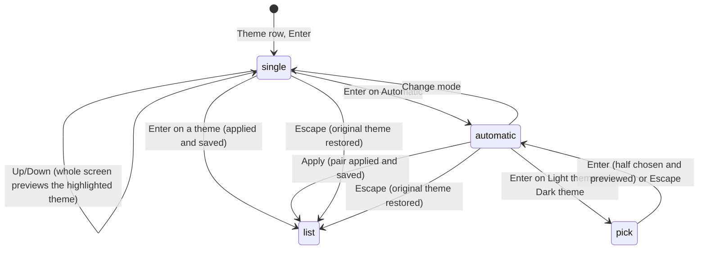

# Themes

## Summary

The `theme` setting names the set of colours pi draws with. Two themes are built in, `dark` and `light`. When the setting is absent, pi asks the terminal for its background colour at startup and picks the theme that matches, saving the answer so later runs do not ask again. A theme pair (`light/dark`, shown as "Automatic" in the settings panel) makes pi pick one half from the terminal's current appearance and switch between them live when the terminal announces a change. `--use-theme <name>` sets the theme for one run without touching the file. A theme change re-colours everything still on screen at once; lines that have scrolled into the terminal's history keep their old colours.

Custom theme files in `~/.pi/agent/themes/` and `.pi/themes/` are out of scope; they appear in the same list and behave the same way as the built-in two.

## The simple case

A fresh install in a dark terminal. pi starts, queries the terminal, gets a dark background, draws in `dark`, and writes `"theme": "dark"` to `~/.pi/agent/settings.json`. The user later opens `/settings`, goes to the `Theme` row, and presses Enter. A list appears: `Automatic`, `dark`, `light`, with `dark` highlighted. Pressing Down onto `light` re-colours the whole screen immediately: the user-message backgrounds go pale grey, the editor border goes teal, the footer text darkens. Enter keeps it, writes `"theme": "light"`, and returns to the settings list; Escape instead would have put `dark` back. The next run starts in `light` without asking the terminal.

## The interaction, event by event

### Open

Before the submenu is ever opened, a theme is already in force, chosen at startup in this order: the `--use-theme` value for this run; else the `theme` setting (a project file wins over the global one); else detection. Detection asks the terminal for its background colour and waits up to 100 ms; if there is no answer it reads the `COLORFGBG` environment variable; if that is absent too it falls back to `dark`. A detected answer from the terminal or from `COLORFGBG` is written to the global settings file as `"theme": "dark"` or `"theme": "light"`, so detection normally happens once; the `dark` fallback is not written and detection runs again next time. A theme pair in the setting is resolved the same way, except that pi also asks the terminal for its colour scheme directly and turns on change notifications.

> Technical note: pi paints its first frame with the theme `COLORFGBG` suggests (or `dark`) and switches when the terminal's answer arrives within the 100 ms window, so a light terminal that answers slowly may show one dark frame. The background query is OSC 11; the colour-scheme query and the live notifications are the DEC mode 2031 / `CSI ? 996 n` mechanism, which only some terminals support. In terminals that report true-colour support the theme's hex colours are used as given; otherwise each is approximated to the nearest of the 256 indexed colours.

The submenu opens from the `Theme` row of [the settings panel](the-settings-panel.md) with Enter. It shows the title `Theme` in the accent colour, the line `Select a theme, or choose Automatic to follow terminal appearance.`, a list of `Automatic` (described as `Use separate themes for light and dark terminal appearance`), `dark`, `light`, and any custom themes, and the hint `Enter to select · Esc to go back`. The highlight starts on the theme in force (for a pair, the half currently showing). When the setting is already a pair the submenu opens in its automatic form instead, described under "While open".

### Dismissed at once

Escape straight away returns to the settings list with nothing changed and nothing written. If the highlight had moved, the preview is undone first: the theme that was in force when the submenu opened is put back and the screen is redrawn in it.

### First change

Moving the highlight is the first change the user sees: the theme under the highlight is applied to the whole screen as a preview. The transcript, the panel itself, the footer, and the editor border (hidden behind the panel) all take the new colours on the next frame. Nothing is written.

Enter on `dark`, `light`, or a custom name applies that theme for good: the `theme` key is written, live switching is turned off if it was on, and the submenu closes back to the settings list, where the row now shows the name. Enter on `Automatic` switches the submenu to its automatic form, previewing the pair it starts with.

### While open

The automatic form is titled `Automatic Theme`, with `Choose themes for terminal light and dark appearance.` and `Light/dark detection requires terminal support.` above four rows: `Light theme` and `Dark theme` showing their chosen names, `Apply` (`save and go back`), and `Change mode` (`switch to single theme`). Starting from a fixed theme, both halves are that theme, so nothing changes until one is picked. Enter on `Light theme` opens a list titled `Light Theme` (`Select the theme to use for light terminal appearance`); moving the highlight previews each theme directly, Enter chooses it and returns to the four rows with the pair previewed as it would look in the terminal's current appearance, and Escape returns without choosing, previewing the pair as it stands. `Dark theme` works the same way. `Apply` writes the pair as `"theme": "<light>/<dark>"`, turns on live switching, and returns to the settings list, where the row shows `<light>/<dark>`. `Change mode` goes back to the single list with the half currently showing highlighted, and nothing is written yet. Escape on the four rows abandons the whole submenu: the original theme is restored and the settings list returns.

Everything behind the submenu keeps running. Streamed text arriving during a preview is drawn in the previewed theme; a tool box that finishes takes the previewed success or error tint.

### Accepted

On Enter in the single list or `Apply` in the automatic form, the setting is written and the theme is re-applied from the setting as it will be at the next start. For a fixed theme that means live switching off. For a pair pi asks the terminal for its colour scheme again (100 ms), applies the matching half, and from then on listens for the terminal's appearance changes: when the terminal reports a switch from dark to light, the other half is applied at once with no keystroke, and the editor border is recoloured. Turning a pair off (choosing a fixed theme) stops the listening. At exit pi tells the terminal to stop sending the notifications.

What a theme change re-renders is everything pi still owns on screen: every message in the transcript that is still within the terminal's viewport, tool boxes, the pending area, the status line, the editor and its border (the thinking-level ramp or the bash-mode colour, read from the new theme), and the footer. Lines that have already scrolled into the terminal's history are not rewritten; see [the screen](../foundations/the-screen.md). A theme name that cannot be loaded (a custom file that was deleted, or a setting written by hand with a typo) produces `Error: Failed to load theme "<name>": <reason>` followed by `Fell back to dark theme.` and pi draws in `dark`; the setting is left as written.

Every colour the user meets comes from the theme. Where each role shows up, with the two built-in values:

| Where the user sees it | Role | `dark` | `light` |
| --- | --- | --- | --- |
| Spinner, highlighted rows in overlays, the `pi` logo, box titles such as `What's New` | accent | `#8abeb7` | `#5a8080` |
| Box and panel border lines (settings panel, reload box, `/hotkeys`) | border | `#5f87ff` | `#547da7` |
| Success marks, the `✓` in `/trust` | success | `#b5bd68` | `#588458` |
| `Error:` lines, `(exit N)`, `Operation aborted`, tool error text | error | `#cc6666` | `#aa5555` |
| `Warning:` lines, the retry spinner, the context figure above 70% | warning | `#ffff00` | `#9a7326` |
| Status line text, footer, descriptions, `Steering:` lines | muted | `#808080` | `#6c6c6c` |
| Hints, `(n/N)` counters, collapsed-output notes | dim | `#666666` | `#767676` |
| Body text | text | `#d4d4d4` | `#1f2328` |
| Thinking blocks | thinkingText | `#808080` | `#6c6c6c` |
| User message background | userMessageBg | `#343541` | `#e8e8e8` |
| Compaction and branch-summary boxes, skill invocations (background / label) | customMessageBg / customMessageLabel | `#2d2838` / `#9575cd` | `#ede7f6` / `#7e57c2` |
| Tool box while the call streams in | toolPendingBg | `#282832` | `#e8e8f0` |
| Tool box after success / after an error | toolSuccessBg / toolErrorBg | `#283228` / `#3c2828` | `#e8f0e8` / `#f0e8e8` |
| Tool output text | toolOutput | `#808080` | `#6c6c6c` |
| Markdown headings, links, inline code | mdHeading, mdLink, mdCode | `#f0c674`, `#81a2be`, `#8abeb7` | `#9a7326`, `#547da7`, `#5a8080` |
| Added, removed, and context lines of an `edit` diff | toolDiffAdded / Removed / Context | `#b5bd68` / `#cc6666` / `#808080` | `#588458` / `#aa5555` / `#6c6c6c` |
| Code in `read`, `write`, and fenced blocks | syntax* | a VS Code dark palette | a VS Code light palette |
| Editor border by thinking level `off` … `max` | thinkingOff … thinkingMax | `#505050`, `#6e6e6e`, `#5f87af`, `#81a2be`, `#b294bb`, `#d183e8`, `#ff5fff` | `#b0b0b0`, `#767676`, `#547da7`, `#5a8080`, `#875f87`, `#8b008b`, `#af005f` |
| Editor border and `$ command` line in bash mode | bashMode | `#b5bd68` | `#588458` |
| Selected row background; fullscreen scrollbar | selectedBg | `#3a3a4a` | `#d0d0e0` |

Not from the theme: the terminal's own background (pi paints no full-screen background in regular mode), the terminal's default foreground where a role is left empty, and images.

`--use-theme <name>` or `--use-theme <light>/<dark>` applies for this run only: nothing is written, detection is skipped, and the settings panel's `Theme` row shows the run's value. Choosing a theme in the panel afterwards replaces the run override and saves normally. `--use-theme` with no value is a startup error (`--use-theme requires a theme name`) and pi exits.

## Modifiers

| Modifier | Before open | While open |
| --- | --- | --- |
| Model | No effect. | No effect. |
| Thinking level | The editor border shows the level's colour from the current theme: in `dark`, dark grey for `off` then `#6e6e6e`, `#5f87af`, `#81a2be`, `#b294bb`, `#d183e8`, `#ff5fff` up to `max`; in `light`, light grey then `#767676`, `#547da7`, `#5a8080`, `#875f87`, `#8b008b`, `#af005f`. | A preview or change recolours the border at once to the new theme's entry for the same level. |
| Agent busy | Idle or working: the submenu opens either way. | Streaming text and tool boxes take the previewed colours as they are drawn. |
| Attachments | No effect. | No effect. |
| Session kind | Saved or ephemeral: the theme is not part of the session. | No effect. |

## Cancel and interrupt

| Event | Before open | While open |
| --- | --- | --- |
| Escape (once; twice within 500 ms) | Not applicable. | Restores the original theme and returns to the settings list; inside the `Light Theme`/`Dark Theme` pick, returns to the four rows instead. A second Escape closes the settings panel. |
| Ctrl+C once / twice; Ctrl+D | Not applicable. | Ctrl+C acts as Escape at each level and does not arm the quit window. Ctrl+D does nothing. |
| Another message submitted (Enter; Alt+Enter follow-up) | Not applicable. | Enter chooses; nothing is submitted to the model. Alt+Enter does nothing. |
| A slash command or shortcut that opens an overlay or changes the session | Not applicable. | None can be typed. A session switch triggered by a queued operation does not happen from here. |
| Model or thinking level changed | No effect. | A per-model override cannot be reached from inside the Theme submenu. |
| Provider error, rate limit, timeout, or network lost | No effect. | The status line changes behind the submenu in the previewed colours. |
| Context window exhausted (auto-compaction) | No effect. | The transcript is rebuilt behind the submenu, in the previewed theme. |
| Terminal resized; pi suspended (Ctrl+Z) and resumed | The screen re-wraps in the current theme. | Same; the preview survives a resize. Ctrl+Z is not handled while the submenu has focus. |
| Process ends: terminal closed (SIGHUP), SIGTERM, killed | Nothing to lose. | A preview not yet accepted is lost; the file holds the last accepted theme. On a clean shutdown the terminal is told to stop colour-scheme notifications; on a kill it may keep sending them to the shell. |
| Session or files changed from outside | A hand edit to `theme` in `settings.json` applies at the next start or `/reload`. A custom theme file being edited is reloaded live. | Same. A terminal appearance change arriving while a pair is saved and a preview is showing applies the pair's half over the preview. |
| Credentials lost, or logged out | No effect. | No effect. |

## Interactions with other systems

**Session persistence.** Not recorded. `/export` to HTML renders the page with the theme in force at the time of the export, and HTML shared with `/share` carries those colours.

**Branching and history.** No interaction.

**Compaction.** The compaction summary box uses the theme's custom-message background and label colours.

**Context files and the system prompt.** No interaction.

**Settings and keybindings.** The `theme` key, global or project; `--use-theme` for one run; `/reload` re-applies the theme from the settings file, so a hand edit takes effect without a restart. The Theme submenu uses the selector bindings (`tui.select.*`). `themes` (custom theme paths) is out of scope.

**Tools and the working directory.** Tool boxes take the pending, success, and error tints from the theme; `edit` diffs use the added, removed, and context colours; `read` and `write` previews use the syntax colours.

**Terminal and rendering.** Detection and live switching depend on the terminal answering OSC 11 and supporting mode 2031; without them pi uses `COLORFGBG` or `dark` and never switches on its own. Colour depth is the terminal's: true colour where reported, 256-colour approximations otherwise. See [the terminal](../cross-cutting/the-terminal.md).

**Credentials and providers.** No interaction.

## Edge cases

- Both built-in themes use a green for bash mode (`#b5bd68` in `dark`, `#588458` in `light`), so the bash-mode border looks alike in either; the thinking ramp differs more (see the table under "Accepted").
- A pair whose halves are the same name (`dark/dark`) behaves like the fixed theme but keeps the terminal notifications on.
- A setting with two slashes (`a/b/c`) is neither a pair nor a name: pi reports it as a theme it could not load and falls back to `dark`.
- The `Theme` row in the settings list shows the raw setting, so a pair reads `light/dark`, not `Automatic`; the word `Automatic` appears only inside the submenu.
- With a pair saved and a terminal that does not support the notifications, pi stays on the half chosen at startup until the next start or `/reload`.
- A custom theme file that lacks the newest colour roles (`thinkingMax`, `scrollbarThumb`, the search-match colours) falls back to older roles (`thinkingXhigh`, `selectedBg`, text) rather than failing.
- Opening the Theme submenu while the agent is working and leaving the preview on a theme for a while makes the streamed text arrive in it; pressing Escape then redraws that text in the original theme, since it is still on screen.

## Open questions and verification

- Whether every component redraws in the new colours on a preview (some components cache rendered lines) was read from the invalidate path and not confirmed by hand; one that caches would keep its old colours until its next content change.
- Which terminals honour the colour-scheme notifications, and whether tmux passes them through, was not determined.
- Whether the 100 ms background query at startup delays the first frame or lets a dark frame show first in a light terminal was not observed.
- The `COLORFGBG` detection is treated as high confidence and written to the file; a terminal that sets `COLORFGBG` wrongly therefore pins the wrong theme until the user changes it. Whether that is intended was not determined.
- The light theme's thinking ramp values above answer an open question in [the screen](../foundations/the-screen.md); they were read from `light.json` and not observed.
- A custom theme edited on disk is reloaded within about 100 ms of the change (read from the file watcher); out of scope and not tested.

Verified against pi-mono commit `a69bef789`.
