# Launching pi

## Summary

Launching pi is the stretch from typing `pi` at a shell prompt to the editor being ready, or to the first turn starting on its own when a message was given on the command line. The command line decides which session to open, which model and thinking level to start with, whether tools, context files, and the session file are in play, and whether pi starts at all (`--help`, `--version`, `--list-models`, and `--export` print and exit). Once startup begins, a few questions may be asked before the screen appears (trusting the project, a session whose directory is gone, a session from another project), then the header is drawn and pi finishes setting up in view: checking for its `fd` and `rg` helpers, listing what it loaded, showing what changed since the last version, and, a moment later, whether a newer version exists. The editor accepts typing from the first frame; submitting before setup is complete is refused with a status message.

In scope is `pi` in its interactive form, with or without messages and `@file` arguments. Out of scope, named once here and not described: the package subcommands (`pi install`, `pi remove`, `pi update`, `pi list`, `pi config`) which manage packages and exit; `pi auth`, which prints or checks credentials and exits; and the non-interactive modes (`-p`/`--print`, `--mode json`, `--mode rpc`), which take over when asked for or when standard input or output is not a terminal.

## The simple case

The user opens a terminal in `~/code/app` and types `pi`. The screen clears to the header: `pi v0.84.2`, one line of shortcut hints, `Press Ctrl+O to show full startup help and loaded resources.`, and `Pi can explain its own features and look up its docs. Ask it how to use or extend Pi.` Below it a `[Context]` line lists `AGENTS.md` if the project has one. At the bottom the editor waits with its border in the thinking-level colour and the footer shows `~/code/app (main)` and, on the right, `claude-opus-4-8 • medium`. The whole thing takes well under a second. The user types a prompt and presses Enter; the first turn begins as in [the turn](../foundations/the-turn.md).

With `pi "Summarize this repository"` the same screen appears and, without any keypress, the prompt is shown as a user message and `Working... (escape to interrupt)` starts.

## The interaction, event by event

```mermaid
stateDiagram-v2
    [*] --> command_line
    command_line --> exited : --help, --version, --list-models, --export, parse error
    command_line --> prompts : startup begins
    prompts --> exited : Cancel, No, n, or Escape at a prompt
    prompts --> screen : prompts answered (or none needed)
    screen --> setting_up : header drawn; editor accepts typing
    setting_up --> ready : fd and rg present, resources listed, session redrawn
    ready --> first_turn : initial prompt given
    first_turn --> ready : turn settles
```

### Compose

The command line is `pi [options] [--] [@files...] [messages...]`. Positional arguments are messages; arguments beginning with `@` are files to attach. Everything after `--` is positional, so a message that begins with a dash is written `pi -- "- Summarize these points"`. Without `--`, a message beginning with a single dash is an unknown option and startup fails; one beginning with `--` is silently taken as an extension flag, and the next argument as its value, so `pi --oops "Hello"` starts pi idle with nothing sent.

The options a user meets in interactive use:

- **Session:** `-c`/`--continue` reopens the newest session for this directory (or starts a new one if there is none); `-r`/`--resume` opens the session picker before the screen; `--session <path|id>` opens a particular session file or id (a unique prefix is enough); `--fork <path|id>` copies one into a new session; `--session-id <id>` uses or creates a session with an exact id; `--no-session` starts an ephemeral session; `-n`/`--name <name>` names the session; `--session-dir <dir>` relocates session storage. See [resuming](../sessions/resuming.md) and [naming and info](../sessions/naming-and-info.md).
- **Model:** `--model <pattern>` (`provider/id`, an id, or a substring, optionally `:level`), `--provider <name>` with it, `--thinking <level>`, `--models <patterns>` to scope Ctrl+P, `--api-key <key>` for this run (needs `--model`), `--list-models [search]`. See [models and credentials](../foundations/models-and-credentials.md).
- **Tools:** `-t`/`--tools <names>` allowlist, `-xt`/`--exclude-tools <names>` denylist, `-nt`/`--no-tools`, `-nbt`/`--no-builtin-tools`; `-nc`/`--no-context-files`; `--system-prompt`, `--append-system-prompt`.
- **Appearance and startup:** `--use-theme <name[/name]>` for this run, `--verbose` to force the header and listings even with `quietStartup`, `--offline` (no version check, catalogue refresh, download, or telemetry), `--tui-mode regular|fullscreen` (fullscreen is out of scope), `-a`/`--approve` and `-na`/`--no-approve` to answer the trust question in advance.
- **Print and exit:** `-h`/`--help`, `-v`/`--version`, `--export <file> [out]`.
- **Resources:** `-e`, `--no-extensions`, `--skill`, `--no-skills`, `--prompt-template`, `--no-prompt-templates`, `--theme`, `--no-themes`: out of scope, they exist.

`-c`, `-r`, `--session`, and `--fork` combine with messages: `pi -c "What did we discuss?"` resumes and sends. `--fork` cannot be combined with `--session`, `-c`, `-r`, or `--no-session`; `--session-id` not with `--session`, `-c`, or `-r`.

### Resolves at once

These end before pi's screen appears. Errors go to standard error in red with an `Error:` prefix and exit status 1; warnings in yellow with `Warning:` and startup continues.

- **`-v`/`--version`:** the version number alone, exit 0. Checked before anything else except the subcommands.
- **Parse errors:** `--name requires a value`, `--use-theme requires a theme name`, `--tui-mode requires regular or fullscreen`, `Invalid TUI mode "x". Valid values: regular, fullscreen`, `Unknown option: -x`. A bad `--thinking` is only a warning, `Invalid thinking level "x". Valid values: off, minimal, low, medium, high, xhigh, max`, and the default level is used. `--fork cannot be combined with …` and `--session-id cannot be combined with …` follow.
- **`--export <file> [out]`:** `Exported to: <path>` and exit 0, or `Error: File not found: <absolute path>` and exit 1. See [export, import, and share](../sessions/export-import-share.md).
- **`--name ""`** (empty or only spaces): `Error: --name requires a non-empty value`.
- **Session not found:** `No session found matching '<arg>'` for `--session` or `--fork`. A session found under another project's directory asks, in plain text, `Session found in different project: <dir>` then `Fork this session into current directory? [y/N] `; anything but `y` or `yes` prints `Aborted.` and exits 0.
- **`-r` cancelled:** the picker closes, `No session selected`, exit 0.
- **A missing `@file`:** `Error: File not found: <absolute path>`, exit 1. An empty file is skipped silently.
- **`-h`/`--help`:** the usage text (commands, options, examples, the environment variables for every provider's key, the tool names), exit 0. It is printed after the runtime has been built, so it takes as long as a normal start and reports settings-file warnings first; it never asks the trust question. Note the line `--provider <name>  Provider name (default: google)`; there is no such default. See "Open questions".
- **`--list-models [search]`:** a table of available models (`provider`, `model`, `context`, `max-out`, `thinking`, `images`), sorted by provider then id, fuzzy-filtered by the search term; `No models matching "x"` or, with no credentials, `No models available.` followed by the `/login` instructions. Exit 0.
- **Model errors:** `Model "x" not found. Use --list-models to see available models.`, `Model "x" is ambiguous across providers: …`, `Unknown provider "x". …`, `--api-key requires a model to be specified via --model, --provider/--model, or --models`. These are reported after the trust question and exit 1.
- **Piped input or output:** `echo hi | pi` or `pi > out.txt` switches to print mode, which is out of scope.

### Sent

Startup begins. Before the screen, in this order, each only when needed:

1. **The session picker** for `-r`: a full-screen selector of sessions for this directory, with Tab for all directories; Enter opens one. Described in [resuming](../sessions/resuming.md).
2. **The missing-directory question** when the chosen session (from `-c`, `-r`, `--session`, or `--fork`) records a working directory that no longer exists: a bordered selector titled `cwd from session file does not exist`, the old path, `continue in current cwd`, the current path, with `Continue` and `Cancel`. Cancel exits 0 without a word. Continue opens the session in the current directory.
3. **The trust question** when the project (or an ancestor) has `.pi/settings.json`, `.pi/extensions`, `.pi/skills`, `.pi/prompts`, `.pi/themes`, `.pi/SYSTEM.md`, `.pi/APPEND_SYSTEM.md`, or `.agents/skills` and no remembered decision: `Trust project folder?`, the path, and a sentence on what trusting allows, with `Trust`, `Trust parent folder (…)`, `Trust (this session only)`, `Do not trust`, and `Do not trust (this session only)`. Escape is `Do not trust (this session only)`. A project with none of those is never asked. See [project trust](../settings/project-trust.md).
4. **Deprecation warnings** for extensions in old locations, with `Press any key to continue...`; not in the default configuration.

Each of these draws on its own, clears itself, and gives way to the next. Then the `@file` arguments are read (a text file becomes `<file name="/abs/path">` … `</file>` in front of the message; an image becomes an attachment plus a `<file>` tag), the theme is chosen, and the screen starts.

> Technical note: `--help` and `--list-models` skip the trust question by running as if non-interactive, and `--approve`/`--no-approve` answer it without asking. The answer to the trust question is remembered in `~/.pi/agent/trust.json` except for the two `this session only` options.

### While working

The screen appears and fills in from the top, usually in well under a second; on a slow network or first run the pieces are visible arriving:

1. **`Model scope: claude-sonnet-4-6, gpt-5.5:high (Ctrl+P to cycle)`**, dim, printed before the screen starts (so it sits in scrollback above the header) when `--models` or `enabledModels` is set. Not shown with `quietStartup` unless `--verbose`.
2. **The header** ([the screen](../foundations/the-screen.md#the-parts-of-the-screen)): logo, hint strip, the two onboarding lines. `quietStartup` replaces it with nothing. The editor and footer are drawn with it; the editor has focus at once.
3. **`fd` and `rg`.** If either is missing from `~/.pi/agent/bin`, a dim `fd not found. Downloading...` (and the same for `rg`) appears in the transcript, then `fd installed to ~/.pi/agent/bin/fd`. There is no progress bar; the two downloads run together. Failure is `Warning: Failed to download fd: <reason>` and pi continues without it (no `@` file search, no `grep` tool). With `--offline`: `Warning: fd not found. Offline mode enabled, skipping download.` On Termux: `fd not found. Install with: pkg install fd`. Nothing else happens until both are settled.
4. **The loaded-resources block** under the header: `[Context]` with the context files found, relative to the working directory; in the default configuration nothing else, and nothing at all when no context file exists. Diagnostics about resources (for example `[Skill conflicts]`) appear here too. Ctrl+O expands the block along with the header.
5. **The changelog box**, only after an upgrade: a bordered block with `What's New` in the accent colour and the changelog entries newer than the last version that ran, as markdown. With `collapseChangelog` it is one line: `Updated to v0.84.2. Use /changelog to view full changelog.` On a fresh install nothing is shown and the version is recorded; on resume (`-c`, `-r`, `--session` of a session with messages) it is never shown. One anonymous install ping is sent with it unless `enableInstallTelemetry` is off or `--offline`.
6. **The session's messages**, when resuming: the transcript of the active branch, then `Session compacted N times` if it was, then `Warning: This project is not trusted. Project .pi resources and packages are ignored. Use /trust to save a trust decision, then restart pi.` if the trust question was declined. The footer now shows the session name, tokens, and model.
7. **Warnings and notices**, dim or in the warning colour, each on its own line: settings-file problems (`Warning: Failed to parse settings file …`), `Warning: No models match pattern "x"`, keybinding conflicts, `Migrated credentials to auth.json: …` after an upgrade from an old version, `models.json error: …`, `Could not restore model <provider>/<id>. Using <provider>/<id>` on resume, and, with no credentials, `Warning: No models available. Use /login to log into a provider via OAuth or API key. See:` followed by two documentation paths. A warning about the Anthropic subscription (`Anthropic subscription auth is active. …`) appears once per run when the model is an Anthropic model used through `/login`. In tmux without extended keys: `Warning: tmux extended-keys is off. Modified Enter keys may not work. Add …`.
8. **The `Update Available` box**, whenever the answer arrives: after the screen is up pi asks `pi.dev` for the latest version in the background with a ten-second limit and no retry, and if it is newer draws a box with warning-coloured borders, `Update Available` in bold, `New version 0.85.0 is available. Run pi update`, an optional note from the server as markdown, and `Changelog: https://pi.dev/changelog`. It lands wherever the transcript is at that moment, possibly in the middle of the first response. No answer, no network, `--offline`, or `PI_SKIP_VERSION_CHECK` mean no box and no message. A `Package Updates Available` box exists for packages; never in the default configuration.

Two more things happen in the background without a message: the model catalogue is refreshed from the providers (15 second limit; the footer's `(provider)` prefix may appear or change when it finishes) and the syntax highlighter loads its grammars.

**Typing during startup.** The editor takes keystrokes from step 2. Until step 3 is finished only three things work: typing, Ctrl+C (clear; twice quits) and Ctrl+D (quit when empty). Enter puts the text back into the editor untouched and shows the status message `Startup is still in progress`; the text is not in the prompt history. From step 4 on, Enter submits normally: while an initial prompt's turn is running it queues a steering message; otherwise the prompt is held for the instant it takes startup to finish and then sent. Escape, slash commands, and the other shortcuts do nothing until step 3 is done.

### Done

With no message on the command line, startup is over when step 7 is drawn: the agent is idle, the status line is empty, and Enter starts a turn. With a message, the initial prompt is sent at that moment exactly as if typed: the `@file` contents and the first message, joined, appear as one user message (tags included) with any images attached, and `Working... (escape to interrupt)` begins. Each further message on the command line is sent as its own turn after the previous one settles, in order. Escape during any of them aborts that turn; the remaining messages are still sent.

**With no credentials** the screen is the same, the `No models available` warning is in the transcript under the header, the footer's right side reads `unknown` (a placeholder stands in for the model) and its context readout `0.0%/0 (auto)`, and the first prompt, typed or from the command line, ends at once with `Error: No API key found for the selected model.`, a blank line, and the `/login` instructions. The prompt is neither recorded nor drawn. Everything that does not need a model works; see [models and credentials](../foundations/models-and-credentials.md#credentials) and [login and logout](../models/login-and-logout.md).

## Modifiers

| Modifier | Set before sending | Changed while working |
| --- | --- | --- |
| Model | `--model`, or the session's recorded model on resume, or the saved default, or the first available model; `--models` scopes the choice and adds the `Model scope:` line. An unavailable `--model` is an error and pi does not start. | Ctrl+P, Ctrl+L, and `/model` do nothing until step 3 is done; afterwards they work as usual, and an initial prompt already running uses the new model from its next model call. |
| Thinking level | `--thinking`, or `:level` on `--model`, or the session's recorded level, or the default `medium`; the editor border shows it from the first frame. An invalid level is a warning and ignored. | Shift+Tab is not delivered until step 3 is done. |
| Agent busy | Never busy at launch. An initial prompt makes the agent working the moment startup finishes. | Enter during an initial prompt's turn queues a steering message; the next command-line message waits for the turn to settle. |
| Attachments | `@file` text is inlined in the first message; `@image.png` is attached. A file that does not exist stops startup. The tags are visible in the transcript. | No effect. |
| Session kind | Saved (default, `-c`, `-r`, `--session`, `--fork`): the file is created at the first assistant message. `--no-session`: ephemeral; `--name` still shows in the footer for the run. | No effect. |

## Cancel and interrupt

| Event | Before the screen (a prompt is showing) | After the screen, during setup or the initial prompt |
| --- | --- | --- |
| Escape (once; twice within 500 ms) | Dismisses the prompt: the session picker and the missing-directory question exit 0 (`No session selected` for the picker); the trust question continues as `Do not trust (this session only)`. | Nothing until step 3 is done. Then it aborts the initial prompt's turn (the prompt stays in the session, the partial response is kept); the remaining command-line messages are still sent. Twice on an empty editor opens `/tree`. |
| Ctrl+C once / twice; Ctrl+D | Ctrl+C in a startup prompt cancels it like Escape. Ctrl+D does nothing in a prompt. At the `[y/N]` question Ctrl+C ends the process. | Ctrl+C clears the editor; twice within 500 ms quits, even during the download (the half-written binary is discarded, the download retried next start). Ctrl+D quits when the editor is empty. Quitting before any response leaves no session file and prints no resume hint. |
| Another message submitted (Enter; Alt+Enter follow-up) | Enter accepts the highlighted option. | Before step 3 is done: `Startup is still in progress`, text kept. After: Enter sends, or queues a steering message during the initial prompt; Alt+Enter queues a follow-up. |
| A slash command or shortcut that opens an overlay or changes the session | Not available. | Not available until step 3 is done; afterwards every slash command and overlay works, including `/new` and `/resume` while the initial prompt is running (which abort it). |
| Model or thinking level changed | Not available; `--model` and `--thinking` are the only way. | See "Modifiers". |
| Provider error, rate limit, timeout, or network lost | No effect on the prompts. | The version check and catalogue refresh fail silently: no `Update Available` box, the built-in model list is used, `(provider)` may be missing from the footer. A failed `fd`/`rg` download is a warning. The initial prompt's turn retries or fails as in [the turn](../foundations/the-turn.md#cancel-and-interrupt). |
| Context window exhausted (auto-compaction) | Not applicable. | A resumed session over the limit is not compacted at startup; the first turn compacts before or after its model call as usual. |
| Terminal resized; pi suspended (Ctrl+Z) and resumed | The prompt redraws at the new width. Ctrl+Z is not handled by the prompts and suspends pi in the prompt; `fg` redraws it. | The screen redraws. Ctrl+Z works once step 3 is done; the download continues while suspended. |
| Process ends: terminal closed (SIGHUP), SIGTERM, killed | Nothing is on disk yet (trust and session decisions are written only when answered). | Nothing is on disk until the first assistant message; a partially downloaded `fd` or `rg` is not kept. |
| Session or files changed from outside | A session file chosen by the picker is read when opened, after the pick. | The resumed file is read once at step 6; later changes from outside are not seen. `settings.json` edited after startup is not re-read. |
| Credentials lost, or logged out | No effect. | The model chosen at startup stays in the footer until a call fails; see [models and credentials](../foundations/models-and-credentials.md#cancel-and-interrupt). |

## Interactions with other systems

**Session persistence.** Launch chooses the session; nothing is written until the first assistant message ([sessions](../foundations/sessions.md)). `--name` is held with the rest of the unsaved session and written with it. `-c` picks by file modification time; `-r` sorts by last message. `--session` with a path that is a zero-byte file initialises it as a new session; with a non-session file, `Session file is not a valid pi session: <path>` and exit 1.

**Branching and history.** `--fork <path|id>` and the cross-project `--session` fork create a new session file whose header names the parent; the transcript shows the copied branch. On resume the branch's user messages are loaded into the prompt history so Up recalls them.

**Compaction.** A resumed session shows `Session compacted N times`; its context figure in the footer reads `?` until the first response if the last entry is a compaction.

**Context files and the system prompt.** Found at launch by walking from the agent directory and the root down to the working directory, listed under `[Context]`, and read into the system prompt on every model call; `-nc` skips them and the listing. `--system-prompt` and `--append-system-prompt` change the prompt without any visible sign at startup.

**Settings and keybindings.** `quietStartup` hides the header, `Model scope:` line, and the resources listing (errors still show); `--verbose` overrides it for a run. `collapseChangelog`, `enableInstallTelemetry`, `theme` (auto-detected from the terminal background within 100 ms when unset, and saved if the detection is confident), `defaultProjectTrust`, `enabledModels`, `defaultProvider`/`defaultModel`, `defaultThinkingLevel`. Keybinding conflicts in `keybindings.json` are reported as warnings at step 7. `--use-theme` beats `theme` for the run and is not saved. The `-h` text reflects `PI_CODING_AGENT_DIR`.

**Tools and the working directory.** `fd` and `rg` live in `~/.pi/agent/bin` and are on `PATH` for the `bash` tool and `!` commands. `--tools`, `--exclude-tools`, `--no-tools`, `--no-builtin-tools` set the tool list for the run; an unknown name in `--tools` is silently ignored. The working directory is the shell's directory, or the session's when resuming one whose directory exists.

**Terminal and rendering.** pi sets the terminal title to `π - <directory name>` (with the session name in the middle when there is one), queries the terminal for the Kitty keyboard protocol and its background colour, and warns about tmux's `extended-keys` settings. The `Model scope:` line is plain output above the first frame. Everything else is drawn by pi; see [the terminal](../cross-cutting/the-terminal.md).

**Credentials and providers.** The startup model is chosen from the credentials present ([models and credentials](../foundations/models-and-credentials.md#models-providers-and-availability)); `--api-key` is used for the run only. The catalogue refresh after the screen is up can add models to `/model` a few seconds after launch. `auth.json` migrated from an older layout is announced once.

## Edge cases

- `pi --oops "Hello"` swallows `Hello` as the value of the unknown flag `--oops` and starts idle; `pi -x "Hello"` fails with `Unknown option: -x`. Only single-dash unknowns are errors.
- `pi "first" "second"`: two turns in order; the second is sent only after the first settles, and is sent even if the first was aborted with Escape.
- `pi @notes.md` with no message sends a prompt that is only the file block; the model answers the file.
- `pi -c` in a directory with no previous session starts a new one without saying so.
- `pi --session <id>` with a prefix that matches several sessions opens the first match found; the order is the picker's.
- `--thinking high` on a model without reasoning is clamped to `off`; the footer shows `thinking off`.
- `--models` patterns that match nothing leave the scope empty: no `Model scope:` line, a warning at step 7, and the unscoped startup model.
- `-h` lists `--ui-mode`'s replacement `--tui-mode`; the old flag is accepted as an unknown extension flag and does nothing.
- The changelog box appears under the loaded-resources block and above any resumed messages, but never for a resumed session, so a user who always runs `pi -c` never sees it; `/changelog` shows it on demand.
- The header is drawn for every start, including resume, before the resumed transcript.
- `Startup is still in progress` replaces the previous status line if one is showing, and is itself replaced by the next status message.

## Open questions and verification

- `--help` says `--provider <name>  Provider name (default: google)`; the model resolution has no such default. May be worth treating as a bug rather than documenting.
- A message beginning with `--` is swallowed as an unknown extension flag with the following word as its value, silently; whether unknown double-dash flags should be an error without an extension claiming them may be worth treating as a bug rather than documenting.
- [The screen](../foundations/the-screen.md) says the header is not shown when resuming; the startup code adds the header before the resumed messages regardless. One of the two is wrong; not confirmed by hand.
- Whether the `fd`/`rg` download is cleaned up when pi is quit or killed mid-download was not determined from the download code.
- Whether Escape reaches the session picker and the startup selectors as cancel (read from the selector components) and what the `[y/N]` readline prompt does with Ctrl+C were not tried.
- Whether the `<file name="…">` tags of `@file` arguments are shown verbatim in the user message on screen, or rendered as markdown (which would hide the tags), was not checked.
- The ordering of the `Update Available` box relative to a fast first response, and whether it can land inside a streaming assistant message or only between transcript items, was not observed.
- Whether `--use-theme` with an unknown theme name warns or silently keeps the default was not determined.
- Exit status and output when `-r` is given and no sessions exist anywhere (empty picker) were not checked.

Verified against pi-mono commit `a69bef789`.
